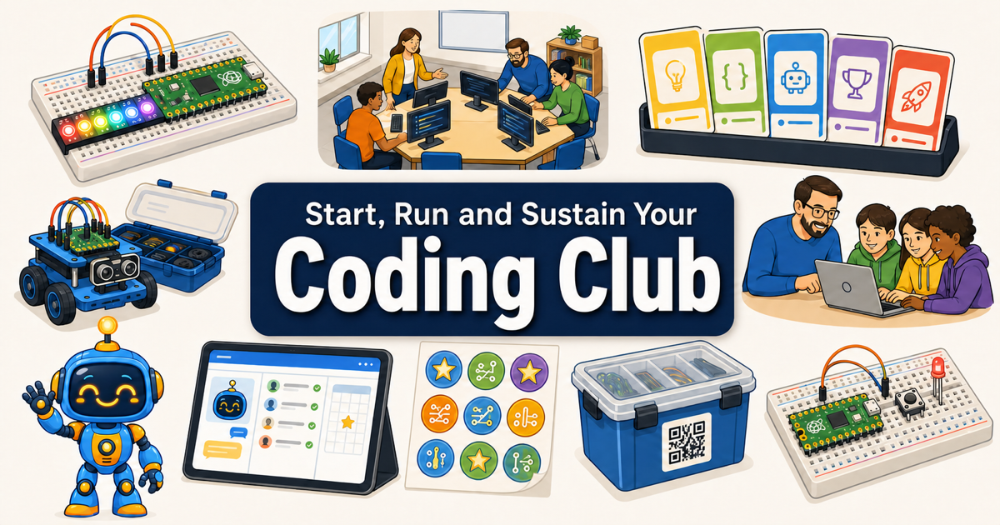

# Coding Club

[](https://www.mkdocs.org/)
[](https://squidfunk.github.io/mkdocs-material/)
[](https://dmccreary.github.io/coding-club/)
[](https://claude.ai/code)
[](https://github.com/dmccreary/ibook-skills)
[](https://creativecommons.org/licenses/by-nc-sa/4.0/)
[](https://www.python.org/)
[](https://developer.mozilla.org/en-US/docs/Web/JavaScript)
[](https://p5js.org/)



## View the Live Site

Read the interactive textbook at
[https://dmccreary.github.io/coding-club/](https://dmccreary.github.io/coding-club/).

## Overview

**Coding Club** is an interactive intelligent textbook about creating, organizing, promoting, and running a
sustainable coding club. It is written for teachers, librarians, parents, engineers, and other adult volunteers
who want to serve students in schools, libraries, bookstores, or community centers. No prior coding-club
experience is required, and the prose targets approximately a tenth-grade reading level.

The book follows a coding club from its first interest survey and charter through curriculum design, physical
computing, device management, inclusive outreach, funding, AI-assisted operations, mentor development, and
leadership succession. Its central principle is that a strong club should outlast any single founder.

This is a Level 2+ intelligent textbook built with MkDocs Material. A 657-concept learning graph records
dependencies and helps sequence the chapters. Interactive MicroSims let readers explore systems and decisions,
while the glossary, FAQ, chapter quizzes, diagrams, stories, and learning mascot provide several ways to enter and
review the material. Content development uses an AI-assisted skill pipeline with human authorship and review.

## Site Status and Metrics

Metrics come from the canonical
[`book-metrics.json`](./docs/learning-graph/book-metrics.json) snapshot generated on September 1, 2026.

| Metric | Count |
|---|---:|
| Concepts in the learning graph | 657 |
| Chapters | 35 |
| MicroSims | 129 |
| Diagrams | 129 |
| Stories | 2 |
| Glossary terms | 657 |
| FAQ questions | 70 |
| Chapter quizzes | 35 |
| Quiz questions | 350 |
| Appendices | 3 |
| References | 0 |
| Total words | 307,336 |
| Equivalent pages | 1,326 |
| Mascot images | 7 |

**Development stage:** Not specified in the canonical metrics file.

## What the Book Covers

- Launching a club, gauging interest, drafting a charter, and establishing safety policies
- Defining leadership, mentor, student, parent, governance, and succession roles
- Designing rooms, sessions, schedules, registration, events, surveys, and retrospectives
- Teaching computational thinking through Scratch, Python, challenge cards, and portfolios
- Supervising physical computing, electronics, Raspberry Pi Pico, sensors, displays, motors, and robots
- Purchasing and managing kits, laptops, networks, peripherals, student accounts, and club data
- Supporting motivation, persistence, student voice, accessibility, representation, and community trust
- Budgeting, fundraising, grant writing, expense tracking, and institutional partnerships
- Using AI agents responsibly for communication, registration, scheduling, curriculum, and coaching
- Building oversight, inventory, mentor-development, documentation, and leadership-transfer systems

## Getting Started

### Read the Book

The easiest way to use the textbook is through the
[published site](https://dmccreary.github.io/coding-club/). Use the left sidebar to follow chapters in learning
order, search for a term, open the glossary or FAQ, and interact with the MicroSims embedded in the chapters.

### Clone the Repository

```bash
git clone https://github.com/dmccreary/coding-club.git
cd coding-club
```

### Installation

Use a Python virtual environment and install MkDocs Material with its imaging dependencies and the lightbox
plugin used by this site:

```bash
python3 -m venv .venv
source .venv/bin/activate
python -m pip install --upgrade pip
python -m pip install "mkdocs-material[imaging]" mkdocs-glightbox
```

### Build the Site

Run the strict build to catch missing pages, broken internal links, and navigation errors:

```bash
mkdocs build --strict
```

### Preview Locally

```bash
mkdocs serve
```

Then open [http://localhost:8000](http://localhost:8000). MkDocs watches the source files and rebuilds the local
site when content changes.

### Deploy to GitHub Pages

```bash
mkdocs gh-deploy
```

This builds the site and publishes it to the repository's `gh-pages` branch. Confirm the generated site locally
before deploying.

## Usage and Content Development

- Edit textbook pages in `docs/` using Markdown.
- Treat the `nav:` block in `mkdocs.yml` as the source of truth for reader navigation.
- Add each chapter under `docs/chapters/<chapter-id>/index.md`.
- Store each MicroSim under `docs/sims/<sim-id>/` with an embeddable `main.html` and lesson `index.md`.
- Update concept dependencies in the learning-graph source files and run the graph validators.
- Follow [`CONTENT-GENERATION-GUIDE.md`](./CONTENT-GENERATION-GUIDE.md) before editing student-facing content.
- Run `mkdocs build --strict` before submitting changes.

## Repository Structure

```text
coding-club/
├── docs/                         # MkDocs source content
│   ├── chapters/                 # 35 textbook chapters and quizzes
│   ├── sims/                     # Standalone and embedded MicroSims
│   ├── learning-graph/           # Concepts, dependencies, metrics, and reports
│   ├── stories/                  # Illustrated learning stories
│   ├── appendices/               # Supplemental resources
│   ├── img/                      # Cover, license, and mascot artwork
│   ├── css/                      # Textbook and mascot styles
│   ├── glossary.md               # ISO-style concept definitions
│   └── faq.md                    # Categorized answers and source links
├── plugins/                      # MkDocs hooks, including social metadata
├── logs/                         # Content-generation session records
├── AGENTS.md                     # Shared instructions for coding agents
├── CONTENT-GENERATION-GUIDE.md   # Student-facing content standards
├── mkdocs.yml                    # Site configuration and navigation
└── README.md                     # Repository overview
```

## Reporting Issues

Found a typo, broken interaction, accessibility issue, or content gap? Open a
[GitHub issue](https://github.com/dmccreary/coding-club/issues) and include:

- A clear description of the problem or suggestion
- The affected page or MicroSim URL
- Steps to reproduce interactive problems
- Expected and actual behavior
- Browser and device details when relevant
- A screenshot when it helps explain the issue

Please do not include student names or other personal information in public issues.

## Contributing

Contributions that improve accuracy, accessibility, examples, diagrams, or interactive learning are welcome.

1. Fork the repository.
2. Create a focused branch for the change.
3. Follow `AGENTS.md` and the content-generation guide.
4. Add new pages to `mkdocs.yml` where appropriate.
5. Run `mkdocs build --strict`.
6. Open a pull request describing the change and its validation results.

## License

This work is licensed under the
[Creative Commons Attribution-NonCommercial-ShareAlike 4.0 International License](https://creativecommons.org/licenses/by-nc-sa/4.0/).

You may:

- **Share** — copy and redistribute the material
- **Adapt** — remix, transform, and build upon the material

Under these terms:

- **Attribution** — give appropriate credit, link to the license, and identify changes
- **NonCommercial** — do not use the material commercially without permission
- **ShareAlike** — distribute adaptations under the same license

See the [project license](./docs/license.md) for details and commercial-licensing information.

## How to Cite

Suggested citation:

```text
McCreary, Dan. (2026). Coding Club: How to Create, Organize, Promote and Manage a Sustainable Coding Club.
GitHub. https://github.com/dmccreary/coding-club
```

BibTeX:

```bibtex
@misc{mccreary-coding-club-2026,
  author = {Dan McCreary},
  title = {Coding Club: How to Create, Organize, Promote and Manage a Sustainable Coding Club},
  year = {2026},
  publisher = {GitHub},
  url = {https://github.com/dmccreary/coding-club}
}
```

## Acknowledgements

This project uses and benefits from:

- [MkDocs](https://www.mkdocs.org/) and [Material for MkDocs](https://squidfunk.github.io/mkdocs-material/)
- [p5.js](https://p5js.org/) for interactive graphics and simulations
- [Chart.js](https://www.chartjs.org/) for interactive charts
- [Mermaid](https://mermaid.js.org/) for diagrams and workflows
- [vis-network](https://visjs.github.io/vis-network/docs/network/) and [vis-timeline](https://visjs.github.io/vis-timeline/docs/timeline/) for network and timeline visualizations
- [Python](https://www.python.org/) and JavaScript for generation, validation, and interaction
- [Claude](https://claude.ai/) and the [Intelligent Textbook Skills](https://github.com/dmccreary/ibook-skills) for AI-assisted content workflows
- [GitHub Pages](https://pages.github.com/) for hosting the published textbook

Special thanks to the educators, librarians, families, volunteer mentors, and students whose experience informs
the practices described in the book.

## Contact

**Dan McCreary**

- LinkedIn: [linkedin.com/in/danmccreary](https://www.linkedin.com/in/danmccreary/)
- GitHub: [@dmccreary](https://github.com/dmccreary)

Questions, suggestions, and collaboration ideas are welcome through LinkedIn or
[GitHub Issues](https://github.com/dmccreary/coding-club/issues).
