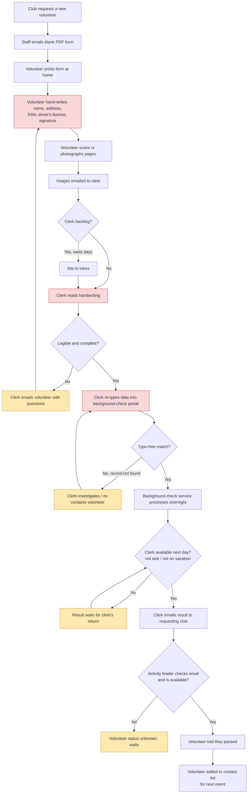
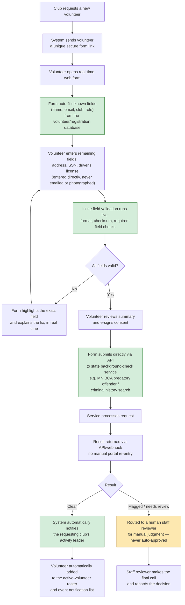

# Automating Volunteer Background Checks

Many school and club programs still run volunteer background checks as a
paper process: a form is emailed out, printed, filled in by hand, scanned or
photographed, and re-typed by a staff member before it ever reaches the
background-check service. This appendix documents that legacy process,
proposes a web-form-based replacement, and estimates the time saved and the
quality improvement.

This is an administrative/operations design document, not student-facing
curriculum content — it does not use Circuit the Robot or the chapter
content-generation formatting rules.

## Current (manual) workflow

The existing process depends on a single staff member re-keying handwritten
data, which is the main source of delay and error.

**Failure points** (red = manual re-entry / transcription risk, orange = a
single point of failure that can stall the whole process):

1. Handwriting is misread or illegible, forcing a round-trip email.
2. The clerk manually re-types every field from an image, introducing typos
   that cause "record not found" results at the background-check service.
3. The entire pipeline depends on one person's calendar (sick days,
   vacation) with no backup or fallback.
4. Results are relayed by a manual email chain to whichever activity leader
   happens to be checking their inbox, so a "pass" can sit unseen for days.
5. SSN and driver's license numbers travel as photos/scans through personal
   email, which is a data-security and compliance risk in itself.

## Proposed (automated) workflow

The redesign replaces steps 1–8 above with a single validated web form,
removes manual re-keying entirely by submitting structured data directly to
the background-check service's API, and routes the result automatically to
the correct activity leader.

### Design details

**Auto-filled fields (no re-typing required):**
Name, email, phone, mailing address on file, club name, requested role/event,
and requesting activity leader — pulled from the existing volunteer or
membership database the moment the volunteer authenticates to the form link.

**Fields the volunteer must still type, with live validation:**

| Field | Validation performed in real time |
|---|---|
| Full legal name | Non-empty, matches ID-style character set |
| Date of birth | Valid date, plausible adult age range |
| Street address | Format check; optional address-autocomplete API |
| Social Security Number | 9-digit format + checksum-style pattern check; masked input; never stored in plaintext, never emailed |
| Driver's license number | State-specific format pattern matched to the selected state |
| E-signature / consent | Required checkbox + typed legal name, timestamped |

Only a validated, complete form can be submitted — the "Submit" button stays
disabled until every field passes its check, which eliminates the
round-trip "please re-send legible copy" email entirely.

**Automatic submission to the background-check service:**
Once validated, the form calls the background-check service's own
submission API (for example, Minnesota's BCA predatory-offender and criminal
history search) directly with the structured data. No human ever re-types
the volunteer's information, which removes the single largest source of
"record not found" errors.

**Automatic result routing:**
The service's result (pass, needs-review, or flagged) comes back via API or
webhook and is matched, by the original request record, to the specific club
and activity leader who requested the volunteer. That person is notified
immediately by email/text — no dependency on a single clerk's calendar.
Flagged results are routed to a human staff reviewer for judgment; the
system never auto-approves a flagged record.

**Volunteer list update:**
On a clear result, the volunteer is automatically added to the active
roster and the event-notification list, closing the loop that today
requires a separate manual step.

## Time saved (estimate)

| Step | Manual process | Automated process |
|---|---|---|
| Form distribution | 5–10 min (email, follow-up) | Instant (automated link) |
| Volunteer fills form | 15–30 min (print, write, find scanner) | 5–10 min (guided web form) |
| Image capture & send | 5–15 min, often next-day | Eliminated |
| Clerk data entry | 10–20 min per volunteer | Eliminated |
| Clerk turnaround (queue/backlog) | 1–5 business days | Same-day submission |
| Error/re-contact loop | 1–3 business days when it occurs (est. ~20% of forms) | Eliminated — form won't submit until valid |
| Result relay to activity leader | 0.5–2 business days (depends on clerk/leader availability) | Minutes (automatic notification) |
| **Total elapsed time, request to notified volunteer** | **~3–10 business days** | **~1 business day (bounded by the background-check service's own processing time)** |
| **Staff labor per volunteer** | **~20–35 minutes of clerk time** | **~0–2 minutes (exception review only)** |

For a club processing, say, 50 new volunteers a year, this removes roughly
17–29 hours of clerk data-entry labor annually and cuts end-to-end turnaround
from a typical week to about a day.

## Quality improvement (estimate)

- **Transcription errors eliminated.** Today's biggest failure mode —
  a clerk misreading handwriting and mistyping a name, address, or SSN into
  the background-check portal — is removed entirely because the volunteer's
  own input is validated and submitted electronically, with no re-keying
  step. This is the most common cause of "record not found" results, which
  today costs a full extra round trip.
- **Fewer round-trips.** Real-time field validation catches malformed data
  (bad SSN format, wrong driver's-license pattern, missing signature) before
  submission instead of a day later by email, so the "clerk emails volunteer
  with questions" step (previously ~1 in 5 forms, by rough estimate) is
  largely eliminated.
- **No single point of failure.** Today, if the clerk is sick or on
  vacation, every pending result stalls. The automated notification step
  removes that dependency — results reach the correct activity leader
  automatically, whether or not staff is at their desk.
- **Improved data security.** SSNs and driver's license numbers currently
  travel as photographs through personal email and sit in an inbox; the
  proposed form submits that data directly over an encrypted channel to the
  official background-check service and never stores it in plaintext or
  emails it as an image. This meaningfully reduces the club's data-breach
  exposure and improves compliance posture.
- **Auditability.** Every submission, validation failure, and result is
  timestamped and logged automatically, giving the club a clean audit trail
  for compliance and insurance purposes — something the current email-based
  process does not reliably provide.
- **Human review preserved where it matters.** The design intentionally
  keeps a human in the loop for flagged results, so automation improves
  speed and accuracy without removing judgment from the one place it is
  legally and ethically necessary.

## Summary

The manual workflow's core weakness is that a single staff member re-types
handwritten data twice — once to read it, once to enter it into the
background-check portal — and every other delay in the process (backlog,
sick days, missed emails) compounds on top of that. Replacing the paper
form with a validated web form that submits directly to the background-check
service's API removes the re-typing step, removes the single point of
failure, and routes results automatically to the right person. The net
effect is turnaround dropping from roughly a week to about a day, clerk
labor per volunteer dropping from ~20–35 minutes to near zero, and the
largest source of processing errors — transcription mistakes — being
eliminated outright.
