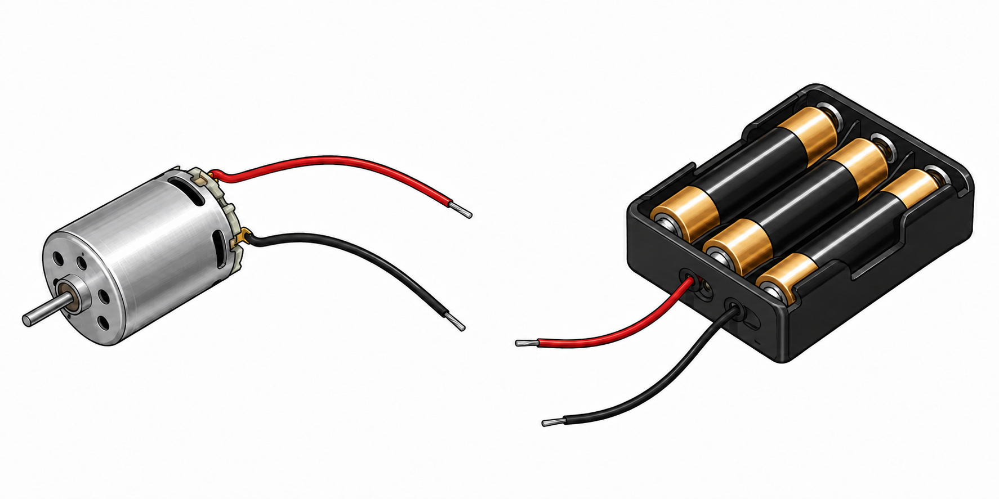

# Make a Motor Spin Image Description and Prompt

## Finished image

The illustration measures 1774 × 887 pixels, with a 2:1 landscape aspect ratio. It shows a small silver DC hobby motor on the left and an open black battery holder containing exactly three AA batteries on the right. Each device has one red insulated wire and one black insulated wire. All four wires terminate in separate, visible, silver-colored stripped tips. The two devices are not connected, and none of the free wire ends touch.

## Composition and background

The objects appear against a clean white background, viewed from above at a three-quarter angle. The motor occupies the lower-left portion of the image, while the larger battery holder occupies the upper-right portion. The motor's shaft points diagonally toward the lower-left corner. The batteries run diagonally from the lower-left front of their holder toward its upper-right rear.

The four wires curve into the open central area between and below the objects. Their ends remain separated by visible white space. Every component and wire is completely inside the frame. The composition has no horizon, tabletop edge, surrounding room, decorative frame, or background objects.

## Left object: DC hobby motor

The motor has a compact, cylindrical silver metal housing with a brushed surface, pale highlights, and darker gray shading along its underside. Its circular front face is visible on the left, with several small dark ventilation holes surrounding a raised central shaft bearing. A short, narrow metal shaft projects from that bearing toward the lower left. The shaft is bare, with no wheel, fan, gear, or pulley attached.

The right-hand rear of the motor has a pale gray end cap, small tabs, and visible electrical terminals. Dark elongated ventilation openings appear near the rear of the metal casing. Bold dark contours distinguish the casing, end cap, shaft, and terminals.

One red wire leaves the upper rear terminal and curves rightward in a broad, shallow upward arch before bending downward to a short exposed metal tip near the upper center of the image. One black wire leaves the lower rear terminal, initially curves slightly upward and rightward, then bends down toward a second exposed tip near the lower center-left. Both leads have rounded insulation, narrow reflective highlights, and clearly visible free ends.

## Right object: three-AA battery pack

The battery pack is a rectangular black plastic holder with an open top, raised outer walls, and narrow internal dividers. Exactly three parallel AA cells sit side by side in individual channels. Each cell has a long black central wrapper, metallic gold-colored end sections, silver-colored terminal details, and bright lengthwise highlights. There are no printed brand names, letters, numbers, or polarity symbols on the batteries.

The holder's front wall faces the viewer toward the lower left. Its longer right side and rear rim are also visible. Rounded corners, dark gray edge highlights, deep channel shadows, and small metallic contact details give the holder depth while keeping its shape easy to recognize.

One red wire exits through a round opening in the front wall, curves down and left, and ends in a nearly horizontal stripped silver tip just right of the image center. One black wire exits a separate opening farther to the right, sweeps downward and left in a longer curve, and ends in a stripped silver tip near the lower center. Neither lead reaches or touches a motor lead.

## Style and essential constraints

The style is a polished educational illustration with strong dark outlines, smooth dimensional shading, and restrained metallic texture. Silver and gray define the motor, black and gold define the battery pack, and saturated red makes each positive-color lead easy to distinguish from its black companion. The illustration contains no captions, labels, arrows, motion marks, hands, people, mascots, logos, watermarks, switches, or additional circuit parts.

The essential visual requirements are exactly one motor, exactly three AA batteries in one holder, exactly two leads per device, and four separate free wire ends. The image depicts the parts before connection.

## Detailed recreation prompt

Create a polished educational illustration for the printed challenge card “Make a Motor Spin.” Use a wide 2:1 landscape canvas with a clean white background. Place a compact silver DC hobby motor on the left and an open black plastic battery holder containing exactly three clearly visible AA batteries on the right. Show both objects from above at a three-quarter angle, fully inside the frame. Place the motor lower than the battery holder, leaving open white space between them for their disconnected leads.

Draw the motor with a cylindrical brushed-silver casing, a visible circular front face with small dark ventilation holes, a raised central bearing, and a short bare metal shaft pointing diagonally toward the lower left. Include a pale gray rear end cap, small electrical terminals, and dark elongated ventilation openings near the rear of the housing. From the rear terminals, draw exactly one red insulated wire arching rightward across the upper part of the gap and exactly one black insulated wire curving rightward and downward below it. End each lead in a short, clearly exposed silver-colored metal tip.

Draw the holder with raised black plastic walls, rounded corners, narrow dividers, and three parallel battery channels extending from the lower-left front toward the upper-right rear. Put exactly one AA cell in each channel. Give each cell a black central wrapper, gold-colored end sections, silver terminal details, and narrow bright highlights. Leave the wrappers and ends unmarked: no brands, text, numbers, or polarity symbols. Show the front wall, long right side, rear rim, and small contact details.

From two separate openings in the holder's front wall, draw exactly one red wire and exactly one black wire. Curve the red wire down and left to a nearly horizontal exposed metal tip near the center. Curve the black wire farther downward and left, ending near the lower center. Keep all four stripped wire tips visibly separated by white space. No free wire end may touch another wire or either device. The motor and battery pack must remain completely disconnected.

Use bold crisp outlines, smooth three-dimensional shading, subtle brushed-metal texture, and clear silhouettes that remain recognizable when reduced for a printed card. Keep every object and the full length of every wire visible. Do not add hands, people, mascots, switches, extra components, arrows, motion marks, captions, decorative borders, scenery, logos, or watermarks.
