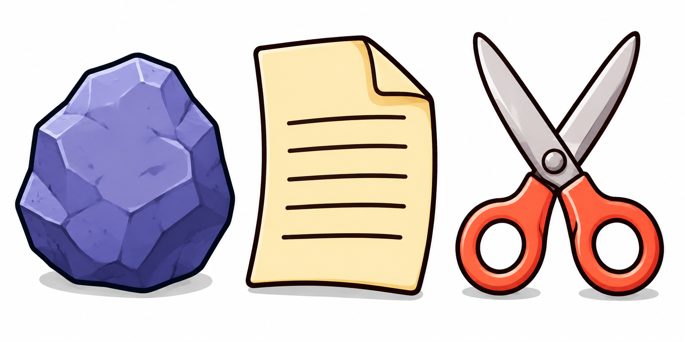

# Rock, Paper, Scissors Image Description and Prompt

## Finished image

The illustration is a wide landscape composition measuring 1774 × 887 pixels, with a 2:1 aspect ratio. Three large objects represent the choices in Rock, Paper, Scissors: a purple stone on the left, a yellow sheet of paper in the center, and a pair of open scissors on the right. They sit against a clean white background, with small gray shadows beneath them. The objects are separate, fully visible, and presented at roughly comparable visual scale. Their strong outlines and distinct silhouettes make the game recognizable when the image is reduced to fit a printed challenge card.

## Composition and spacing

The three objects form a single horizontal row. Their lower edges align loosely along a shared baseline near the bottom of the illustration. The paper and scissors reach slightly higher than the rock, creating a gentle variation in height without disrupting the balance. Narrow white gaps separate the objects, and white margins surround the group. Nothing overlaps or extends beyond the frame.

The composition has no horizon, visible tabletop edge, surrounding room, or decorative border. The shadows imply a supporting surface while leaving the background uncluttered. Each object occupies approximately one third of the available width. The broad rock balances the tall paper and the open, airy shape of the scissors.

## Left object: purple rock

The rock is a large, irregular stone with a broad base, rounded angular sides, and an uneven peak near the upper center. Its silhouette narrows toward the top and widens through the lower half. A thick, nearly black navy outline encloses the entire form, making its boundary especially clear against the white background.

Its surface consists of overlapping polygonal facets in lavender, periwinkle, muted violet, and deep blue-purple. Pale lavender highlights appear along the upper ridges and left-facing planes. Medium purple covers much of the broad central face, while darker indigo facets define the lower edge and right side. Smaller angular patches and short irregular marks suggest a rough stone surface without overwhelming the main shape. The shading gives the rock weight and volume while preserving the simplified style of a classroom illustration.

A flattened gray oval shadow extends beneath the base. It is wider than the rock's contact area and reinforces the impression that the stone is resting heavily on the surface.

## Center object: yellow paper

The paper is a single upright sheet with a warm cream-yellow face and a thick, dark brown outline. Its shape is broadly rectangular, but the edges curve gently. The upper edge rises slightly toward the right before meeting the folded corner. The left edge bows inward through the middle, and the lower edge curves subtly, giving the sheet a flexible, lightly curled appearance.

The upper-right corner folds forward into a large triangular flap. A curved dark line defines the fold, and golden shading beneath it distinguishes the overlapping layers. The flap is pale yellow, with brighter highlights toward its upper portion. A soft amber band along the fold suggests depth without making the paper look thick or rigid.

Five dark brown horizontal strokes run across the central face. These are simple, slightly curved marks with rounded ends, representing lines of writing without forming actual letters or words. They are widely spaced and bold enough to remain visible at small sizes. The upper portion of the sheet remains blank above the first stroke.

The paper's main surface is brightest near the upper-left area, with warmer yellow shading toward the right and lower edges. A narrow gray shadow beneath its bottom edge visually anchors the sheet to the same implied surface as the other objects.

## Right object: orange-handled scissors

The scissors stand upright with their blades open in a broad V. Two long, tapered silver-gray blades extend toward the upper corners of the right-hand section. Their ends are softly rounded, and each blade has a heavy, dark brown outer contour. One blade crosses in front of the other at the central joint, making the cutting tool's construction easy to read.

The metal surfaces use pale gray highlights, warm gray midtones, and darker edge shading. Long changes in tone follow the length of the blades to suggest reflective metal. A large circular pivot sits at the crossing point. Its pale center, darker lower shading, and dark circular border give it the appearance of a rounded metal fastener.

Below the pivot are two bright coral-orange handles. Each handle forms a thick rounded loop with one clearly visible white finger opening. The left loop angles outward toward the lower left; the right loop angles outward toward the lower right. Their outer forms are rounded and slightly teardrop-shaped, with narrower necks connecting them to the blades.

Vivid orange-red fills the handles, with lighter peach highlights along the upper and outer curves and deeper red shading around the inner openings and lower rims. The thick dark outlines match the visual weight of the rock and paper. Small gray shadows beneath the handles complete the shared baseline.

## Style, color, and readability

The image combines the clarity of cartoon icon artwork with softly shaded, dimensional surfaces. Outlines are bold and slightly organic. Highlights and shadows add volume, but the objects retain simple, immediately recognizable forms. Purple, yellow, and orange provide three distinct color groups; the white background and dark contours maintain separation between those groups.

The lighting reads as soft illumination from above and slightly to the left. Shadows stay close to the objects, with no dramatic spotlight or dark environment. There are no people, hands, faces, mascots, arrows, game-result symbols, labels, captions, logos, or watermarks. The only writing-like elements are the five abstract strokes on the paper.

## Detailed recreation prompt

Create a polished educational illustration for a printed Rock, Paper, Scissors challenge card. Use a wide landscape canvas with a 2:1 aspect ratio and a clean white background. Arrange exactly three large, separate objects in a horizontal row: a purple rock on the left, a yellow sheet of paper in the center, and open orange-handled scissors on the right. Show each object completely, with narrow white gaps between them and comfortable margins around the group. Align their bases approximately along the same low horizontal baseline. Make them bold and recognizable from a distance.

Draw the rock as a chunky, irregular stone with a broad base and an uneven, narrower top. Give it a heavy dark navy outline and large angular facets in lavender, periwinkle, violet, and deep indigo. Put pale highlights along its upper and left ridges, medium purple across its central face, and darker planes along its lower and right edges. Add restrained angular surface marks and a soft, flattened gray contact shadow beneath it.

Draw the paper as one upright cream-yellow sheet with gently curved edges and a thick dark brown outline. Fold its upper-right corner forward into a prominent triangular flap, using golden shading beneath the fold. Add exactly five bold, slightly curved horizontal dark brown strokes with rounded ends to suggest writing. Do not include readable text. Keep the upper-left face pale and bright, with warmer yellow shading near the lower and right edges and a subtle gray shadow below.

Draw the scissors upright with two long silver-gray blades spread into a broad V above a clearly visible circular metal pivot. Show one blade crossing in front of the other. Use long pale highlights and muted gray shading to suggest metal. Below the pivot, draw two large coral-orange handle loops with distinct white finger openings. Use peach highlights on their outer curves, deeper orange-red shading around the openings and lower edges, and a heavy dark brown contour. Add short, soft gray shadows beneath the handles.

Use a friendly illustrated style with crisp silhouettes, substantial outlines, simple dimensional shading, and restrained texture. Balance the visual weight of the three objects so none dominates. Preserve the white background. Do not add people, hands, faces, mascots, extra objects, arrows, labels, captions, decorative framing, scenery, logos, or watermarks.
