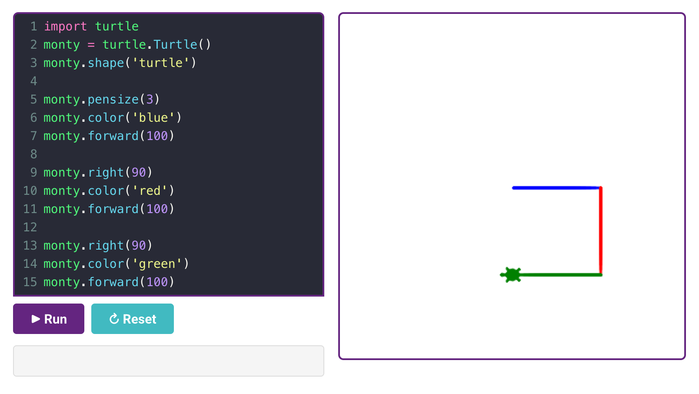

# Computational Thinking, Scratch, and Python Basics

## Summary

This chapter introduces computational thinking -- decomposition, pattern recognition, abstraction, algorithm design, and debugging -- as the mental toolkit underneath all coding instruction. It then walks through the club's typical language progression: keyboarding, Scratch block coding, and an introduction to Python syntax, variables, loops, and conditionals. You will be able to explain the five computational thinking skills and teach a first Scratch or Python lesson.

## Concepts Covered

This chapter covers the following 25 concepts from the learning graph:

| Concept | CIS Score |
|---------|-----------|
| Computational Thinking Skills | 1102 |
| Decomposition Skill | 284 |
| Pattern Recognition Skill | 283 |
| Abstraction Skill | 282 |
| Algorithm Design Skill | 281 |
| Debugging Skill | 280 |
| Keyboarding Skills | 279 |
| Typing Practice Tool | 278 |
| Scratch Programming | 277 |
| Scratch Sprite | 276 |
| Scratch Block Coding | 275 |
| Scratch Project Sharing | 274 |
| Block Based To Text Transition | 273 |
| Python Programming | 272 |
| Python Syntax Basics | 53 |
| Python Variable | 52 |
| Python Loop | 51 |
| Python Conditional | 50 |
| Python Function | 49 |
| Turtle Graphics | 48 |
| Turtle Graphics Challenge | 47 |
| Curriculum Design | 46 |
| Lesson Sequencing | 45 |
| Skill Progression Ladder | 44 |
| Challenge Based Curriculum | 43 |

## Prerequisites

This chapter assumes only the prerequisites listed in the [course description](../../course-description.md).

---

Every chapter so far has been about running a club around students. This chapter is about what students actually learn once they're in the room: the mental habits underneath all coding, and the specific path -- keyboarding, Scratch, then Python -- most clubs follow to build them.

!!! mascot-welcome "Now for the coding itself"
    { class="mascot-admonition-img" }
    Let's build something great -- and think like a programmer while we're at it! This chapter covers the five thinking skills underneath every project, plus the club's typical path from typing practice through Scratch to Python.

## The Five Computational Thinking Skills

**Computational thinking skills** are the mental habits that make coding possible, independent of any specific language -- the single most foundational concept in this entire chapter's portion of the learning graph, since every Scratch block and every line of Python that follows is really just one of these five skills expressed in a specific syntax. Recognizing them by name matters because it lets a mentor teach the underlying skill directly, not just the surface-level code.

**Decomposition** is breaking a large, intimidating problem into smaller, manageable pieces -- "build a game" becomes "draw a character, make it move, detect a collision, keep score," each piece solvable on its own. **Pattern recognition** is noticing similarities between a new problem and one already solved -- a student who's built one blinking-light pattern recognizes that a second, different pattern reuses the same underlying loop structure. **Abstraction** means focusing on the essential details of a problem while ignoring irrelevant ones -- a student controlling a robot doesn't need to think about the physics of the motor, just "forward," "turn," and "stop." **Algorithm design** is sequencing a precise, ordered set of steps to solve a problem -- the actual plan a student writes down or sketches before touching a keyboard. **Debugging** is the systematic process of finding and fixing what's wrong when code doesn't behave as expected -- not randomly guessing at fixes, but forming a hypothesis about the cause and testing it. The interactive poster below lets you explore all five side by side.

#### Diagram: The Five Computational Thinking Skills

<iframe src="../../sims/five-computational-thinking-skills/main.html" width="100%" height="650px" scrolling="no"></iframe>

The Five Computational Thinking Skills

Type: infographic-overlay (grid)
**sim-id:** five-computational-thinking-skills 
**Library:** Interactive Infographic Overlay (grid-diagram.js, annotation-free comparison poster + rectangular hover zones) 
**Status:** Specified 
**Template:** https://github.com/dmccreary/computer-science/tree/main/docs/sims/computational-thinking-pillars

Purpose: Give students and mentors a single reference poster naming and defining all five computational thinking skills, so a mentor can point to "that's decomposition" during a real project rather than the skill staying an abstract vocabulary word.

Bloom Taxonomy: Remember (L1)
Bloom Taxonomy Verb: identify

Learning objective: Given a moment in a coding project, the learner identifies which of the five computational thinking skills is being used.

Image style: Flat comparison poster, five vertical columns, each with a bold printed column header baked into the image ("Decomposition," "Pattern Recognition," "Abstraction," "Algorithm Design," "Debugging")

Image dimensions: 1400x800 (landscape)

Zones (5 columns, each with id, label, color, approximate x1/y1/x2/y2 percentage boundaries, one-line summary, and 3-4 bullet facts including a concrete coding-club example):
1. `decomposition` -- color #4A90D9 -- boundaries approximately x1:1,y1:10,x2:20,y2:92 -- Summary: "Breaking a big problem into smaller pieces." Facts: "build a game" becomes draw, move, collide, score; makes an intimidating project feel achievable; the first skill applied before any code is written
2. `pattern-recognition` -- color #F5A623 -- boundaries approximately x1:21,y1:10,x2:40,y2:92 -- Summary: "Noticing similarities to a problem already solved." Facts: a second blinking pattern reuses the first one's loop structure; speeds up new projects by reusing known solutions; strengthens with more projects completed
3. `abstraction` -- color #7ED6A5 -- boundaries approximately x1:41,y1:10,x2:60,y2:92 -- Summary: "Focusing on essential details, ignoring the rest." Facts: "forward" and "turn" hide the motor's actual physics; lets a beginner control a robot without an engineering degree; the same skill behind using any function someone else wrote
4. `algorithm-design` -- color #E67E22 -- boundaries approximately x1:61,y1:10,x2:80,y2:92 -- Summary: "Sequencing precise, ordered steps to solve a problem." Facts: the plan a student sketches before touching a keyboard; order matters -- turning before moving forward produces a different result than the reverse; the direct bridge from an idea to actual code
5. `debugging` -- color #E74C3C -- boundaries approximately x1:81,y1:10,x2:99,y2:92 -- Summary: "Systematically finding and fixing what's wrong." Facts: form a hypothesis about the cause, then test it -- not random guessing; the skill Chapter 1's continuous improvement mindset applies at the level of a single line of code; often the most frustrating and most valuable skill to build confidence in

showLabels: false (column titles are printed in the generated image)

Interactive features: Click or hover any column to highlight its zone and reveal its full fact list, including the coding-club example, in a detail panel; explore mode, plus a simple quiz mode asking "which skill is this?" against short scenario prompts

Implementation: Interactive Infographic Overlay Guide (grid engine) -- `grid-diagram.js` + `grid-overlay.css` render the five rectangular hover zones over the generated poster image; a close template already exists at the GitHub URL above (WHAT match score 0.61) and should be adapted rather than built from scratch; `data.json` holds the 5 zones per the overlay-grid-data-json-schema

!!! mascot-thinking "These five skills show up in every single project in this book"
    { class="mascot-admonition-img" }
    Notice that none of these skills are specific to Scratch or Python -- they're the same five skills a student uses wiring an LED strip, debugging a robot's collision sensor, or designing a challenge card of their own. Naming them out loud during a session ("that's debugging you just did!") makes the invisible mental work visible.

## Keyboarding First

Before any language-specific instruction, most clubs start with **keyboarding skills**: basic touch-typing proficiency, since a student who has to hunt for each key struggles far more with the mechanics of typing than with the actual logic of the code they're writing. A **typing practice tool** -- a simple browser-based typing game, not necessarily anything club-specific -- gives students a low-stakes, game-like way to build that speed over a few sessions before moving into Scratch or Python, where typing speed stops being a bottleneck to actually thinking about the code.

## Scratch: Learning to Code with Blocks

**Scratch programming** is a visual, block-based coding environment where students snap together colored blocks instead of typing text-based syntax, making it an ideal first language since it removes syntax errors -- missing colons, mismatched parentheses -- that frustrate text-based beginners before they've built any confidence. Every Scratch project centers on a **Scratch sprite**: a character or object on the stage that the student's code controls, giving even the most abstract programming concept -- a loop, a conditional -- an immediately visible, animated result. **Scratch block coding** is the actual mechanism: dragging blocks like "move," "repeat," and "if-then" into a stack, where the shape of each block (an event block is rounded on top, a loop block wraps around others) visually communicates how pieces fit together, reinforcing algorithm design without a student needing to memorize any syntax rules.

Once a project is finished, **Scratch project sharing** lets a student publish it to the Scratch community website, where other students -- inside or outside the club -- can view, remix, and build on it, turning an individual project into a small taste of the open, collaborative culture of real software development.

!!! mascot-tip "Let students remix before they build from scratch"
    { class="mascot-admonition-img" }
    Here's a shortcut: a student staring at a blank Scratch project often freezes. Point them toward an existing shared project close to what they want to build, and let them remix it first. Modifying working code is a gentler on-ramp to algorithm design than starting from nothing.

## Moving to Python

At some point, usually once a student has built several confident Scratch projects, a club introduces the **block-based to text transition**: moving from visual blocks to typed, text-based code. This transition works best when framed explicitly as "the same ideas, a different notation" rather than "now for real coding" -- a phrase that accidentally implies Scratch wasn't real, which undermines a student's confidence right at the moment they need it most.

**Python programming** is usually the text-based language clubs choose next, valued for its relatively readable, English-like syntax. **Python syntax basics** cover the mechanical rules -- indentation defines a block of code instead of Scratch's visual nesting, and a colon introduces that block. A **Python variable** stores a value a program can reference and change, the text equivalent of a Scratch "variable" block a student has likely already used. A **Python loop** repeats a block of code, directly parallel to Scratch's "repeat" block. A **Python conditional** runs code only if a condition is true, mirroring Scratch's "if-then" block. A **Python function** groups a reusable sequence of steps under one name -- the text equivalent of a Scratch custom block -- and is usually the last of these four core constructs introduced, since it builds on understanding variables, loops, and conditionals first.

| Scratch Block | Python Equivalent | What It Does |
|---|---|---|
| Variable block | Python Variable | Stores a value the program can change |
| Repeat block | Python Loop | Repeats a block of code a set number of times or while a condition holds |
| If-then block | Python Conditional | Runs code only when a condition is true |
| Custom block | Python Function | Groups reusable steps under one name |

!!! mascot-warning "Don't rush the transition before Scratch confidence is solid"
    { class="mascot-admonition-img" }
    Watch out for this: moving a student to Python before they're genuinely comfortable with loops and conditionals in Scratch just adds syntax frustration on top of a concept they haven't fully grasped yet. Confirm the underlying computational thinking skill is solid in blocks before asking a student to also learn Python's exact punctuation rules.

**Turtle graphics** is often the first Python project clubs use, because it makes text-based code visual again right when a student needs that reassurance most -- a small on-screen turtle that draws a line as it moves, controlled entirely by typed commands like `forward(100)` and `right(90)`. A **turtle graphics challenge** -- "draw a five-pointed star," "draw a spiral" -- gives students a concrete, visually verifiable goal, so they know immediately whether their code worked without needing a mentor to check line by line.

<!-- TODO: Turn this into an infographic overlay MicroSim with hover/click regions
for the following regions:

1. Line numbers in the left column
2. Color syntax highlighting editor with pre-loaded program
3. Copy icon in the upper right of the editor (not working in this image yet)
4. Run button will execute the program
5. Reset button will reload the original code
6. Input field for allowing text input
6. Turtle graphics drawing area

--->

[Sample Turtle Graphics Program](https://dmccreary.github.io/learning-python/python-labs/02-simple-square/#try-it-now)

## Designing the Curriculum

Pulling all of this into an actual weekly plan is **curriculum design**: deciding which topics get taught, in what order, across a term or year. Good **lesson sequencing** respects the dependencies this chapter has already described -- keyboarding before Scratch, Scratch confidence before the text transition, variables before functions -- rather than jumping to an exciting topic before its prerequisites are solid. A **skill progression ladder** makes that sequencing visible to students themselves: a simple posted chart showing the path from "typing practice" through "first Scratch project" to "first Python turtle drawing," so a student can see roughly where they are and what's next.

Tying it all together, a **challenge-based curriculum** -- introduced briefly in Chapter 1 and covered in full in Chapter 15 -- organizes each step of that ladder around a concrete challenge card rather than an abstract lesson topic, keeping every computational thinking skill this chapter described anchored to something a student actually builds.

## Chapter Summary

Decomposition, pattern recognition, abstraction, algorithm design, and debugging are the five computational thinking skills underneath every coding club project, regardless of language. Most clubs build toward them through a deliberate progression: keyboarding skills first, then Scratch's visual block coding with its sprites and shareable projects, then a carefully paced transition to Python's variables, loops, conditionals, and functions, often anchored by a visual turtle graphics project. Thoughtful curriculum design and lesson sequencing turn that progression into a skill progression ladder students can see themselves climbing.

!!! mascot-celebration "You can teach the thinking, not just the syntax"
    { class="mascot-admonition-img" }
    You can now name the five computational thinking skills in a real project and sequence a curriculum from keyboarding through Scratch to Python. Next up: turning all of this into challenge cards, tracks, and a portfolio students can actually see their progress in.

[See Annotated References](./references.md)
