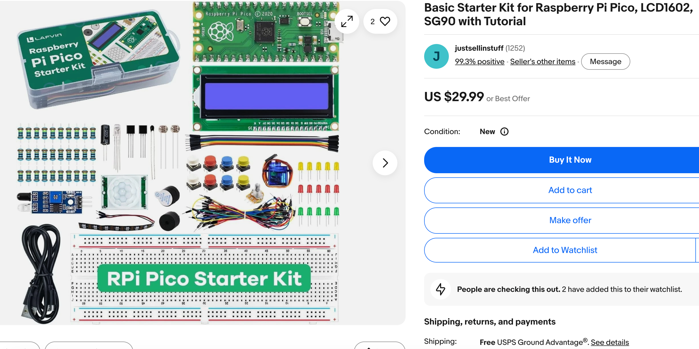
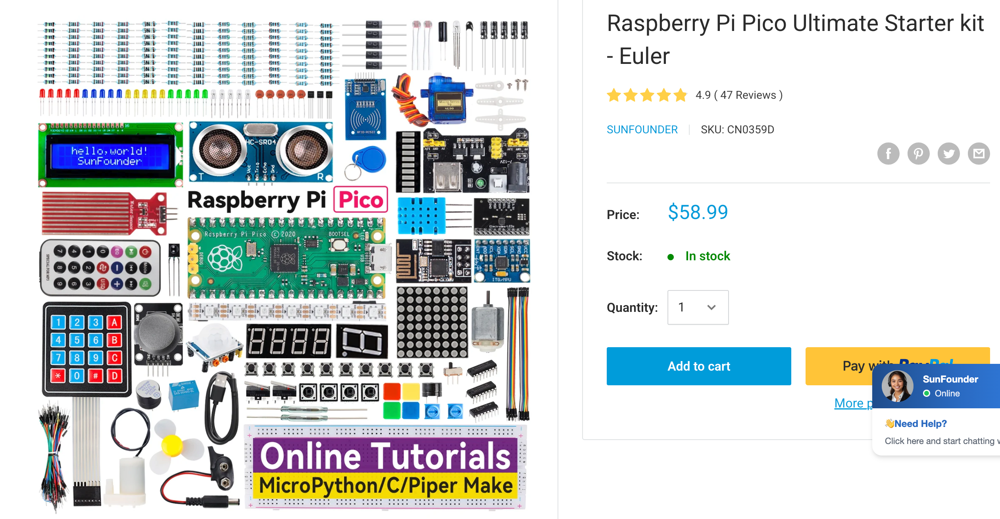
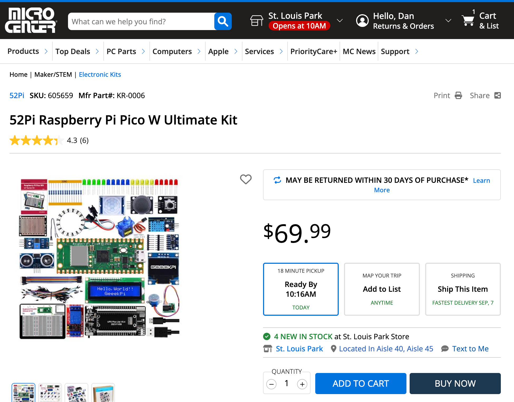
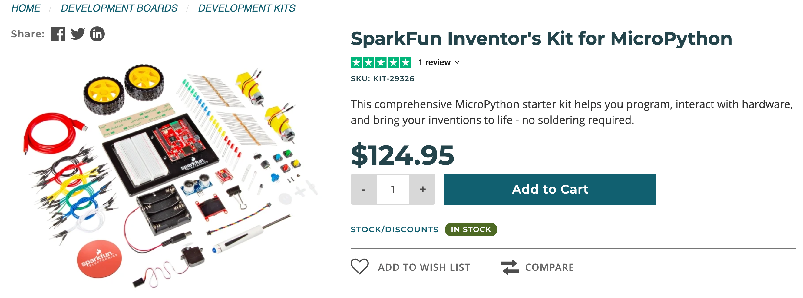

# Managing Your Kit Inventory and Signal Processing Kits

## Summary

This chapter shifts from building kits to managing them: cost comparison, storage, loaner programs, and documentation like wiring diagrams and code templates. It closes with more advanced kits -- real-time audio and Fast Fourier Transform signal processing, plus wearable and smartwatch displays -- for clubs ready to go further. You will be able to set up a kit management system and describe what a signal-processing kit does.

## Concepts Covered

This chapter covers the following 20 concepts from the learning graph:

| Concept | CIS Score |
|---------|-----------|
| Kit Cost Comparison | 46 |
| Kit Reuse Strategy | 45 |
| Kit Storage Bin | 44 |
| Kit Return Process | 17 |
| Kit Damage Assessment | 16 |
| Kit Loaner Program | 15 |
| Kit Documentation Sheet | 14 |
| Kit Wiring Diagram | 13 |
| Kit Code Template | 12 |
| Kit Debugging Guide | 11 |
| Kit Upgrade Path | 10 |
| Kit Vendor Selection | 9 |
| Kit Bulk Purchasing | 8 |
| Kit Unboxing Procedure | 7 |
| Kit Safety Checklist | 6 |
| Signal Processing Basics | 5 |
| Real Time Audio Processing | 4 |
| Fast Fourier Transform Basics | 3 |
| Smartwatch Display Kit | 2 |
| Wearable Electronics Basics | 1 |

## Prerequisites

This chapter builds on concepts from:

- [17. Sensors, Displays, Motors, and Robot Chassis](../17-sensors-displays-motors/index.md)
- [19. Raspberry Pi Pico, MicroPython, and the Moving Rainbow Kit](../19-pico-micropython-moving-rainbow/index.md)
- [20. Sensor, Sound, and IoT Project Kits](../20-sensor-sound-iot-kits/index.md)

---

Chapter 19 and Chapter 20 filled a shelf with kits -- robots, displays, gyroscopes, microphones, IoT monitors -- and gave each one an assembly sheet, a component checklist, and a difficulty rating. None of that work survives past a single semester unless someone also manages the shelf itself: deciding which vendor to buy from, where a returned kit lives between sessions, and what happens the day a gyroscope kit comes back with a bent pin. This chapter is where a coding club's kit bin turns into kit *inventory* -- the kind of unglamorous, written-down infrastructure this book keeps coming back to, because a club that only lives in one leader's head about "where the spare wires are" is a club that stalls the day that leader misses a session.

!!! mascot-welcome "From building kits to running an inventory"
    { class="mascot-admonition-img" }
    Let's build something great -- this chapter turns your kit shelf into a system a co-mentor could run without you in the room: buying, storing, loaning, and retiring kits on paper, not just from memory. By the end, you'll also be able to describe, in plain language, what a signal-processing kit and a smartwatch display kit actually do for a club ready to go further.

## Buying Smart: Vendors, Cost, and Bulk Orders

### Kit Vendor Selection

Here are some samples of Raspberry Pi Pico Starter kits with a variety of prices.  The prices do not include shipping costs.

The image above is a screen image from eBay describing a value oriented $30 Raspberry Pi Pico starter kit.

Sunfounder Pico Starter Kit screen image from eBay describing a $60 Raspberry Pi Pico kit.

The image above is the 52 Raspberry Pi Pico W Starter Kit sold at MicroCenter for around $70.00.

This kit includes the following parts:

- 1 x Raspberry Pi Pico W H
- 1 x breadboard experiment platform (3 1/2 size 400 tie boards)
- 1 x Ultrasonic sensor
- 1 x 0.96-inch OLED display
- 1 x DHT11 temperate and Humidity sensor
- 1 x Single Channel Relay
- 1 x PIR sensor
- 1 x LCD1602 display module 
- 1 x Raindrop sensor 
- 1 x Potentiometer
- 1 x Stepper motor
- 1 x ULN2003AN driver board (drive stepper motor)
- 1 x 9g Servo
- 1 x PS2 Joystick Module
- 1 x MPU6050 Gyroscope module
- 1 x MicroUSB cable (Data Transfer)
- 20 x Male to male jumper wire
- 20 x Male to female jumper wire
- 5 x Red LED
- 5 x Green LED
- 5 x Yellow LED
- 5 x Blue LED
- 20 x 220 Ohm Resistors
- 1 x Instruction book

The image above is a screen image from the Sparkfun website describing a [$130 Inventors kit](https://www.sparkfun.com/sparkfun-inventors-kit-for-micropython.html) that supports MicroPython with higher-end parts.

**Kit vendor selection** is the deliberate comparison of suppliers before ordering a kit's parts, weighing unit price against shipping time, part-quality consistency between orders, and how closely a vendor's actual product matches the pin layout and part list a kit's documentation already assumes. Two vendors selling what looks like the identical sensor module online can ship boards with different pin orders printed on the silkscreen, which turns a five-minute wiring job into a confusing troubleshooting session the first time a mentor assumes last time's datasheet still applies.

A worked example makes the tradeoff concrete: a mentor restocking gyroscope kits finds Vendor A at $6.50 per module with three-week shipping and, based on past orders, a pin layout that has changed twice in two years, against Vendor B at $7.75 per module with four-day shipping and a stable, unchanged layout across every past order. The club chooses Vendor B, accepting a $1.25 higher unit cost to avoid rewriting the kit's wiring diagram and code template every time a shipment arrives -- a cost the cost comparison below shows is easy to underestimate.

### Kit Cost Comparison

**Kit cost comparison** looks past a kit's sticker price to its full cost per session actually delivered: the purchase price plus shipping and any one-time tools, divided by however many working sessions the kit survives before it is retired or needs a costly repair. A cheaper kit that reliably fails after a handful of uses can cost more per session than a pricier kit that keeps working for years, which is the opposite of what the price tags alone suggest.

A worked example turns this into arithmetic a mentor can actually run: a $12 microphone kit that survives 40 sessions before retirement costs $0.30 per session, while a $9 kit from a different vendor that reliably fails after 8 sessions costs $1.13 per session -- nearly four times as much, despite listing for less. Tracking how many sessions a kit type actually survives, even informally on the documentation sheet introduced later in this chapter, turns "which kit is cheaper" from a guess into a number.

!!! mascot-thinking "True cost is price divided by sessions survived, not the sticker price"
    { class="mascot-admonition-img" }
    Notice that the cheaper kit in the example above was actually the more expensive choice once you divide by how long it lasted. Once a mentor starts thinking in cost-per-session instead of price-per-kit, a lot of "which kit should we buy" decisions get a lot less subjective.

### Kit Bulk Purchasing

**Kit bulk purchasing** means ordering several identical kits in a single order rather than restocking one or two at a time, which typically unlocks a lower per-unit price and -- just as valuable -- guarantees every unit in the batch shares the same hardware revision, avoiding the pin-layout drift the vendor selection section described. A club buying microphone kits three separate times across a semester risks three subtly different board revisions in the same bin; a club buying twelve at once gets twelve identical boards that all match one wiring diagram.

A worked example shows both benefits landing at once: ordering three microphone kits individually over three months costs $9.50 per unit and produces two different board revisions with swapped data-pin positions; ordering twelve at once for the whole semester drops the price to $7.25 per unit, and every board matches the same single wiring diagram -- saving both money and the confusion of maintaining two versions of one kit's documentation.

Now that vendor selection, cost comparison, and bulk purchasing have each been introduced, the table below gathers the buying decision into one reference a mentor can scan before placing an order.

| Buying Approach | Per-Unit Price | Hardware Consistency | Best For |
|---|---|---|---|
| Single-unit orders, cheapest vendor | Lowest listed price | Risk of revision drift between orders | A one-off kit, or trying a new kit type before committing |
| Single-unit orders, consistent vendor | Slightly higher | Stable across orders | Restocking an existing kit type in small numbers |
| Bulk order (10+ units) | Lowest total cost per unit | Guaranteed identical revision | Stocking a whole semester's worth of one kit type at once |

## Getting a Kit Ready for Its First Session

### Kit Unboxing Procedure

**A kit unboxing procedure** is the one-time ritual a brand-new kit goes through before it ever reaches a student: confirming every part on the vendor's packing slip is actually in the box, powering on and testing the kit's core sensor or output with its code template, and assigning the kit a name and an ID before it goes into storage. This is distinct from the component checklist Chapter 20 introduced -- a component checklist runs before every session on a kit already in service, while an unboxing procedure happens exactly once, the day a kit first arrives.

A worked example shows why testing at unboxing matters more than it might seem: a mentor unboxes ten new microphone kits in one sitting, plugging each into a Pico running the five-line code template described later in this chapter. Nine kits print a changing loudness number the moment someone claps; one prints a flat zero no matter what. Catching that dead microphone during a quiet unboxing session costs nothing; catching it mid-session, with a student waiting to see their first clap-triggered light, costs real trust.

### Kit Safety Checklist

**A kit safety checklist** is a short, printed list of electrical-safety checks -- no exposed conductor touching another wire, no reversed power polarity, every connector seated snugly rather than resting loosely against its pins -- run specifically during unboxing and again after any repair, applying Chapter 16's general safety rules to one specific kit in hand. Where the safety rules in Chapter 16 are general knowledge every mentor carries around, a kit safety checklist turns that knowledge into a specific, repeatable check for one exact board.

A worked example shows the checklist earning its place: while unboxing a new batch of humidity-monitor kits, a mentor runs the safety checklist on each board and finds that one unit's power and ground pins are reversed relative to the labeled silkscreen -- a wiring mistake that would have created a short circuit the moment a student plugged it in blind. The checklist catches it during a calm unboxing session instead of during a live one.

!!! mascot-tip "Run the safety checklist during kit prep, not live in front of students"
    { class="mascot-admonition-img" }
    Here's a shortcut: treat the safety checklist as part of unboxing and post-repair prep, done at your kitchen table or a prep session, not as a step you narrate live while a room full of students waits. A calm check catches more problems than a rushed one.

## Documenting a Kit So Anyone Can Run It

### Kit Documentation Sheet

**A kit documentation sheet** is the single page -- printed or digital -- filed with each kit that gathers everything a mentor needs to run that kit's station without the person who originally built it: its difficulty rating from Chapter 20, its wiring diagram, its code template, and a short debugging guide, all in one place rather than scattered across a mentor's memory. A kit without a documentation sheet only really "exists" for whoever assembled it -- exactly the single-leader dependency problem this book keeps returning to, now applied to hardware instead of people.

A worked example shows the sheet doing its real job: the mentor who originally wired and tested the club's one gyroscope kit is out sick the morning of a session. A substitute mentor who has never touched a gyroscope kit before pulls its documentation sheet, follows the wiring diagram to connect four pins, pastes in the code template, and has the station running for students within ten minutes -- using nothing but the sheet.

### Kit Wiring Diagram

**A kit wiring diagram** is a labeled diagram showing exactly which physical pin -- named by the label actually printed on the module, such as SDA, SCL, VCC, or GND, per the naming rule Chapter 20 established -- connects to which specific Pico pin, drawn for the exact board revision that particular kit's bin contains. Because bulk purchasing guarantees every kit in one bin shares a hardware revision, one wiring diagram can serve an entire bin rather than needing to be redrawn kit by kit.

A worked example shows the diagram catching a mistake before it happens: two of the club's gyroscope kits came from different vendor batches with SDA and SCL swapped on the physical board. A wiring diagram drawn specifically for each batch's board -- rather than one generic diagram assumed to fit both -- tells a mentor immediately which two wires to swap for that particular bin, instead of guessing after a blank reading.

### Kit Code Template

**A kit code template** is a short, already-working starter program -- typically five to fifteen lines -- that reads a kit's core sensor or drives its core output and prints or displays a result, meant to be copied and run exactly as written before any student customizes it. A code template's job is to prove the wiring works, separately from proving a student's own code works; mixing the two together is what turns a simple wiring mistake into a confusing debugging session.

A worked example shows this separation in action: a student pastes the microphone kit's code template onto a Pico unmodified and immediately sees a loudness number scrolling on screen. That confirms the wiring is correct before the student writes a single original line -- so if their own, edited version later prints nothing, they already know the hardware isn't the problem, and can focus on their own code instead of re-checking wires.

### Kit Debugging Guide

**A kit debugging guide** is a short troubleshooting table, attached to a kit's documentation sheet, pairing a specific symptom with the fix most likely to solve it -- for example, "no numbers appear" paired with "reseat the data pins" -- so a stuck mentor or student has a first place to look before guessing randomly or assuming the hardware is broken.

A worked example shows the guide doing exactly this job: a microphone kit reports a constant zero no matter how loud the room gets. The debugging guide's first row says "check the power light is on"; the second row says "reseat the data pin." The power light is on, so the mentor tries the second fix -- the data pin had backed halfway out of its socket -- and the kit starts reporting normally again, all without needing to guess.

Now that a documentation sheet's three supporting pieces have each been introduced, the table below summarizes what each one captures and when a mentor actually reaches for it.

| Documentation Piece | What It Captures | When a Mentor Reaches for It |
|---|---|---|
| Kit Wiring Diagram | Which labeled pin connects to which Pico pin, for this exact board revision | Before first wiring a kit, or when a reading looks wrong |
| Kit Code Template | A short, already-working starter program | The very first time a kit is powered on, to confirm wiring before writing new code |
| Kit Debugging Guide | A symptom-to-fix troubleshooting table | When a kit that used to work stops behaving as expected |

## Storing, Loaning, and Getting Kits Back

### Kit Storage Bin

**A kit storage bin** is a dedicated, labeled container -- one per kit or kit type -- that holds a kit and its documentation sheet together between sessions, sized and labeled consistently across the whole shelf so a mentor can find and identify any kit at a glance. An unlabeled box of loose parts forces a mentor to open several bins and guess; a storage bin labeled with the kit's name and difficulty rating from Chapter 20 turns that search into a two-second glance.

A worked example shows the payoff during a real session: a walk-in student arrives mid-session with no assigned project, and a mentor needs a beginner-rated kit immediately. Because every bin on the shelf is labeled with both its kit name and difficulty rating printed on the outside, the mentor spots a beginner-rated microphone kit bin in seconds, rather than opening four bins to find one that matches the student in front of them.

### Kit Loaner Program

**A kit loaner program** lets a specific kit leave its regular storage bin and go home with a student, or to another location, for a defined period, with the club tracking which kit is out, who has it, and when it is due back -- the same accountability a library applies to a borrowed book, applied to a $12 microphone kit instead.

A worked example shows the program running end to end: a student who wants to keep experimenting between sessions signs out a gyroscope kit; the sign-out log records the student's name, the kit's ID, the date it left, and a two-week due date. When two weeks pass without a return, the log flags it, and a mentor follows up with the student directly instead of the kit simply disappearing from the shelf unnoticed.

### Kit Return Process

**A kit return process** is the sequence a loaned or session-used kit goes through before it is cleared to go back into general circulation: its parts are physically counted against its documentation sheet's part list, its core function is quick-tested with its code template, and its loaner-log entry, if any, is closed out.

A worked example runs the full sequence on a returned gyroscope kit: the mentor checks it against the documentation sheet and confirms the Pico, the gyroscope module, and all four jumper wires are present; running the code template for thirty seconds confirms it still reports rotation correctly; and the loaner log entry for that student is marked returned. Only after all three checks pass does the kit go back into its storage bin.

### Kit Damage Assessment

**Kit damage assessment** is the judgment call a mentor makes about a returned kit's condition: whether a problem, if one exists, is purely cosmetic, an easy fix like a loose or bent pin, or a genuine failure that requires replacing a part -- and it deliberately starts with the debugging guide's fixes rather than jumping straight to "this kit is broken."

A worked example shows why that order matters: a returned gyroscope kit reads all zeros on every axis. Before writing the module off as dead, the mentor works through the debugging guide's first two fixes -- checking the power light, then reseating each jumper wire -- and discovers one wire had backed halfway out of its socket during transport. Reseating it fixes the kit completely; nothing was ever actually damaged.

!!! mascot-warning "A dead-looking reading doesn't always mean a dead kit"
    { class="mascot-admonition-img" }
    Watch out for this: a flat-zero or no-response reading looks exactly the same whether a sensor has genuinely failed or a wire has simply worked loose. Always run the debugging guide's fixes before writing a kit off as damaged -- retiring a perfectly good kit over a loose wire wastes both money and a working part.

A damage-assessment note worth keeping with a kit's documentation sheet records just a few things:

- The exact symptom observed (for example, "reports zero on all three axes")
- Which debugging-guide fixes were tried, in order
- The final verdict: fine, fixed, or needs replacement
- The date, so a pattern across multiple returns is easy to spot later

## Deciding What Happens Next: Reuse, Upgrade, or Retire

### Kit Reuse Strategy

**A kit reuse strategy** is the default outcome for any kit that passes its return process and damage assessment cleanly: it goes straight back into its labeled storage bin, unchanged, ready for the next session -- the loop every kit in the bin is designed to complete over and over, and the cheapest possible outcome per the cost-comparison math earlier in this chapter.

A worked example shows the strategy working exactly as intended: a microphone kit purchased two years ago has now completed thirty sessions, passing return and damage assessment cleanly every single time, and going back into its bin unchanged after each one. At a $12 purchase price divided across thirty sessions, that kit now costs the club $0.40 per session and shows no sign of needing anything more than continued reuse.

### Kit Upgrade Path

**A kit upgrade path** is a planned, deliberate revision to a kit's documentation sheet, code template, or even its hardware -- not because anything is broken, but because a better approach has become clear, such as a simpler starter program or a newer sensor module that solves a problem the original one had.

A worked example shows an upgrade path triggered by confusion rather than failure: the gyroscope kit's original code template printed raw rotation values in radians, a unit most students had never encountered, and mentors noticed the same confused question every single session. A mentor rewrites the code template to convert and print degrees instead -- the hardware never changes, but the documentation sheet and code template both get replaced across every bin on the shelf, and the confusion stops.

!!! mascot-thinking "A kit's life is a loop, not a one-way trip"
    { class="mascot-admonition-img" }
    Notice that reuse, upgrade, and even retirement all feed back into the same shelf rather than ending the story -- a kit goes out, comes back, gets checked, and either returns unchanged or comes back better. That's the same continuous-improvement habit this book has applied to sessions and events, now applied to hardware.

The diagram below traces one kit all the way through this entire cycle -- buying, prepping, documenting, circulating, and deciding what happens when it comes back -- so every piece introduced separately in this chapter can be seen as one connected path.

#### Diagram: Kit Lifecycle Workflow

<iframe src="../../sims/kit-lifecycle-workflow/main.html" width="100%" height="1042px" scrolling="no"></iframe>

Kit Lifecycle Workflow

Type: workflow
**sim-id:** kit-lifecycle-workflow 
**Library:** Mermaid 
**Status:** Specified

Purpose: Trace one kit through its entire lifecycle -- purchase, preparation, documentation, storage, circulation, and the reuse/upgrade/retire decision -- tying together every kit-management concept from this chapter into one connected path.

Bloom Taxonomy: Analyze (L4)
Bloom Taxonomy Verb: differentiate

Learning objective: Given a kit's current lifecycle stage and its damage-assessment outcome, the learner differentiates whether the kit should be reused as-is, sent down an upgrade path, or retired.

Steps (flowchart with decision diamonds):
1. Start: "New Kit Type Needed" -- click reveals "A mentor identifies a gap in the shelf, such as no kit yet existing for a sensor a new lesson calls for."
2. Process: "Select a Vendor" -- click reveals the Kit Vendor Selection definition above.
3. Process: "Compare Total Cost" -- click reveals the Kit Cost Comparison definition above.
4. Decision: "Order 10 or More?" -- click reveals the Kit Bulk Purchasing definition above; both the Yes and No branches continue to the next step.
5. Process: "Unbox and Test" -- click reveals the Kit Unboxing Procedure definition above.
6. Process: "Run Safety Checklist" -- click reveals the Kit Safety Checklist definition above.
7. Process: "Write Documentation Sheet" -- click reveals the Kit Documentation Sheet definition above.
7a. Process (branch of 7): "Draw Wiring Diagram" -- click reveals the Kit Wiring Diagram definition above.
7b. Process (branch of 7): "Save Code Template" -- click reveals the Kit Code Template definition above.
8. Process: "Store in Labeled Bin" -- click reveals the Kit Storage Bin definition above.
9. Process: "Loan Out for a Session" -- click reveals the Kit Loaner Program definition above.
10. Process: "In Use -- Stuck?" -- click reveals "If a kit stops behaving as expected while in use, a mentor consults its debugging guide before assuming damage."
10a. Process (branch of 10): "Consult Debugging Guide" -- click reveals the Kit Debugging Guide definition above; loops back to step 10.
11. Process: "Kit Returned" -- click reveals the Kit Return Process definition above.
12. Decision: "Damage Assessment" -- click reveals the Kit Damage Assessment definition above; three branches follow.
12a. Branch "No Damage Found" leads to "Reuse As-Is" -- click reveals the Kit Reuse Strategy definition above; loops back to step 8.
12b. Branch "Fixable, but Outdated" leads to "Revise and Upgrade" -- click reveals the Kit Upgrade Path definition above; loops back to step 7.
12c. Branch "Unrepairable" leads to End: "Retire and Salvage Parts" -- click reveals "A kit with unsafe or unrepairable damage is retired; any still-good parts, such as a working Pico or jumper wires, are salvaged into other kits' bins rather than thrown away."

Interactivity requirement (satisfied): every node has a Mermaid `click` directive tied to an infobox showing its revealed text, matching the definition already given in this chapter's prose.

Color coding: Blue for acquisition steps (vendor, cost, bulk order), amber for preparation steps (unboxing, safety, documentation), green for circulation steps (storage, loan, return), purple for the three decision diamonds, gray for the retire end state.

Implementation: Mermaid flowchart (`graph TD`) rendered in main.html with `click NodeId call showInfo("NodeId")` directives for every node, opening a side-panel infobox; a "Reset View" button re-centers the diagram after any zoom or pan.

## Kits Ready for Clubs That Want to Go Further

Everything so far in this chapter manages kits a club already runs every week. Some clubs, once their basic kit rotation is running smoothly, are ready to add one more shelf: kits built around signal processing and wearable displays. A mentor doesn't need to understand the math behind either one to manage it -- only to recognize what it does and know which companion textbook covers the deeper material, since that material is intentionally out of scope for this book.

### Signal Processing Basics

**Signal processing basics** describes, at the level a club mentor actually needs, the general idea of taking a raw, changing signal -- most often sound picked up by a microphone -- and extracting useful information from it, such as loudness, pitch, or which frequencies are present, beyond what a plain microphone kit's single loudness number can show. What a mentor actually sees when one of these kits runs is a screen filling with moving bars or a shifting waveform in time with whatever sound the microphone picks up -- visually similar to, but more detailed than, the sound spectrum kit's display from Chapter 20. This book does not teach the mathematics behind that extraction; a mentor managing a signal-processing kit needs to recognize what it does, not derive how it does it.

### Real Time Audio Processing

**Real-time audio processing** means a signal-processing kit updates its display continuously, many times per second, as sound keeps changing -- rather than capturing a sound once and analyzing it afterward. The "real time" part is what makes the kit feel alive to a student: clap, and the display reacts within a fraction of a second, not after a noticeable pause.

A club running one of these kits for the first time will notice the same threshold-and-react pattern from Chapter 20 reappears at a faster pace: instead of one number changing once a second, a whole row of bars updates dozens of times per second, fast enough that a student waving a hand near the microphone sees the display respond as they move, not after they stop.

### Fast Fourier Transform Basics

**The Fast Fourier Transform**, or FFT, is the specific mathematical technique most signal-processing kits use to turn a raw sound wave into the separate frequency bands a frequency spectrum display (Chapter 20) shows as bars. This book deliberately does not explain how the transform itself works -- that is the specialized territory of the companion Signal Processing on a $5 MicroController textbook, which has labs suitable for students as young as eight alongside genuinely advanced material for high-school and college readers.

For a club mentor, "FFT" is simply the name behind the frequency-band display already familiar from Chapter 20's sound spectrum kit -- worth recognizing by name so a curious student's question gets an honest, brief answer rather than an uncomfortable dodge: it's the math that sorts sound into pitches, and there's a whole book about it for anyone who wants to go deeper.

!!! mascot-encourage "You don't need to understand the math to manage the kit"
    { class="mascot-admonition-img" }
    If the name "Fast Fourier Transform" sounds intimidating, that's a completely normal reaction -- and it's also not a requirement for running this kit in your club. Knowing what it does and where to point an eager student is enough; the transform itself belongs to a different, more advanced textbook.

### Smartwatch Display Kit

**A smartwatch display kit** pairs a small, low-power, wrist-wearable screen with a Pico and starter code, extending the display kit idea from Chapter 20 onto hardware built to be worn rather than set on a table. Where a standard display kit's OLED module assumes it will sit still on a desk or a robot chassis, a smartwatch display kit's screen and battery are sized and shaped for something that moves with a person all day.

A worked example shows what a mentor actually sees when this kit runs: a student straps on the small screen, and a starter program shows the current time, updating once a minute -- the same "hello, club" starting point Chapter 20's display kit used, now worn on a wrist instead of clipped to a robot.

### Wearable Electronics Basics

**Wearable electronics basics** covers the handful of practical differences a mentor needs to know before letting a project leave the desk and go onto a person: power draw matters far more on battery-only wearables than on a Pico plugged into a wall, physical comfort and safe attachment matter in a way a stationary kit never has to consider, and a wearable's connections need to survive real movement rather than sitting still on a breadboard. The companion Clocks and Watches textbook covers an extensive set of wearable and smartwatch projects for clubs that want to go much further in this direction.

The comparison below puts these two families of advanced kits side by side, for a mentor who wants a one-glance answer to "what does this kit actually do?"

#### Diagram: Kits Ready to Go Further

<iframe src="../../sims/kits-ready-to-go-further/main.html" width="100%" height="660px" scrolling="no"></iframe>

Kits Ready to Go Further

Type: infographic-overlay (grid)
**sim-id:** kits-ready-to-go-further 
**Library:** Interactive Infographic Overlay (grid-diagram.js, annotation-free comparison poster + rectangular hover zones) 
**Status:** Specified

Purpose: Let a mentor compare a signal-processing kit and a smartwatch/wearable display kit side by side, so "what does this kit actually do" gets a one-glance answer without any signal-processing math.

Bloom Taxonomy: Remember (L1)
Bloom Taxonomy Verb: identify

Learning objective: Given a signal-processing kit or a smartwatch display kit running, the learner identifies what it does and what a mentor would see, without explaining the underlying transform.

Image style: Flat comparison poster, two vertical columns, each with a bold printed column header baked into the image ("Signal Processing Kit," "Smartwatch / Wearable Display Kit") since grid overlays hide chip labels by default

Image dimensions: 1200x700 (landscape)

Zones (2 columns, each with id, label, color, approximate x1/y1/x2/y2 percentage boundaries, one-line summary, and 3-5 bullet facts):
1. `signal-processing-kit` -- color #4A90D9 -- boundaries approximately x1:3,y1:10,x2:48,y2:92 -- Summary: "Turns raw sound into a live, moving frequency display -- no math required to run it." Facts: builds on the microphone and sound spectrum kits from Chapter 20; updates its display many times per second (real-time audio processing); uses a technique called the Fast Fourier Transform (FFT) behind the scenes; the math itself is covered in the companion Signal Processing on a $5 MicroController textbook, not here
2. `smartwatch-display-kit` -- color #F5A623 -- boundaries approximately x1:52,y1:10,x2:97,y2:92 -- Summary: "A display kit built to be worn, not set on a desk." Facts: extends the Chapter 20 display kit idea onto wrist-wearable hardware; battery power draw matters far more than on a stationary kit; connections must survive real movement, not just sit on a breadboard; the companion Clocks and Watches textbook covers an extensive set of wearable projects

showLabels: false (column titles are printed in the generated image)

Interactive features: Click or hover either column to highlight its hover zone and reveal its full fact list in a detail panel; explore mode only.

Implementation: Interactive Infographic Overlay Guide (grid engine) -- `grid-diagram.js` + `grid-overlay.css` render the two rectangular hover zones over the generated poster image; `data.json` holds the 2 zones per the overlay-grid-data-json-schema.

## Chapter Summary

This chapter turned a shelf of kits into a managed inventory: comparing vendors and total cost before buying, unboxing and safety-checking a kit before it ever reaches a student, documenting it with a wiring diagram, code template, and debugging guide so a substitute mentor can run it cold, and storing, loaning, returning, and assessing it through a cycle that ends in reuse, a deliberate upgrade, or a clean retirement. It closed with a brief look at two more advanced kit families -- signal processing and wearable displays -- that a club can add once its everyday kit rotation runs smoothly, without needing to teach the math behind either one.

!!! mascot-celebration "You can now run a kit's entire lifecycle, not just its wiring"
    { class="mascot-admonition-img" }
    You just built a complete system for buying, documenting, storing, loaning, and retiring kits -- the exact kind of shared infrastructure that lets a club survive a change in leadership. That's sustainability, not just inventory.
