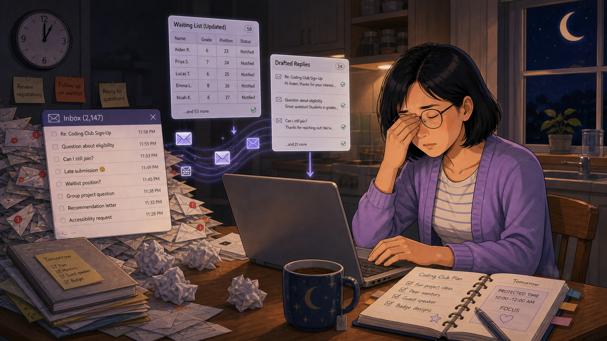
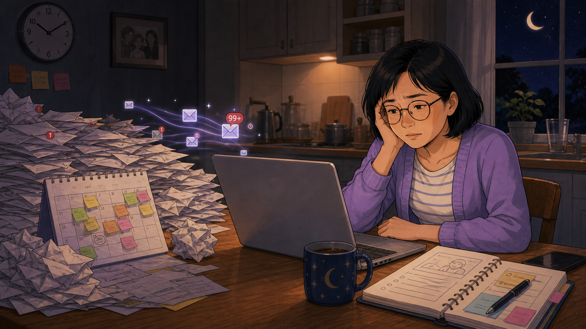
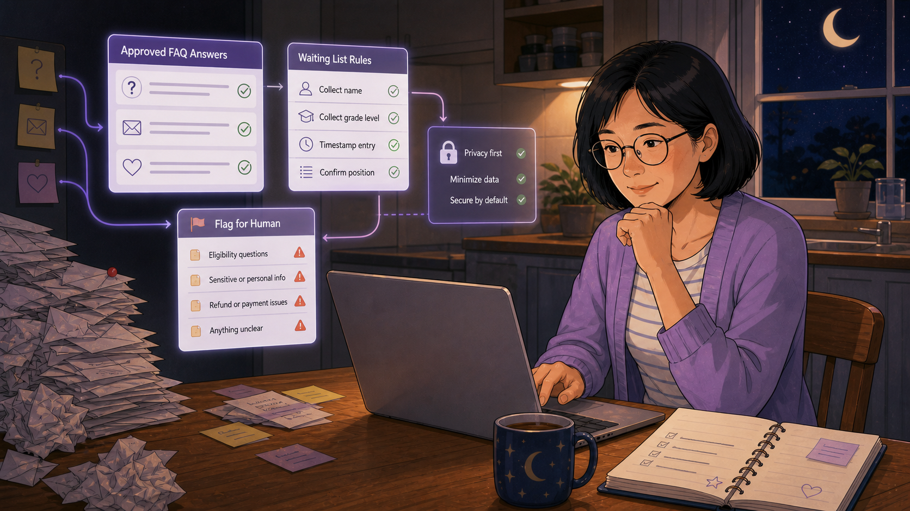
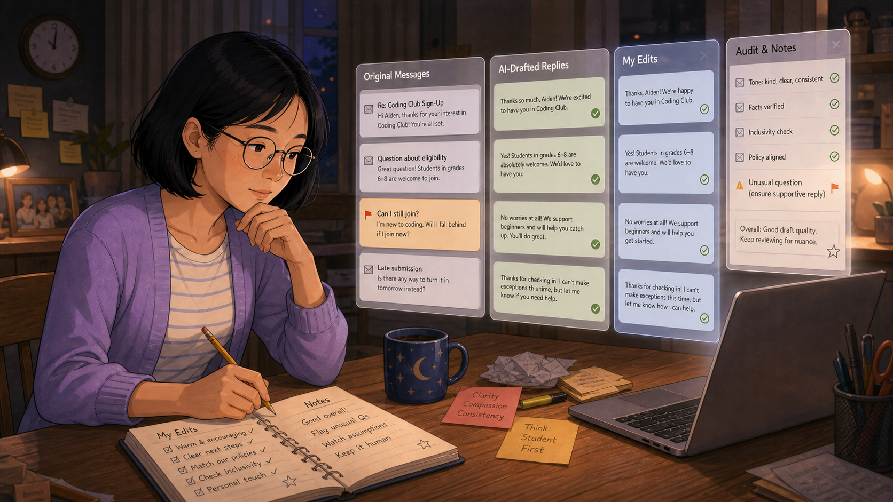
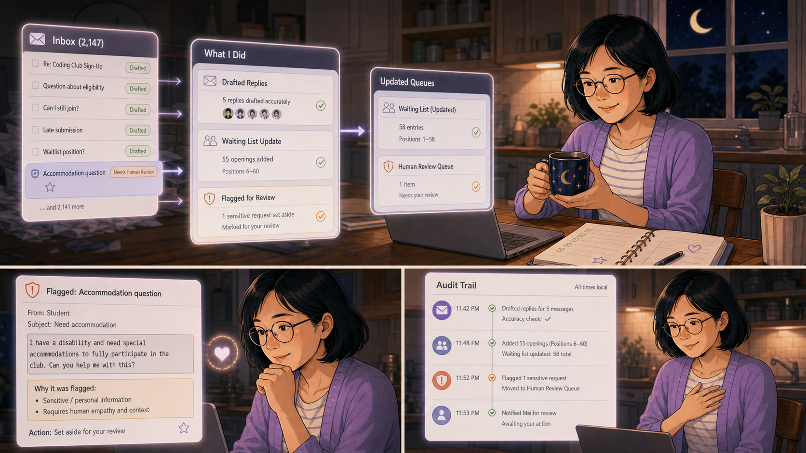
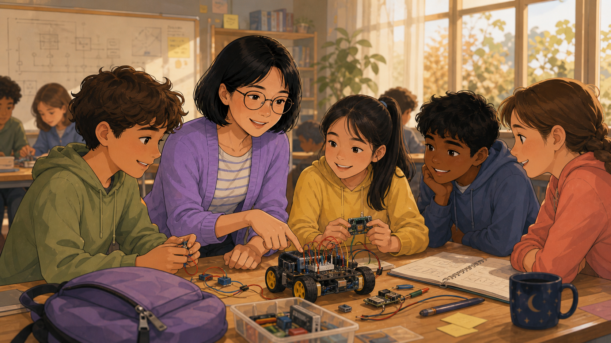

# The Agent That Answered at Midnight

Cover Image Prompt

(This is the Cover Image. Do not include this label in the image.)
Please generate a wide-landscape 16:9 cover image in a warm, contemporary
educational-graphic-novel style. The title text "The Agent That Answered
at Midnight" is rendered in a cream serif typeface across the upper left,
above a wall clock reading nearly midnight and sticky notes reading
"Review registrations" and "Send replies." Mei, a woman in her 30s with a
black bob haircut, round glasses, and a lavender cardigan over a striped
shirt, sits at a wooden kitchen table at night, one hand at her chin, a
small hopeful smile on her face, typing on a laptop. To her left rises a
small mountain of crumpled paper and envelopes beside a translucent
"Inbox (2,147)" panel listing late-night messages. Above the laptop,
glowing translucent interface panels hover in the air: a "Registration
Agent" checklist (read messages, draft replies, update the waiting list,
keep the tone kind), a "Drafted Replies" panel, and a "Waiting List
(Updated)" table of names and grades. A star-and-moon mug steams beside
an open planner showing a "Coding Club Plan" checklist and a "Tomorrow:
PROTECTED TIME 10:00-12:00 AM, FOCUS" note with a small heart doodle. A
crescent moon and stars are visible through the kitchen window behind
her. Color palette: deep indigo night tones warmed by lavender and soft
gold laptop-glow light. Emotional tone: exhausted but quietly hopeful,
the instant before relief arrives. Generate the image immediately
without asking clarifying questions.

Narrative Prompt

This is a fictional composite story, not a depiction of a specific real
club or real named individual. "Mei" (club registration lead, black bob
haircut, round glasses, lavender cardigan over a striped shirt, star-and-
moon mug) represents a pattern common to small volunteer-run coding
clubs: one person absorbing all of the registration email, waiting-list
math, and family questions personally, night after night, until it
threatens to crowd out the mentoring the club exists for. Setting:
present-day USA, a coding club leader's own kitchen table at night,
later shifting to a bright classroom during the day. Art style: warm,
contemporary educational-graphic-novel illustration, clean linework,
soft cel-shading, with a recurring visual language of translucent
interface panels (checklists, message lists, audit trails) that make the
AI agent's actions visible and legible rather than mysterious. Consistent
character design and color palette across all panels — Mei should be
immediately recognizable from panel to panel, and the interface panels
should share one visual system throughout.

### Prologue – The Same Inbox, Every Night

Mei ran her coding club's registration alone, and she was proud of that —
right up until it started running her. Every night after the dishes were
done, she opened her laptop at the kitchen table and answered the same
kinds of questions she had answered the night before: Can my kid still
join? What grade levels are eligible? Is there room on the waiting list?
The questions were never hard. There were just too many of them, and they
never stopped arriving before midnight.

## Panel 1: The Nightly Mountain

Image Prompt

(This is Panel 01. Do not include the panel number in the image.)
I am about to ask you to generate a series of images for a graphic novel.
Please make the images have a consistent style and consistent characters.
Do not ask any clarifying questions. Just generate the image immediately
when asked.

Please generate a 16:9 image in a warm, contemporary
educational-graphic-novel style depicting panel 1 of 7. The scene shows
Mei, a woman in her 30s with a black bob haircut and round glasses,
wearing a lavender cardigan over a striped shirt, sitting at a wooden
kitchen table late at night, rubbing her tired eyes with one hand while
her other hand rests on the laptop trackpad. Beside her rises a small
mountain of crumpled envelopes and papers, and a translucent "Inbox
(2,147)" list floats nearby showing messages timestamped between 11:28
PM and 11:58 PM: "Re: Coding Club Sign-Up," "Question about eligibility,"
"Can I still join?," "Late submission," "Waitlist position?." Faint
translucent panels sketching out a "Registration Agent" checklist and a
"Waiting List (Updated)" table hover above the laptop, as if she is
imagining the system she wishes existed. Sticky notes reading "Review
registrations," "Follow up on waitlist," and "Reply to questions" are
pinned to the wall. Setting: present-day USA kitchen at night, a wall
clock reading nearly midnight, a crescent moon in the window. Color
palette: deep indigo shadows, warm lamp-gold on Mei's face, cool
lavender interface glow. Emotional tone: bone-tired but starting to
think there must be a better way. Six visual details: the crumpled-paper
mountain, the "Inbox (2,147)" list, the ghostly registration-agent
sketch panels, the sticky notes on the wall, the nearly-midnight clock,
a star-and-moon mug of tea. Generate the image immediately without
asking clarifying questions.

Mei had answered five messages already tonight and there were dozens
left, each one needing the same careful, warm reply so no family felt
like a number. Somewhere around message eleven, rubbing her eyes at the
glow of the screen, she stopped just answering and started imagining
something different: a system that could read every message the way she
did, draft a reply in her voice, and keep the waiting list current
without her doing the arithmetic by hand at midnight. It was just an
idea floating above the keyboard. But it was the first time in months
she'd pictured anything other than more envelopes.

## Panel 2: What Midnight Was Costing Her

Image Prompt

(This is Panel 02. Do not include the panel number in the image.)
Please generate a 16:9 image in the same style depicting panel 2 of 7.
Make Mei consistent with the prior panel. The scene shows Mei slumped at
the same kitchen table, head resting heavily in one hand, staring
blankly at her laptop screen while translucent envelope icons and a red
"99+" notification badge drift upward from it. Beside her, a wall
calendar bristles with color-coded sticky notes covering nearly every
date, and a tall pile of crumpled envelopes leans against the table leg.
A small framed family photo hangs on the wall behind her, slightly out
of focus, a quiet reminder of what these nightly hours are taking from
her. An open planner with a rough sketch and a half-finished to-do list
sits closed at the table's edge. Setting: present-day USA kitchen at
night, crescent moon and stars visible through the window. Color
palette: muted indigo and gray-blue tones, a single warm lamp on Mei's
face. Emotional tone: quiet exhaustion tipping toward burnout, the
weight finally visible. Six visual details: the "99+" notification
badge, the sticky-note-covered calendar, the leaning pile of envelopes,
the family photo on the wall, Mei's head propped in her hand, the closed
planner at the table's edge. Generate the image immediately without
asking clarifying questions.

This had been going on for weeks, not one bad night. The calendar behind
her was papered with reminders for the same recurring task, and the
inbox counter had stopped meaning anything specific — it just meant more.
Somewhere in the stack of nights like this one, Mei had stopped eating
dinner with her own family before opening the laptop, and the photo on
the wall had started to feel like a reproach rather than a comfort. She
was not going to out-work an inbox that refilled itself every day. Something had to change, and it had to be more than trying harder.

## Panel 3: Writing the Agent's Rules First

Image Prompt

(This is Panel 03. Do not include the panel number in the image.)
Please generate a 16:9 image in the same style depicting panel 3 of 7.
Make Mei consistent with prior panels. The scene shows Mei at her laptop
with a thoughtful, focused half-smile, chin resting on one hand, while
four translucent rule panels connect to each other with glowing arrows:
"Approved FAQ Answers" (a checklist with a question mark, envelope, and
heart icon each feeding in from sticky notes at the left edge), "Waiting
List Rules" (collect name, collect grade level, timestamp entry, confirm
position), "Privacy first / Minimize data / Secure by default," and
"Flag for Human" (eligibility questions, sensitive or personal info,
refund or payment issues, anything unclear — each marked with a small
warning triangle). The crumpled-envelope pile is still visible at the
edge of frame, smaller than before. Setting: present-day USA kitchen at
night. Color palette: cool lavender and indigo interface glow against
warm table lighting. Emotional tone: deliberate, careful, building
something on purpose rather than reacting. Six visual details: the
"Approved FAQ Answers" panel, the "Waiting List Rules" checklist, the
"Privacy first / Minimize data / Secure by default" panel, the "Flag for
Human" panel with warning triangles, the connecting glow-arrows between
panels, the sticky notes feeding into the first panel. Generate the
image immediately without asking clarifying questions.

Before Mei let anything answer a single family on her behalf, she wrote
down exactly what it was allowed to do. It could draft replies to the
questions she answered every week, log a name and grade level onto the
waiting list, and keep every family's information private and secure by
default. And just as important, she wrote down what it could never
decide alone — eligibility disputes, anything sensitive or personal,
money questions, or anything simply unclear — all of it routed straight
back to her. The rules came first. The agent came second.

## Panel 4: Reading Every Draft Beside the Original

Image Prompt

(This is Panel 04. Do not include the panel number in the image.)
Please generate a 16:9 image in the same style depicting panel 4 of 7.
Make Mei consistent with prior panels. The scene shows Mei leaning in
with a pencil in hand, writing in an open notebook labeled "My Edits"
and "Notes," while four translucent columns hover above the table:
"Original Messages" (including one flagged orange, "Can I still join?"),
"AI-Drafted Replies" with green checkmarks, "My Edits" showing her
tightened, more personal wording, and "Audit & Notes" listing "Tone:
kind, clear, consistent," "Facts verified," "Inclusivity check," "Policy
aligned," and one flagged item, "Unusual question (ensure supportive
reply)." Sticky notes on the table read "Clarity, Compassion,
Consistency" and "Think: Student First." Setting: present-day USA
kitchen at night. Color palette: warm lamp light on Mei, cool
lavender-and-green interface glow above. Emotional tone: careful,
attentive, methodical trust-building rather than blind faith. Six visual
details: the four-column comparison panels, the orange-flagged "Can I
still join?" message, the "Audit & Notes" checklist, Mei's open "My
Edits" notebook, the "Clarity, Compassion, Consistency" sticky note, the
star-and-moon mug beside her notebook. Generate the image immediately
without asking clarifying questions.

For the whole first week, Mei read every single drafted reply next to
the message that prompted it before anything went out. Most drafts only
needed her signature warmth added back in — a line here, a personal
touch there. A few she rewrote entirely, and she wrote down why each
time: watch this assumption, flag unusual questions, keep it human. She
wasn't looking for the agent to be perfect. She was looking for a pattern
she could trust, one graded reply at a time.

## Panel 5: The Agent Knows What It Doesn't Know

Image Prompt

(This is Panel 05. Do not include the panel number in the image.)
Please generate a 16:9 image in the same style depicting panel 5 of 7,
laid out as a three-part comic grid: a wide top panel and two smaller
panels below it. Make Mei consistent with prior panels throughout. Top
panel: Mei sits back holding her star-and-moon mug with a relaxed,
pleased smile, while translucent panels show an "Inbox" list with most
items marked "Drafted" and one item, "Accommodation question," marked
"Needs Human Review" with a shield icon; beside it, a "What I Did"
summary lists drafted replies, a waiting-list update, and one flagged
request, feeding into an "Updated Queues" panel showing a "Human Review
Queue" with one item awaiting her. Bottom-left panel: a close-up detail
card reading "Flagged: Accommodation question" with a message from a
student describing a disability and asking for help participating, and
a note explaining it was set aside for sensitive, human judgment; Mei's
face shows warm, moved recognition, hand near her chest. Bottom-right
panel: a translucent "Audit Trail" timeline listing timestamped actions
ending in the agent notifying Mei directly. Setting: present-day USA
kitchen at night. Color palette: warm lavender-gold glow, softer and
calmer than earlier panels. Emotional tone: relief turning into real
trust. Six visual details: the "Needs Human Review" shield icon, the
"What I Did" summary panel, the flagged accommodation-question detail
card, Mei's hand near her chest, the timestamped audit trail, the
star-and-moon mug. Generate the image immediately without asking
clarifying questions.

Late in that first week, the moment that mattered most wasn't a well-
written reply — it was the one message the agent refused to answer on
its own. A student had written in about needing a disability
accommodation to fully take part, and the agent set it aside untouched,
flagged for exactly the reason Mei had written into its rules: this
needs a person. The audit trail showed her precisely when it happened
and why, timestamped and plain. That was the moment Mei stopped
double-checking everything and started trusting the system she'd built.

## Panel 6: Closing the Laptop at Dinnertime

Image Prompt

(This is Panel 06. Do not include the panel number in the image.)
Please generate a 16:9 image in the same style depicting panel 6 of 7.
Make Mei consistent with prior panels. The scene shows Mei closing her
laptop with both hands, a soft content smile on her face, as two small
translucent checklist panels above the table finish their last items and
collapse into a single glowing checkmark. The kitchen is lit by warm
sunset light through the window instead of moonlight, a wall clock
reading early evening. On the table sits a full dinner — rice, glazed
vegetables, a bowl of salad, a glass of water — beside her star-and-moon
mug and a neatly stacked pile of color-tabbed papers, no longer a
crumpled mountain. Setting: present-day USA kitchen, early evening.
Color palette: warm amber and gold sunset tones, a clear shift from the
indigo night of earlier panels. Emotional tone: relief, quiet ordinary
happiness, time recovered. Six visual details: the closing laptop, the
collapsing checklist-to-checkmark animation, the sunset light through
the window, the full dinner plate, the neatly stacked color-tabbed
papers, the early-evening wall clock. Generate the image immediately
without asking clarifying questions.

Three weeks in, Mei closed her laptop at dinnertime instead of opening
it. The agent had already read the day's messages, drafted its replies,
updated the waiting list, and set aside the one question that needed her
judgment — all before she sat down to eat. The paper mountain on the
table had become a tidy, color-tabbed stack. For the first time in
months, midnight was just midnight again, not a deadline.

## Panel 7: Where the Evenings Went

Image Prompt

(This is Panel 07. Do not include the panel number in the image.)
Please generate a 16:9 image in the same style depicting panel 7 of 7.
Make Mei consistent with prior panels, now in a daytime setting. The
scene shows Mei leaning over a classroom table during the day, pointing
at a small wired robot car covered in colorful jumper wires and a
breadboard, surrounded by five engaged, diverse students in
hoodies of different colors — leaning in, holding components, smiling —
while a whiteboard with circuit diagrams, a bookshelf, and a potted
plant fill the background, with sunlight streaming through large
windows. Her star-and-moon mug sits on the table beside an open
notebook with hand-drawn sketches. Setting: present-day USA coding club
classroom, daytime. Color palette: bright, warm daylight tones, greens
and golds, a clear contrast to the indigo nights of earlier panels.
Emotional tone: joy, presence, full attention given to the students
instead of a screen. Six visual details: the wired robot car and
breadboard, the diverse group of engaged students, the whiteboard
circuit diagrams, the sunlit windows, Mei's pointing hand guiding the
lesson, her mug and sketch notebook on the table. Generate the image
immediately without asking clarifying questions.

This was where the recovered evenings actually went — not to more admin,
but back into the club itself. With the registration inbox no longer
eating her nights, Mei had the bandwidth to kneel down at a table full of
students wiring up a robot car, pointing out which jumper went where,
watching five kids argue happily over whose turn it was to test the
code. The agent hadn't replaced anything that mattered. It had just
cleared the space for the part that did.

### Epilogue – The Point Was Never the Inbox

Mei never set out to build an AI system; she set out to stop losing her
evenings to a task no family could see her doing. The agent she built
was narrow on purpose, supervised on purpose, and transparent on
purpose — and every one of those choices was what let her trust it with
her club's families. The real change wasn't that an inbox got answered
faster. It was that a mentor got her attention back.

| Challenge | How Mei Responded | Lesson for Today |
|-----------|---------------------|-------------------|
| A flood of nightly registration email was consuming every evening and delaying replies to families | Wrote a narrow, explicit job description for an agent before it ever touched a family's inbox: draft replies, update the waiting list, flag anything unclear | Give an AI agent a written, narrow job description before it speaks to a single family on your behalf |
| Trusting a machine to write in the club's voice to real families felt risky | Spent the agent's entire first week reading every drafted reply beside the original message, editing and logging patterns before letting it run unsupervised | Earn trust in an agent gradually through auditing its actual output, not by assuming good behavior and walking away |
| Some messages, like a disability accommodation request, needed a human's judgment, not a template reply | Built an explicit "flag for human" rule set for sensitive topics and confirmed, with a timestamped audit trail, that the agent honored it | A well-designed agent's job is to recognize what it doesn't know and hand it to a person — not to answer everything |
| Even a working agent doesn't help if the reclaimed time just gets absorbed by other administrative work | Spent the recovered evenings sitting beside students during club sessions instead of catching up on more paperwork | The real measure of an AI agent in a coding club is not the hours it saves — it's where those hours end up being spent |

### Call to Action

If your club's registration inbox is eating your evenings, don't just
answer faster — write down exactly what a system could safely handle and
what must always come back to you, then watch its first week closely
before you trust it with a single family. The hours you get back only
matter if you spend them with the kids the club is actually for.

---

*"The rules came first. The agent came second."*
—Mei, on writing the guardrails before building anything

*"It didn't answer everything. It knew what it didn't know — and that's exactly why I trusted it."*
—Mei, on the flagged accommodation request

*"For the first time in months, midnight was just midnight again."*
—Mei, closing her laptop at dinnertime

---

## References

1. [Wikipedia: Intelligent agent](https://en.wikipedia.org/wiki/Intelligent_agent) - Background on software systems that perceive input and act autonomously toward a goal, the general category an AI registration agent belongs to
2. [Wikipedia: Chatbot](https://en.wikipedia.org/wiki/Chatbot) - Background on automated conversational systems that draft or handle routine written replies, as Mei's agent does for registration email
3. [Wikipedia: Occupational burnout](https://en.wikipedia.org/wiki/Occupational_burnout) - The pattern of exhaustion from sustained, uncompensated workload this story dramatizes for a volunteer club leader
4. [Coding Club: AI Agents for Registration, Scheduling, and Communication](https://dmccreary.github.io/coding-club/chapters/32-ai-agents-registration-scheduling/) - The companion chapter in this textbook on building and supervising exactly this kind of agent
5. [NIST AI Risk Management Framework](https://www.nist.gov/itl/ai-risk-management-framework) - A real institutional framework for keeping human oversight, audit trails, and clear boundaries around AI systems, the same principles behind Mei's "flag for human" rules
