# AI Racing League

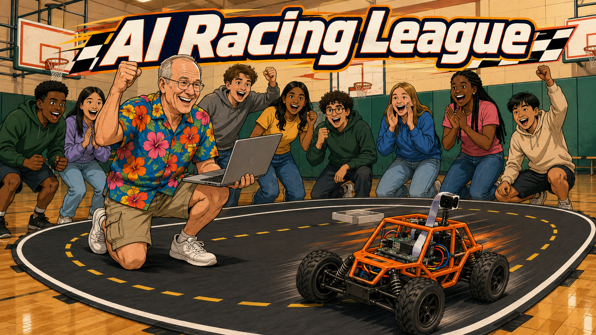

Cover Image Prompt

(This is the Cover Image. Do not include this label in the image.)
Please generate a wide-landscape 16:9 cover image in a warm,
contemporary educational-graphic-novel illustration style: clean bold
linework, soft cel-shading, warm saturated colors, grounded realistic
proportions — not photorealistic, not painterly, no heavy noir-style
shading. Scene: inside a high school gymnasium converted into a
racetrack. On the floor, an indoor racetrack made of matte black
vinyl matting taped flat down, bordered by solid white lane-edge
lines with a yellow dashed centerline down the middle, laid out in a
wide oval with rounded ends. Racing along the track: the DonkeyCar, a
1/16-scale RC car with an orange 3D-printed open roll-cage frame
bolted onto a compact four-wheel off-road chassis, thick black knobby
off-road tires, a small gray single-board computer and a narrow
ribbon-cable camera module mounted on a short forward mast tilted
slightly downward, loose colored jumper wires visible across the open
deck — plain unbranded hardware with no visible logos, text, or
trademarks anywhere on the car. Kneeling beside the track: Charlie, a
66-year-old white American man, about 5 feet 10 inches tall, of
average build, slightly balding on top with short neatly-trimmed gray
hair on the sides and back, clean-shaven, small wire-rim glasses, a
big warm smile with laugh lines, dressed in a brightly colored loud
tropical Hawaiian shirt (bold hibiscus-flower print) worn untucked
with the top button open, tan khaki cargo shorts, and white leather
sneakers. Charlie holds a laptop open on one knee (plain, unbranded,
no visible logo on the lid) and pumps his other fist in the air,
grinning ear to ear. Behind him, a small visibly diverse group of
high school students (a mix of genders and ethnicities, with girls
prominently included) cheer with raised arms. Basketball hoops and
green wall padding are visible in the gym background. Title text "AI
Racing League" rendered in a bold, energetic, rounded sans-serif
typeface, styled like a racing banner. Color palette: warm gym-light
yellows and warm woods, contrasted with the matte black track and
bright orange car. Emotional tone: joy, discovery, contagious
excitement. Do not render any real brand names, logos, or trademarks
anywhere in the image (no Raspberry Pi logo, no computer or phone
brand logos, no clothing logos). Generate the image immediately
without asking clarifying questions.

Narrative Prompt

This is a fictional composite story, not a depiction of a specific
real named individual, though it draws on a real, commonly reported
pattern in the coding-club movement: retired engineers who volunteer
their time and expertise to start clubs for young people, and the
real open-source "Donkey Car" platform, which pairs a Raspberry Pi
and camera with an off-the-shelf 1/16-scale RC car chassis to teach
autonomous-driving machine learning. The story also depicts a
realistic early rough patch — a skeptical principal, weak initial
enrollment against a more established traditional RC club, dead
batteries, and buggy, poorly documented open-source software — that
the founder turns into a debugging and problem-solving lesson rather
than papering over. Setting: a present-day suburban home, a
high-tech AI engineering company office, and a public high school in
the United States. Art style: warm, contemporary
educational-graphic-novel illustration, clean bold linework, soft
cel-shading, warm saturated colors, grounded realistic proportions —
consistent across every single panel.

**Character and prop descriptions — repeat these exact descriptions
verbatim in every panel's image prompt below (the image-generation
API has no memory between calls, so restating the full description
every time is the only way to keep characters, the car, and the
track visually consistent from panel to panel).**

- **Charlie** (the retired engineer): a 66-year-old white American
  man, about 5 feet 10 inches tall, of average build, slightly
  balding on top with short neatly-trimmed gray hair on the sides and
  back, clean-shaven, small wire-rim glasses, a big warm smile with
  laugh lines. Starting in Panel 3 and for the rest of the story, he
  wears a brightly colored loud tropical Hawaiian shirt (a different
  bold floral or tropical print in nearly every scene) worn untucked
  with the top button open, tan khaki cargo shorts, and white leather
  sneakers. In Panels 1 and 2 only (his last days at his engineering
  job, before retirement), he instead wears a plain light-blue
  short-sleeve collared work shirt, khaki slacks, and a company photo
  ID badge on a lanyard — no Hawaiian shirt yet.
- **Joan** (Charlie's wife): a 64-year-old white American woman,
  about 5 feet 5 inches tall, of average build, shoulder-length
  straight dark brown hair with a few visible gray streaks framing
  her face, wearing simple wire-rim reading glasses only when reading
  something, dressed in practical, comfortable everyday clothing (a
  plain solid-color crew-neck T-shirt or blouse and jeans), minimal
  jewelry, an expressive face that reads as warm but no-nonsense.
- **Linda** (the high school principal): a 45-year-old Black American
  woman, about 5 feet 6 inches tall, natural black hair worn in a
  neat short professional style, dressed in sharp professional
  business attire (a tailored blazer over a blouse), simple small
  gold stud earrings, a warm, optimistic, confident expression.
- **The DonkeyCar** (the RC car, appears from Panel 4 onward): a
  1/16-scale RC car with an orange 3D-printed open roll-cage frame
  bolted onto a compact four-wheel off-road chassis, thick black
  knobby off-road tires, a small gray single-board computer and a
  narrow ribbon-cable camera module mounted on a short forward mast
  tilted slightly downward, loose colored jumper wires visible across
  the open deck — plain unbranded hardware with no visible logos,
  text, or trademarks anywhere on the car.
- **The racetrack** (appears from Panel 11 onward): an indoor
  racetrack made of matte black vinyl matting taped flat to the
  floor, bordered by solid white lane-edge lines with a yellow dashed
  centerline running down the middle (giving the visual impression of
  two lanes side by side), laid out in a wide oval with rounded ends.
- **The three founding students** (appear from Panel 8 onward):
  Priya, a 16-year-old South Asian-American girl with a long dark
  braid and glasses, wearing a purple hoodie; Marcus, a 16-year-old
  Black American boy with short curly hair, wearing a gray zip-up
  hoodie; and Sofia, a 15-year-old Hispanic-American girl with
  shoulder-length curly brown hair, wearing a denim jacket.
- **Every prompt** should end with an explicit instruction not to
  render any real brand names, logos, or trademarks anywhere in the
  image (no Raspberry Pi logo, no computer or phone brand logos, no
  clothing logos, no real company names) — hardware and companies in
  this story should read as generic and unbranded.

### Prologue – A Man Built for a Problem That Wasn't There Anymore

Charlie had spent thirty-five years solving problems for a living at
an AI-focused engineering company — tolerances, wiring diagrams,
failure modes, and lately, machine-learning pipelines he only half
trusted. Retirement was supposed to be the reward. Nobody warned him
it would also be the first time in decades he had absolutely nothing
that needed fixing.

## Panel 1: The Retirement Party

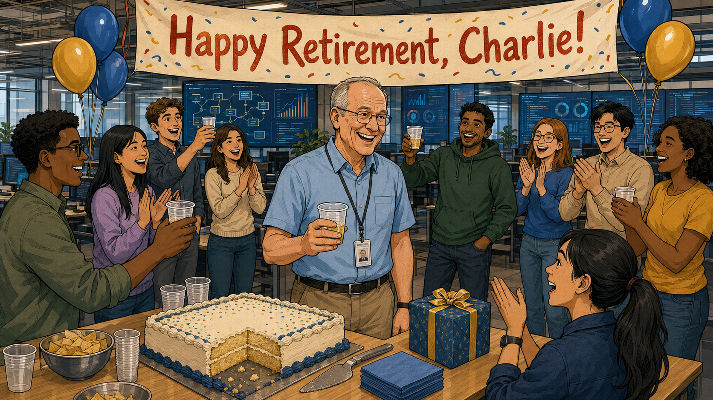

Image Prompt

(This is Panel 01. Do not include the panel number in the image.)
I am about to ask you to generate a series of images for a graphic
novel. Please make the images have a consistent style and consistent
characters. Do not ask any clarifying questions. Just generate the
image immediately when asked.

Please generate a 16:9 image in a warm, contemporary
educational-graphic-novel illustration style (clean bold linework,
soft cel-shading, warm saturated colors, grounded realistic
proportions) depicting panel 1 of 13. Scene: an open-plan office at a
high-tech AI-focused engineering company, decorated with a
hand-lettered "Happy Retirement, Charlie!" banner, a sheet cake, and
a few balloons; large monitors in the background show abstract
circuit diagrams and data dashboards (no real company logos or brand
names anywhere). At the center: Charlie — a 66-year-old white
American man, about 5 feet 10 inches tall, of average build, slightly
balding on top with short neatly-trimmed gray hair on the sides and
back, clean-shaven, small wire-rim glasses, a big warm smile with
laugh lines — wearing a plain light-blue short-sleeve collared work
shirt, khaki slacks, and a company photo ID badge on a lanyard (no
Hawaiian shirt in this panel). A small diverse group of coworkers and
friends of mixed ages and genders surrounds him, clapping and raising
plastic cups in a toast. Setting: present-day USA, daytime, bright
office lighting. Color palette: cool office grays and blues warmed by
festive balloon colors. Emotional tone: warm celebration tinged with
Charlie's own quiet uncertainty about what comes next. Six visual
details: the "Happy Retirement, Charlie!" banner, a half-cut sheet
cake, Charlie's ID badge on its lanyard, coworkers raising plastic
cups, abstract circuit-diagram monitors in the background, a small
wrapped retirement gift box on a nearby desk. Do not render any real
brand names, logos, or trademarks anywhere in the image. Generate the
image immediately without asking clarifying questions.

Charlie's coworkers threw him a good send-off — cake, balloons, a
banner someone had clearly made in a hurry. Thirty-five years of
solving other people's problems ended with a round of applause and a
gift card he wasn't sure what to do with.

## Panel 2: "What Are Your Post-Retirement Plans?"

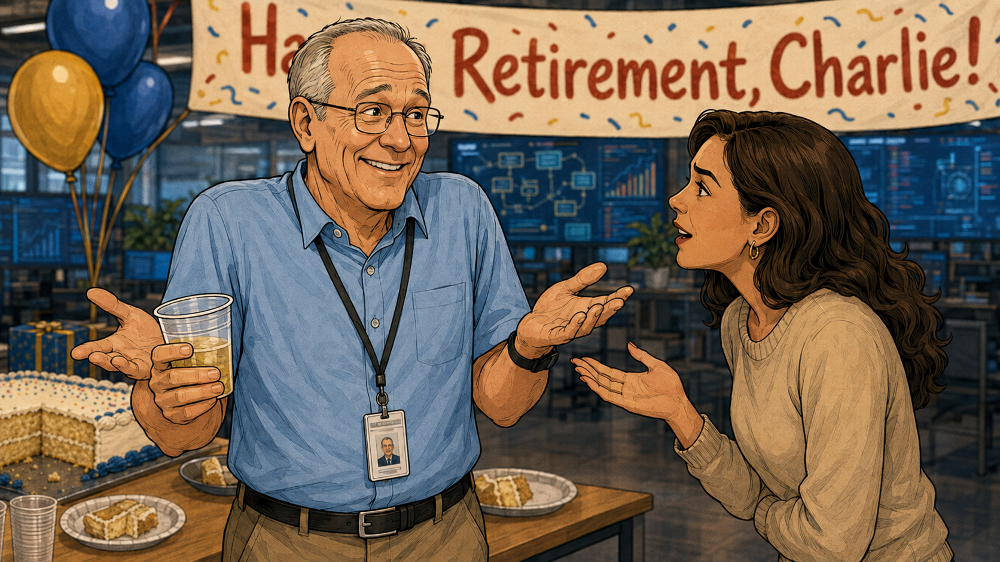

Image Prompt

(This is Panel 02. Do not include the panel number in the image.)
Please generate a 16:9 image in the same warm, contemporary
educational-graphic-novel illustration style (clean bold linework,
soft cel-shading, warm saturated colors, grounded realistic
proportions) depicting panel 2 of 13. Scene: the same retirement
party, a medium close-up. Charlie — a 66-year-old white American man,
about 5 feet 10 inches tall, of average build, slightly balding on
top with short neatly-trimmed gray hair on the sides and back,
clean-shaven, small wire-rim glasses, wearing the same plain
light-blue short-sleeve collared work shirt, khaki slacks, and
company ID badge on a lanyard as the prior panel — stands holding a
plastic cup, shrugging with raised eyebrows and an easy, slightly
uncertain smile. Facing him, a curious younger coworker (a woman in
her 30s in business-casual clothing) leans in, mid-question. Setting:
same present-day USA office retirement party, daytime. Color palette:
same warm office tones as the prior panel. Emotional tone: a
lighthearted question that Charlie genuinely doesn't have an answer
for yet. Six visual details: Charlie's raised eyebrows and shrug, his
plastic cup, the younger coworker's curious expression, the
retirement banner blurred in the background, a scatter of paper
plates with cake, Charlie's ID badge still clipped to his lanyard.
Do not render any real brand names, logos, or trademarks anywhere in
the image. Generate the image immediately without asking clarifying
questions.

"So, Charlie, what are your plans after retirement?" a coworker
asked, cake in hand. "I have no idea," Charlie admitted, laughing.
"I'm still trying to figure that out." He meant it as a joke. It
would turn out to be the truest thing he said all week.

## Panel 3: Get a Hobby

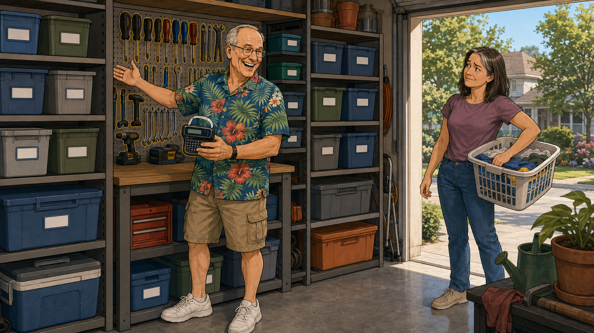

Image Prompt

(This is Panel 03. Do not include the panel number in the image.)
Please generate a 16:9 image in the same warm, contemporary
educational-graphic-novel illustration style (clean bold linework,
soft cel-shading, warm saturated colors, grounded realistic
proportions) depicting panel 3 of 13. Scene: a suburban garage,
weeks later. Every tool is pegboard-mounted and hand-labeled, storage
bins stacked in a freshly reorganized arrangement. Charlie — a
66-year-old white American man, about 5 feet 10 inches tall, of
average build, slightly balding on top with short neatly-trimmed gray
hair on the sides and back, clean-shaven, small wire-rim glasses, a
big warm smile — now wearing a brightly colored loud tropical
Hawaiian shirt (bold palm-and-hibiscus print) worn untucked with the
top button open, tan khaki cargo shorts, and white leather sneakers —
stands holding a label maker, admiring a shelf he has clearly
reorganized for the third time this month. Through the open garage
door, Joan — a 64-year-old white American woman, about 5 feet 5
inches tall, of average build, shoulder-length straight dark brown
hair with a few visible gray streaks, wearing a plain solid-color
T-shirt and jeans — stands on the driveway holding a laundry basket
on her hip, giving him a flat, done-with-this look. Setting:
present-day USA suburban home, early afternoon, bright daylight.
Color palette: warm, tidy garage tones — wood browns, tool-pegboard
grays — contrasted with Charlie's bright, loud shirt pattern.
Emotional tone: restless energy meeting quiet exasperation. Six
visual details: a label maker in Charlie's hand, a perfectly labeled
row of storage bins, a pegboard with every tool outlined in marker,
Joan's laundry basket, her flat unimpressed expression, sunlight
spilling across the driveway. Do not render any real brand names,
logos, or trademarks anywhere in the image. Generate the image
immediately without asking clarifying questions.

Retirement, Charlie discovered, came with an unlimited supply of time
and an alarming shortage of things that actually needed doing. So he
invented them — reorganizing the garage for the third time that
month, narrating every decision out loud to no one in particular.
"Charlie," Joan finally said from the driveway, laundry basket on her
hip, "you need to get a hobby."

## Panel 4: The "Donkey Car" Video That Sparked an Idea

Image Prompt

(This is Panel 04. Do not include the panel number in the image.)
Please generate a 16:9 image in the same warm, contemporary
educational-graphic-novel illustration style (clean bold linework,
soft cel-shading, warm saturated colors, grounded realistic
proportions) depicting panel 4 of 13. Scene: Charlie's kitchen table
the next evening, dim lighting except for the blue-white glow of a
plain unbranded laptop screen lighting his face. Charlie — a
66-year-old white American man, about 5 feet 10 inches tall, of
average build, slightly balding on top with short neatly-trimmed gray
hair on the sides and back, clean-shaven, small wire-rim glasses
catching the screen's reflection, wearing a brightly colored loud
tropical Hawaiian shirt (bold tropical-leaf print) — leans in with
wide, delighted eyes at a paused video on the laptop showing a small
1/16-scale RC car with an orange roll-cage frame, a small computer
board, and a camera on a mast, mid-drive on an indoor track. Setting:
same present-day USA suburban kitchen, evening. Color palette: warm
kitchen tones fading into the laptop's cool blue glow. Emotional
tone: the first real spark of excitement after weeks of restless
boredom. Six visual details: the glowing laptop screen, the paused
video frame of the small RC car, Charlie's wide eyes behind his
glasses, a mug of tea beside the laptop, a dark kitchen window, his
hand frozen mid-reach toward the trackpad. Do not render any real
brand names, logos, or trademarks anywhere in the image. Generate the
image immediately without asking clarifying questions.

The next evening, scrolling at the kitchen table, one video stopped
Charlie cold: a small RC car, no bigger than a shoebox, driving
itself around a taped track with a little computer and a camera
bolted to its roof. It was called "Donkey Car" — open-source, built
around machine learning, exactly the kind of hands-on problem
Charlie hadn't realized he was missing. He knew immediately where he
wanted to bring it: the high school two miles from his house.

## Panel 5: The Meeting With the Principal

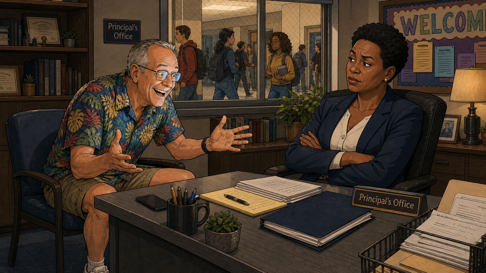

Image Prompt

(This is Panel 05. Do not include the panel number in the image.)
Please generate a 16:9 image in the same warm, contemporary
educational-graphic-novel illustration style (clean bold linework,
soft cel-shading, warm saturated colors, grounded realistic
proportions) depicting panel 5 of 13. Scene: a modest high school
principal's office. Charlie — a 66-year-old white American man, about
5 feet 10 inches tall, of average build, slightly balding on top with
short neatly-trimmed gray hair on the sides and back, clean-shaven,
small wire-rim glasses, wearing a brightly colored loud tropical
Hawaiian shirt (bold pineapple print), tan khaki cargo shorts — sits
forward earnestly in a chair across the desk, hands spread mid-pitch.
Behind the desk, Linda — a 45-year-old Black American woman, about 5
feet 6 inches tall, natural black hair in a neat short professional
style, dressed in a tailored blazer over a blouse, simple gold stud
earrings — sits with arms loosely crossed, one eyebrow raised, a
polite but visibly unconvinced expression. Through the office's
interior window, a hallway of diverse students is visible walking
past. Setting: present-day USA public high school, daytime,
fluorescent office lighting. Color palette: institutional office
neutrals — beige walls, gray desk — punctuated by Charlie's loud
Hawaiian shirt as the one vivid element in the room. Emotional tone:
hopeful persuasion meeting polite, guarded skepticism. Six visual
details: Charlie's spread-hands pitching gesture, Linda's crossed
arms and raised eyebrow, diverse students visible through the office
window, a "Welcome Back" bulletin board behind the desk, a nameplate
reading "Principal's Office" (no personal name shown), a stack of
paperwork on the desk between them. Do not render any real brand
names, logos, or trademarks anywhere in the image. Generate the image
immediately without asking clarifying questions.

Within a week, Charlie had talked his way into the principal's
office, explaining that he wanted to teach AI to students who never
got a shot at engineering at home — underserved kids, and especially
girls, routinely told computer science wasn't for them. Principal
Linda listened politely, arms crossed. A retired stranger with a big
idea and a loud shirt was not, on its face, a compelling pitch.
"Bring me something I can actually watch drive," she said, "and I'll
believe you."

## Panel 6: The Donkey Car Demo

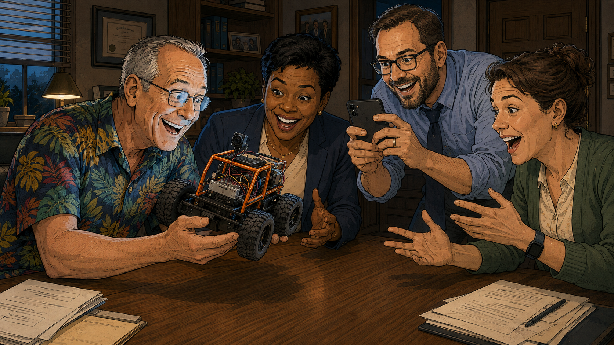

Image Prompt

(This is Panel 06. Do not include the panel number in the image.)
Please generate a 16:9 image in the same warm, contemporary
educational-graphic-novel illustration style (clean bold linework,
soft cel-shading, warm saturated colors, grounded realistic
proportions) depicting panel 6 of 13. Scene: the same principal's
office, now with a small conference table cleared off. Charlie — a
66-year-old white American man, about 5 feet 10 inches tall, of
average build, slightly balding on top with short neatly-trimmed gray
hair on the sides and back, clean-shaven, small wire-rim glasses,
wearing a brightly colored loud tropical Hawaiian shirt (bold parrot
print) — holds up the DonkeyCar: a 1/16-scale RC car with an orange
3D-printed open roll-cage frame on a compact four-wheel off-road
chassis, thick black knobby tires, a small gray computer board and a
ribbon-cable camera on a forward mast, loose colored wires visible —
for the table to see. Linda — a 45-year-old Black American woman,
about 5 feet 6 inches tall, natural black hair in a neat short
professional style, tailored blazer, gold stud earrings — now leans
in with a wide, delighted smile, and two other school staff members
(a man and a woman in business-casual clothing) lean in too, one
holding up a phone to take a photo. Setting: same present-day USA
high school office, daytime. Color palette: same institutional
neutrals now brightened by shared excitement and the car's vivid
orange frame. Emotional tone: excitement replacing skepticism, a
turning point. Six visual details: the orange DonkeyCar held up at
table height, Linda's delighted open smile, a staff member's phone
raised to take a photo, the car's visible camera mast, scattered
excited hand gestures, papers pushed aside to clear table space. Do
not render any real brand names, logos, or trademarks anywhere in the
image. Generate the image immediately without asking clarifying
questions.

Charlie didn't come back with a slide deck — he came back with an
actual car, driving itself in a lazy loop across the conference
table. Linda's arms uncrossed almost immediately. "Okay," she said,
leaning in for a closer look, "now I'm interested." A school this
proud of preparing kids for the future couldn't very well say no to
this.

## Panel 7: The Grant Letter

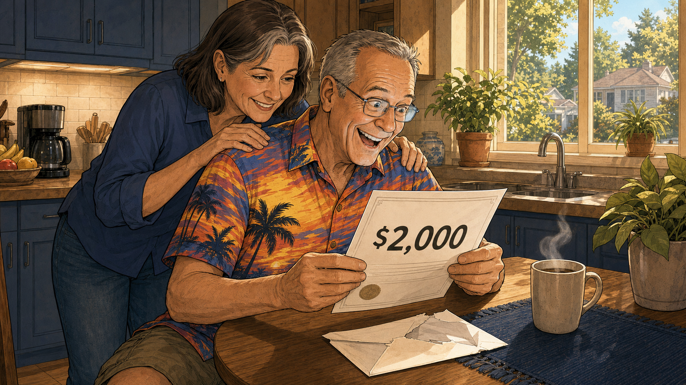

Image Prompt

(This is Panel 07. Do not include the panel number in the image.)
Please generate a 16:9 image in the same warm, contemporary
educational-graphic-novel illustration style (clean bold linework,
soft cel-shading, warm saturated colors, grounded realistic
proportions) depicting panel 7 of 13. Scene: Charlie and Joan's
kitchen, bright daytime. Charlie — a 66-year-old white American man,
about 5 feet 10 inches tall, of average build, slightly balding on
top with short neatly-trimmed gray hair on the sides and back,
clean-shaven, small wire-rim glasses, wearing a brightly colored loud
tropical Hawaiian shirt (bold surfboard-and-sunset print) — holds up
an official-looking grant award letter from the school district with
"$2,000" clearly visible in bold print, a torn-open envelope on the
table. Joan — a 64-year-old white American woman, about 5 feet 5
inches tall, shoulder-length dark brown hair with gray streaks,
wearing a plain solid-color blouse — stands behind him with both
hands on his shoulders, leaning down to read the letter, her earlier
exasperation replaced by genuine pride. Setting: same present-day USA
suburban kitchen, bright morning light. Color palette: bright,
optimistic morning light. Emotional tone: triumph and quiet pride.
Six visual details: the grant letter with "$2,000" clearly visible,
the torn envelope, Joan's hands on Charlie's shoulders, her proud
expression, morning sunlight through the kitchen window, a coffee mug
steaming beside the letter. Do not render any real brand names,
logos, or trademarks anywhere in the image. Generate the image
immediately without asking clarifying questions.

A few weeks later, an envelope arrived with the school district's
letterhead. Charlie tore it open right there in the kitchen: a
$2,000 grant, enough for a small GPU to train models and three
DonkeyCar kits to build. Joan read it over his shoulder and squeezed
his shoulders instead of rolling her eyes. "Well," she said, "I
suppose this beats the garage."

## Panel 8: The Event Sign-Up Day

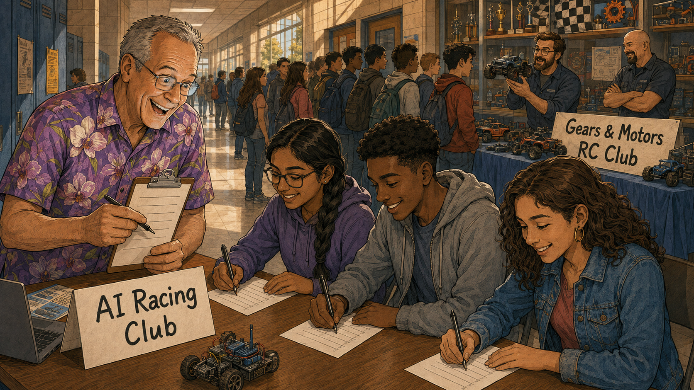

Image Prompt

(This is Panel 08. Do not include the panel number in the image.)
Please generate a 16:9 image in the same warm, contemporary
educational-graphic-novel illustration style (clean bold linework,
soft cel-shading, warm saturated colors, grounded realistic
proportions) depicting panel 8 of 13. Scene: a high school hallway
during the start-of-year club sign-up day. Charlie — a 66-year-old
white American man, about 5 feet 10 inches tall, of average build,
slightly balding on top with short neatly-trimmed gray hair on the
sides and back, clean-shaven, small wire-rim glasses, wearing a
brightly colored loud tropical Hawaiian shirt (bold orchid print) —
stands behind a modest folding table with a hand-lettered "AI Racing
Club" sign, smiling hopefully at exactly three students who have
stopped to sign up: Priya, a 16-year-old South Asian-American girl
with a long dark braid and glasses in a purple hoodie; Marcus, a
16-year-old Black American boy with short curly hair in a gray
zip-up hoodie; and Sofia, a 15-year-old Hispanic-American girl with
curly brown hair in a denim jacket. A few feet away, a much larger,
livelier table for an established "Gears & Motors RC Club," run by
two adult shop teachers, is surrounded by a long line of students and
covered in shiny toy RC cars and trophies. Setting: present-day USA
public high school hallway, midday, fluorescent lighting. Color
palette: bright, busy rival-table colors contrasted with the calmer,
smaller scene at Charlie's table. Emotional tone: modest hope holding
steady against visible competition. Six visual details: Charlie's
hand-lettered "AI Racing Club" sign, the three founding students at
his table, the rival "Gears & Motors RC Club" banner, its long line
of students, shiny toy RC cars and trophies on the rival table,
Charlie's clipboard with exactly three names written on it. Do not
render any real brand names, logos, or trademarks anywhere in the
image. Generate the image immediately without asking clarifying
questions.

Charlie had hoped for a line. Instead, most students walked straight
past his table toward the "Gears & Motors RC Club" a few feet away —
an established group run by the shop teachers, with real trophies and
zero mention of machine learning. By the end of the day, exactly
three students had signed up: Priya, Marcus, and Sofia. It wasn't the
flood Charlie had pictured, but it was enough to start.

## Panel 9: Dead Batteries

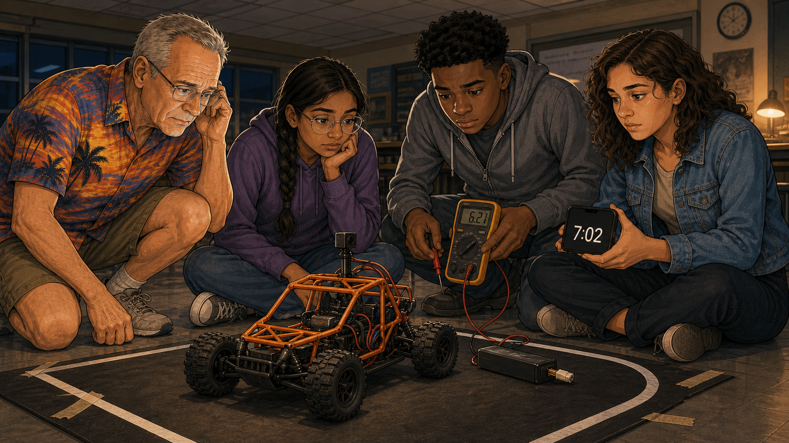

Image Prompt

(This is Panel 09. Do not include the panel number in the image.)
Please generate a 16:9 image in the same warm, contemporary
educational-graphic-novel illustration style (clean bold linework,
soft cel-shading, warm saturated colors, grounded realistic
proportions) depicting panel 9 of 13. Scene: a high school classroom
after hours. The DonkeyCar — an orange 3D-printed open roll-cage
frame on a compact four-wheel off-road chassis with thick black
knobby tires, a small gray computer board and ribbon-cable camera on
a forward mast — sits stalled dead in the middle of a short practice
loop taped on the classroom floor, its onboard indicator light dark.
Charlie — a 66-year-old white American man, about 5 feet 10 inches
tall, of average build, slightly balding on top with short
neatly-trimmed gray hair, clean-shaven, small wire-rim glasses,
wearing a brightly colored loud tropical Hawaiian shirt (bold
banana-leaf print) — crouches beside it looking disappointed, next to
Priya (South Asian-American girl, long dark braid, glasses, purple
hoodie), Marcus (Black American boy, short curly hair, gray zip-up
hoodie), and Sofia (Hispanic-American girl, curly brown hair, denim
jacket). Marcus holds a multimeter probe to the battery pack showing
a low reading, while Sofia holds up a phone whose stopwatch reads
"7:02". Setting: same present-day USA high school classroom, late
afternoon light. Color palette: neutral practical classroom tones
with a small warning-red highlight on the multimeter reading.
Emotional tone: shared disappointment mixed with curious
troubleshooting energy. Six visual details: the stalled orange
DonkeyCar, its dark indicator light, the multimeter's low-voltage
reading, the phone stopwatch reading "7:02", the three students
crouched around the car with Charlie, a spare battery pack lying on
the floor nearby. Do not render any real brand names, logos, or
trademarks anywhere in the image. Generate the image immediately
without asking clarifying questions.

The car's stock battery died after about seven minutes of driving —
nowhere near enough time to gather the roughly 10,000 images a good
driving model needed. Run after run stalled out early, and Charlie,
thirty-five years of engineering behind him, felt an unfamiliar
sting of doubt watching his three students' enthusiasm fray at the
edges. It took two weeks of research before he found a replacement
battery pack rated for a full thirty minutes — enough, finally, to
actually finish a training run.

## Panel 10: The Software That Wouldn't Behave

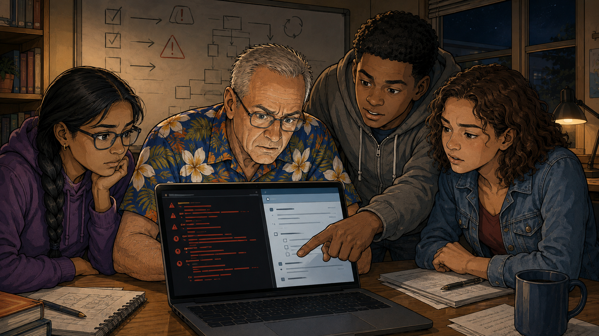

Image Prompt

(This is Panel 10. Do not include the panel number in the image.)
Please generate a 16:9 image in the same warm, contemporary
educational-graphic-novel illustration style (clean bold linework,
soft cel-shading, warm saturated colors, grounded realistic
proportions) depicting panel 10 of 13. Scene: the same classroom in
the evening. A plain unbranded laptop screen is filled with dense red
terminal error text next to a browser tab showing an old, sparsely
updated open-source documentation page. Charlie — a 66-year-old white
American man, about 5 feet 10 inches tall, of average build, slightly
balding on top with short neatly-trimmed gray hair, clean-shaven,
small wire-rim glasses, wearing a brightly colored loud tropical
Hawaiian shirt (bold plumeria-flower print) — leans in with a
furrowed brow next to Marcus (Black American boy, short curly hair,
gray zip-up hoodie), who points at a specific error line, while Priya
(South Asian-American girl, long dark braid, glasses, purple hoodie)
and Sofia (Hispanic-American girl, curly brown hair, denim jacket)
watch over their shoulders. A whiteboard behind them has begun to
fill with a hand-drawn troubleshooting checklist. Setting: same
present-day USA classroom, after-school hours, windows dark outside.
Color palette: cool screen-glow blues contrasted with warm classroom
lighting. Emotional tone: shared frustration turning into stubborn,
collaborative determination. Six visual details: the terminal full of
red error text, the sparse open-source documentation page, Charlie's
furrowed brow, Marcus pointing at a specific error line, the
partially filled troubleshooting checklist on the whiteboard, Priya
and Sofia watching closely over their shoulders. Do not render any
real brand names, logos, or trademarks anywhere in the image.
Generate the image immediately without asking clarifying questions.

The open-source Donkey Car software assumed a level of Python and
machine-learning fluency none of them had yet, and its documentation
hadn't been touched in years. Calibration alone took three frustrating
evenings, full of cryptic errors and a car that steered confidently
in exactly the wrong direction. It turned out to be a blessing in
disguise: Charlie taught the team to reproduce a bug, isolate one
variable at a time, and read an error message instead of fearing it
— skills that mattered as much as any line of Python they wrote.

## Panel 11: Race Day Demo Event

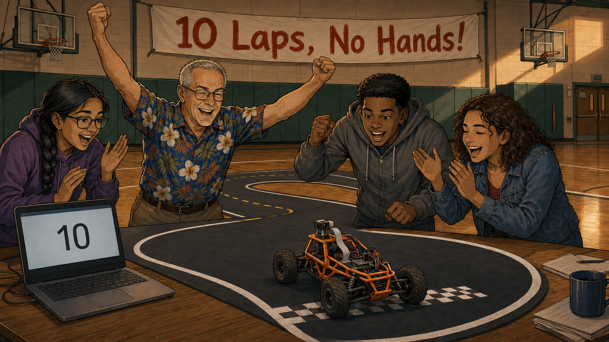

Image Prompt

(This is Panel 11. Do not include the panel number in the image.)
Please generate a 16:9 image in the same warm, contemporary
educational-graphic-novel illustration style (clean bold linework,
soft cel-shading, warm saturated colors, grounded realistic
proportions) depicting panel 11 of 13. Scene: the high school
gymnasium transformed into a racetrack: an indoor racetrack made of
matte black vinyl matting taped flat to the floor, bordered by solid
white lane-edge lines with a yellow dashed centerline down the
middle, laid out in a wide oval with rounded ends; basketball hoops
and green wall padding visible in the background. The DonkeyCar —
orange 3D-printed roll-cage frame, four-wheel off-road chassis, black
knobby tires, small gray computer board and ribbon-cable camera on a
forward mast — drives itself along the track with no one touching the
controls. Charlie — a 66-year-old white American man, about 5 feet 10
inches tall, of average build, slightly balding on top with short
neatly-trimmed gray hair, clean-shaven, small wire-rim glasses,
wearing a brightly colored loud tropical Hawaiian shirt (bold
tiki-and-palm print) — stands at the finish line with both arms
raised, cheering, beside Priya, Marcus, and Sofia (as previously
described) who are cheering too, one of them holding a laptop showing
a lap counter reading "10". Setting: present-day USA high school
gymnasium, daytime, overhead gym lighting. Color palette: warm
gym-wood tones and bright overhead lighting contrasted with the matte
black track and vivid orange car. Emotional tone: pure celebratory
triumph after months of struggle. Six visual details: the black
vinyl track with white borders and yellow dashed centerline, the
self-driving orange DonkeyCar mid-lap with no hands on it, a laptop
showing a lap counter reading "10", Charlie's raised arms, the three
students cheering, a hand-lettered banner reading "10 Laps, No
Hands!". Do not render any real brand names, logos, or trademarks
anywhere in the image. Generate the image immediately without asking
clarifying questions.

Once the batteries lasted and the software behaved, the team scheduled
a real demo: first car to finish training and complete ten laps with
no one touching the controls. When Priya's car crossed lap ten clean,
the gym erupted — Charlie loudest of all. Months of dead batteries
and cryptic errors had led to exactly this moment.

## Panel 12: Success Comes Slowly

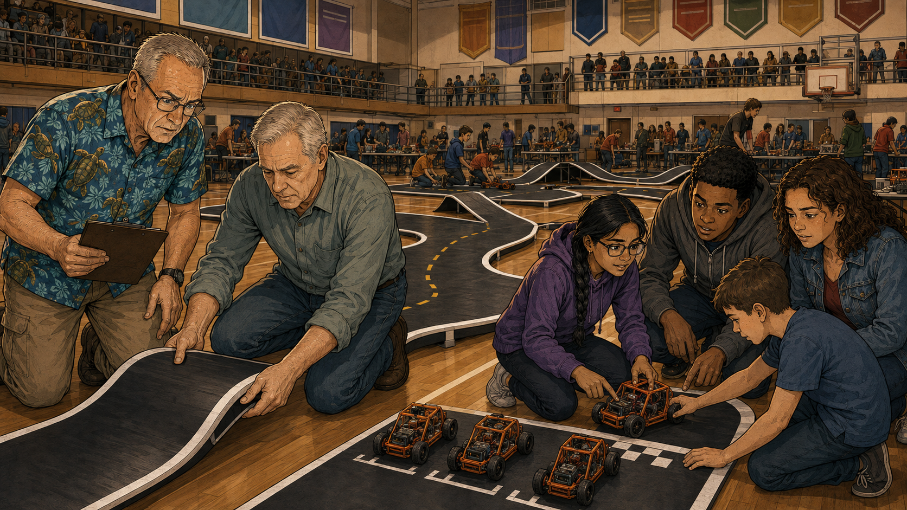

Image Prompt

(This is Panel 12. Do not include the panel number in the image.)
Please generate a 16:9 image in the same warm, contemporary
educational-graphic-novel illustration style (clean bold linework,
soft cel-shading, warm saturated colors, grounded realistic
proportions) depicting panel 12 of 13. Scene: a much larger
gymnasium event the following school year. On the floor, a large
indoor racetrack made of matte black vinyl matting, bordered by solid
white lane-edge lines with a yellow dashed centerline down the middle
(reading as two lanes side by side), now with several different
schools' hand-lettered banners hanging above different sections of
the same track. Students and adult mentors from multiple schools mix
together at the trackside. Charlie — a 66-year-old white American
man, about 5 feet 10 inches tall, of average build, slightly balding
on top with short neatly-trimmed gray hair, clean-shaven, small
wire-rim glasses, wearing a brightly colored loud tropical Hawaiian
shirt (bold sea-turtle print) — stands to one side with a clipboard,
helping a new adult volunteer (another gray-haired retiree in a plain
button-down shirt) set up a second track section, clearly training
someone else to run their own chapter, while Priya, Marcus, and Sofia
(as previously described) now help newer students from another
school with their own orange DonkeyCar. Setting: present-day USA, a
larger shared gymnasium or fieldhouse hosting a multi-school event,
daytime, bright overhead lighting. Color palette: bright, busy
multi-school event colors against the same black track and warm wood
gym floor. Emotional tone: pride in something outgrowing its founder,
a movement taking shape. Six visual details: the black track with
white borders and yellow dashed centerline, several different school
banners, mixed groups of students from different schools, Charlie
mentoring a new adult volunteer with a clipboard, Priya/Marcus/Sofia
helping newer students, multiple orange DonkeyCars lined up at a
starting area. Do not render any real brand names, logos, or
trademarks anywhere in the image. Generate the image immediately
without asking clarifying questions.

Word travels fast when kids come home excited about something. By the
next school year, two neighboring high schools had launched their own
AI Racing clubs, borrowing Charlie's track design and rulebook almost
line for line. Priya, Marcus, and Sofia — no longer the only three
names on a clipboard — started teaching newer students themselves,
and Charlie found himself spending as much time training other adult
volunteers as he spent training kids.

## Panel 13: Charlie at Home

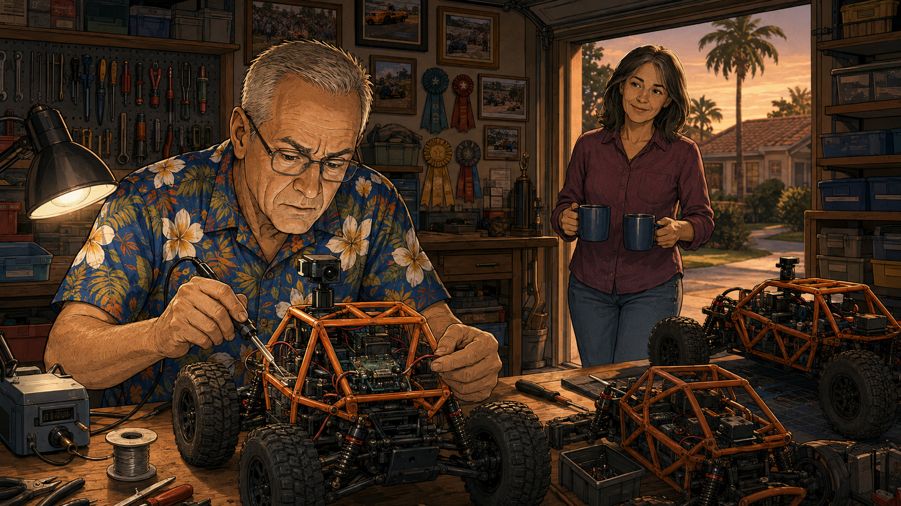

Image Prompt

(This is Panel 13. Do not include the panel number in the image.)
Please generate a 16:9 image in the same warm, contemporary
educational-graphic-novel illustration style (clean bold linework,
soft cel-shading, warm saturated colors, grounded realistic
proportions) depicting panel 13 of 13. Scene: Charlie's garage, once
perfectly organized for its own sake, now a small workshop lined with
a wall of photos and ribbons from race days at several different
schools, a few orange DonkeyCar chassis in various stages of repair
on the workbench. Charlie — a 66-year-old white American man, about 5
feet 10 inches tall, of average build, slightly balding on top with
short neatly-trimmed gray hair, clean-shaven, small wire-rim glasses,
wearing a brightly colored loud tropical Hawaiian shirt (bold
sunset-and-palm print) — sits on a stool soldering a wire on one of
the cars with quiet contentment. In the doorway behind him, Joan — a
64-year-old white American woman, about 5 feet 5 inches tall,
shoulder-length dark brown hair with gray streaks, wearing a plain
solid-color blouse — leans smiling warmly, holding two mugs of
coffee. Setting: present-day USA suburban garage, early evening, warm
golden light. Color palette: warm golden evening light, the wall of
photos adding scattered bright color accents. Emotional tone: quiet
fulfillment, a life's purpose rediscovered. Six visual details: the
wall of race-day photos and ribbons, orange DonkeyCar chassis on the
workbench in repair, Charlie soldering with focused calm, Joan in the
doorway holding two mugs of coffee, her warm smile, golden evening
light through the garage door. Do not render any real brand names,
logos, or trademarks anywhere in the image. Generate the image
immediately without asking clarifying questions.

The garage Charlie used to reorganize out of boredom is still full of
labeled bins, but it's also a repair shop now for a dozen borrowed RC
cars and a wall covered in photos from race days at three different
schools. Joan brings him coffee most evenings and no longer worries
about what he's going to rearrange next. He finally found the thing
retirement never handed him on its own: a problem worth solving, for
kids who needed exactly the mentor he'd become.

### Epilogue – The Resource Was Already in the Neighborhood

Every one of Charlie's students got something a curriculum alone
couldn't give them: a retired engineer with decades of hands-on
experience and, more importantly, the patience to sit beside a
nervous beginner until a model finally, actually worked. The club's
rocky start — a skeptical principal, a nearly empty sign-up sheet,
dead batteries, and broken open-source software — turned out to be as
valuable a lesson as anything that came after. Coding clubs looking
for their next great mentor often don't need to look very far —
sometimes the best resource in the building is a restless retiree two
blocks away, wearing a loud shirt and waiting to be asked.

| Challenge | How Charlie Responded | Lesson for Today |
|-----------|------------------------|-------------------|
| A retired engineer had deep technical skill but no outlet for it | His wife's blunt "get a hobby" pushed him to look for one instead of inventing more chores | Retired engineers are an underused volunteer resource — sometimes all it takes is someone at home saying it plainly |
| A skeptical principal wasn't going to take a stranger's proposal on faith | Charlie came back with an actual working demo instead of just a pitch | A hands-on demonstration earns trust far faster than any proposal document |
| Almost no students signed up because an established "Gears & Motors" RC club already had the room, with no AI angle to compete with | Charlie kept meeting anyway with the three students who did show up | A discouraging first turnout doesn't predict a club's future — persistence with even a handful of students is often enough to eventually outgrow the room |
| Batteries died after seven minutes — nowhere near enough to gather 10,000 training images | Charlie researched and found a replacement battery pack rated for thirty minutes | Real hardware constraints are part of the engineering problem, not a distraction from it |
| The open-source Donkey Car software was poorly documented and assumed deep Python and machine-learning fluency | The team treated every bug as a shared debugging exercise: reproduce it, isolate the variable, read the log | Struggling with real, unpolished open-source tools teaches more durable problem-solving skill than a flawless canned kit ever could |
| A single club in one gym has a ceiling on its impact | Charlie mentored other adult volunteers, and his own students taught newer ones, to start chapters at other schools | A founder who trains other founders is how a hobby becomes a league |

### Call to Action

If you know a retired engineer, technician, or hobbyist who seems a
little restless, don't wait for them to find a coding club on their
own — ask them directly. The mentor your students need most may
already be a few blocks away, looking for exactly the kind of problem
your club can hand them.

---

*"I have no idea. I'm still trying to figure that out."*
—Charlie, at his retirement party

*"Charlie, you need to get a hobby."*
—Joan

*"Bring me something I can actually watch drive, and I'll believe you."*
—Linda, the first time they met

*"I finally found the thing retirement never handed me on its own."*
—Charlie

---

## References

1. [Wikipedia: Raspberry Pi](https://en.wikipedia.org/wiki/Raspberry_Pi) - The small computer mounted on each car to run its self-driving software
2. [Wikipedia: Radio-controlled car](https://en.wikipedia.org/wiki/Radio-controlled_car) - Background on the 1/16-scale RC car chassis used as the racing platform
3. [Wikipedia: Convolutional neural network](https://en.wikipedia.org/wiki/Convolutional_neural_network) - The kind of machine-learning model commonly trained to steer cars like these from camera images
4. [Donkey Car](https://www.donkeycar.com/) - The real open-source self-driving RC car platform this story's club is built around
5. [Wikipedia: Girls Who Code](https://en.wikipedia.org/wiki/Girls_Who_Code) - A real organization working to close the same gender gap in computer science this story's club sets out to address
