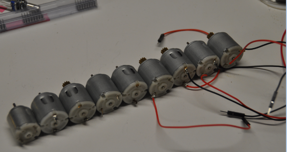
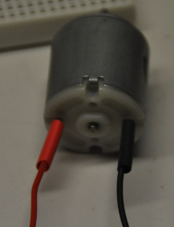
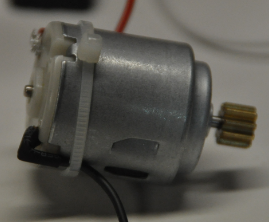
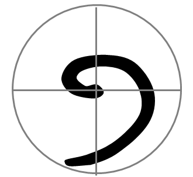
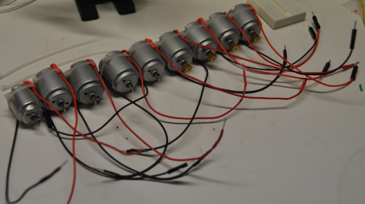

# The Broken Wires on the Motors

*This story is illustrated with real, unedited photographs from the
original 2014 repair session rather than AI-generated artwork — see
[Dan McCreary's original blog post](https://datadictionary.blogspot.com/2014/10/motors-for-arduino-labs.html)
that this account is based on. Because every image already exists,
this story does not need the image-generation step — there is
nothing left to generate.*

Narrative Prompt

This is a true story, not a dramatization. In 2014, coding-club
volunteer Dan McCreary noticed that the small DC motors in the
club's SparkFun Inventor's Kits — used for Arduino H-bridge
motor-direction labs — kept arriving at sessions with their delicate
factory wires snapped off. Rather than simply replacing the motors,
he re-engineered the connection itself: heavier stranded wire,
heat-shrink strain relief, a cable tie anchored to the case, and a
hand-applied "golden spiral" sticker on the spindle so students could
see which way the shaft was turning — the whole point of the lab. No
AI-generated art is used for this story; every panel below is a real
photograph from that repair session, presented in a loose
chronological order (problem, fix, insight, result) rather than the
exact order the photos were originally taken.

### Prologue – A Bin Full of Frustration

Dan was a new volunteer at a large coding club that met on a
university campus, with over a hundred students and nearly forty
mentors on a busy Saturday. The Raspberry Pi and Arduino kits the
club owned were supposed to each hold a full set of parts: a
microcontroller, a breadboard, hookup wires, LEDs, resistors,
sensors, and small DC motors for the motor-direction labs. What Dan
found instead was chaos — and buried in that chaos, one problem that
was quietly wrecking every motor lab in the building.

## Panel 1: The Motors That Wouldn't Spin

*A row of small DC gear motors pulled from the club's kits for
inspection, their factory-thin wires already showing wear.*

Dan pulled every motor out of every kit and lined them up on a table
to see what he was actually dealing with. More than half had wires
that had snapped off flush with the case — the original factory
leads were never built for a ten-year-old's grip. Students spent more
time hunting for a motor that still worked than they spent wiring
their H-bridge circuit, and mentors were quietly dreading the day the
motor lab came up on the schedule.

## Panel 2: Solder, Then Shrink

*A single repaired motor, its red and black leads now joined with a
soldered connection and sealed under a length of heat-shrink tubing.*

He took a bag of motors home and got out a soldering iron. Each
snapped lead got a fresh length of heavier stranded wire, soldered
directly to the motor's terminals, then covered end-to-end in
heat-shrink tubing shrunk down with a heat gun. The tubing did double
duty: it insulated the joint and stiffened the wire right where it
left the case, exactly where the old wires had always failed first.

## Panel 3: Nothing to Grab

*A repaired motor with a small cable tie cinching the new wire pair
against the motor's plastic housing.*

Solder alone wasn't enough — a curious student pulling on a wire
would just rip the new joint apart the same way they'd ripped apart
the old one. Dan added a small cable tie around the case, binding the
wire pair to the motor body itself so any tug pulled against plastic
and nylon instead of against solder. After that, a yanked wire simply
didn't happen anymore.

## Panel 4: Borrowing an Idea From a Jet Engine

*A reference photo of an aircraft engine's spinner cone, painted with
a swirling spiral so ground crews can see at a glance that the engine
is turning.*

While he worked, Dan remembered something he'd seen on airport ramps:
jet engine spinner cones are painted with a swirl for exactly one
reason — from a distance, a spinning blank cone looks perfectly
still, and a swirl makes the rotation impossible to miss. The whole
point of the club's H-bridge lab was watching a motor reverse
direction. If the motor shaft was too small and fast to read by eye,
the lesson would fail no matter how clean the wiring was.

## Panel 5: Sketching the Fix

*A simple hand-drawn golden spiral, the shape Dan chose to mark each
motor's rotation.*

Dan sketched out a simple golden spiral — a shape with just enough
asymmetry that its rotation is unmistakable even at speed, unlike a
plain dot or a straight line. He hot-glued a small sticker in that
shape onto the center of each motor's spindle, one motor at a time,
turning an ordinary repair task into a small piece of instructional
design.

## Panel 6: Back in the Kits

*The full set of repaired motors, each with a fresh soldered joint,
heat-shrink sleeve, cable tie, and spindle marker, ready to return to
the club's kits.*

Every motor went back into its kit with new wires, a cable tie, heat
shrink, and a spiral on the spindle that made forward and reverse
obvious from across the room. The next time the motor lab came up on
the schedule, no student spent the first ten minutes hunting for a
working part — and every student could actually see the lesson the
lab was designed to teach.

### Epilogue – What a Bag of Motors Taught the Club

Dan kept watching the kits every week after that, taking notes on
what else could be improved. None of the changes happened all at
once — a slightly better motor here, a restocked missing part there —
but a year later the club had a fully restocked inventory, new
lessons, and the beginning of an online textbook to go with the
kits. Word spread; students told their friends about the fun they'd
had, some even bought their own kits to bring to sessions, and the
club slowly grew.

| Challenge | How Dan Responded | Lesson for Today |
|-----------|--------------------|-------------------|
| Factory motor wires snapped under normal student handling | Re-soldered with heavier wire and added heat-shrink strain relief | Equipment built for a lab bench rarely survives a classroom of ten-year-olds — reinforce the weakest physical point, not just the circuit |
| Repaired wires still pulled loose when tugged | Anchored each wire pair to the case with a cable tie | A fix that only solves the electrical problem will fail again at the mechanical one |
| Motor rotation direction was too fast and small to see | Added a golden-spiral marker to each spindle, inspired by jet-engine spinner cones | If a lab's entire point depends on students *seeing* something, engineer the equipment so they actually can |
| Small maintenance fixes felt disconnected from "real" curriculum work | Kept a weekly log of what could be improved and let it compound over a year | Continuous improvement, not a single overhaul, is what turns a struggling kit inventory into a great club |

### Call to Action

You don't need a grant, a committee, or a semester of planning to
make your club better — you need one bag of broken parts and an hour
with a soldering iron. Pick the piece of equipment your students
complain about most, fix it properly, and write down what you
changed. A year of small fixes like that is how sustainable clubs
actually get built.

---

*"The care and attention to detail we give each of these labs help
the kids get quickly to the next level."*
—Dan McCreary

*"He decided the students deserved better."*
—from the original story notes

---

## References

1. [Wikipedia: DC motor](https://en.wikipedia.org/wiki/DC_motor) - Background on the brushed DC motors used in the club's kits
2. [Wikipedia: H-bridge](https://en.wikipedia.org/wiki/H-bridge) - The motor-direction-control circuit these labs teach students to build
3. [Wikipedia: CoderDojo](https://en.wikipedia.org/wiki/CoderDojo) - The free, volunteer-run coding club movement this session was part of
4. [Wikipedia: SparkFun Electronics](https://en.wikipedia.org/wiki/SparkFun_Electronics) - Maker of the Inventor's Kit whose motors needed repair
5. [Original blog post: Motors for Arduino Labs](https://datadictionary.blogspot.com/2014/10/motors-for-arduino-labs.html) - Dan McCreary's 2014 account this story is based on
