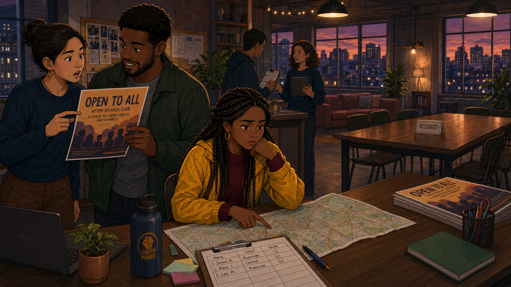
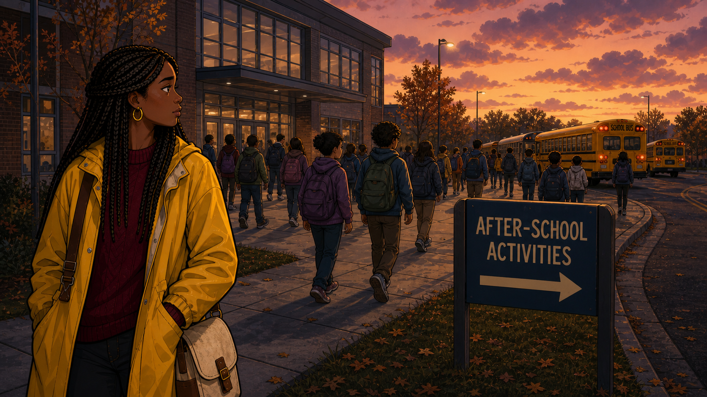
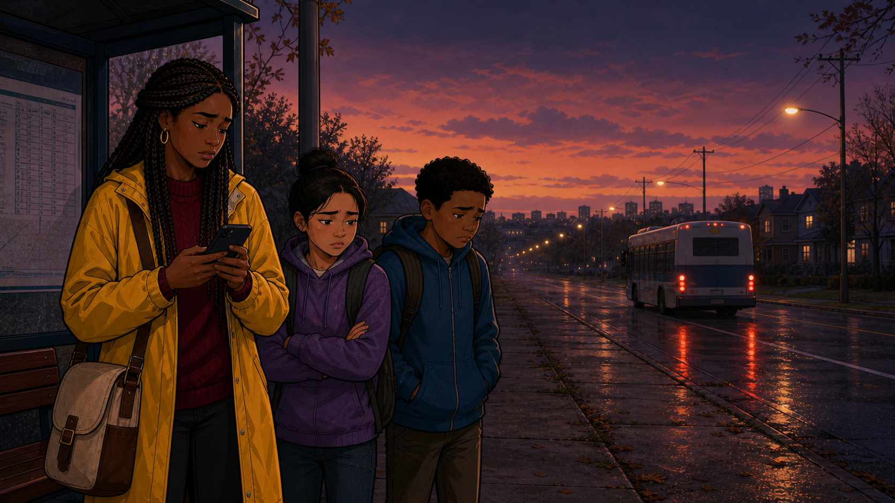
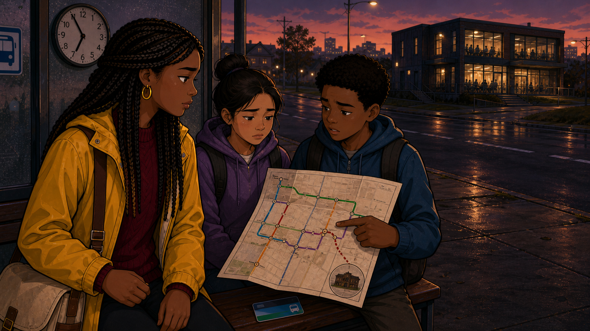
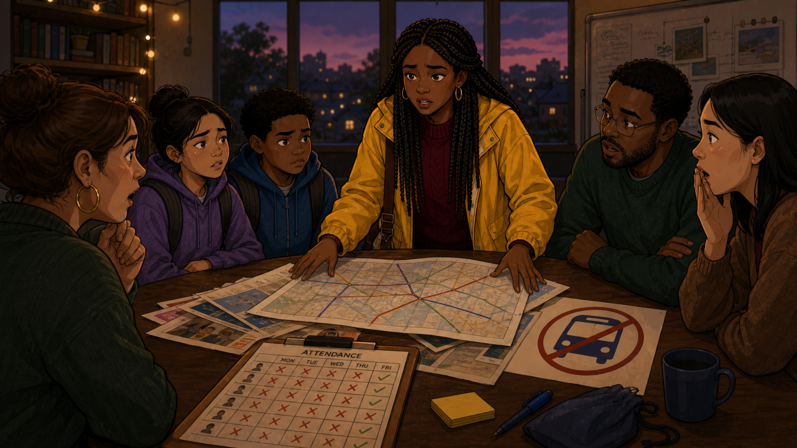
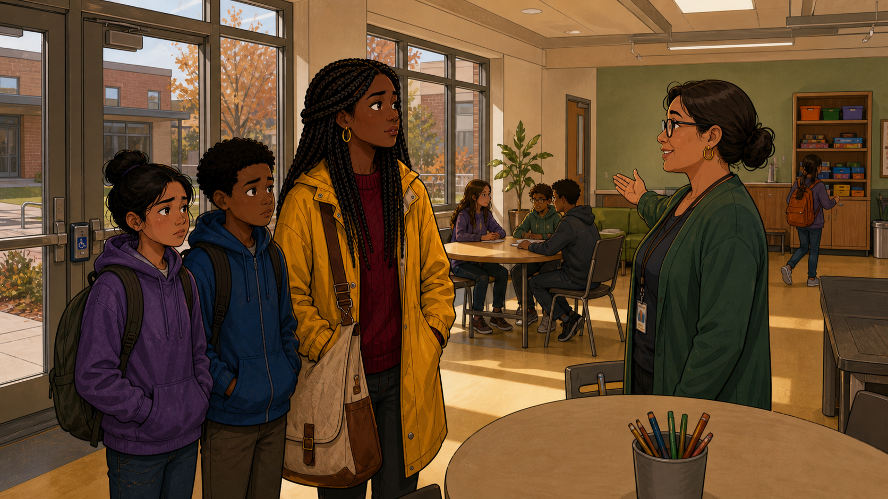
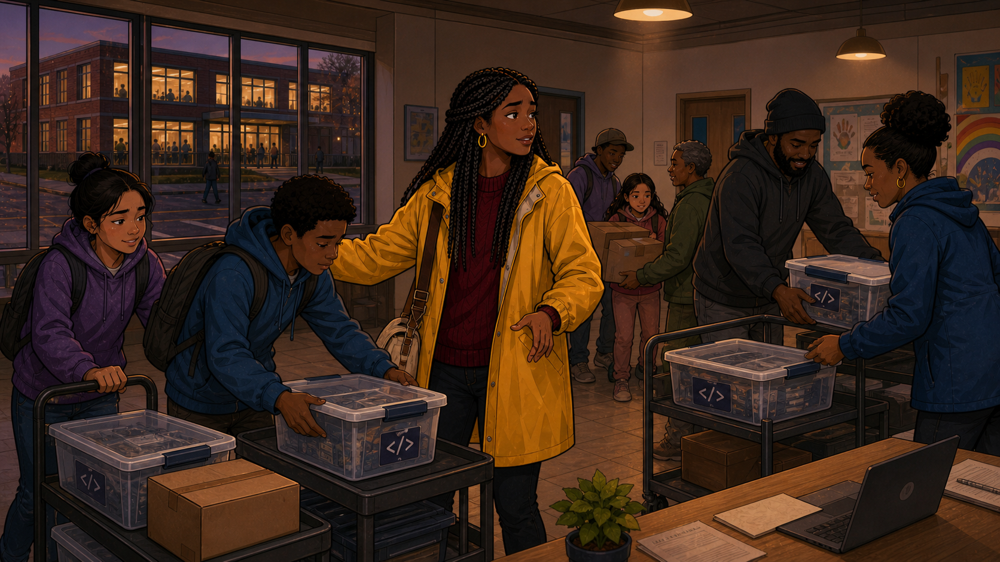
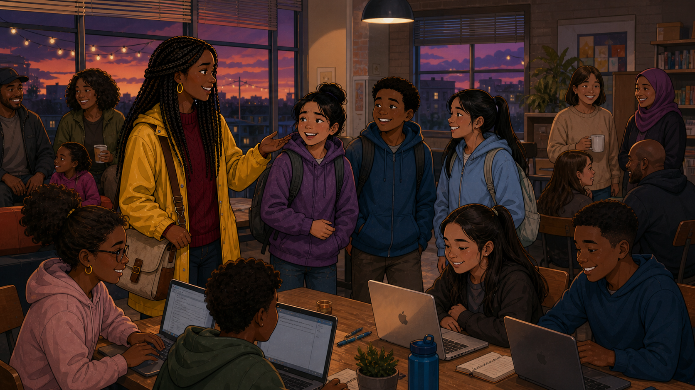
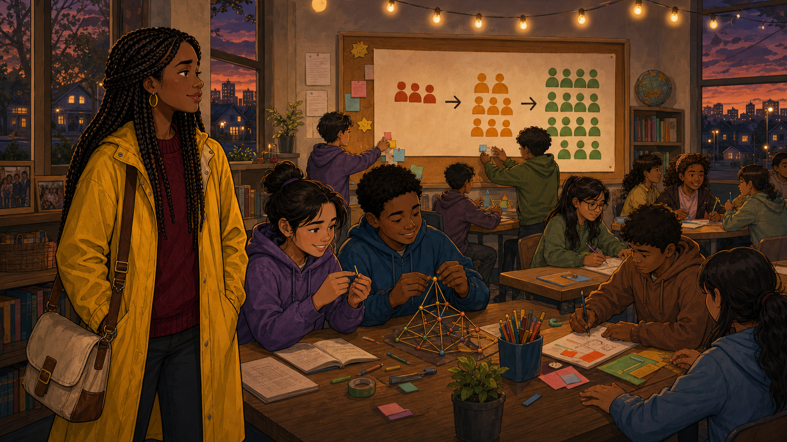

# The Bus That Never Came

Narrative Prompt

This is a fictional composite story, not a depiction of a specific
real club, school, or real named individuals. "Grace" (club outreach
coordinator, forest-green cardigan, lanyard) and the Alvarez family —
"Yolanda" (guardian, yellow raincoat, braided hair), "Camila"
(daughter, purple hoodie), and "Marcus" (son, blue hoodie) —
represent a pattern seen across many well-intentioned clubs: open
enrollment on paper doesn't guarantee equal access in practice when
an invisible logistical barrier, like transportation, quietly locks
an entire neighborhood out. Setting: a present-day mid-sized American
city, a coding club on one side of town and a Title I school
neighborhood on the other. Art style: warm, contemporary
educational-graphic-novel illustration, clean linework, soft
cel-shading, consistent character design and color palette across
all panels — Grace and the Alvarez family should be immediately
recognizable from panel to panel.

### Prologue – Proud of the Wrong Number

Grace was proud of her club's open-door policy: any student, any
background, no fee, no application. The flyers said so in bright
letters, distributed to every school in the district. What the
flyers couldn't do was explain why almost none of them were coming
from one particular part of town.

## Panel 1: Flyers Everywhere

<!--  -->

Image Prompt

(This is Panel 01. Do not include the panel number in the image.)
I am about to ask you to generate a series of images for a graphic
novel. Please make the images have a consistent style and consistent
characters. Do not ask any clarifying questions. Just generate the
image immediately when asked.

Please generate a 16:9 image in a warm, contemporary
educational-graphic-novel style depicting panel 1 of 9. The scene
should show Grace, a woman in her 30s wearing a forest-green cardigan
and a lanyard with an ID badge, pinning a colorful "All Students
Welcome — Free Coding Club" flyer to a school bulletin board crowded
with other flyers, smiling and confident. Setting: present-day USA,
a school hallway bulletin board, daytime. Color palette: bright,
optimistic flyer colors against a warm neutral hallway. Emotional
tone: pride, optimism, confidence in an open-door policy. Six visual
details: the colorful flyer reading "All Students Welcome," a
bulletin board crowded with other notices, Grace's lanyard and ID
badge, a stack of extra flyers under her arm, hallway lockers in the
background, natural light through a hallway window. Generate the
image immediately without asking clarifying questions.

Grace had personally delivered flyers to every school in the
district, proud that her club's policy was as simple as it could be:
anyone could come, for free, no exceptions. She believed that was
enough.

## Panel 2: A Map With One Empty Corner

<!--  -->

Image Prompt

(This is Panel 02. Do not include the panel number in the image.)
Please generate a 16:9 image in the same style depicting panel 2 of
9. Make Grace consistent with the prior panel. The scene should show
Grace at a desk studying a printed city map with colored pins marking
where enrolled students live, most pins clustered near the club's
location, with one neighborhood on the far side of town — near a
school labeled on the map — showing almost no pins at all. Grace
leans in, frowning slightly, tracing the empty area with a finger.
Setting: present-day USA, a small office or workroom, daytime. Color
palette: muted map tones with colorful pins as the visual focus.
Emotional tone: puzzlement, dawning concern. Six visual details: a
printed city map, colored enrollment pins clustered in one area, a
conspicuously empty neighborhood on the map, a school label near the
empty area, Grace's finger tracing the gap, a cup of coffee on the
desk. Generate the image immediately without asking clarifying
questions.

Months into the term, Grace pulled up a simple map of where her
enrolled students actually lived. Pins clustered thickly near the
club — and thinned to almost nothing around one particular
neighborhood, despite flyers posted at its school just like everywhere
else. The flyers clearly weren't the problem. Something else was.

## Panel 3: "It's Probably the Bus"

<!--  -->

Image Prompt

(This is Panel 03. Do not include the panel number in the image.)
Please generate a 16:9 image in the same style depicting panel 3 of
9. Make Grace consistent with prior panels. The scene should show
Grace sitting across a desk from a school counselor in a modest
school office, the counselor mid-sentence with an open, matter-of-fact
expression, gesturing loosely, while Grace listens with a surprised,
attentive expression, a school bus route map or bell schedule visible
pinned to the wall behind the counselor. Setting: present-day USA
school office, daytime. Color palette: warm institutional tones,
muted greens and browns. Emotional tone: quiet realization, a
casual comment landing with real weight. Six visual details: the
counselor's open gesture, a bus route map or bell schedule on the
wall, Grace's surprised attentive expression, a nameplate on the
desk, a stack of student files, afternoon light through a school
office window. Generate the image immediately without asking
clarifying questions.

Grace visited the school directly and asked a counselor why so few
families from the area ever signed up. The answer came almost as an
afterthought: "It's probably the bus. The late activity bus doesn't
run on the days your club meets — parents working shifts can't
always get across town to pick a kid up otherwise." Grace hadn't even
thought to ask about transportation.

## Panel 4: Waiting at the Stop That Doesn't Come

<!--  -->

Image Prompt

(This is Panel 04. Do not include the panel number in the image.)
Please generate a 16:9 image in the same style depicting panel 4 of
9. Make Grace consistent with prior panels, and introduce the Alvarez
family for the first time. The scene should show Grace standing at a
respectful distance near a "School Bus Stop" sign at dusk, observing
Yolanda (a woman in a yellow raincoat with long braided hair) waiting
with her two children, Camila (purple hoodie) and Marcus (blue
hoodie, backpack), all three looking down an empty street with
disappointed, resigned expressions, string lights and a distant lit
building visible far down the road. Setting: present-day USA
residential street, dusk, the same bus stop referenced in the cover
image. Color palette: dusky blues and purples, warm porch lights in
the far distance. Emotional tone: quiet disappointment, empathy,
recognition. Six visual details: the "School Bus Stop" sign, Yolanda's
yellow raincoat, Camila and Marcus's hoodies, the empty street ahead,
a distant lit building on the horizon, Grace watching from a
respectful distance with a notebook in hand. Generate the image
immediately without asking clarifying questions.

Grace went to see it for herself. At a quiet bus stop after school,
she found Yolanda waiting with her two kids, Camila and Marcus, both
still in their backpacks, all three watching an empty street where a
bus wasn't coming. "We wanted to come," Yolanda admitted when Grace
introduced herself. "There's just no way to get there and back."

## Panel 5: The Barrier Finally Named

<!--  -->

Image Prompt

(This is Panel 05. Do not include the panel number in the image.)
Please generate a 16:9 image in the same style depicting panel 5 of
9. Make Grace, Yolanda, Camila, and Marcus consistent with the prior
panel. The scene should show Grace crouched down to the children's
eye level at the bus stop, notebook open, asking a gentle question,
while Yolanda looks on, arms crossed but not unfriendly, and Camila
and Marcus look mildly curious rather than sad now. Setting: same
present-day USA bus stop, slightly later in the dusk light. Color
palette: same dusky blues, warmer highlight on Grace and the family
as a small connection forms. Emotional tone: a shift from
disappointment toward possibility. Six visual details: Grace crouched
to the children's eye level, her open notebook, Yolanda's crossed but
open arms, Camila and Marcus's curious expressions, the same empty
bus-stop street, a hint of the distant lit building still visible.
Generate the image immediately without asking clarifying questions.

Grace crouched down and asked the question she should have asked
months earlier: not "why don't you come," but "what would actually
make it possible?" Yolanda didn't hesitate. A location she could
reach on foot, or a session on a day the activity bus already ran —
either one would work. The barrier had a name now, and it wasn't
interest.

## Panel 6: Bringing the Map Back to the Table

<!--  -->

Image Prompt

(This is Panel 06. Do not include the panel number in the image.)
Please generate a 16:9 image in the same style depicting panel 6 of
9. Make Grace consistent with prior panels. The scene should show
Grace presenting her city map, now annotated with the bus-stop
location and a walking-distance circle around the neighborhood's
community center, to two other club leaders around a table, one
nodding thoughtfully, one pointing at the community center location
with interest. Setting: present-day USA, a small club planning room,
daytime. Color palette: warm collaborative tones, the annotated map
as the visual focus. Emotional tone: problem-solving, constructive
energy. Six visual details: the annotated map with a walking-distance
circle, a marked community center location, two attentive club
leaders, Grace's explaining gesture, a laptop open beside the map, a
whiteboard with a rough sketch of two club locations in the
background. Generate the image immediately without asking clarifying
questions.

Grace brought her findings straight to the club's leadership: not a
request for a shuttle bus they couldn't afford, but a simple map
showing the neighborhood's community center sat well within walking
distance of the school. If the club couldn't move the families, it
could move a session instead.

## Panel 7: A Second Location, Same Kits

<!--  -->

Image Prompt

(This is Panel 07. Do not include the panel number in the image.)
Please generate a 16:9 image in the same style depicting panel 7 of
9. Make Grace consistent with prior panels. The scene should show
Grace and a volunteer loading the same coding-club kits and laptops
into a car, a community center visible in the background with a
handmade "Coding Club — Tuesdays" sign taped to its door, warm
late-afternoon light. Setting: present-day USA, a community center
parking area, daytime. Color palette: warm, hopeful daylight tones.
Emotional tone: practical determination, quiet momentum. Six visual
details: coding-club kit boxes being loaded into a car, laptops in a
protective case, the community center building, the handmade
"Coding Club — Tuesdays" sign, a volunteer helping carry boxes,
Grace checking a clipboard. Generate the image immediately without
asking clarifying questions.

Two weeks later, the same LED kits, laptops, and challenge cards the
main club used every week made their way to the community center
instead — no new curriculum, no lowered expectations, just the same
club, walking distance from the families it had never actually
reached.

## Panel 8: The Room Finally Fills

<!--  -->

Image Prompt

(This is Panel 08. Do not include the panel number in the image.)
Please generate a 16:9 image in the same style depicting panel 8 of
9. Make Grace, Yolanda, Camila, and Marcus consistent with prior
panels. The scene should show the community center's first session
in full swing: Camila and Marcus seated at a table working eagerly
with an LED-strip kit, Yolanda standing nearby smiling and talking
with another parent, Grace helping at a neighboring table, the room
full of other neighborhood families and children engaged and happy.
Setting: present-day USA community center room, early evening, warm
lighting. Color palette: warm, lively, full of color from the LED
projects. Emotional tone: joy, belonging, a room finally reached.
Six visual details: Camila and Marcus working with an LED kit,
Yolanda talking with another parent, Grace helping at a nearby table,
a full room of engaged families, colorful LED glow from a project,
the handmade "Coding Club — Tuesdays" sign visible near the entrance.
Generate the image immediately without asking clarifying questions.

The community center's first session filled every table. Camila and
Marcus bent over an LED kit, arguing happily over whose turn it was
to code the next pattern, while Yolanda struck up a conversation with
another parent she recognized from the neighborhood. It wasn't a
smaller version of the club. It was the same club, finally within
reach.

## Panel 9: A Map With Two Full Corners

<!--  -->

Image Prompt

(This is Panel 09. Do not include the panel number in the image.)
Please generate a 16:9 image in the same style depicting panel 9 of
9. Make Grace consistent with prior panels, a wide closing shot. The
scene should show Grace back at her desk months later, looking at
the same city map from panel 2, now with a second dense cluster of
pins around the community center location, both clusters roughly
equal in size, a small satisfied smile on her face. Setting: present-
day USA, the same small office as panel 2. Color palette: warm,
resolved, brighter than panel 2's muted tones. Emotional tone: quiet
triumph, a barrier turned into a solved problem. Six visual details:
the same city map now with two dense pin clusters, Grace's satisfied
smile, the original flyer from panel 1 pinned on her office wall, a
coffee mug, a small framed photo of the community center session, warm
desk lamp light. Generate the image immediately without asking
clarifying questions.

Three months later, Grace looked at the same map and saw something
different: two clusters of pins instead of one, roughly equal in
size. Enrollment from that neighborhood had nearly tripled — not
because the families' interest had changed, but because the one
invisible thing standing between them and the club had finally been
seen.

### Epilogue – Open Enrollment Isn't the Same as Open Access

Grace's club had never turned a single family away. It just hadn't
occurred to her, until she stood at a bus stop that stayed empty,
that "anyone can come" and "anyone can get here" are two entirely
different promises. Fixing the second one took a map, a conversation,
and one folding table moved two miles across town.

| Challenge | How Grace Responded | Lesson for Today |
|-----------|------------------------|-------------------|
| A neighborhood with no signups despite equal promotion looked like a lack of interest | Mapped actual enrollment by home address to see the pattern clearly | An access gap often looks identical to a lack of interest until someone maps where students actually live |
| Nobody at the club had ever asked families directly what was stopping them | Visited the school and then the bus stop itself to hear the barrier firsthand | The people closest to a barrier usually know exactly what it is — if someone asks them directly |
| The obvious fix (a shuttle bus) was outside the club's budget entirely | Moved a session to a community center within walking distance instead | The fix for an access barrier is often relocation or rescheduling, not new spending the club can't afford |

### Call to Action

Map where your students actually live, not just where your flyers
went. If one part of your community is consistently missing, the
fix probably isn't a better flyer — it's a conversation with the
families closest to that gap, and a willingness to move the club to
them.

---

*"We wanted to come. There's just no way to get there and back."*
—Yolanda, at the bus stop

*"Anyone can come" and "anyone can get here" are two different
promises."*
—Grace, reflecting on the neighborhood map

---

## References

1. [Wikipedia: Transport poverty](https://en.wikipedia.org/wiki/Transport_poverty) - Background on how limited transportation access excludes families from opportunities regardless of stated eligibility
2. [Wikipedia: Digital divide](https://en.wikipedia.org/wiki/Digital_divide) - The broader pattern of unequal access to technology education this story is one instance of
3. [Wikipedia: Title I](https://en.wikipedia.org/wiki/Title_I) - The US federal program supporting schools serving low-income communities, like the one in this story
4. [Wikipedia: Boys & Girls Clubs of America](https://en.wikipedia.org/wiki/Boys_%26_Girls_Clubs_of_America) - A real community-center-based youth organization model similar to the satellite location Grace's club adopted
5. [STEM Classroom Administration](http://dmccreary.github.io/stem-classroom-admin/) - The companion textbook on managing classroom technology across locations
