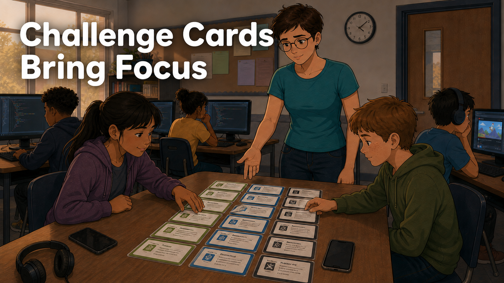
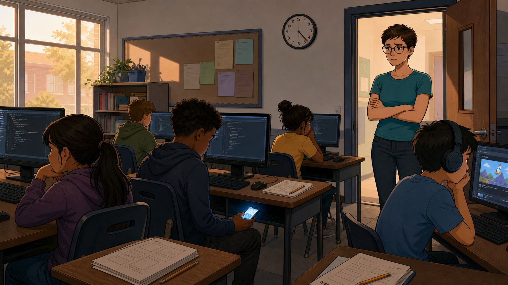
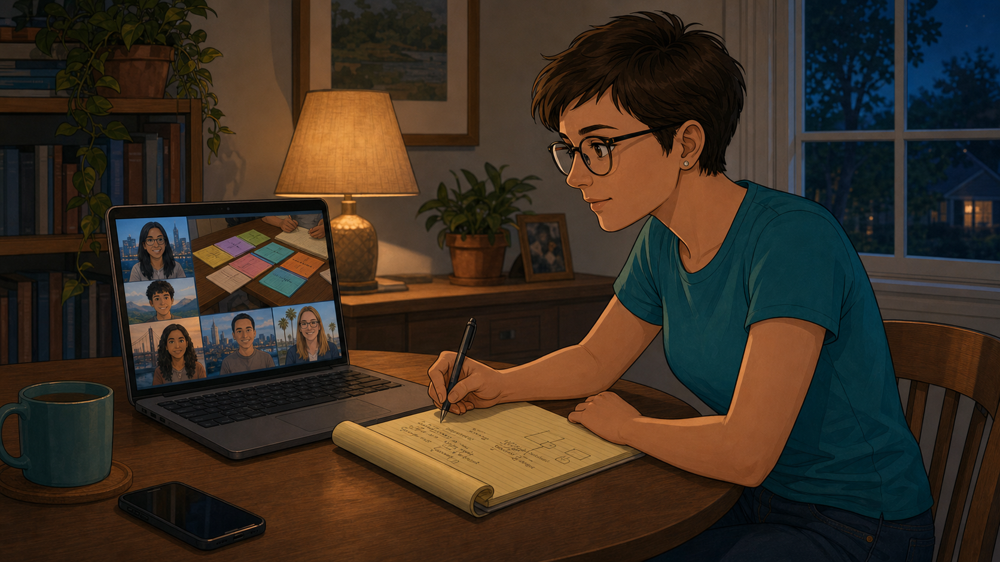
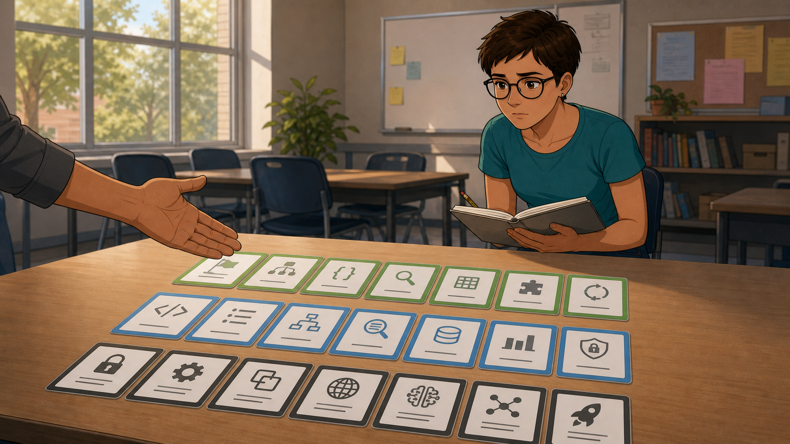
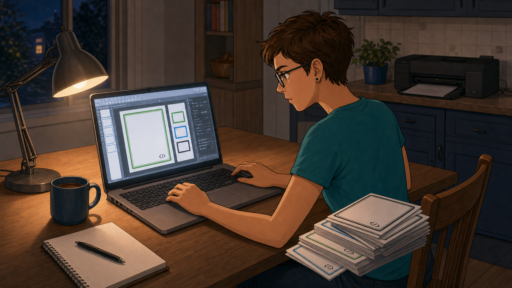
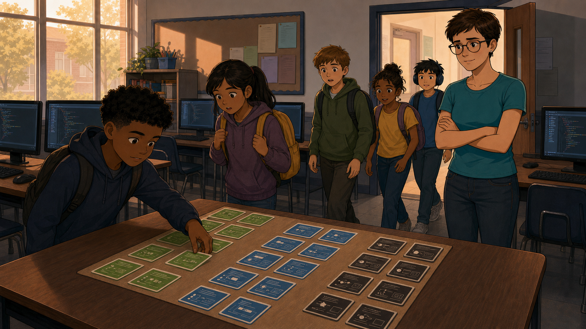
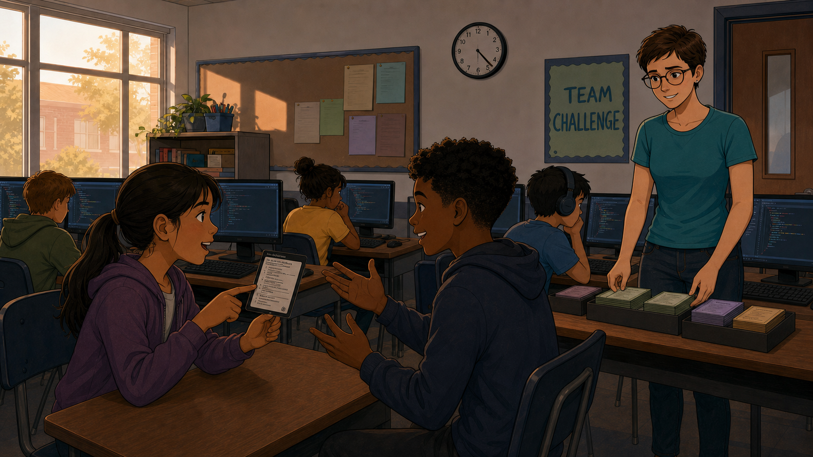
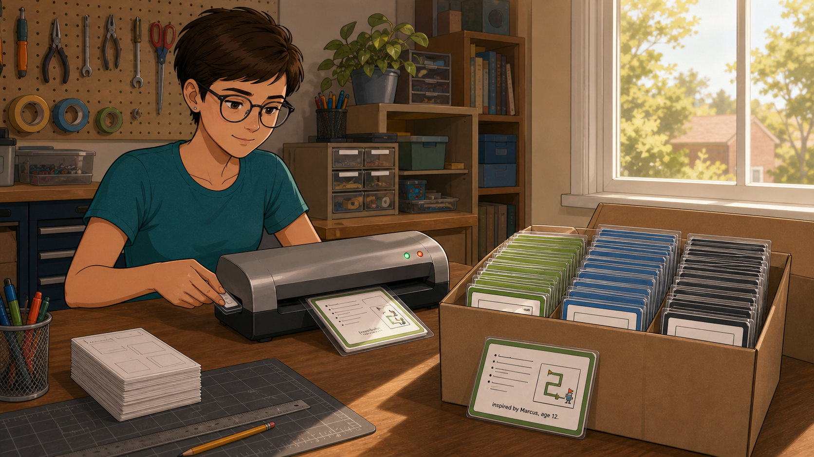

# Challenge Cards Bring Focus

Cover Image Prompt

(This is the Cover Image. Do not include this label in the image.)
Please generate a wide-landscape 16:9 cover image in a warm,
contemporary educational-graphic-novel style — clean linework, soft
cel-shading, grounded realistic proportions. Scene: a coding-club
center table displaying three neat rows of laminated cards with
colored borders — green, blue, and black — fanned out invitingly. A
woman in her 30s (Sally), wearing glasses and a plain t-shirt, stands
behind the table gesturing toward the cards while two students (a boy
around 10, a girl around 13) lean in, reaching for cards with
interested expressions, their phones visibly set aside on the table.
Title text "Challenge Cards Bring Focus" rendered in a bold, rounded,
friendly sans-serif typeface. Color palette: crisp green, blue, and
near-black card borders against a neutral classroom background, warm
overhead lighting. Emotional tone: order emerging from distraction,
quiet confidence. Generate the image immediately without asking
clarifying questions.

Narrative Prompt

This is a fictional composite story, not a depiction of a specific
real club or a real named individual. "Sally" represents a pattern
seen across many coding clubs: a volunteer who solves a chronic
distraction problem by borrowing and adapting a tiered
challenge-card system from other clubs. Setting: a present-day,
community-based after-school coding club in the United States,
serving students roughly ages 9-14. Art style: warm, contemporary
educational-graphic-novel illustration, clean linework, soft
cel-shading, consistent character design and color palette across
all panels — Sally should be immediately recognizable from panel to
panel (same glasses, same short haircut, same t-shirt style).

### Prologue – The Room That Couldn't Settle

Sally had volunteered at her coding club for two terms, and she'd
watched the same thing happen almost every week: students arrived,
sat at the computers, and within minutes some of them had drifted
somewhere else entirely — a video, a group chat, anywhere but the
project in front of them. They weren't bad kids. They just didn't
have anything pulling them back.

## Panel 1: Everyone Somewhere Else

Image Prompt

(This is Panel 01. Do not include the panel number in the image.)
I am about to ask you to generate a series of images for a graphic
novel. Please make the images have a consistent style and consistent
characters. Do not ask any clarifying questions. Just generate the
image immediately when asked.

Please generate a 16:9 image in a warm, contemporary
educational-graphic-novel style depicting panel 1 of 7. The scene
should show a coding-club classroom with several students at
computer stations, two of them clearly disengaged — one scrolling a
phone under the desk, another watching a video with headphones on,
screens showing unfinished code editors behind them. Sally, a woman
in her 30s with glasses and short hair, stands in the doorway
surveying the room with a concerned, thoughtful expression. Setting:
present-day USA after-school classroom, late afternoon light through
windows. Color palette: muted classroom neutrals, the glow of phone
screens standing out as a small distracting light source. Emotional
tone: quiet concern, drift, low energy. Six visual details: a phone
screen glowing under a desk, headphones on a distracted student, an
unfinished code editor on a monitor, a wall clock, scattered
unopened worksheets, Sally's crossed arms in the doorway. Generate
the image immediately without asking clarifying questions.

Every week Sally watched students come in, sit down at the computers,
and start working — for a little while. Then the smallest thing would
pull them away: a notification, a video, a friend two seats over. They
weren't focused on coding, weren't building their problem-solving
skills, and Sally didn't yet know how to change that.

## Panel 2: Asking Around

Image Prompt

(This is Panel 02. Do not include the panel number in the image.)
Please generate a 16:9 image in the same style depicting panel 2 of
7. Make Sally consistent with the prior panel. The scene should show
Sally at home in the evening on a video call, laptop open showing a
grid of other coding-club volunteers from different cities, one of
their shared screens displaying a photo of a table with colorful
cards laid out. Sally leans forward, taking notes on a legal pad.
Setting: present-day USA home office or kitchen table, evening,
warm lamp light. Color palette: warm indoor lamp tones with a cool
blue laptop-screen glow. Emotional tone: curiosity, active
investigation. Six visual details: laptop video call grid, a shared
screen showing colorful cards, a legal pad with handwritten notes, a
pen mid-write, a mug on the table, evening light through a window.
Generate the image immediately without asking clarifying questions.

Sally started asking other club leaders what they did about
distraction, and one answer kept coming up: a set of "challenge
cards" — laminated, color-coded cards laid out where every student
could see them the moment they walked in. She'd never seen anything
like it at her own club.

## Panel 3: Green, Blue, and Black

Image Prompt

(This is Panel 03. Do not include the panel number in the image.)
Please generate a 16:9 image in the same style depicting panel 3 of
7. Make Sally consistent with prior panels. The scene should show a
close-up of a real example table at a different club, three tidy rows
of laminated cards with green, blue, and black borders respectively,
each card showing a small icon and short title, a hand (not Sally's)
gesturing to explain the tiers. Sally stands just behind, observing
closely with a notebook in hand. Setting: a different, present-day
USA coding-club room, daytime. Color palette: crisp green, blue, and
black card borders against a plain table surface. Emotional tone:
discovery, clarity. Six visual details: green-bordered cards, blue-
bordered cards, black-bordered cards, small icons on each card, a
hand gesturing to explain the tiers, Sally's notebook open and
ready. Generate the image immediately without asking clarifying
questions.

At the club she visited, every card had a colored border that meant
something: green cards were quick, easy warm-ups; blue cards took
real focus; black cards were the hardest, often requiring a team.
Students didn't need an adult to tell them where to start — the color
told them.

## Panel 4: Building Her Own Deck

Image Prompt

(This is Panel 04. Do not include the panel number in the image.)
Please generate a 16:9 image in the same style depicting panel 4 of
7. Make Sally consistent with prior panels. The scene should show
Sally at her kitchen table late at night, laptop open to a slide-
design program, a stack of freshly printed cards nearby not yet
laminated, colored border swatches visible on screen. Setting:
present-day USA home, nighttime. Color palette: warm lamp light,
cool laptop glow, colorful printed cards as the visual focal point.
Emotional tone: focused, determined, a small creative project taking
shape. Six visual details: laptop showing card-design software, a
stack of printed but unlaminated cards, colored border swatches on
screen, a mug of coffee, a desk lamp, a printer in the background.
Generate the image immediately without asking clarifying questions.

Sally didn't wait for anyone's permission — she opened a slide
program that same week and designed a dozen cards of her own: green
for warm-ups, blue for focus work, black for team challenges. It
took a few late nights, but by the weekend she had a full deck ready
to print.

## Panel 5: The Table Everyone Notices

Image Prompt

(This is Panel 05. Do not include the panel number in the image.)
Please generate a 16:9 image in the same style depicting panel 5 of
7. Make Sally and the classroom consistent with prior panels. The
scene should show the same classroom from panel 1, now with a
freshly displayed center table of Sally's own green, blue, and black
cards, several students walking in and immediately noticing the
table, one already reaching for a green card with curiosity. Sally
stands nearby, watching with a hopeful expression. Setting: same
present-day USA classroom, same time of day as panel 1. Color
palette: the new colorful cards standing out against the same muted
classroom as panel 1. Emotional tone: cautious hope, first signs of
change. Six visual details: the new card table, a student reaching
for a green card, curious expressions, Sally watching from a few
steps away, the same computer stations from panel 1 now in the
background, natural light through windows. Generate the image
immediately without asking clarifying questions.

The next session, Sally set the deck out on the center table before
anyone arrived. She didn't announce it or explain the rules — she just
watched. Within minutes, the first curious student picked up a green
card, and within an hour half the room had chosen one too.

## Panel 6: Phones Down, Debate Up

Image Prompt

(This is Panel 06. Do not include the panel number in the image.)
Please generate a 16:9 image in the same style depicting panel 6 of
7. Make Sally consistent with prior panels. The scene should show
several weeks later: the same classroom, now animated, two students
mid-conversation gesturing at a black-bordered card between them,
clearly debating an idea, phones nowhere visible on any desk, other
students working intently at their stations in the background. Sally
stands near the card table restocking it, smiling as she watches the
debate. Setting: same present-day USA classroom, same layout, weeks
later. Color palette: warm, lively classroom tones, phones notably
absent from the scene. Emotional tone: energetic engagement,
collaborative focus. Six visual details: two students debating over a
black card, animated hand gestures, no phones visible anywhere, other
students focused at their stations, Sally restocking the card table,
a poster referencing "team challenge" on the wall. Generate the image
immediately without asking clarifying questions.

Weeks later, Sally realized she hadn't seen a single phone out in an
hour. Instead she heard students arguing happily over whether they'd
"done the turtle card" yet, comparing notes on the hardest black
cards, and pitching each other ideas for cards that didn't exist yet.

## Panel 7: A Deck That Keeps Growing

Image Prompt

(This is Panel 07. Do not include the panel number in the image.)
Please generate a 16:9 image in the same style depicting panel 7 of
7. Make Sally consistent with prior panels. The scene should show
Sally at a home workbench with a small laminating machine, feeding a
new card through it, a large organized box of finished laminated
cards open beside her showing dozens of green, blue, and black cards,
one card visibly printed with a small credit line and a student's
name. Setting: present-day USA home workshop corner, daytime. Color
palette: bright, satisfied, full-color card box as the visual anchor.
Emotional tone: pride, accomplishment, a small project turned into a
lasting system. Six visual details: a laminating machine mid-feed, a
large box of finished cards, a card with a visible student-credit
line, neatly organized card dividers by color, a stack of blank card
templates ready for more, warm daylight through a window. Generate
the image immediately without asking clarifying questions.

By the end of the year Sally had her own laminator and a card library
deep enough to fill a shoebox, including a few cards students had
pitched themselves — one proudly printed with the line "inspired by
Marcus, age 12." The room that used to drift toward its phones now
argued about which black card to try next.

### Epilogue – Structure Isn't the Opposite of Freedom

Sally hadn't solved distraction by cracking down on phones — she'd
solved it by giving students something more interesting to reach for
first. The card system didn't just fill time; it gave every student,
regardless of skill level, an obvious next step the moment they
walked in the door.

| Challenge | How Sally Responded | Lesson for Today |
|-----------|------------------------|-------------------|
| Students drifted to phones and videos with no clear starting point | Displayed a visible, tiered set of challenge cards on the center table | A room without an obvious first move invites distraction — give students something to reach for the moment they arrive |
| Sally didn't know what a working solution looked like | Asked other club leaders what they'd already tried | You don't have to invent a fix from scratch — borrowing and adapting a proven idea from another club is faster and safer |
| A one-size-fits-all activity didn't match students' different skill levels | Color-coded cards into green, blue, and black tiers | Visible difficulty tiers let students self-select an appropriate challenge without an adult gatekeeping every choice |
| The deck risked going stale after the first few sessions | Kept expanding it, including cards suggested and credited to students | A challenge-card system stays alive when students see themselves as co-creators, not just users |

### Call to Action

Distraction usually isn't a discipline problem — it's a design
problem. Before your next session, put three tiers of quick, focused,
and team-based challenges somewhere every student will see them
walking in, and watch how much of the "phone problem" quietly solves
itself.

---

*"Did you do the turtle card yet?"*
—a student, mid-argument with a friend

*"Inspired by Marcus, age 12."*
—credit line on a student-suggested card

---

## References

1. [Wikipedia: Flashcard](https://en.wikipedia.org/wiki/Flashcard) - Background on the tiered, self-paced card format Sally adapted
2. [Wikipedia: Bloom's taxonomy](https://en.wikipedia.org/wiki/Bloom%27s_taxonomy) - The framework this book's own learning outcomes use, echoed in the green/blue/black difficulty tiers
3. [Wikipedia: Instructional scaffolding](https://en.wikipedia.org/wiki/Instructional_scaffolding) - The educational theory behind giving students a visible, graduated set of challenges
4. [Wikipedia: Differentiated instruction](https://en.wikipedia.org/wiki/Differentiated_instruction) - How tiered materials let students of different skill levels self-select an appropriate task
5. [STEM Classroom Administration](http://dmccreary.github.io/stem-classroom-admin/) - The companion textbook on managing classroom technology and materials
