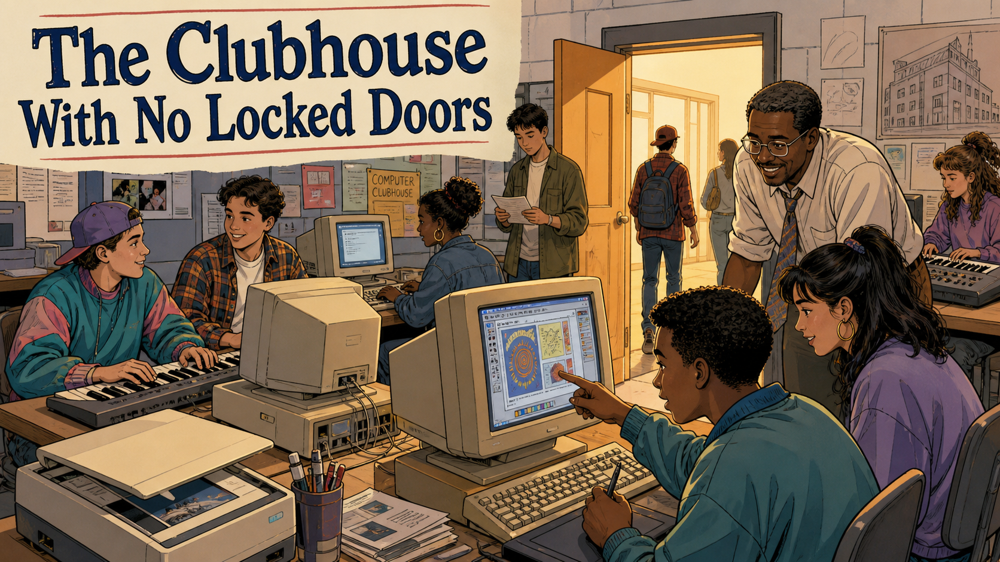
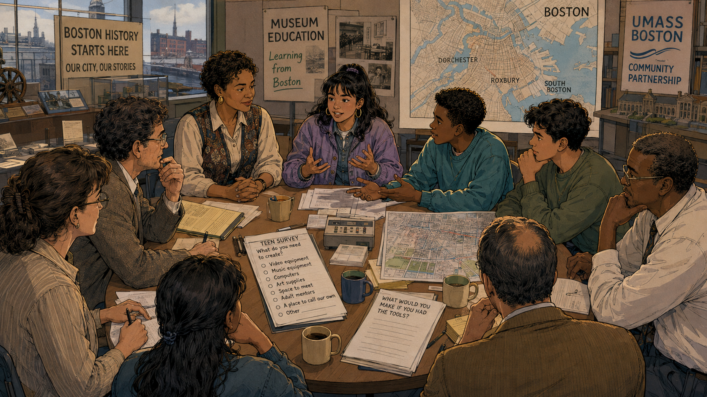
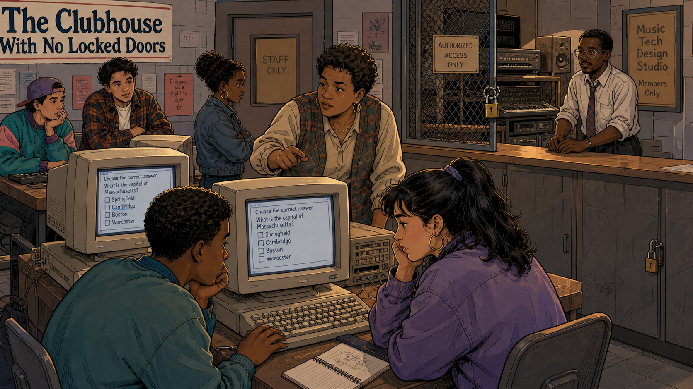
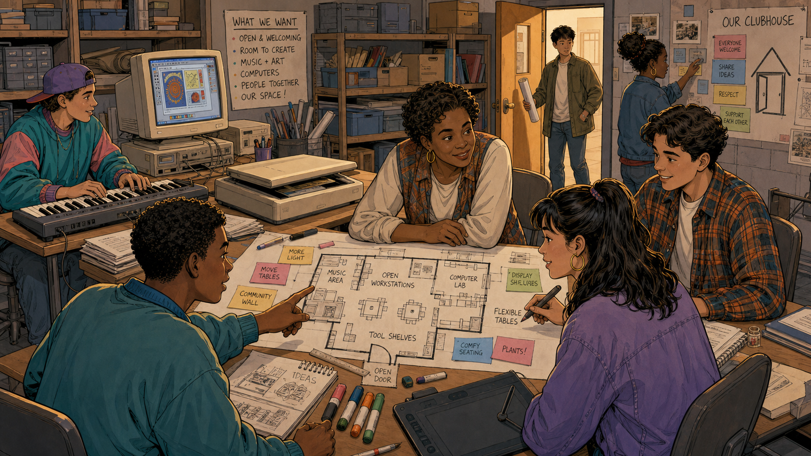
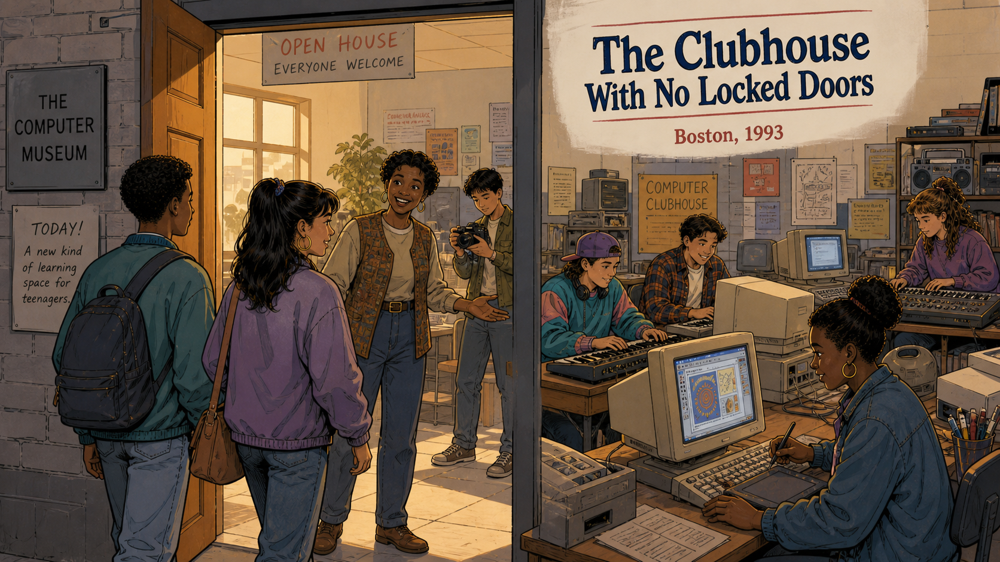
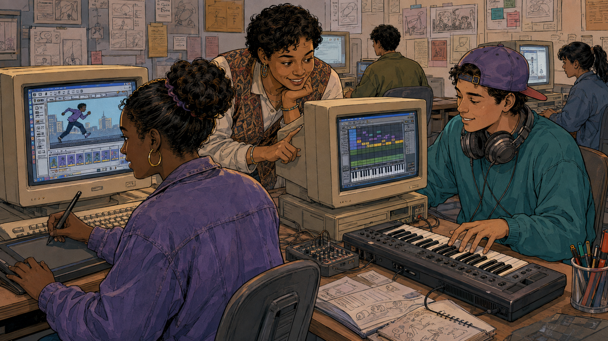
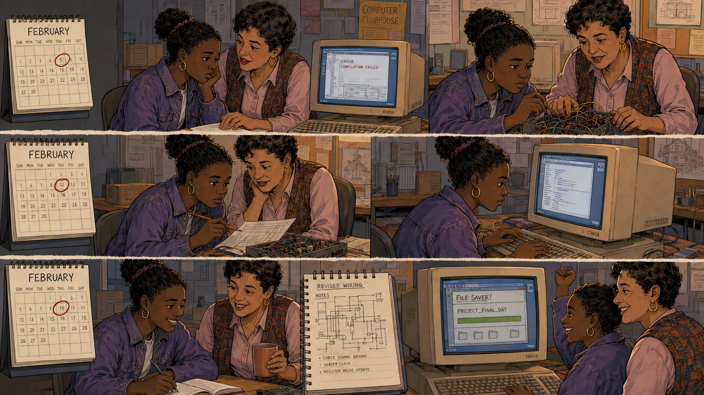
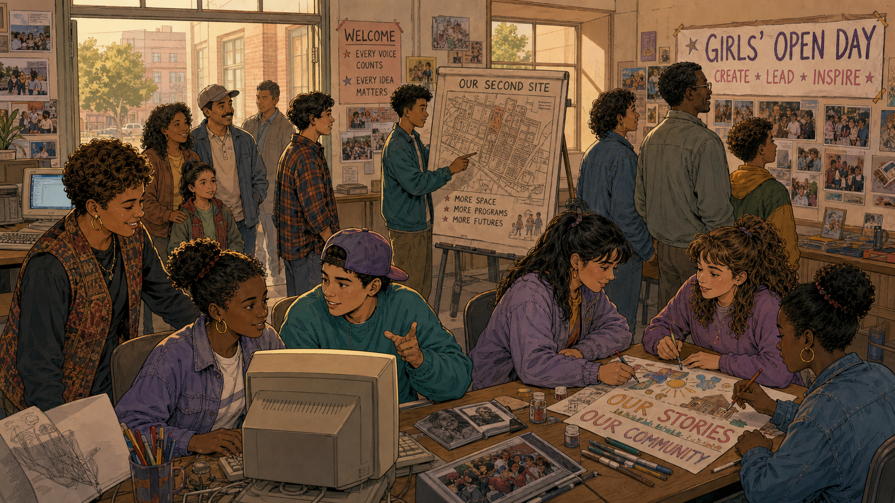
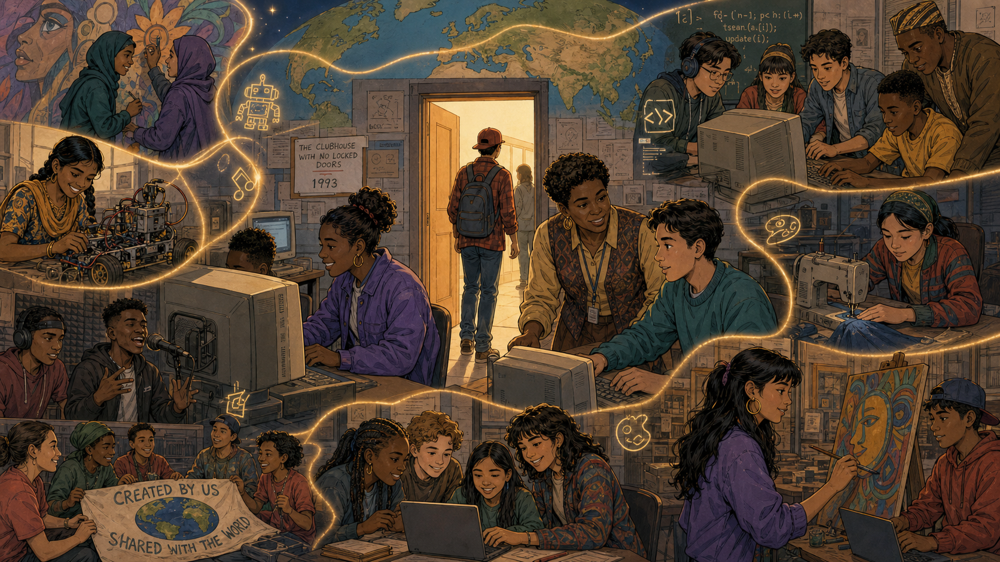

# The Clubhouse With No Locked Doors

Cover Image Prompt

(This is the Cover Image. Do not include this label in the image.)
Please generate a wide-landscape 16:9 cover image in a warm, nostalgic
early-1990s educational-graphic-novel style — clean linework, soft
cel-shading, muted period color grading. Scene: a bustling after-school
computer clubhouse room, several teenagers of different ethnic
backgrounds seated at boxy beige early-1990s computers and electronic
keyboards, one boy pointing excitedly at a colorful graphics program on
his monitor, a smiling Black adult male mentor in a shirt and tie leaning
in to help two teens at a computer, a bulletin board reading "COMPUTER
CLUBHOUSE" behind them, an open door in the background with more young
people walking in freely, taped-up drawings and building blueprints
covering the walls. Title text "The Clubhouse With No Locked Doors"
rendered in a bold, hand-torn-paper banner in a friendly vintage
newspaper typeface. Color palette: warm amber lamplight, dusty teal and
mauve 1990s clothing tones, beige computer plastics. Emotional tone:
welcome, energy, creative freedom. Generate the image immediately
without asking clarifying questions.

Narrative Prompt

This is a real historical founding story: the Computer Clubhouse, opened
in 1993 in Boston as a partnership between the MIT Media Lab (led by
Mitchel Resnick and Natalie Rusk) and the Computer Museum in Boston,
with Stina Cooke of the Computer Museum as a co-founder. Setting: Boston,
Massachusetts, 1993, at the Computer Museum on Museum Wharf, serving
teens from underserved neighborhoods including Roxbury, Dorchester, and
South Boston. Central themes: replacing locked, curriculum-driven
computer labs with an open, mentor-supported, youth-driven-projects
model; trusting teenagers with real professional tools instead of
simplified drills; the idea later called "technological fluency."
Creative liberties taken: the specific teen characters (the girl in the
purple jacket, the boy in the ball cap, the boy in the plaid shirt, and
others) are a composite representing the roughly 1,000 real young people
who joined in the Clubhouse's first two years — they are not depictions
of any single named individual. Dialogue on signage and screens is
illustrative, not transcribed from a specific historical document. Art
style: warm, nostalgic early-1990s educational-graphic-novel
illustration, clean linework, soft cel-shading, boxy beige-plastic
computer hardware accurate to 1993, consistent character designs and
color palette across all panels so the same teens and mentors are
recognizable panel to panel.

### Prologue – A City Full of Locked Doors

In 1993, most computer labs in American cities worked the same way: a
teacher stood at the front, a locked cabinet held the good equipment,
and every student worked through the same worksheet at the same pace.
For teenagers in Boston neighborhoods like Roxbury and Dorchester, the
newest tools of the digital age were usually the ones they were told to
stay away from. Two researchers at the MIT Media Lab thought that
backwards — and a museum a few blocks away was willing to help them
prove it.

## Panel 1: What Do You Need to Create?

Image Prompt

(This is Panel 01. Do not include the panel number in the image.)
I am about to ask you to generate a series of images for a graphic
novel. Please make the images have a consistent style and consistent
characters. Do not ask any clarifying questions. Just generate the
image immediately when asked.

Please generate a 16:9 image in a warm, nostalgic early-1990s
educational-graphic-novel style depicting panel 1 of 8. The scene shows
a round table in a museum meeting room overlooking the Boston skyline
and harbor through large windows, where two adult museum staff and MIT
researchers sit alongside four neighborhood teenagers, all leaning in
and talking. On the table is a handwritten "TEEN SURVEY: What do you
need to create?" sheet with checkboxes for video equipment, music
equipment, computers, art supplies, space to meet, adult mentors, and
"a place to call our own," plus a second sheet reading "WHAT WOULD YOU
MAKE IF YOU HAD THE TOOLS?" Behind them, posters read "MUSEUM
EDUCATION — Learning from Boston" and a wall map of Boston labels
Dorchester, Roxbury, and South Boston. Setting: The Computer Museum,
Boston, 1993, daytime. Color palette: warm wood tones, museum-beige
walls, harbor blues through the window. Emotional tone: collaborative,
respectful listening, genuine curiosity. Six visual details: the
teen-survey checklist, the labeled Boston neighborhood map, coffee mugs
on the table, a "UMass Boston Community Partnership" banner, a teenage
girl gesturing while she talks, an older museum staffer taking notes.
Generate the image immediately without asking clarifying questions.

Before anyone touched a screwdriver or a paint can, the researchers and
museum staff did something unusual for adults planning a program for
teenagers: they asked the teenagers what they actually wanted. Around a
table overlooking Boston Harbor, kids from Dorchester and Roxbury
filled out surveys about what tools they needed and what they'd build
if nobody was standing over their shoulder. The answers weren't a
curriculum — they were a wish list: music gear, art supplies, computers,
and mentors who would treat them like builders, not students.

## Panel 2: The Old Way — Locked Cabinets, Fixed Quizzes

Image Prompt

(This is Panel 02. Do not include the panel number in the image.)
Please generate a 16:9 image in the same style depicting panel 2 of 8.
Make the setting consistent with a typical early-1990s school computer
lab. The scene shows two teenagers at beige computer terminals, both
looking bored, their screens displaying an identical fixed
multiple-choice quiz reading "Choose the correct answer. What is the
capital of Massachusetts?" with options Springfield, Cambridge, Boston,
Worcester. Behind them, a locked wire equipment cage is chained shut
with a padlock under a sign reading "AUTHORIZED ACCESS ONLY," and a
nearby door reads "STAFF ONLY." A small hand-written note taped to the
wall reads "Everyone has a right to learn." An adult staff member stands
behind a counter, arms folded, guarding the locked gear rather than
teaching. Setting: a conventional restricted computer lab, Boston area,
early 1990s, dim fluorescent lighting. Color palette: cool gray-blue
institutional tones, contrasting with the warm palette of the other
panels. Emotional tone: restriction, boredom, missed potential. Six
visual details: the padlocked wire cage, the "STAFF ONLY" door, the
identical quiz screens, the folded-arms staffer, a "MUSIC TECH DESIGN
STUDIO — Members Only" sign on the locked cabinet, two teens resting
their chins on their hands in boredom. Generate the image immediately
without asking clarifying questions.

This was the problem the founders were trying to solve. Across the
city, the good equipment — synthesizers, mixing boards, the newest
computers — usually sat behind a locked cage with a sign that read
"Authorized Access Only," while the machines students were allowed to
touch ran the same fixed multiple-choice quiz for everyone. Mitchel
Resnick and Natalie Rusk of the MIT Media Lab had watched this pattern
for years and believed technology access built on locks and worksheets
was teaching kids the opposite of what it claimed to. If teenagers were
ever going to become genuine creators with technology, someone needed
to hand them the keys instead of guarding them.

## Panel 3: Teens Design Their Own Room

Image Prompt

(This is Panel 03. Do not include the panel number in the image.)
Please generate a 16:9 image in the same style depicting panel 3 of 8.
Make the teen characters consistent with panel 1. The scene shows the
same group of teenagers and a mentor gathered around a large hand-drawn
floor plan spread across a worktable, covered in colorful sticky notes
reading "MORE LIGHT," "MOVE TABLES," "COMMUNITY WALL," "DISPLAY
SHELVES," "FLEXIBLE TABLES," "COMFY SEATING," "PLANTS!," and "OPEN
DOOR," labeling zones for a Music Area, Open Workstations, Computer
Lab, and Tool Shelves. On the wall behind them, a large hand-lettered
poster reads "OUR CLUBHOUSE" above four sticky notes: "EVERYONE
WELCOME," "SHARE IDEAS," "RESPECT," "SUPPORT EACH OTHER." A boy plays a
keyboard connected to a computer showing colorful generative art in the
background, while two more teens enter through an open door. Setting:
a storage-and-workroom space at the Computer Museum, Boston, 1993.
Color palette: warm wood and cardboard-box tones with bright sticky-note
accent colors. Emotional tone: ownership, pride, collaborative design.
Six visual details: the sticky-note floor plan, the "OUR CLUBHOUSE"
values poster, the boy at the keyboard, storage boxes and shelves of
supplies, a scanner and older computer on a side table, teens entering
through the open doorway. Generate the image immediately without asking
clarifying questions.

Instead of handing the teens a finished room, the mentors handed them
markers and a blank floor plan. The same kids who had filled out the
survey now argued over where the music area should go, whether the
door should always stay open, and what values belonged on the wall.
"Everyone welcome. Share ideas. Respect. Support each other" — the
rules of the Clubhouse were written by the people who would actually
have to live by them, months before a single visitor walked through
the door.

## Panel 4: Opening Day, 1993

Image Prompt

(This is Panel 04. Do not include the panel number in the image.)
Please generate a 16:9 image in the same style depicting panel 4 of 8.
Make the teens and setting consistent with prior panels. The scene shows
three teenagers with backpacks walking through a wide-open front door
into a lit, welcoming room, greeted by a smiling adult woman staff
member with her arms open in welcome while a young man documents the
moment with a camera. A sign beside the door reads "THE COMPUTER
MUSEUM" and a handwritten sign reads "TODAY! A new kind of learning
space for teenagers," beneath a banner reading "OPEN HOUSE — EVERYONE
WELCOME." Through the doorway, other teens are already seated at
computers and a keyboard, a "COMPUTER CLUBHOUSE" sign visible on the far
wall. A large title card in the image reads "The Clubhouse With No
Locked Doors — Boston, 1993." Setting: The Computer Museum entrance,
Boston, 1993, late-afternoon golden light spilling through the open
door. Color palette: warm golden interior light against a cooler gray
exterior. Emotional tone: welcome, anticipation, a threshold being
crossed. Six visual details: the open unlocked door, the "OPEN HOUSE —
EVERYONE WELCOME" sign, backpacks on the arriving teens, the camera
capturing the moment, teens already inside at computers and a keyboard,
the "COMPUTER CLUBHOUSE" wall sign. Generate the image immediately
without asking clarifying questions.

On opening day, there was no orientation lecture and no sign-up sheet
that decided who got to use the good equipment. There was just an open
door at the Computer Museum on Museum Wharf, a hand-lettered sign
promising "a new kind of learning space for teenagers," and neighborhood
kids walking in off the street to see for themselves. In its first two
years, more than a thousand young people came through that door — 98
percent of them from underserved communities across Boston.

## Panel 5: Drop In, Build What You Want

Image Prompt

(This is Panel 05. Do not include the panel number in the image.)
Please generate a 16:9 image in the same style depicting panel 5 of 8.
Make the mentor and teens consistent with prior panels. The scene shows
a woman mentor leaning between two workstations, on the left a teenage
girl using a graphics tablet to animate a running figure on her
computer screen, on the right a teenage boy wearing headphones around
his neck playing a MIDI keyboard connected to a computer showing a music
sequencer with colored note blocks, an open sketchbook of storyboard
drawings on the desk between them. The walls are covered with taped-up
sketches, storyboards, and sticky notes from other members' projects.
Setting: the Computer Clubhouse workroom, Boston, 1993. Color palette:
warm lamp-lit interior, colorful computer-screen accents against beige
hardware. Emotional tone: focused creative independence, quiet mentor
support. Six visual details: the graphics tablet and animation
timeline, the MIDI keyboard and music-sequencer screen, the mentor's
encouraging point at the animation, the boy's headphones resting around
his neck, the sketchbook full of storyboards, walls covered in other
members' project drawings. Generate the image immediately without
asking clarifying questions.

Once the doors were open, nobody assigned the projects. One girl chose
to animate a running figure against a city skyline; a few feet away, a
boy layered notes into a music sequencer with headphones looped around
his neck. A mentor circulated between them, answering questions only
when asked, never taking over the mouse. This was the idea Resnick and
Rusk later called technological fluency — not just knowing how to
operate a tool, but having the confidence to use it to say something
that was genuinely yours.

## Panel 6: A Whole February With One Mentor

Image Prompt

(This is Panel 06. Do not include the panel number in the image.)
Please generate a 16:9 image in the same style depicting panel 6 of 8,
laid out as a six-panel comic-strip grid. Make the girl and mentor
consistent with prior panels. Panel row 1: a wall calendar reading
"FEBRUARY" with the 5th circled, beside the girl and her mentor looking
at a computer screen reading "ERROR — COMPILATION FAILED"; then the two
of them working together with a soldering iron and a tangle of colored
wires on a circuit board. Panel row 2: the calendar now with the 12th
circled, the girl and mentor reviewing handwritten notes and a partly
assembled circuit board; then the girl alone typing code at the
computer, focused. Panel row 3: the calendar now with the 19th circled,
the girl and mentor smiling together over coffee and a notebook page
titled "REVISED WIRING NOTES" with a hand-drawn circuit diagram; then a
screen reading "FILE SAVED! — PROJECT_FINAL.DAT" as the girl pumps her
fist and the mentor grins beside her. Setting: the Computer Clubhouse
workroom, Boston, 1993, over the course of one February. Color palette:
warm consistent lamp-lit tones across all six panels to show the passage
of time in the same place. Emotional tone: patient persistence turning
into earned triumph. Six visual details: the three calendar pages
marking the passing weeks, the "COMPILATION FAILED" error screen, the
soldering and wiring work, the "REVISED WIRING NOTES" notebook page, the
"FILE SAVED!" screen, the girl's fist-pump celebration. Generate the
image immediately without asking clarifying questions.

Technological fluency didn't arrive in an afternoon. One member spent
nearly the entire month of February working the same problem with the
same mentor beside her — a failed compile on the 5th, a rewired circuit
board on the 12th, revised notes over coffee on the 19th. Nobody rushed
her to the next worksheet and nobody moved her to a different mentor to
keep to a schedule. When the screen finally read "File Saved," the win
belonged entirely to her, and to the adult who had shown up week after
week to keep believing she'd get there.

## Panel 7: A Second Clubhouse, and a Day Just for Girls

Image Prompt

(This is Panel 07. Do not include the panel number in the image.)
Please generate a 16:9 image in the same style depicting panel 7 of 8.
Make the teen characters consistent with prior panels, now slightly
older. The scene shows a bright room where a teenage boy points at a
hand-drawn neighborhood map on an easel labeled "OUR SECOND SITE" with
notes reading "MORE SPACE," "MORE PROGRAMS," "MORE FUTURES," while
nearby three teenage girls paint a poster reading "OUR STORIES — OUR
COMMUNITY." A large banner on the wall reads "GIRLS' OPEN DAY — CREATE
· LEAD · INSPIRE" and a smaller sign reads "WELCOME — EVERY VOICE
COUNTS, EVERY IDEA MATTERS." A mentor and several parents and younger
siblings look on, some visiting for the first time, with a city street
and tree visible through open windows. Setting: a Computer Clubhouse
site, Boston, mid-to-late 1990s, daytime. Color palette: bright,
optimistic daylight tones. Emotional tone: pride, expansion, community
celebration. Six visual details: the "OUR SECOND SITE" map easel, the
"GIRLS' OPEN DAY" banner, the "OUR STORIES — OUR COMMUNITY" poster in
progress, visiting parents and younger kids, framed photos of past
Clubhouse members on the wall, an open window showing the neighborhood
outside. Generate the image immediately without asking clarifying
questions.

Word spread the way it does when something actually works: through the
members themselves. Within a few years the original Clubhouse needed a
second site to keep up with demand, and members who once needed
convincing to walk through the door were now the ones presenting the
floor plan for it. A "Girls' Open Day" brought in younger sisters and
neighbors who had never pictured themselves as engineers, animators, or
musicians — and left with a project of their own already started.

## Panel 8: One Idea, Carried Around the World

Image Prompt

(This is Panel 08. Do not include the panel number in the image.)
Please generate a 16:9 image in the same style depicting panel 8 of 8,
composed as a montage. At the center, a mentor and a teenage boy work
together at a computer in the original 1993 Boston Clubhouse, a plaque
beside them reading "THE CLUBHOUSE WITH NO LOCKED DOORS — 1993," with a
new visitor walking through an open doorway in the background beneath a
faint world map. A glowing golden thread winds outward from this center
to smaller framed scenes around the edges: a girl in a headscarf wiring
a small robot; two boys performing music into a microphone; a girl
sewing an LED-lit garment on a machine; a diverse group of teens
gathered around a computer covered in program code; a girl painting a
large sun mural on canvas; and a group holding a hand-lettered banner
reading "CREATED BY US — SHARED WITH THE WORLD" in front of a globe.
Setting: a symbolic global collage radiating from the original Boston
Clubhouse, present day framing on a 1990s core scene. Color palette:
warm amber core light with a soft golden connecting thread against
varied international scene palettes. Emotional tone: legacy, pride,
worldwide belonging. Six visual details: the "THE CLUBHOUSE WITH NO
LOCKED DOORS — 1993" plaque, the golden connecting thread, the robotics
scene, the sewing-machine scene, the "CREATED BY US — SHARED WITH THE
WORLD" banner, the world map behind the central doorway. Generate the
image immediately without asking clarifying questions.

What started in a thousand square feet on the ground floor of a Boston
museum did not stay in Boston. The model — open hours, real tools, no
fixed lesson plan, mentors who listened more than they lectured —
became the Computer Clubhouse Network, eventually growing into what is
known today as The Clubhouse Network: more than 150 Clubhouses across
roughly nineteen countries, on nearly every continent, all tracing back
to that one unlocked door.

### Epilogue – What Made This Clubhouse Different?

The Computer Clubhouse didn't succeed because it had better computers
than the locked lab down the street — for years, its donated hardware
was often older. It succeeded because it changed who got to decide what
happened next: not a curriculum, not a locked cabinet, but the teenager
sitting at the keyboard. That single shift, repeated in city after city
and country after country, is still the clearest description of what
the Clubhouse model actually is.

| Challenge | How the Founders Responded | Lesson for Today |
|-----------|------------------------------|-------------------|
| Underserved teens had little access to real design and technology tools | The Computer Museum and MIT Media Lab opened a free, drop-in space stocked with real equipment | A club earns trust by handing over real tools, not simplified toys |
| Traditional computer labs used fixed curricula and locked cabinets | The Clubhouse let members choose their own projects on an open schedule | Ownership of the project, not compliance with a lesson plan, is what builds lasting engagement |
| One-time access does not build deep skill | Adult mentors stayed with members across weeks and months of the same project | Consistency of relationship matters more than any single lesson |
| A single site could not reach everyone who needed it | Members themselves helped design and advocate for new sites and outreach days | Youth who feel ownership become the strongest recruiters and advocates for growth |

### Call to Action

The next time your club is tempted to lock away the good equipment
"until they're ready," remember the 1,000 teenagers who walked through
an unlocked door in Boston in 1993 and proved they were ready the whole
time. Hand over the real tools, find them a mentor who will stick
around, and then get out of the way.

---

*"There's no one breathing down your neck here."*
—a Computer Clubhouse member, describing the program in its early years

*"Technological fluency means much more than the ability to use
technological tools... True fluency involves the ability to express,
explore, and realize ideas."*
—Mitchel Resnick and Natalie Rusk, MIT Media Lab

---

## References

1. [Wikipedia: The Clubhouse Network](https://en.wikipedia.org/wiki/The_Clubhouse_Network) - Biography of the organization founded in 1993 as the Computer Clubhouse by Mitchel Resnick and Natalie Rusk of the MIT Media Lab and Stina Cooke of the Computer Museum
2. [Wikipedia: MIT Media Lab](https://en.wikipedia.org/wiki/MIT_Media_Lab) - The MIT research lab whose researchers co-founded and continue to collaborate with the Clubhouse network
3. [Wikipedia: The Computer Museum, Boston](https://en.wikipedia.org/wiki/The_Computer_Museum,_Boston) - The Boston museum that hosted the first Computer Clubhouse on its ground floor starting in 1993
4. [The Clubhouse Network - official site](https://theclubhousenetwork.org/) - The present-day international nonprofit network descended from the original 1993 Computer Clubhouse
5. [MIT Media Lab: The Computer Clubhouse - Technological Fluency in the Inner City](https://www.media.mit.edu/publications/the-computer-clubhouse-technological-fluency-in-the-inner-city/) - The founders' own account of the Clubhouse's origins, philosophy, and early results
