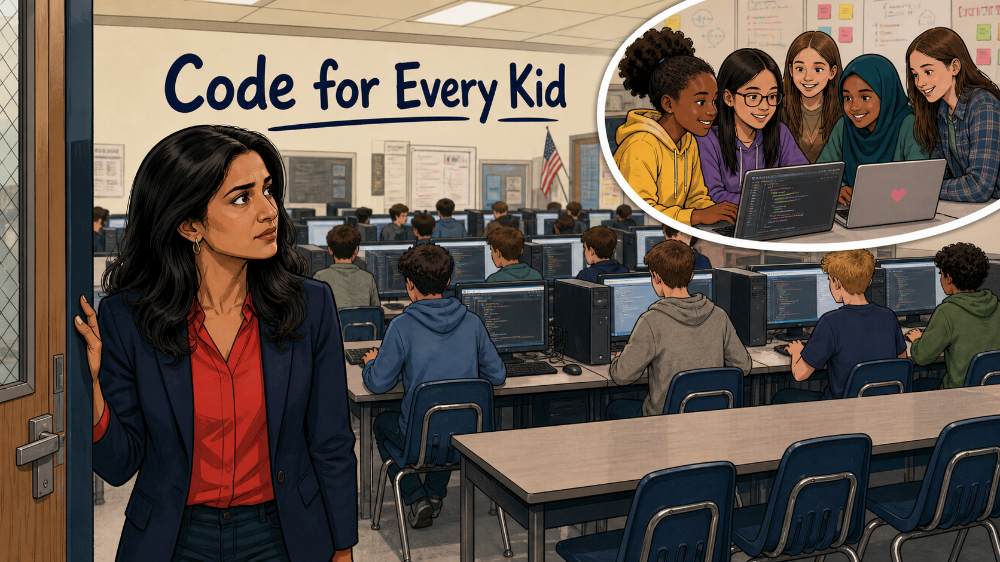
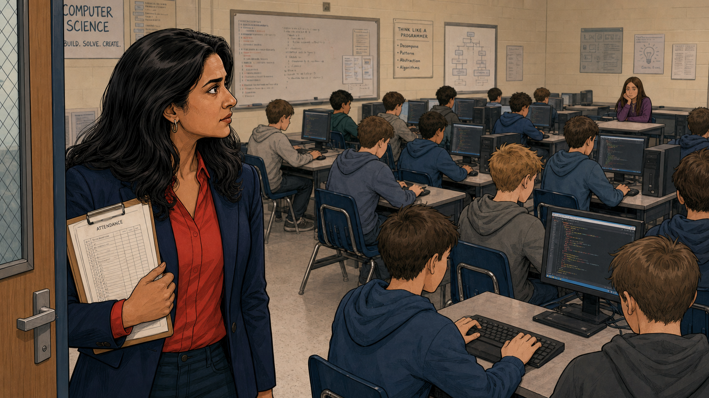
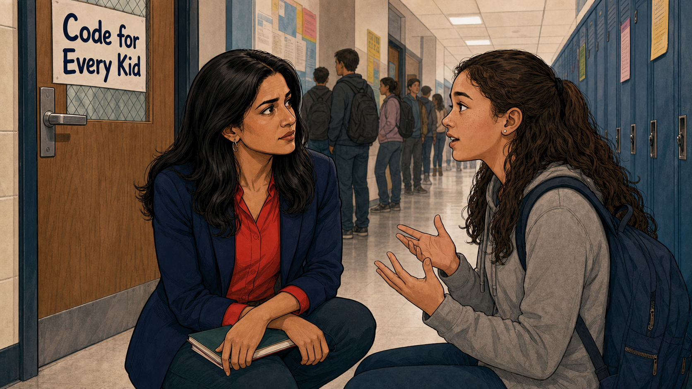
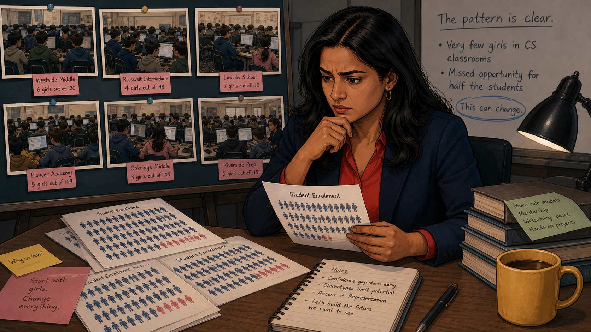
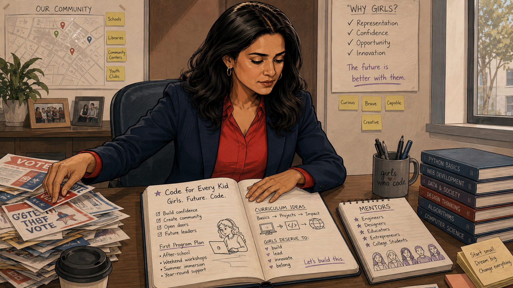
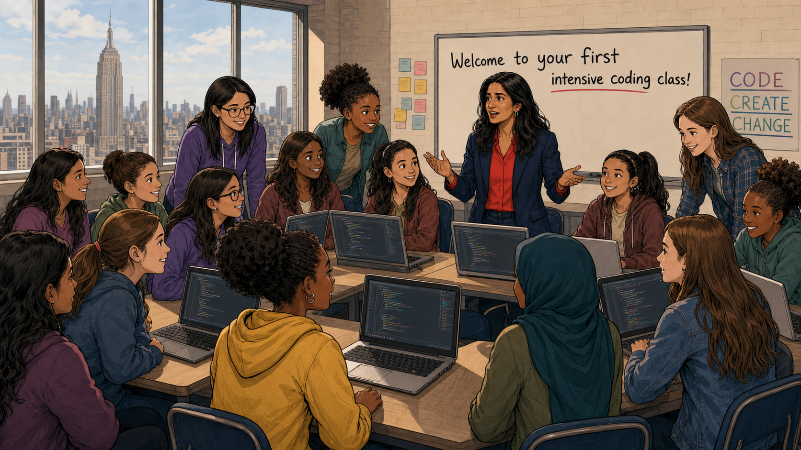
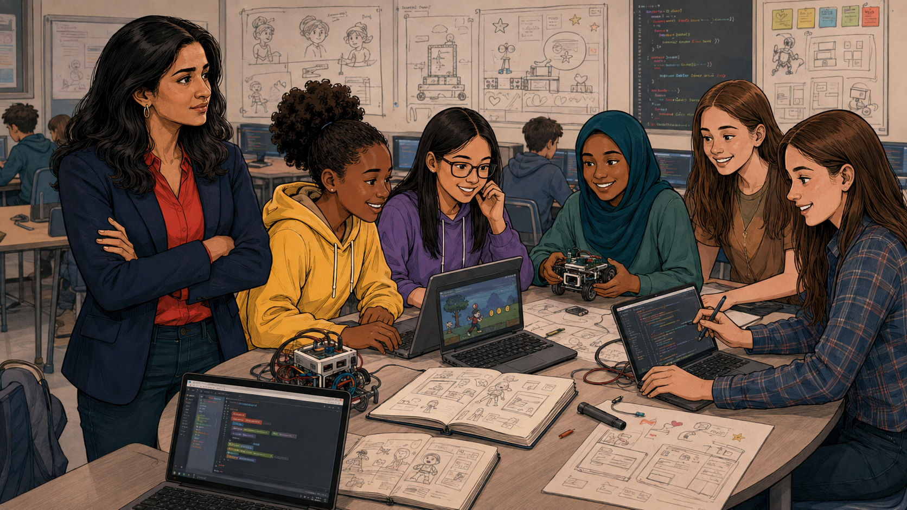
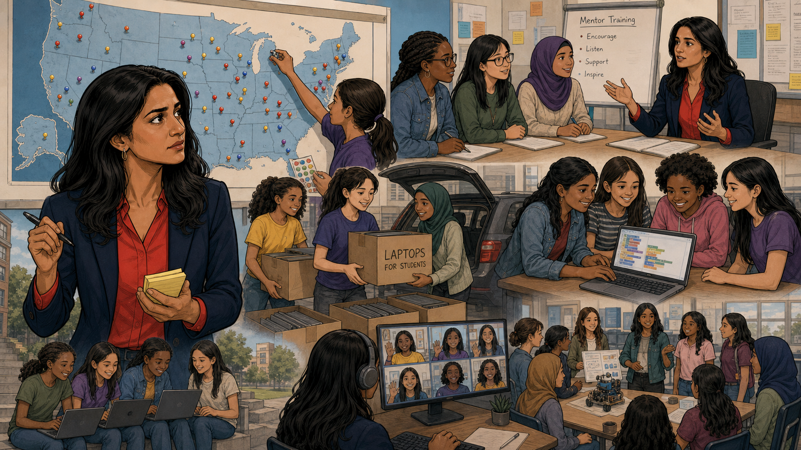
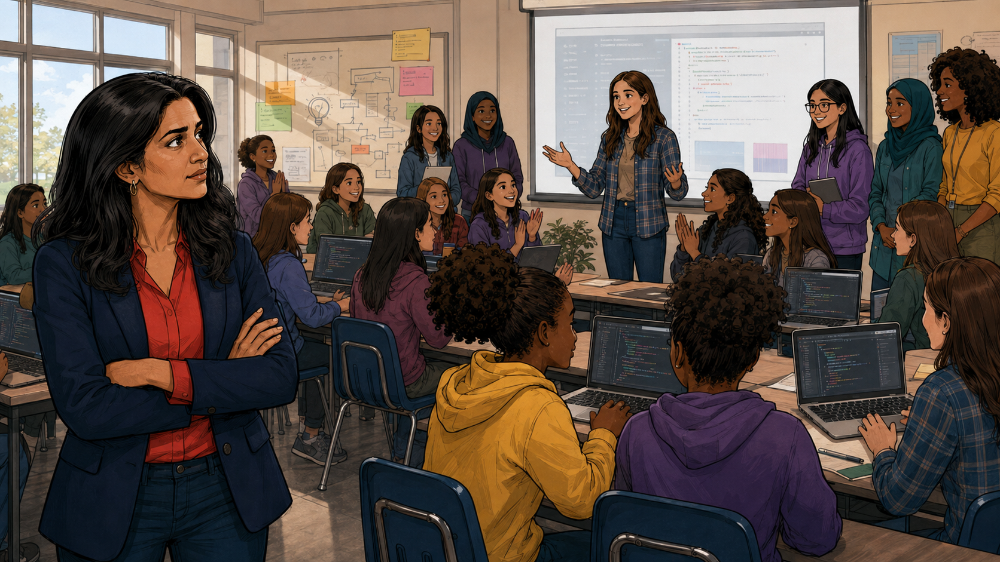

# Code for Every Kid

Cover Image Prompt

(This is the Cover Image. Do not include this label in the image.)
Wide-landscape 16:9 cover image in a warm, contemporary
educational-graphic-novel style — clean linework, soft cel-shading,
grounded realistic proportions. Reshma Saujani (South Asian-American
woman in her mid-thirties, long dark wavy hair past her shoulders,
gold hoop earrings, red button-down blouse under an open navy
blazer) stands in the doorway of a school computer lab, glancing back
over her shoulder with a furrowed, thoughtful expression at a room
full of teenage boys in hoodies working at desktop computers, rows of
glowing monitors stretching into the background, an American flag
near a bulletin board. Title text "Code for Every Kid" rendered in
bold, rounded navy sans-serif lettering across the upper-left of the
image. A circular inset vignette in the upper right shows five
diverse teenage girls — one Black girl in a yellow hoodie, one Asian
girl in glasses and a purple hoodie, one girl in a green top, one
girl wearing a teal hijab, one more girl in plaid — gathered happily
around two laptops covered in code, one laptop marked with a small
heart sticker, a whiteboard full of notes behind them. Color palette:
warm beige classroom tones and cool navy blue on Reshma's blazer,
brighter warm highlights inside the inset circle. Emotional tone:
concern giving way to hope. Generate the image immediately without
asking clarifying questions.

Narrative Prompt

This is a nonfiction founding story about a real, living person:
Reshma Saujani (b. November 18, 1975), an American attorney and
former congressional candidate who founded the nonprofit
organization Girls Who Code in 2012. Setting: New York state and New
York City, present-day (contemporary era, 2010–present), depicted in
a warm, contemporary educational-graphic-novel illustration style
with clean linework, soft cel-shading, and a consistent color
palette across all panels. Reshma should be immediately recognizable
in every panel — same long dark wavy hair, gold hoop earrings, red
blouse under a navy blazer. Because "Girls Who Code" is a registered
trademark, the in-scene signage inside the illustrations (posters,
door signs, notebook headings) uses a generic stand-in phrase, "Code
for Every Kid," rather than reproducing the real organization's
name or logo; the narrative prose below each panel uses the real
name, Girls Who Code, throughout. The specific school names shown on
printouts in Panel 3 (Westside Middle, Roosevelt Intermediate,
Lincoln School, Pioneer Academy, Oakridge Middle, Riverside Prep) are
fictional composites standing in for the many real schools Saujani
visited on her campaign route — they are a storytelling device, not
a claim about specific real schools. The unnamed student Reshma
speaks with in Panel 2 is a representative composite of the many
students she encountered, not a documented individual or verbatim
conversation. All other events — the 2010 congressional campaign,
the classroom observation, the 2012 founding, the first class of
girls in New York City, and the organization's growth into
after-school clubs, summer programs, and a nationwide network — are
grounded in the historical record cited in the References section
below.

Reshma Saujani had spent years building a career most people would
call a success. She had a law degree from Yale, a master's degree
from Harvard, and jobs at a top law firm and a hedge fund. In 2010,
she gave much of that up to run for the U.S. House of Representatives
in New York's 14th congressional district — becoming the first
Indian American woman ever to run for Congress. She lost badly. But
on the campaign trail, stopping in classroom after classroom to meet
students and parents, she noticed something that stuck with her long
after the election was over: the computer science rooms were full of
boys, and almost empty of girls. That single, repeated observation
became the seed of Girls Who Code — proof that the first step toward
fixing an absence is simply noticing it.

## Panel 1: A Room Full of Boys

Image Prompt

(This is Panel 01. Do not include the panel number in the image.)
I am about to ask you to generate a series of images for a graphic
novel. Please make the images have a consistent style and consistent
characters. Do not ask any clarifying questions. Just generate the
image immediately when asked.

Please generate a 16:9 image in a warm, contemporary
educational-graphic-novel style depicting panel 1 of 8. The scene
shows a present-day New York school computer science classroom,
Reshma Saujani standing just inside the doorway holding a clipboard
labeled "ATTENDANCE," her expression concerned and searching. Rows
of desktop computers stretch back through the room, occupied almost
entirely by teenage boys in hoodies typing and looking at glowing
code on their screens; a single girl in a purple sweater sits alone
near the back, watching quietly. A whiteboard reads "COMPUTER
SCIENCE — BUILD. SOLVE. CREATE." and a nearby poster reads "THINK
LIKE A PROGRAMMER: Decompose, Pattern, Abstraction, Algorithms."
Setting: contemporary USA public school, daytime. Color palette:
neutral beige classroom tones, Reshma's red blouse and navy blazer
as the only warm accent. Emotional tone: quiet unease, a pattern
starting to form. Six visual details: the attendance clipboard, rows
of glowing monitors, the lone girl in the back row, the "Think Like a
Programmer" poster, hooded boys with backs turned, fluorescent
classroom lighting. Generate the image immediately without asking
clarifying questions.

Reshma had come to the school as a candidate, not a teacher, but
habit made her count rooms the way a lawyer counts evidence. Row
after row of boys sat hunched over keyboards, absorbed in code
scrolling down their screens, while a single girl sat apart near the
back, unnoticed. It wasn't the first classroom that looked this way
on her campaign route — it wasn't even the fifth. She stood in the
doorway a moment longer than she needed to, already asking herself a
question she couldn't shake: why was this room only half full of the
students it was supposed to serve?

## Panel 2: A Question in the Hallway

Image Prompt

(This is Panel 02. Do not include the panel number in the image.)
Please generate a 16:9 image in the same style depicting panel 2 of
8. Make Reshma consistent with the prior panel. The scene shows a
school hallway just after class, Reshma crouched down to eye level,
listening intently to a teenage girl with long curly hair and a
backpack who is speaking with her hands as she explains something.
Behind them, a classroom door carries a poster reading "Code for
Every Kid," and other students walk past in the background, some
with backpacks, blue lockers lining the hallway. Setting: contemporary
USA public school hallway, midday. Color palette: cool hallway tones
with warm skin tones and Reshma's red blouse standing out. Emotional
tone: genuine listening, a student's candid honesty. Six visual
details: the "Code for Every Kid" door poster, the girl's expressive
open hands, Reshma's clipboard-free crouch, blue lockers, students
passing in the background, the girl's backpack straps. Generate the
image immediately without asking clarifying questions.

After class, Reshma stopped one of the few girls she'd seen at a
keyboard and asked her, plainly, what it was like being one of maybe
two girls in the room. The girl didn't hesitate — she talked about
feeling like she had to prove she belonged every single day, about
raising her hand less than she wanted to. Behind them, a faded poster
on the classroom door promised "Code for Every Kid." Reshma looked at
it, then back at the classroom she'd just left, and understood the
gap between what a school promised and what it actually delivered.

## Panel 3: The Pattern Is Clear

Image Prompt

(This is Panel 03. Do not include the panel number in the image.)
Please generate a 16:9 image in the same style depicting panel 3 of
8. Make Reshma consistent with prior panels. The scene shows Reshma
at a desk at night, chin resting on her hand, studying printouts and
labeled classroom photos pinned to a board: "Westside Middle — 6
girls out of 120," "Roosevelt Intermediate — 4 girls out of 98,"
"Lincoln School — 7 girls out of 110," "Pioneer Academy — 5 girls
out of 108," "Oakridge Middle — 3 girls out of 105," "Riverside Prep
— 6 girls out of 115." Enrollment charts with small human-figure
icons, mostly blue with a handful of pink, are spread across the
desk. A sticky note reads "Start with girls. Change everything." A
whiteboard behind her reads "The pattern is clear. Very few girls in
CS classrooms. Missed opportunity for half the students. This can
change." A notebook lists "Confidence gap starts early / Stereotypes
limit potential / Access ≠ Representation." Setting: a home office at
night, desk lamp lit, a mug of coffee nearby. Color palette: warm
lamp light against cool night-blue shadows. Emotional tone: focused
realization hardening into resolve. Six visual details: the six
labeled classroom photos, the enrollment charts with figure icons,
the sticky note, the whiteboard list, the notebook of causes, the
warm desk lamp. Generate the image immediately without asking
clarifying questions.

Back home, Reshma laid out what she'd seen, school after school, and
the pattern refused to look like a coincidence. Six schools, six
classrooms, and in every one, girls made up a small fraction of the
room — never the whole class, never even close to half. She wrote
"start with girls, change everything" on a sticky note and stuck it
where she'd see it every morning, because a problem this consistent
wasn't going to fix itself, and nobody else seemed to be counting.

## Panel 4: Trading a Campaign for a Classroom

Image Prompt

(This is Panel 04. Do not include the panel number in the image.)
Please generate a 16:9 image in the same style depicting panel 4 of
8. Make Reshma consistent with prior panels. The scene shows Reshma
at her desk, one hand pushing aside a stack of "VOTE" campaign
flyers, the other resting on an open notebook. The notebook page
reads "Code for Every Kid — Girls. Future. Code." with checkboxes for
"Build confidence / Create community / Open doors / Future leaders"
and a "First Program Plan" list: "After-school, Weekend workshops,
Summer immersion, Year-round support." A second notebook page lists
"Curriculum Ideas: Basics → Projects → Impact" and "Mentors:
Engineers, Designers, Educators, Entrepreneurs, College Students." A
wall map labeled "Our Community" is marked with pins for schools,
libraries, community centers, and youth clubs. A mug reads "girls who
code" with a small heart. Setting: the same home office, daytime,
sunlight through a window. Color palette: warm daylight replacing
the previous panel's night-time lamp light. Emotional tone:
determination, a career pivot in progress. Six visual details: the
pushed-aside campaign flyers, the open notebook's program plan, the
curriculum-ideas page, the "Our Community" map with pins, the mug,
framed photos of past community events. Generate the image
immediately without asking clarifying questions.

Reshma lost her House race in the 2010 primary, and instead of
running again, she chose to build something instead of campaign for
it. She pushed her old flyers aside and opened a new notebook,
sketching out after-school clubs, weekend workshops, and a summer
program built specifically for girls — a curriculum that moved from
basics to real projects to real impact. In 2012, that notebook became
an actual organization: Girls Who Code.

## Panel 5: Twenty Girls, One Classroom

Image Prompt

(This is Panel 05. Do not include the panel number in the image.)
Please generate a 16:9 image in the same style depicting panel 5 of
8. Make Reshma consistent with prior panels. The scene shows a bright
classroom with the New York City skyline and the Empire State
Building visible through large windows, Reshma standing at the front
gesturing warmly toward a whiteboard that reads "Welcome to your
first intensive coding class!" with a poster nearby reading "CODE.
CREATE. CHANGE." A dozen or so diverse teenage girls of different
ethnicities sit and lean around tables with open laptops showing
lines of colorful code, smiling, some standing to see better. Setting:
present-day New York City, daytime. Color palette: bright optimistic
daylight, the city skyline in cool blues, warm classroom tones
inside. Emotional tone: excitement, a beginning. Six visual details:
the NYC skyline through the windows, the "Welcome to your first
intensive coding class" whiteboard, the "CODE CREATE CHANGE" poster,
laptops with visible code, a girl wearing a hijab among the group,
sticky notes on a side wall. Generate the image immediately without
asking clarifying questions.

The first Girls Who Code class met in New York City in the summer of
2012 — twenty girls, one classroom, and a curriculum built from
scratch. Reshma stood at the front and welcomed them the way she
wished someone had welcomed the lone girl she'd met on the campaign
trail: not as an exception in the room, but as exactly who the room
was built for. The skyline outside the window was the same city
where she'd lost an election two years earlier; this time, she wasn't
asking anyone to vote for her.

## Panel 6: Building, Not Just Learning

Image Prompt

(This is Panel 06. Do not include the panel number in the image.)
Please generate a 16:9 image in the same style depicting panel 6 of
8. Make Reshma and the girls consistent with prior panels. The scene
shows Reshma standing with arms crossed, watching proudly, while six
girls work together at a cluttered table: one girl types on a laptop
showing a simple platform video game she is building, another holds
a small wired robot kit, others sketch storyboards in open notebooks
full of character doodles, another points at code on a laptop screen
with a stylus. A wall behind them is covered with sketches, sticky
notes, and lines of code on a chalkboard. Other students work at
desks in the background. Setting: the same New York classroom, later
in the program, afternoon light. Color palette: warm collaborative
tones, screens glowing softly. Emotional tone: focused creative
immersion. Six visual details: the small robot kit, the video game
on-screen, the storyboard sketchbooks, the code-covered chalkboard,
Reshma's crossed-arm proud stance, background students at desks.
Generate the image immediately without asking clarifying questions.

The program was never just about syntax. Within weeks, the girls
were building — a video game with a character who collects coins
through a forest, a small robot wired together from a kit, sketchbook
pages full of storyboards for apps that didn't exist yet. Reshma
stood back and let them lead, arms crossed, watching kids who had
been the lone girl in their own classrooms turn into a room that
built things together.

## Panel 7: From One Classroom to a Movement

Image Prompt

(This is Panel 07. Do not include the panel number in the image.)
Please generate a 16:9 image in the same style depicting panel 7 of
8. Make Reshma consistent with prior panels, shown multiple times
across a multi-scene montage layout. Top left: Reshma looks at a wall
map of the United States dotted with colorful location pins across
many states, while a girl adds another pin. Top right: Reshma leads a
"Mentor Training" session with three girls at a table, a whiteboard
listing "Encourage, Listen, Support, Inspire." Middle: two girls load
a car trunk with boxes labeled "LAPTOPS FOR STUDENTS," and a separate
group of girls gathers around a laptop showing block-based code.
Bottom: a girl on a video call waves at a grid of other girls from
different chapters on a monitor, while nearby another cluster of
girls examines a small robot together outdoors. Setting: contemporary
USA, multiple cities implied, daytime and evening scenes combined.
Color palette: consistent warm-and-navy palette across all
sub-scenes, tied together by recurring blue map pins. Emotional tone:
expansion, momentum, a movement growing beyond one classroom. Six
visual details: the pinned US map, the "Mentor Training" whiteboard
list, the "LAPTOPS FOR STUDENTS" boxes, the block-based code laptop,
the video-call grid of chapters, girls examining a robot outdoors.
Generate the image immediately without asking clarifying questions.

One classroom became a chapter. A chapter became a map covered in
pins — after-school clubs and summer programs spreading state by
state, city by city. Reshma trained new mentors to run clubs she
couldn't run herself, volunteers packed boxes of laptops for students
who needed them, and video calls connected chapters that had never
met in person. What started as twenty girls in one New York room grew
into hundreds of thousands of girls in classrooms across the country
and around the world.

## Panel 8: The Room Teaches Itself

Image Prompt

(This is Panel 08. Do not include the panel number in the image.)
Please generate a 16:9 image in the same style depicting panel 8 of
8. Make Reshma consistent with prior panels, now positioned off to
the side rather than at the front. The scene shows a young woman —
an alumna of the program, brown hair, plaid shirt — standing
confidently at the front of a full classroom, gesturing toward a
projector screen displaying code and simple data charts, teaching a
room of diverse teenage girls who are smiling, clapping, and taking
notes. Reshma stands off to the side with arms crossed, watching with
quiet pride rather than leading. Sketches, sticky notes, and a
lightbulb doodle decorate the wall behind them. Setting: the same
kind of contemporary classroom, full and lively, daytime. Color
palette: bright, warm, celebratory tones. Emotional tone: quiet pride,
a cycle completing itself. Six visual details: the alumna teacher at
the projector screen, the code and chart visuals on screen, girls
clapping, Reshma positioned to the side rather than center, the
lightbulb wall doodle, laptops open on every desk. Generate the image
immediately without asking clarifying questions.

Years later, Reshma no longer had to stand at the front of every
room. A young woman who had once sat where the lone girl in Panel 1
once sat now stood at the projector screen, teaching a full classroom
of girls who clapped and took notes without a second thought about
being the only one. Reshma watched from the side, arms crossed, the
same posture she'd once used to size up an empty half of a
classroom — except now the room was full, and it was teaching itself.

### Epilogue – What Made Reshma Different?

Reshma Saujani didn't invent computer science, and she didn't invent
the idea of teaching kids to code. What she did was refuse to look
past an absence she kept seeing, school after school, until counting
it turned into building something to fix it. Girls Who Code grew from
one classroom of twenty girls in 2012 into a nationwide network of
clubs, summer programs, and college communities — not because the
technology changed, but because someone finally built a room designed
for the students who had been missing from it.

| Challenge | How Reshma Responded | Lesson for Today |
|-----------|---------------------------|------------------|
| A computer science classroom open to every student on paper had almost no girls in the seats | She counted the gap herself, school by school on her campaign route, until the pattern was undeniable | A club open to everyone in theory can still be quietly closed to some — look at who is actually in the room, not just who is welcome to be |
| Fixing the gap meant giving up a career already in motion, including a run for Congress | She left electoral politics to build Girls Who Code from scratch, starting with 20 girls in one NYC classroom in 2012 | The most useful thing you build might not be the thing you set out to build — stay alert to the problem that grabs you |
| One successful classroom doesn't change an entire industry's culture on its own | Girls Who Code built after-school clubs, a summer immersion program, and college communities designed to keep girls coding for years, not weeks | A single successful pilot only matters if you build the structure to repeat it — plan for scale from day one |
| Girls who succeed in a club still need somewhere to grow into afterward | Program alumnae return as mentors and instructors, teaching the same kind of club that once welcomed them | The strongest clubs turn today's beginners into tomorrow's mentors — recruiting and leadership development are the same job |

### Call to Action

The next time you walk into your own coding club, do what Reshma
did in that first classroom: count who's there, and notice who
isn't. You don't need a new invention to close a gap like the one
she found — you need a notebook, a hard question, and the will to
act on what you see.

---

*"In other words, we're raising our girls to be perfect and we're
raising our boys to be brave."*
—Reshma Saujani, TED Talk, "Teach Girls Bravery, Not Perfection" (2016)

*"So in 2012, I started a company to teach girls to code, and what I
found is that by teaching them to code I had socialized them to be
brave."*
—Reshma Saujani, TED Talk, "Teach Girls Bravery, Not Perfection" (2016)

---

## References

1. [Wikipedia: Reshma Saujani](https://en.wikipedia.org/wiki/Reshma_Saujani) - Biography of the attorney, former congressional candidate, and founder of Girls Who Code
2. [Wikipedia: Girls Who Code](https://en.wikipedia.org/wiki/Girls_Who_Code) - History, founding, and programs of the nonprofit organization
3. [Wikipedia: Gender disparity in computing](https://en.wikipedia.org/wiki/Gender_disparity_in_computing) - Background on the gender gap in computer science that Girls Who Code was founded to address
4. [Girls Who Code](https://www.girlswhocode.com/) - The organization's official site, describing its clubs, summer programs, and college loops
5. [WBUR On Point: "Girls Who Code" CEO Advocates For Female Leaders To Be "Brave, Not Perfect"](https://www.wbur.org/onpoint/2019/02/04/girls-who-code-reshma-saujani-brave-not-perfect) - NPR-affiliate interview with Saujani on founding Girls Who Code and her "brave, not perfect" philosophy
