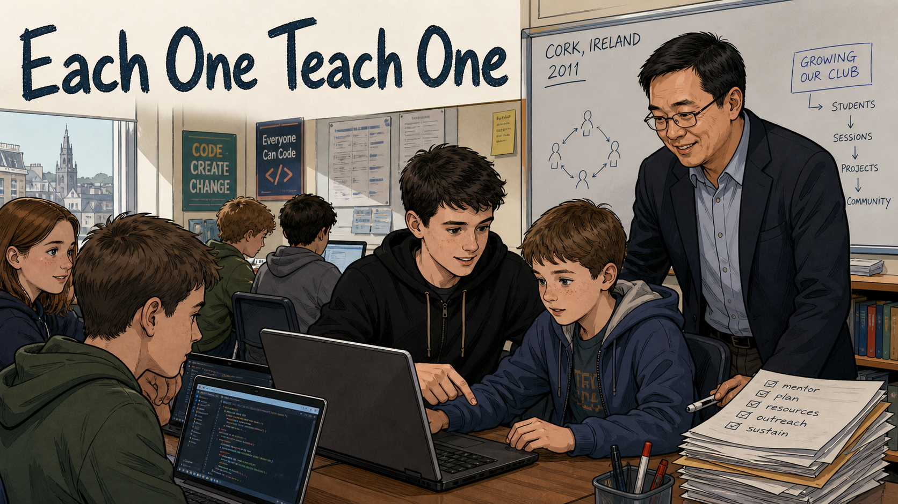
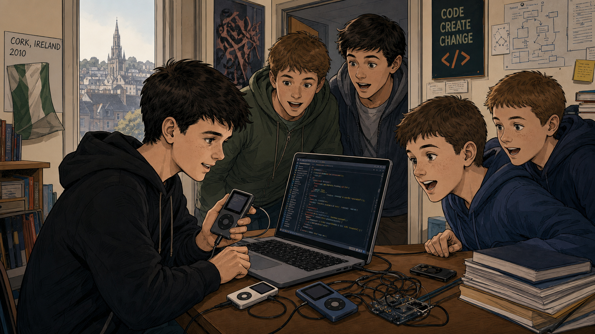
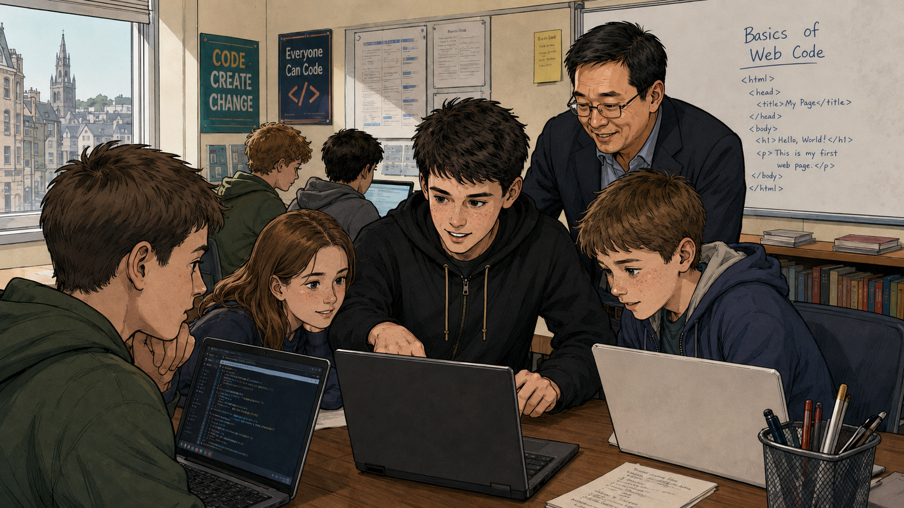
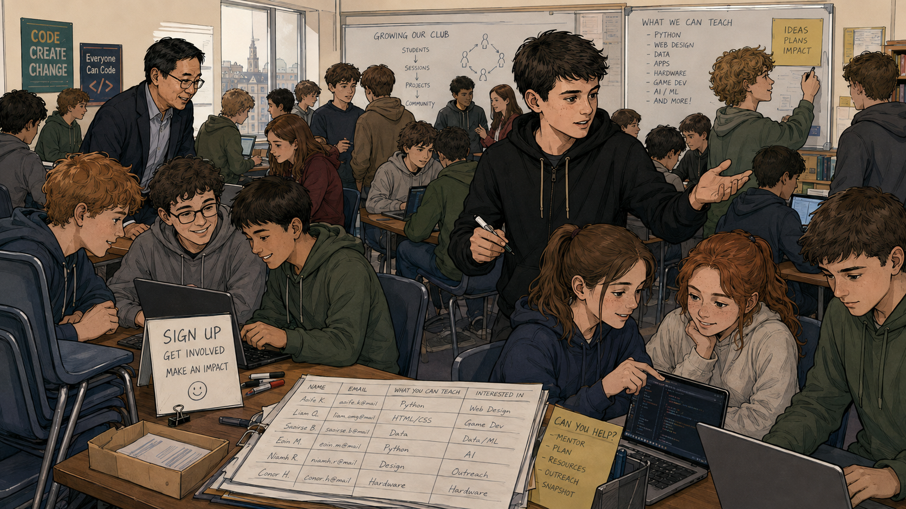
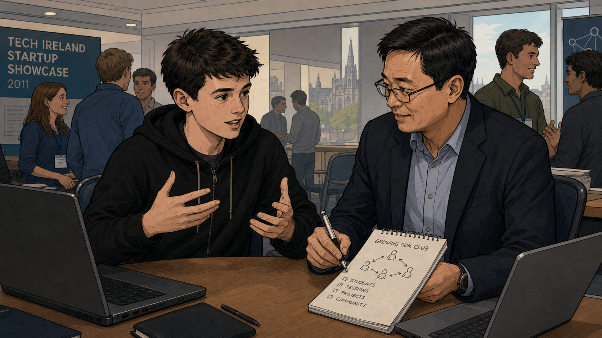
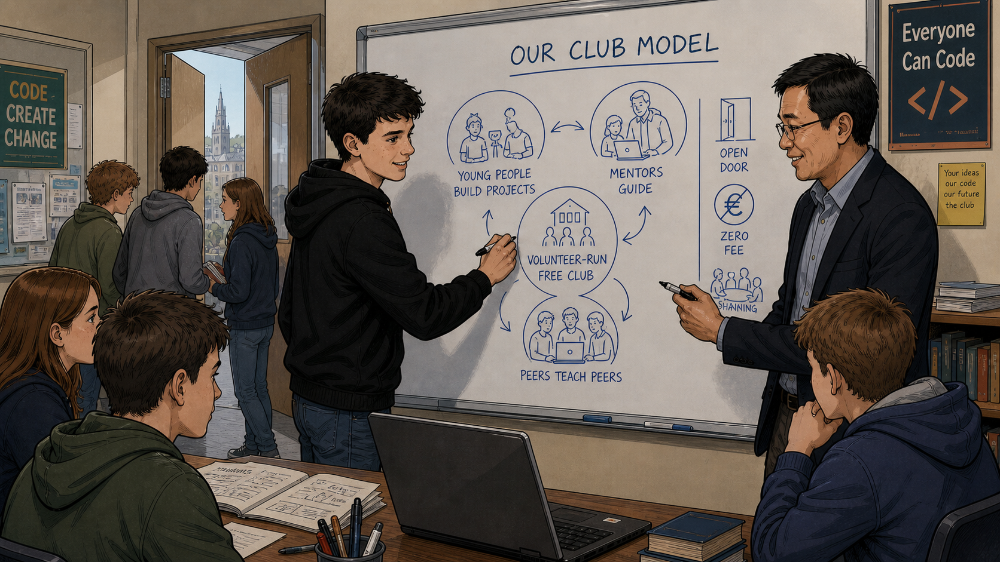
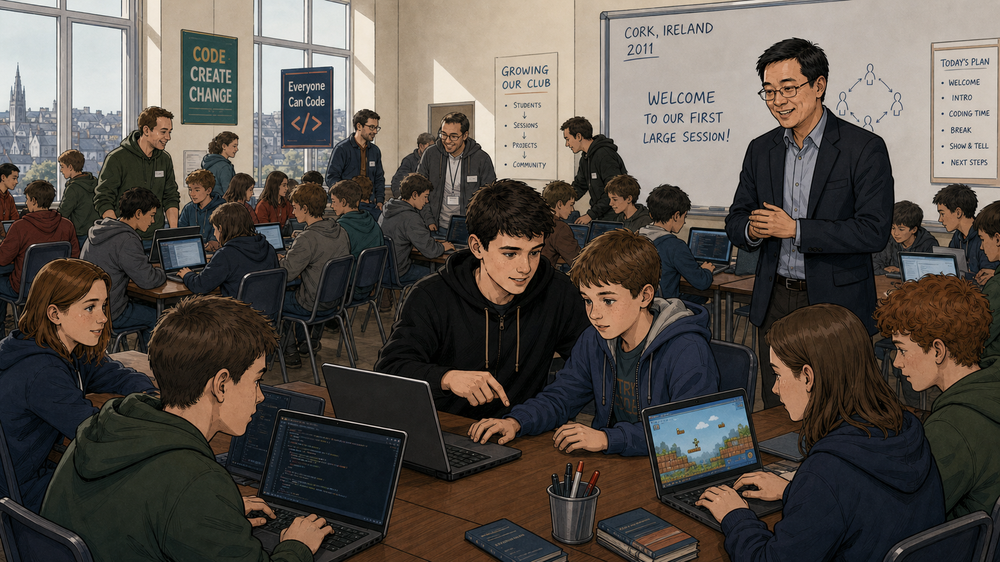
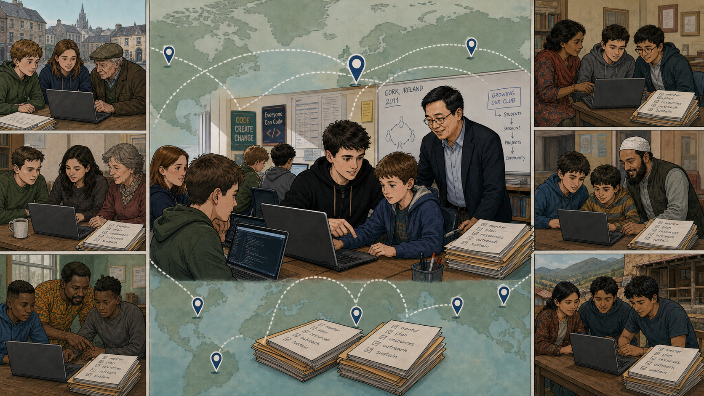
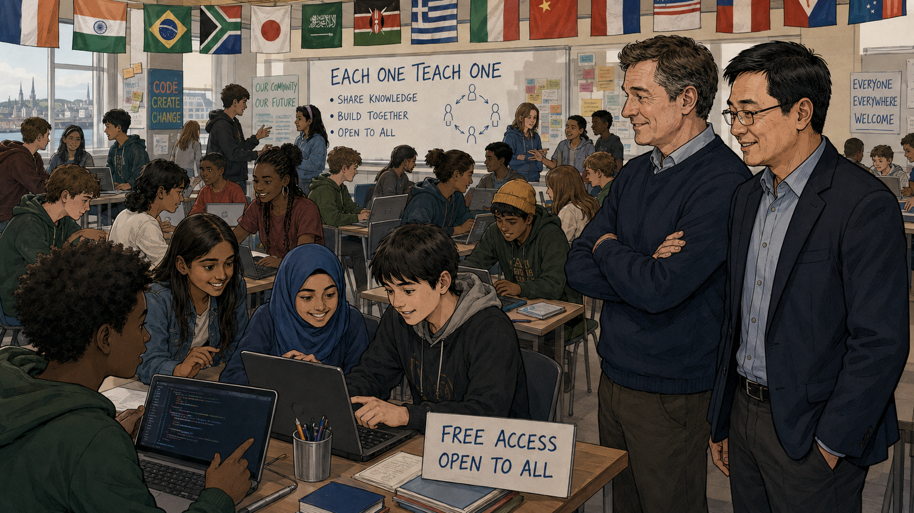

# Each One Teach One

Cover Image Prompt

(This is the Cover Image. Do not include this label in the image.)
Please generate a wide-landscape 16:9 cover image in a warm, contemporary
educational-graphic-novel style — clean linework, soft cel-shading, grounded
realistic proportions. Scene: a Cork, Ireland classroom-turned-clubroom.
James Whelton, a lean teenager of about eighteen with dark tousled hair and
a black zip hoodie, leans over a laptop pointing something out to two
younger boys seated at the table. Beside them stands Bill Liao, a man in
his forties with East Asian features, glasses, dark hair, and a navy suit
over a light blue shirt, holding a stack of papers headed with a checklist
reading "mentor, plan, resources, outreach, sustain." Behind them a
whiteboard reads "CORK, IRELAND / 2011" with a hand-drawn circle of stick
figures and a flowchart reading "GROWING OUR CLUB: STUDENTS, SESSIONS,
PROJECTS, COMMUNITY." Wall posters read "CODE CREATE CHANGE" and "Everyone
Can Code." A large window behind them shows Cork's rooftops and a church
spire under daylight. Title text "Each One Teach One" rendered in a bold,
rounded, hand-lettered navy typeface across the top. Color palette: warm
creams and browns with navy and teal accents. Emotional tone: mentorship,
quiet pride, ambition at a small scale about to grow. Generate the image
immediately without asking clarifying questions.

Narrative Prompt

This is a real, historically documented story. James Whelton (born
c. 1993) grew up in Cork, Ireland, and became locally known as a teenager
for hacking the iPod Nano; he started an informal, then formal, computer
club at his school, Presentation Brothers College (PBC), Cork, teaching
classmates HTML and CSS. In 2011 he met entrepreneur and investor Bill
Liao (born 1967, Australian, of Chinese and Irish—Australian heritage) at
a Dublin tech/startup event; together they turned the club into
CoderDojo, whose first official session was held 23 July 2011 at the
National Software Centre in Cork. The movement grew to more than 1,250
Dojos across roughly 69 countries before CoderDojo merged with the
Raspberry Pi Foundation in May 2017. Setting: Cork, Ireland, 2010–2011,
with a closing panel set some years later at an international CoderDojo
gathering. Art style: warm, contemporary educational-graphic-novel
illustration, clean linework, soft cel-shading, a consistent color
palette across panels. Bill Liao is drawn consistent with his real mixed
Chinese-Australian appearance.

Creative liberties, noted for transparency: (1) "Each One Teach One" is
used here as this story's title because it captures CoderDojo's real
peer-mentorship culture — young coders learning from slightly older
coders, supported by adult mentors — but it is not the organization's
literal recorded founding motto, which was "One Rule: Be Cool." (2) Panel
4's event banner, "Tech Ireland Startup Showcase 2011," stands in for the
real venue where Whelton and Liao met and talked, the Dublin Web Summit.
(3) Panel 3's whiteboard list of subjects (Python, data, apps, hardware,
game dev, AI/ML) compresses how the curriculum broadened over CoderDojo's
first years into a single classroom scene for narrative economy — the
very first 2011 sessions centered on fundamentals like HTML, CSS, and
Scratch. (4) Because text-to-image generation does not guarantee
pixel-identical faces across many panels, James's exact appearance drifts
slightly from panel to panel; Panel 8, set years after the founding, is
meant to show both co-founders as established adults leading a movement
that has become international.

### Prologue – A Nerdy Kid Whose Thing Was Computers

James Whelton was not the star athlete or the top of his class at
Presentation Brothers College in Cork. What he had was a laptop, a
stubborn curiosity, and, at sixteen, enough skill to crack open Apple's
iPod Nano and make it do things Apple never intended. That small act of
local fame did something nobody expected: it made other kids at his
school walk up and ask him to teach them how to do it too.

## Panel 1: The iPod Hacker of Cork

Image Prompt

(This is Panel 01. Do not include the panel number in the image.)
I am about to ask you to generate a series of images for a graphic novel.
Please make the images have a consistent style and consistent characters.
Do not ask any clarifying questions. Just generate the image immediately
when asked.

Please generate a 16:9 image in a warm, contemporary
educational-graphic-novel style depicting panel 1 of 8. The scene shows a
bedroom-turned-workshop in Cork in 2010: James Whelton, a teenage boy with
dark tousled hair in a black hoodie, sits at a desk holding an iPod Nano
he has been modifying, cables running to an open laptop showing code.
Four other teenage boys crowd around him, leaning in with excited,
curious expressions. A small green-and-white flag hangs on the wall, a
poster reads "CODE CREATE CHANGE," and bookshelves and a stack of books
sit nearby. Through a window behind them, Cork's rooftops and a church
spire are visible under daylight. Color palette: warm indoor lamplight
against cool daylight from the window. Emotional tone: contagious,
grassroots curiosity. Six visual details: the disassembled iPod Nano in
James's hand, tangled cables on the desk, the laptop's code-filled
screen, the green-and-white flag on the wall, the "CODE CREATE CHANGE"
poster, the Cork skyline through the window. Generate the image
immediately without asking clarifying questions.

Word had already gotten around school that James had cracked the iPod
Nano — hacking together custom watch faces the device was never designed
to show. Rather than keep it to himself, he started showing friends
exactly how he'd done it, cables and code spread across his desk. He
wasn't running a club yet. He was just doing what came naturally: when he
figured something out, he taught it to whoever asked.

## Panel 2: Forty Kids Show Up

Image Prompt

(This is Panel 02. Do not include the panel number in the image.)
Please generate a 16:9 image in the same style depicting panel 2 of 8.
Keep James consistent with the prior panel. The scene shows a school
classroom at PBC Cork: James stands over a laptop showing a group of
younger students — a girl and three boys — a simple "Hello, World"
webpage, pointing at the code. A whiteboard behind them reads "Basics of
Web Code" with HTML tags written out: html, head, title, body, h1 "Hello,
World!," p tag. An adult mentor — a man in his forties with East Asian
features, glasses, and a dark suit over a light blue shirt — stands just
behind James, smiling, arms relaxed, clearly supporting rather than
leading. Wall posters read "CODE CREATE CHANGE" and "Everyone Can Code."
Other students work at laptops in the background. A window shows Cork's
skyline. Color palette: warm classroom light, navy and teal accents.
Emotional tone: eager first lessons, quiet mentorship. Six visual
details: the whiteboard's HTML code, the "Hello, World!" heading, three
open laptops, the mentor's checklist posture, the classroom's wall
posters, the Cork skyline in the window. Generate the image immediately
without asking clarifying questions.

James turned that curiosity into something more organized: a lunchtime
computer club at his own school, teaching classmates the basics of HTML
and CSS. "I didn't think there would be that much interest," he later
said, "but more than 40 people showed up." Around this same stretch of
2011, James spoke about his iPod hack at a Dublin tech event and struck
up a conversation with Bill Liao, an entrepreneur and investor who saw
something worth nurturing in what James had already started — and began
turning up to help.

## Panel 3: The Club Outgrows the Room

Image Prompt

(This is Panel 03. Do not include the panel number in the image.)
Please generate a 16:9 image in the same style depicting panel 3 of 8.
Keep James and the mentor consistent with prior panels. The scene shows a
now-crowded classroom packed with teenagers at laptops in small clusters,
far more students than panel 2. James stands centrally, gesturing while
explaining something to a cluster of students. The mentor in the dark
suit stands nearby, observing with arms folded, pleased. One whiteboard
reads "GROWING OUR CLUB: STUDENTS, SESSIONS, PROJECTS, COMMUNITY" with a
circular diagram of stick figures; a second whiteboard reads "WHAT WE CAN
TEACH: PYTHON, WEB DESIGN, DATA, APPS, HARDWARE, GAME DEV, AI/ML, AND
MORE!" with a sticky note reading "IDEAS PLANS IMPACT." In the
foreground, a handwritten sign-up sheet on a clipboard reads "SIGN UP,
GET INVOLVED, MAKE AN IMPACT" beside a small box of paper slips, with
names, emails, and "what you can teach" / "interested in" columns filled
in. Wall posters read "CODE CREATE CHANGE" and "Everyone Can Code." Color
palette: warm, busy, full of activity. Emotional tone: momentum, a small
club outgrowing its room. Six visual details: the sign-up clipboard, the
two whiteboards, the sticky note, the crowd of laptops, the mentor's
folded arms, the Cork skyline through the window. Generate the image
immediately without asking clarifying questions.

The lunchtime club stopped fitting in one classroom. More students meant
more laptops, more sign-up sheets, and older students teaching younger
ones without anybody assigning them to do it — exactly the pattern James
had started with his iPod hack, now repeating itself dozens of times over.
Bill began sketching out, in the margins of his own notes, what it might
look like if this stopped being one school's lunchtime club altogether.

## Panel 4: A Conversation at a Startup Showcase

Image Prompt

(This is Panel 04. Do not include the panel number in the image.)
Please generate a 16:9 image in the same style depicting panel 4 of 8.
Keep James and Bill consistent with prior panels. The scene shows a tech
conference venue with a banner reading "TECH IRELAND STARTUP SHOWCASE
2011," attendees with lanyards mingling in the background, a church spire
visible through the windows. In the foreground, James sits across a table
from Bill Liao, gesturing animatedly with both hands as he talks. Bill,
in his dark suit, glasses, and light blue shirt, leans in, pen in hand,
writing on a spiral notepad that reads "GROWING OUR CLUB" with a
checklist: "students, sessions, projects, community" and a small diagram
of stick figures connected by arrows. Open laptops sit on the table.
Color palette: cool conference-hall tones warmed by the pair's focused
conversation. Emotional tone: a serious, energized planning conversation
between a teenager and an experienced mentor. Six visual details: the
event banner, the spiral notepad with its checklist, James's animated
hand gestures, Bill's pen mid-write, the lanyarded attendees in the
background, the church spire through the window. Generate the image
immediately without asking clarifying questions.

At the showcase, James and Bill kept talking past the small talk — about
the shortage of programmers, about how many kids like the ones back at
PBC never got a chance to try coding at all. Bill started writing as
James talked, sketching the shape of an idea on his notepad: students,
sessions, projects, community. What had been one school's lunchtime club
was about to become a plan.

## Panel 5: Sketching the Model

Image Prompt

(This is Panel 05. Do not include the panel number in the image.)
Please generate a 16:9 image in the same style depicting panel 5 of 8.
Keep James and Bill consistent with prior panels. The scene shows James
and Bill standing together at a whiteboard headed "OUR CLUB MODEL," both
holding markers, both mid-sketch. The whiteboard shows three linked
circles of simple stick-figure icons labeled "YOUNG PEOPLE BUILD
PROJECTS," "MENTORS GUIDE," and "PEERS TEACH PEERS," arranged around a
house-shaped icon labeled "VOLUNTEER-RUN FREE CLUB," plus a short list:
an open-door icon labeled "OPEN DOOR," a euro symbol crossed out labeled
"ZERO FEE," and a small circle of figures labeled "SHARING." A handful of
students sit at a table in the foreground with notebooks and a laptop,
watching. Wall posters read "CODE CREATE CHANGE" and "Everyone Can Code."
A doorway shows more students passing in a hallway. Color palette: clean
whiteboard blues against warm classroom tones. Emotional tone: clarity,
two people converging on the same idea. Six visual details: the three
linked stick-figure circles, the house-shaped "volunteer-run free club"
icon, the crossed-out euro symbol, the open-door icon, the students
watching from the table, the doorway with passing students. Generate the
image immediately without asking clarifying questions.

Together they drew out the shape of it: young people building their own
projects, mentors guiding rather than lecturing, and — the part that
mattered most — peers teaching peers, the same habit James had never
stopped doing since the iPod hack. It would run on volunteers. It would
never charge a fee. "From day one we decided that it would all be free,"
James said later, "money can often cause headaches and poison things."
The whiteboard sketch needed a name, and it needed a first real session.

## Panel 6: The First Dojo

Image Prompt

(This is Panel 06. Do not include the panel number in the image.)
Please generate a 16:9 image in the same style depicting panel 6 of 8.
Keep James and Bill consistent with prior panels. The scene shows a large
room packed with rows of teenagers at laptops, several adult volunteer
mentors in name tags circulating between tables, far more people than any
previous panel. A whiteboard reads "CORK, IRELAND / 2011 — WELCOME TO OUR
FIRST LARGE SESSION!" beside a small stick-figure circle diagram, and a
second sign reads "TODAY'S PLAN: WELCOME, INTRO, CODING TIME, BREAK, SHOW
& TELL, NEXT STEPS." Bill stands near the whiteboard addressing the room
warmly with open hands, dressed in his dark suit. In the foreground,
James leans over a laptop helping two younger students, one of whom has a
Super-Mario-style game visible on her screen. Wall posters read "CODE
CREATE CHANGE," "Everyone Can Code," and a sign reading "GROWING OUR
CLUB." Windows show Cork's skyline. Color palette: bright, full,
energetic classroom light. Emotional tone: the buzz of a first big
turnout succeeding. Six visual details: the "welcome to our first large
session" whiteboard, the "today's plan" agenda sign, the circulating
mentors with name tags, the girl's game project on her laptop, the packed
rows of laptops, the Cork skyline through the window. Generate the image
immediately without asking clarifying questions.

On 23 July 2011, the plan became real: the first official CoderDojo
session opened at the National Software Centre in Cork, with volunteer
mentors circulating among rows of laptops and a simple agenda on the
whiteboard — welcome, coding time, a break, and a show-and-tell at the
end. James kept doing exactly what he'd always done, leaning in to help
one student at a time, except now dozens of other mentors were doing the
same thing beside him, all for free.

## Panel 7: The Idea Travels

Image Prompt

(This is Panel 07. Do not include the panel number in the image.)
Please generate a 16:9 image in the same style depicting panel 7 of 8.
Keep James and Bill consistent with prior panels. The composition is a
montage: a large central panel shows the same Cork classroom from panel 6
with James, Bill, and students at laptops, set against a faded world map
background with dotted travel lines connecting location pins across
Europe, the Middle East, Africa, South America, and South Asia. Six
smaller vignette panels surround it, each showing a different local
coding session: a boy, a teenage girl, and an elderly man at a laptop; a
different trio around a laptop with a grandmother present; a South Asian
family of three at a laptop in a home setting; two boys with a mentor
wearing a taqiyah cap; an African father and son at a laptop; an Andean
family of three in a mountain village setting. Each vignette includes a
stack of papers labeled "mentor, plan, resources, outreach, sustain."
Color palette: muted map greens and blues behind warm, varied vignette
lighting. Emotional tone: a single idea multiplying across cultures and
continents. Six visual details: the dotted travel lines on the map, the
location pins, the stacked "mentor plan resources" papers repeated in
each vignette, the varied home settings, the varied family groupings, the
central Cork classroom anchoring the montage. Generate the image
immediately without asking clarifying questions.

The idea didn't stay in Cork. Within about a year, Dojos had opened
across Ireland, then in London, then in San Francisco — each one run the
same simple way: local volunteers, a free venue, and kids teaching kids
under a mentor's light touch. "I really never imagined how popular it
would be, or how fast it would grow," James admitted. By the time
CoderDojo merged with the Raspberry Pi Foundation in 2017, more than
1,250 Dojos were running in roughly 69 countries.

## Panel 8: Each One Teach One, Everywhere

Image Prompt

(This is Panel 08. Do not include the panel number in the image.)
Please generate a 16:9 image in the same style depicting panel 8 of 8.
Keep the mentor consistent with prior panels. The scene shows a
classroom years after the founding, decorated with a row of national
flags — Ireland, India, Brazil, South Africa, Japan, Saudi Arabia, Kenya,
Greece, Italy, Vietnam, the United States, Russia, and others — hanging
overhead. A diverse group of teenagers, including a girl wearing a hijab,
work together at laptops in the foreground beside a sign reading "FREE
ACCESS OPEN TO ALL." A whiteboard behind them reads "EACH ONE TEACH ONE"
with bullet points "SHARE KNOWLEDGE," "BUILD TOGETHER," "OPEN TO ALL,"
and a small circular stick-figure diagram; a nearby poster reads
"EVERYONE EVERYWHERE WELCOME." To the right, two men stand together
watching the room with quiet satisfaction: Bill Liao, still recognizable
in his dark suit and glasses, and James Whelton, now an adult, in a
casual sweater with arms crossed. Wall posters read "CODE CREATE CHANGE"
and "OUR COMMUNITY OUR FUTURE." Color palette: warm, celebratory, full of
color from the flags. Emotional tone: pride at a small idea's global
reach. Six visual details: the row of national flags, the "each one teach
one" whiteboard, the "free access open to all" sign, the diverse group of
students, the "everyone everywhere welcome" poster, the two founders
watching together. Generate the image immediately without asking
clarifying questions.

Years on, a Dojo session looks the same in spirit wherever it happens:
free, volunteer-run, and full of kids explaining things to other kids.
The flags change from room to room, but the whiteboard rule doesn't —
share knowledge, build together, open to all. James and Bill, who once
sketched the whole idea on a notepad at a Cork startup event, still
recognize their own club model in every one of the thousands of Dojos
that grew from it.

### Epilogue – What Made This Different?

CoderDojo didn't start with a grant, a curriculum, or a nonprofit filing.
It started with one teenager who couldn't stop teaching what he'd just
learned, and one mentor who recognized that instinct was worth
structuring rather than replacing. The free, no-fee, volunteer-run, "each
one teach one" model that resulted turned out to be exactly repeatable —
which is the only reason it could spread from a single Cork classroom to
thousands of rooms around the world.

| Challenge | How Whelton and Liao Responded | Lesson for Today |
|-----------|---------------------------------|-------------------|
| A teenager had teaching instinct and local fame but no organization or funding know-how | Paired with an experienced entrepreneur-mentor who supplied structure and outside credibility while James kept teaching | Great clubs often need both a passionate teacher and a resourceful organizer — don't wait for one person to be both |
| An after-school hobby could easily have stayed one school's lunchtime club | Decided from day one that every Dojo would always be free | Removing the cost barrier is often the single biggest thing a club can do to reach every kid, not just the ones who can pay |
| One founder cannot personally run a thousand clubs | Published a simple, repeatable model — volunteers, a free venue, "One Rule: Be Cool" — that any group of parents or mentors could copy without asking permission | A club that scales is a club with a documented, repeatable model, not a single irreplaceable leader |
| A youth-led charity had big ambitions but limited institutional backing | Merged with the Raspberry Pi Foundation in 2017 while keeping CoderDojo's own name, brand, and volunteer network intact | Partnering with a larger, mission-aligned organization can extend a grassroots idea's reach without erasing what made it work |

### Call to Action

You don't need permission, funding, or a finished plan to start what
James Whelton started — you need one person willing to teach whoever
walks up and asks. Write down what works, keep it free, and let the kids
who learn from you become the ones teaching the next group in the room.

---

*"I was a very nerdy kid at school, I wasn't great at sport or academics
particularly, but computers they were my thing."*
—James Whelton

*"From day one we decided that it would all be free – money can often
cause headaches and poison things."*
—James Whelton

*"The first rule of CoderDojo is, above all, be cool."*
—Bill Liao

---

## References

1. [Wikipedia: CoderDojo](https://en.wikipedia.org/wiki/CoderDojo) - Overview of the organization's founding, growth to 1,250+ Dojos in roughly 69 countries, and its merger with the Raspberry Pi Foundation
2. [Wikipedia: James Whelton](https://en.wikipedia.org/wiki/James_Whelton) - Biography of the Cork teenager who hacked the iPod Nano and co-founded CoderDojo
3. [Wikipedia: Bill Liao](https://en.wikipedia.org/wiki/Bill_Liao) - Biography of the entrepreneur and investor who co-founded CoderDojo with Whelton
4. [Raspberry Pi Foundation: Raspberry Pi and CoderDojo join forces](https://www.raspberrypi.org/blog/raspberry-pi-and-coderdojo-join-forces/) - The official 2017 announcement describing CoderDojo's founding story and the merger
5. [Silicon Republic: CoderDojo at 5 - interview with James Whelton on eve of first dojo](https://www.siliconrepublic.com/trending/coderdojo-5th-anniversary-rare-interview-james-whelton) - A reported retrospective on CoderDojo's first five years, including Bill Liao's "be cool" quote
