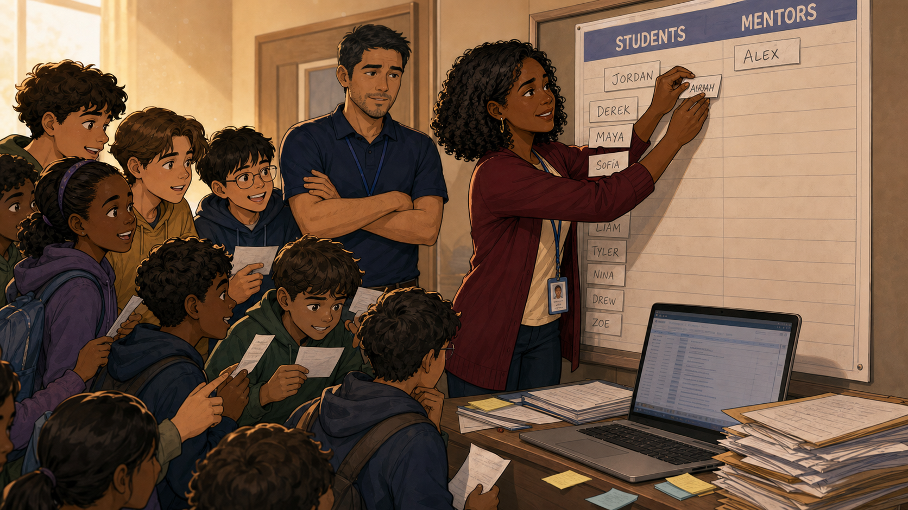
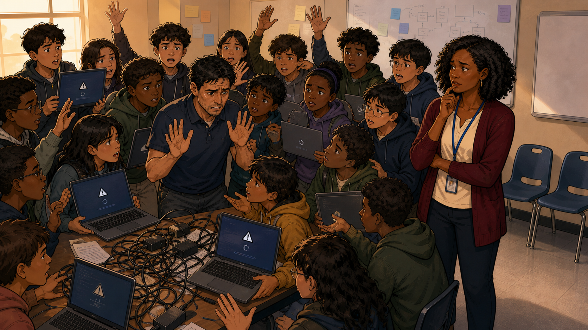
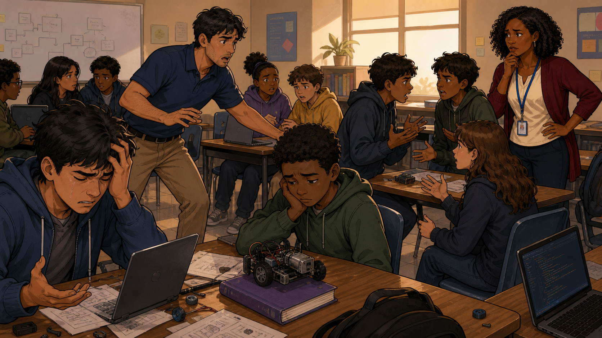
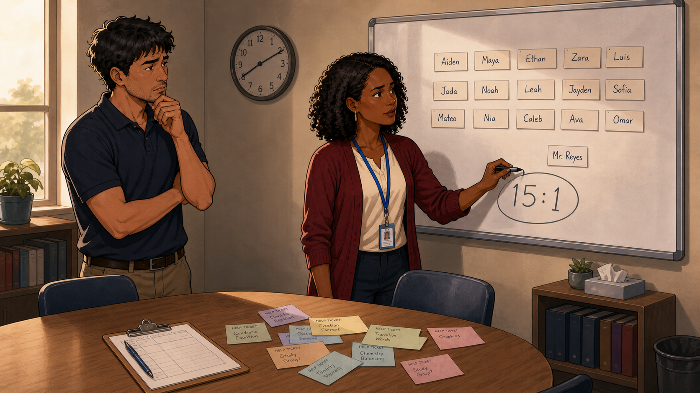
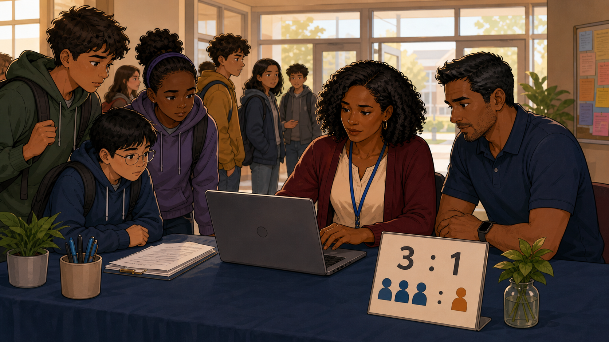

# The Empty Chair

Narrative Prompt

This is a fictional composite story, not a depiction of a specific
real club or a real named individual. "Renee" (club leader, dark
curly hair, maroon cardigan, blue lanyard) and "Alex Reyes" (mentor,
navy polo shirt) represent a pattern seen across many coding clubs:
enrollment growing faster than confirmed mentor sign-ups, until one
volunteer is stretched across far more students than any single
adult can safely supervise. Setting: a present-day, community-based
after-school coding club in the United States. Art style: warm,
contemporary educational-graphic-novel illustration, clean linework,
soft cel-shading, consistent character design and color palette
across all panels — Renee and Alex should be immediately recognizable
from panel to panel.

### Prologue – Growth Nobody Was Tracking

Renee had watched her coding club grow all semester, and growth felt
like nothing but good news — more students, more energy, more word of
mouth. She just hadn't been tracking one number closely enough: how
many confirmed mentors were actually showing up to match that growth.

## Panel 1: One Name in the Mentor Column

Renee stood at the sign-up board updating the "Students" column with
a growing list of names — Jordan, Derek, Maya, Sofia, Liam, Tyler,
Nina, Drew, Zoe — while students crowded around her waving their
registration slips. In the "Mentors" column, only one name was
written down so far: Alex. Nobody had noticed the two columns were
growing at completely different speeds.

## Panel 2: One Mentor, Fifteen Laptops

By the third session, Alex was the only confirmed mentor in a room of
fifteen students, and half the laptops were frozen on a login error
none of them could fix alone. Hands shot up from every direction at
once. Alex held both palms out, trying to calm a room he simply
could not reach fast enough by himself, while Renee watched from the
doorway with a knot forming in her stomach.

## Panel 3: The Chair Nobody Was Sitting In

By the middle of the session, one student had given up entirely,
head in his hands, tears on his face, his robot kit untouched beside
him. Alex was leaning across the room trying to referee an argument
between two other students, and Renee finally understood: this wasn't
a bad day. It was what happens every time one mentor is asked to do
the job of four.

## Panel 4: Fifteen to One

After the session, Renee and Alex sat down to figure out what had
actually gone wrong. She wrote fifteen student names on the board,
then a single card for "Mr. Reyes" beneath them, and circled the
number staring back at both of them: 15:1. It wasn't a bad night. It
was simple arithmetic that nobody had been watching.

## Panel 5: Three to One, No Exceptions

Renee rebuilt registration around one hard rule: three students for
every one confirmed mentor, no exceptions, enforced right at sign-up
instead of discovered mid-session. A small sign on the check-in table
made the new rule impossible to miss — three blue figures, one
orange figure, 3:1 — and every family walking in saw it before they
sat down.

## Panel 6: Building the Bench

A rule was only useful if there were enough mentors to keep it, so
Renee spent the next two weeks recruiting and training a real bench:
Lena, Diego, Maya, and Jordan sat around a table with a shared Mentor
Guide, folders of student profiles, and a hand-drawn map of who would
support whom. For the first time, the club had more confirmed
mentors waiting in reserve than sessions that needed them.

## Panel 7: A Room With Enough Chairs

The next session looked nothing like the one that had broken Alex.
Small clusters of two or three students worked calmly with a mentor
close enough to actually help, laptops stayed unstuck, and nobody's
robot kit sat untouched. Renee stood in the middle of the room,
arms relaxed for the first time in weeks, watching a ratio on paper
turn into a room that finally worked.

### Epilogue – The Number That Was Always the Real Curriculum

Renee had spent months designing lessons, kits, and challenge cards,
never once suspecting that the single biggest lever for whether any
of it worked was a ratio she wasn't tracking. The 3:1 rule didn't
make the lessons better. It made it possible for the lessons that
already existed to actually reach every student in the room.

| Challenge | How Renee Responded | Lesson for Today |
|-----------|------------------------|-------------------|
| Student enrollment grew faster than confirmed mentor sign-ups, unnoticed | Diagnosed the exact ratio (15:1) after a session went badly | A club can be growing and failing its students at the same time — track the mentor number, not just the student number |
| One mentor was left to supervise far more students than was safe or fair | Instituted a hard 3:1 ratio enforced at registration, not discovered mid-session | A ratio is only a real policy if it gates enrollment before the session, not after |
| A new ratio rule was useless without enough mentors to keep it | Actively recruited and trained a bench of new mentors before the next term | Fixing a ratio on paper means nothing without a pipeline of people to fill it |

### Call to Action

Before you promote your next session, count your confirmed mentors,
not just your excited sign-ups. If the ratio doesn't work on paper,
it won't work in the room — and the students who need the most help
will be the first ones to feel it.

---

*"It wasn't a bad night. It was arithmetic nobody was watching."*
—Renee, after the session

*"Three to one, no exceptions."*
—the rule posted at every registration table since

---

## References

1. [Wikipedia: Student–teacher ratio](https://en.wikipedia.org/wiki/Student%E2%80%93teacher_ratio) - Background on why supervision ratios affect learning outcomes
2. [Wikipedia: Mentorship](https://en.wikipedia.org/wiki/Mentorship) - The relationship model a coding club's ratio is designed to protect
3. [Wikipedia: Occupational burnout](https://en.wikipedia.org/wiki/Occupational_burnout) - What happens to volunteers stretched across too many students for too long
4. [STEM Classroom Administration](http://dmccreary.github.io/stem-classroom-admin/) - The companion textbook on managing classroom technology and supervision
5. [Wikipedia: CoderDojo](https://en.wikipedia.org/wiki/CoderDojo) - A global volunteer coding-club movement built on strict mentor-to-student supervision norms
