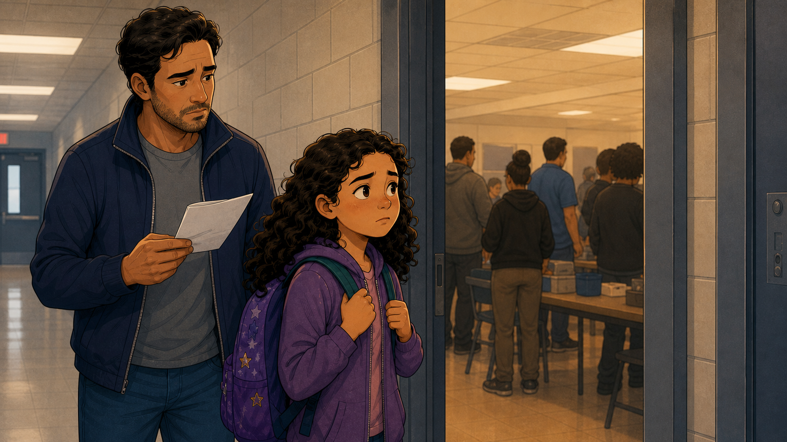
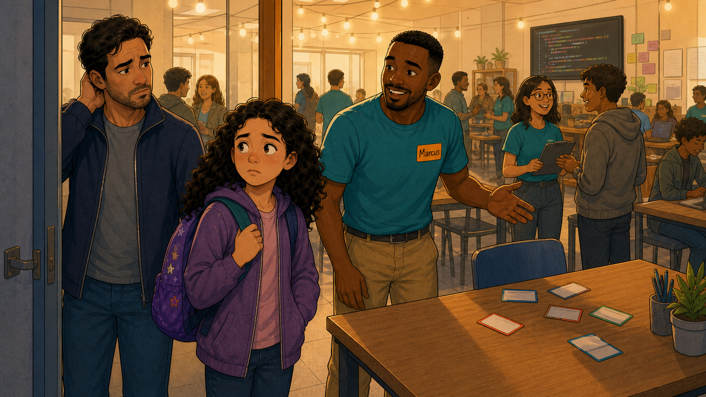
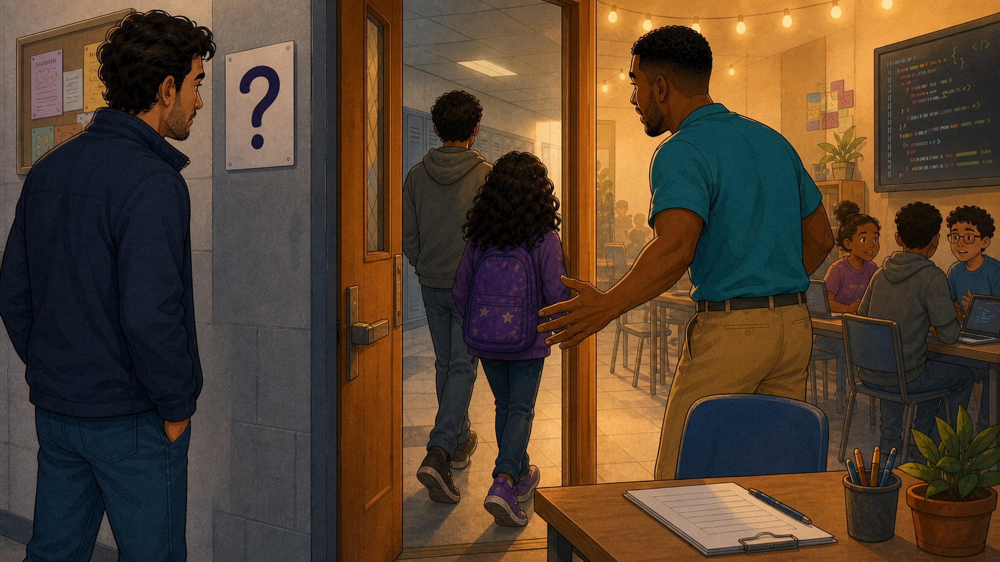
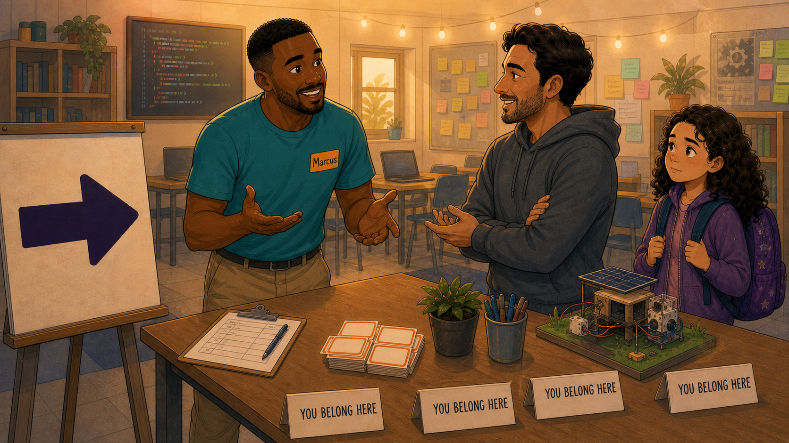
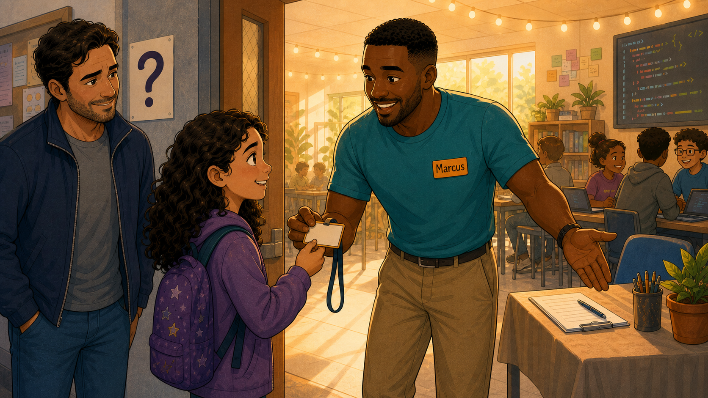
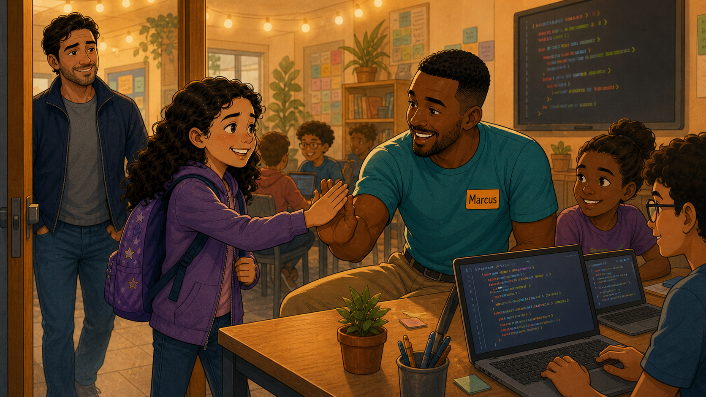

# First Steps Across the Threshold

Cover Image Prompt

(This is the Cover Image. Do not include this label in the image.)
Please generate a wide-landscape 16:9 cover image for this story in a
warm, contemporary educational-graphic-novel style with clean linework
and soft cel-shading. Split composition: on the left, in a plain gray
cinderblock hallway, Hector (a father in his late 30s, dark curly hair,
short beard, navy zip jacket) stands with one hand raised uncertainly
to the back of his head, next to his daughter Sofia (age 11, long dark
curly hair, purple hoodie, backpack covered in star patches), both
looking hesitant toward a doorway; a small laminated sign with a bare
question mark hangs on the wall beside them. On the right, spilling
warm golden light into the hallway, Marcus (a mentor in his late 20s,
short black hair, trimmed beard, teal T-shirt with an orange "Marcus"
name tag, khaki pants) leans through the doorway with one hand
extended in welcome, string lights and a code-covered screen glowing
behind him, other kids visible working at laptops. Title text "First
Steps Across the Threshold" rendered in a bold, friendly hand-lettered
typeface across the top. Color palette: cool grays and blues on the
hallway side transitioning to warm amber and gold on the classroom
side. Emotional tone: hesitation meeting welcome, the instant before a
decision is made. Generate the image immediately without asking
clarifying questions.

Narrative Prompt

This is a fictional composite story, not a depiction of a specific real
club, school, or real named individuals. Hector (father, dark curly
hair, short beard, navy zip jacket, gray T-shirt) and his daughter
Sofia (age 11, long dark curly hair, purple hoodie, star-patched purple
backpack) represent the many nervous first-time families who show up
to a coding club's very first Saturday of the term not knowing what to
expect. Marcus (club mentor, short black hair, trimmed beard, teal
T-shirt with an orange "Marcus" name tag, khaki pants) represents the
deliberate choice a club makes to station a warm, prepared greeter
right at the door. Setting: a present-day, mid-sized American coding
club meeting room, the opening Saturday of a new term. Art style: warm,
contemporary educational-graphic-novel illustration, clean linework,
soft cel-shading, consistent character design and color palette across
all panels — Hector, Sofia, and Marcus should be immediately
recognizable from panel to panel, and the transition from cool hallway
tones to warm classroom tones should track the family's growing sense
of welcome.

### Prologue – The Room on the Other Side of the Door

Every club believes its own hype: "all are welcome," the flyer says,
the website says, the enrollment form says. None of that matters in
the first sixty seconds a family spends standing in a hallway, staring
at a closed door, trying to guess whether "welcome" is actually true.
That is where Hector and his daughter Sofia were standing on the first
Saturday of the new term — and it was Marcus's job, whether he had
ever put it in those words or not, to make sure they did not decide
the answer was no.

## Panel 1: The Hallway Before the Decision

Image Prompt

(This is Panel 01. Do not include the panel number in the image.)
I am about to ask you to generate a series of images for a graphic
novel. Please make the images have a consistent style and consistent
characters. Do not ask any clarifying questions. Just generate the
image immediately when asked.

Please generate a 16:9 image in a warm, contemporary
educational-graphic-novel style depicting panel 1 of 6. The scene
should show Hector, a father in his late 30s with dark curly hair and
a short beard, wearing a navy zip jacket, standing in a plain
cinderblock school hallway holding a folded printed flyer, reading it
with a slightly worried expression, while his daughter Sofia, age 11,
long dark curly hair, purple hoodie, star-patched backpack held with
both straps, stands close beside him looking anxiously toward a
partly open door ahead. Through the doorway, a room is visible with
folding tables stacked with boxes and several adults and kids with
their backs turned, no obvious signage. Setting: present-day USA
school hallway, late afternoon, fluorescent lighting. Color palette:
cool grays and muted blues in the hallway, contrasting with a hazier,
uncertain warm glow from the room beyond. Emotional tone: hesitation,
uncertainty, the moment before deciding whether to go in. Six visual
details: the folded flyer in Hector's hand, Sofia's tight grip on her
backpack straps, an exit sign glowing in the background, a bulletin
board crowded with unrelated notices, the partly open door, the
unclear room beyond with backs turned to the hallway. Generate the
image immediately without asking clarifying questions.

Hector had printed the flyer three times, just to be sure he had the
right room number. Sofia had asked twice in the car if she could stay
home. Now they stood in a hallway that could have belonged to any
after-school program in the building, looking through a half-open door
at a room that gave them absolutely no reason to believe it was
looking back. Nobody had looked up. Nobody had said a word.

## Panel 2: Sixty Seconds at the Door

Image Prompt

(This is Panel 02. Do not include the panel number in the image.)
Please generate a 16:9 image in the same style depicting panel 2 of 6.
Make Hector and Sofia consistent with the prior panel, and introduce
Marcus for the first time. The scene should show Hector and Sofia at
the classroom doorway, Hector's hand raised uncertainly to the back of
his head, Sofia standing close to him looking anxious, while Marcus, a
mentor in his late 20s with short black hair, a trimmed beard, a teal
T-shirt with an orange "Marcus" name tag, and khaki pants, leans
through the doorway with one hand extended toward them in a warm
handshake gesture, a table in the foreground scattered with blank,
unlabeled name-tag cards. Behind Marcus, a bright classroom glows with
string lights, a wall screen showing colorful code, and other students
at desks. Setting: present-day USA classroom doorway, late afternoon.
Color palette: cool hallway tones on the left warming into golden
classroom light on the right. Emotional tone: the pivotal instant of
being noticed and greeted. Six visual details: Marcus's extended hand,
his orange name tag, the blank name-tag cards on the table, string
lights strung across the ceiling behind him, a wall screen glowing
with code, Hector's uncertain hand-to-head gesture. Generate the image
immediately without asking clarifying questions.

They had maybe ten more seconds before Hector would have said, quietly,
"maybe we come back another day." Instead, a hand appeared in the
doorway before either of them had finished deciding. "Hey — you must
be looking for us," Marcus said, already reaching out to shake
Hector's hand like he'd been standing there waiting just for them.
Nobody had to knock. Nobody had to guess.

## Panel 3: Not Alone at the Door

Image Prompt

(This is Panel 03. Do not include the panel number in the image.)
Please generate a 16:9 image in the same style depicting panel 3 of 6.
Make Hector, Sofia, and Marcus consistent with prior panels. The scene
should show a wider hallway view: Hector pausing near the small
laminated question-mark sign on the wall, watching as Sofia takes a
step through the doorway alongside another student, an unfamiliar boy
in a gray hoodie who walks in easily, backpack slung over one shoulder,
clearly a returning member who knows exactly where he's going. Marcus
is visible just inside, already turning toward them with his arm
extended, string lights and the code-covered wall screen glowing
behind him. Setting: present-day USA school hallway and doorway,
continuous with prior panels. Color palette: the cool hallway grays
now visibly giving way to warm gold light spilling from the doorway.
Emotional tone: reassurance found in not having to walk in alone. Six
visual details: the laminated question-mark sign on the wall, the
returning student's confident stride, Sofia's half-step forward, Marcus
already turning to greet them, the glowing doorway threshold, string
lights just visible inside. Generate the image immediately without
asking clarifying questions.

A boy Sofia had never met breezed past them through the same door,
backpack over one shoulder, clearly not thinking twice about it. That,
more than anything, told her something: whatever this room was, other
kids walked into it without fear. Hector lingered a beat longer by the
little question-mark sign on the wall, but Marcus was already turning
toward them both, arm out, like the doorway itself had been designed
so nobody had to cross it alone.

## Panel 4: The Welcome Table

Image Prompt

(This is Panel 04. Do not include the panel number in the image.)
Please generate a 16:9 image in the same style depicting panel 4 of 6.
Make Marcus and Hector consistent with prior panels, and show Sofia to
the side. The scene should show Marcus standing at a welcome table
inside the classroom, gesturing with open hands as he explains
something to Hector, who stands with arms loosely crossed, listening
and starting to relax. On the table: a sign-in clipboard, a small cup
of pens, a potted plant, and a row of table-tent signs reading "YOU
BELONG HERE." Beside the table, Sofia leans in with curiosity toward a
small hands-on demonstration project — a miniature solar-powered
model with wires and a small solar panel. An easel behind Marcus holds
a large arrow sign pointing further into the room, and a bulletin wall
behind them is covered in colorful sticky notes. Setting: present-day
USA classroom, continuous scene, warm interior lighting with string
lights overhead. Color palette: warm ambers and golds, the "YOU BELONG
HERE" signs as a clear visual focus. Emotional tone: orientation,
curiosity, tension easing into interest. Six visual details: the row
of "YOU BELONG HERE" table tents, the sign-in clipboard, the arrow sign
on the easel, Sofia examining the solar-powered demo model, the sticky
note bulletin wall, string lights overhead. Generate the image
immediately without asking clarifying questions.

Marcus walked Hector through the sign-in sheet in under a minute — no
forms to fill out standing up, no fine print, just his name and a
phone number. While they talked, Sofia drifted toward a little
solar-powered model humming quietly on the table, close enough to
touch. Nobody told her not to. And lined up along the table's edge, in
plain block letters, were four small signs that said the same thing
four times: *you belong here.*

## Panel 5: A Name Tag of Her Own

Image Prompt

(This is Panel 05. Do not include the panel number in the image.)
Please generate a 16:9 image in the same style depicting panel 5 of 6.
Make Hector, Sofia, and Marcus consistent with prior panels. The scene
should show Marcus crouching slightly to Sofia's height just inside the
doorway, handing her a name tag on a lanyard, both of them smiling,
Sofia reaching up to take it with both hands. Hector stands just
behind Sofia, relaxed now, smiling with visible relief, one hand
resting loosely in his pocket. Behind them, the classroom continues
with other students at laptops and the code-covered wall screen
glowing warmly. Setting: present-day USA classroom entrance, continuous
scene. Color palette: warm golds and ambers throughout, no more cool
hallway tones visible. Emotional tone: a small ceremony of belonging,
relief, quiet joy. Six visual details: the lanyard name tag being
handed over, Sofia's two-handed reach, Hector's relaxed posture and
relieved smile, the glowing wall screen in the background, other
students at laptops behind them, the classroom's string lights.
Generate the image immediately without asking clarifying questions.

Marcus crouched down slightly so he was talking to Sofia and not over
her head, and handed her a name tag on a lanyard — blank until she
wrote her own name on it, which she did on the spot, pressing hard
with the marker like she wanted it to count. Behind her, Hector let
out a breath he hadn't realized he'd been holding. Whatever this club
was, it had just told his daughter, in the smallest possible gesture,
that she was expected.

## Panel 6: Already One of Them

Image Prompt

(This is Panel 06. Do not include the panel number in the image.)
Please generate a 16:9 image in the same style depicting panel 6 of 6.
Make Hector, Sofia, and Marcus consistent with prior panels, a joyful
closing shot. The scene should show Sofia, now fully inside the
classroom, giving Marcus an enthusiastic high-five, both grinning
widely, her new name tag visible on its lanyard. Beside them, two other
students, a girl with her hair in a bun and a boy with glasses, look up
from their laptops smiling, code visible on their screens and on the
large wall display behind. In the background, near the doorway, Hector
watches with a warm, proud smile, entirely at ease now. Setting: present-
day USA classroom, continuous scene, warm interior lighting. Color
palette: fully warm ambers, golds, and soft classroom light, no
remaining cool tones. Emotional tone: joy, belonging, arrival complete.
Six visual details: the high-five between Sofia and Marcus, Sofia's
name tag on its lanyard, the two other students smiling up from their
laptops, the code-covered wall screen, Hector's proud smile from the
doorway, string lights glowing overhead. Generate the image immediately
without asking clarifying questions.

Ten minutes earlier, Sofia had been ready to turn around in a hallway.
Now she was laughing, slapping palms with Marcus like she'd known him
for months, her new name tag swinging on its lanyard while two other
kids waved her over to see what was on their screens. Hector watched
from just inside the door, arms uncrossed, no longer a nervous parent
guarding the threshold — just a dad who was going to have a very hard
time getting his daughter to leave when the session ended.

### Epilogue – The Sixty Seconds That Decide Everything

Nothing about that welcome cost the club much: a folding table, four
hand-lettered signs, a stack of blank lanyards, and one mentor whose
whole job for the first few minutes of the session was to stand near
the door instead of at a workstation. What it bought in return was a
family who almost turned around in a hallway and instead became
regulars. The walk-in experience is not a nice-to-have around the edges
of a coding club's real work — for a nervous first-timer, it *is* the
first lesson the club teaches, before a single line of code gets
written.

| Challenge | How the Club Responded | Lesson for Today |
|-----------|------------------------|-------------------|
| From the hallway, the meeting room looked like any generic room — nothing said "you're in the right place" | Stationed a mentor at the door itself, greeting arrivals within seconds of their appearing in the doorway | The first face a newcomer sees decides more than any flyer, website, or enrollment form ever will |
| Hector was every bit as uncertain as Sofia, but stood quietly off to the side while she was expected to decide | Marcus greeted and spoke with Hector directly, not only the child who had signed up | Design the welcome for the whole family standing in the doorway, not just the student on the roster |
| A newcomer had no quick way to tell whether this club was actually meant for someone like her | Set out a welcome table with plain "You Belong Here" signs and a hands-on project she could touch immediately | A concrete, physical welcome statement works faster than any mission statement posted on a wall |
| Once inside, nothing distinguished a first-timer from the returning regulars already at their laptops | Handed Sofia a name tag at the door, filled in by her own hand before she took a single step further | A five-second name-tag ritual is a cheap, reliable way to turn "guest" into "member" |

### Call to Action

Walk your own club's entrance the way a nervous eleven-year-old would:
stand in the hallway, look through the door, and count how many
seconds pass before someone looks up. If the answer is more than a
few, station someone at that door on the very first day of term, make
a name tag ready before anyone asks for one, and say hello to the
parent as warmly as you say it to the student. The lesson plans can
wait a minute. The doorway can't.

---

*"I wasn't sure this was even the right room."*
—Sofia, in the hallway

*"The sign on the table already said it before I did — you belong
here."*
—Marcus, at the welcome table

*"I didn't realize how much we both needed someone to just say hello
first."*
—Hector, watching from the doorway

---

## References

1. [Wikipedia: First impression (psychology)](https://en.wikipedia.org/wiki/First_impression_(psychology)) - Background on how quickly people form lasting judgments about a new environment or the people in it
2. [Wikipedia: Belongingness](https://en.wikipedia.org/wiki/Belongingness) - The psychological need to be an accepted member of a group, and its effect on wellbeing and persistence
3. [Wikipedia: Stereotype threat](https://en.wikipedia.org/wiki/Stereotype_threat) - How belonging cues at the moment of entry affect whether underrepresented students persist in STEM settings
4. [Wikipedia: CoderDojo](https://en.wikipedia.org/wiki/CoderDojo) - A real global movement of free, volunteer-led coding clubs for young people, the kind of organization this story's fictional club represents
5. [PubMed: Walton & Cohen (2011), "A brief social-belonging intervention improves academic and health outcomes of minority students"](https://pubmed.ncbi.nlm.nih.gov/21415354/) - The landmark study showing how a short, deliberate belonging message measurably changes whether newcomers persist
