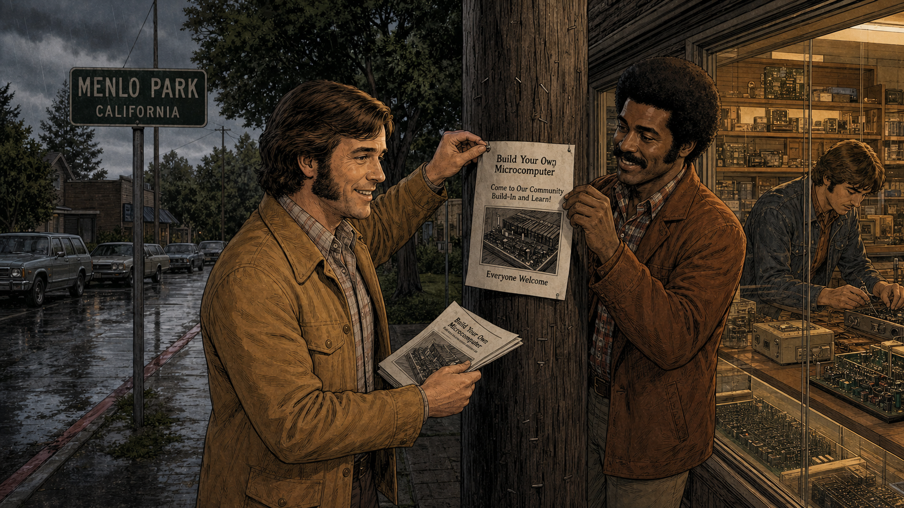
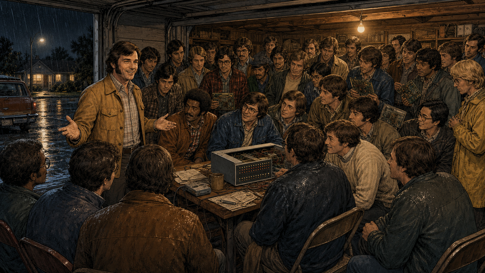
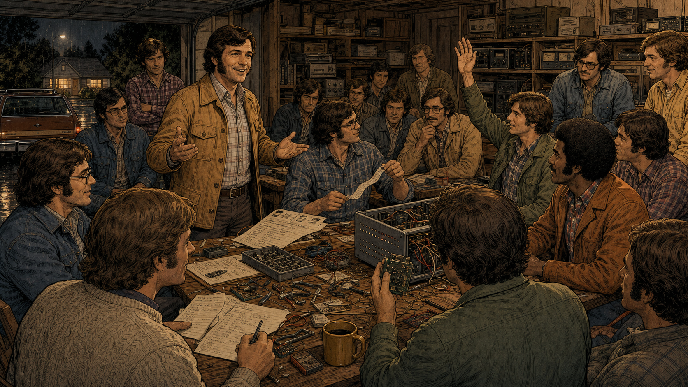
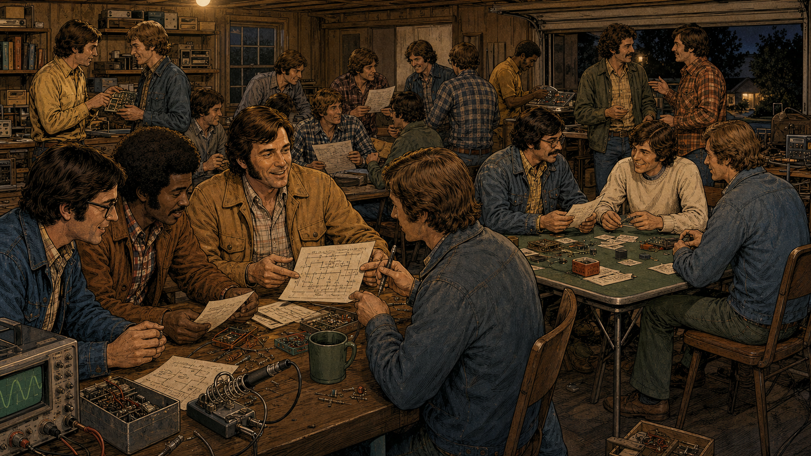
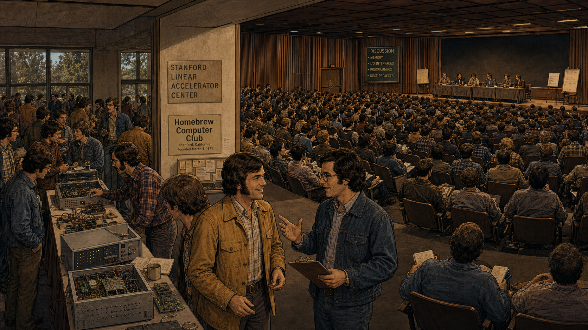
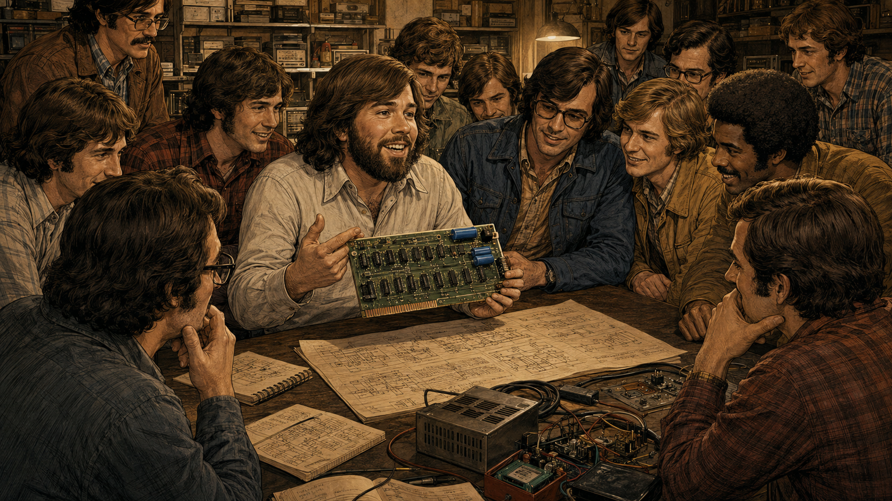
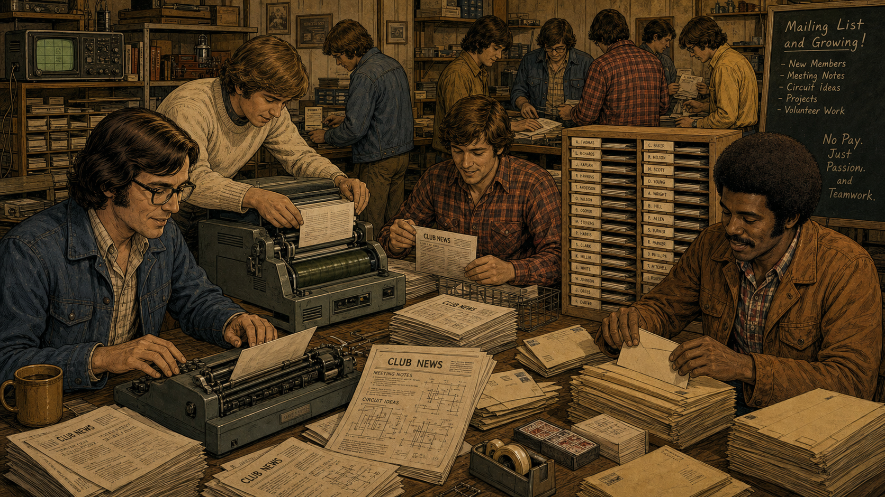
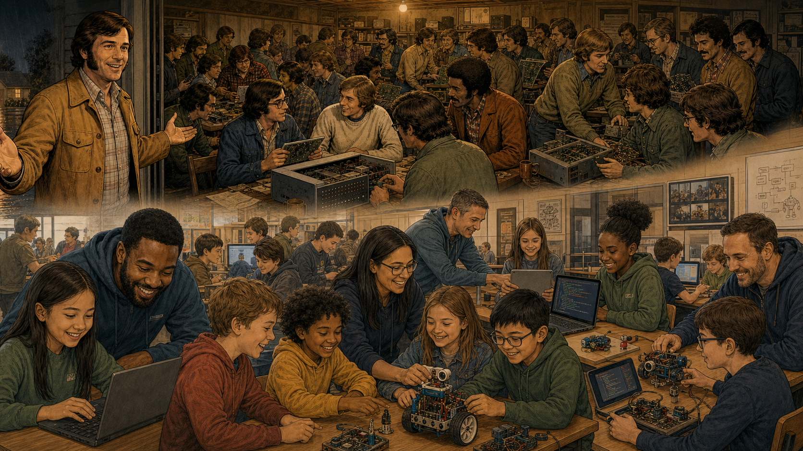

# The Garage Where Everyone Was Welcome

Cover Image Prompt

(This is the Cover Image. Do not include this label in the image.)
Please generate a wide-landscape 16:9 cover image in a warm, detailed
1970s-realist graphic-novel style with fine linework and cinematic
lighting. Scene: a rainy night in March 1975 in Menlo Park, California.
A two-car garage door stands open, spilling warm amber light onto a wet
driveway. In the foreground, a smiling man in his thirties (Gordon
French — wavy brown hair, tan corduroy jacket over a plaid shirt)
stands with both arms open in welcome, addressing the viewer as if
greeting new arrivals. Behind him, roughly thirty hobbyists of mixed
ages and backgrounds — flannel shirts, denim jackets, sweaters — crowd
around homemade workbenches. On the nearest table sits a metal-cased
computer with a front panel of toggle switches and small glowing
lights, alongside circuit boards, hand-drawn schematics, and a coffee
mug. A wood-paneled station wagon is parked on the glistening street
under a streetlamp; a modest ranch house glows softly in the
background. Rain falls in visible sheets against the dark sky. Bold
cream-colored vintage serif title text reads "The Garage Where
Everyone Was Welcome" in the upper left. Color palette: deep indigo
and charcoal for the rainy exterior, contrasted with warm amber and
gold for the crowded interior. Emotional tone: quiet excitement,
generosity, the feeling of something historic beginning without
anyone quite knowing it yet. Generate the image immediately without
asking clarifying questions.

Narrative Prompt

This is a dramatized retelling of a real historical event: the founding
of the Homebrew Computer Club in Gordon French's garage in Menlo Park,
California, on March 5, 1975, and its growth through the club's move
to the Stanford Linear Accelerator Center (SLAC) auditorium and its
eventual close in December 1986. Era: mid-1970s to mid-1980s Silicon
Valley, United States. Art style: warm, detailed 1970s-realist graphic
novel illustration with fine linework and period-accurate clothing,
technology, and typography, consistent across all panels. Character
consistency note: the recurring man in the tan corduroy jacket
represents Gordon French across panels 1, 2, 5, and 8; he should keep
the same hair, build, and jacket throughout. Creative liberties: the
dozens of hobbyists filling each panel are artistic composites standing
in for the real, undocumented individuals who attended — they are not
claimed as likenesses of specific named members except where the
narrative text identifies someone by name. The recruitment flyer shown
in Panel 1 ("Build Your Own Microcomputer... Everyone Welcome") is a
stylized recreation capturing the spirit of Fred Moore's real 1975
invitation; Moore's actual, verifiable flyer wording is quoted directly
in the Panel 1 narrative text and in the Quotes section below, not
copied into the image. Panel 6's young hobbyist holding up a circuit
board is a representative depiction of the well-documented practice of
Steve Wozniak bringing his hand-wired boards to Homebrew meetings; the
illustration is not asserted to be a verified likeness. Note on ages:
Wozniak (born 1950) was 24 and already a Hewlett-Packard engineer when
he joined Homebrew in 1975, and Steve Jobs (born 1955) was 20 — both
young adults, not teenagers, contrary to some popular retellings.

### Prologue – A Club With No Boss

No one owned the Homebrew Computer Club. It had no headquarters, no
paid staff, no application form, and no entrance fee — just a mailing
list, a rotating cast of volunteers, and a standing invitation for
anyone curious enough to show up. Between 1975 and 1986, the loose
band of hobbyists who gathered under that name helped launch more than
twenty companies, including Apple Computer, and quietly rewrote the
rules for who was allowed to build a computer. Every free, all-welcome
coding club that meets today in a school library or community center
is, in a very real sense, still standing in that garage.

## Panel 1: Everyone Welcome

Image Prompt

(This is Panel 01. Do not include the panel number in the image.)
I am about to ask you to generate a series of images for a graphic
novel. Please make the images have a consistent style and consistent
characters. Do not ask any clarifying questions. Just generate the
image immediately when asked.

Please generate a 16:9 image in a warm 1970s-realist graphic-novel
style depicting panel 1 of 8. The scene shows a rainy evening street
in Menlo Park, California, with a green "MENLO PARK / CALIFORNIA" road
sign visible in the background. Two men stand at a wooden telephone
pole outside a lit electronics-surplus shop window: on the left, a
smiling man in his thirties with wavy brown hair and a tan corduroy
jacket (Gordon French) holds a stack of flyers; on the right, a man
with a full afro and a brown corduroy jacket pins a flyer to the pole
that reads "Build Your Own Microcomputer / Come to Our Community
Build-In and Learn! / Everyone Welcome" above a small line drawing of
a circuit board. Through the shop window behind them, a third young
man works alone at a workbench cluttered with surplus radio parts.
Setting: Menlo Park, California, early 1975, evening rain. Color
palette: wet-street blues and grays outside, warm amber light spilling
from the shop window. Emotional tone: hopeful, communal, inviting.
Six visual details: the "Menlo Park, California" road sign, rain
streaking the pavement, parked cars with visible taillights, the
hand-lettered flyer text, a hammer or thumbtack mid-motion, shelves of
radio equipment visible through the shop glass. Generate the image
immediately without asking clarifying questions.

Fred Moore and Gordon French did not have money to advertise, so they
made do with a stack of hand-typed flyers and a fistful of thumbtacks.
Moore's real invitation, copied about a hundred times and nailed to
poles and shop windows around Menlo Park, asked a simple question that
any hobbyist tinkering alone in a garage would recognize instantly:
"Are you building your own computer? Terminal? TV typewriter? I/O
device?" It did not ask what school anyone attended, what company they
worked for, or how much they already knew — only whether they were
curious.

## Panel 2: Thirty Strangers in a Garage

Image Prompt

(This is Panel 02. Do not include the panel number in the image.)
Please generate a 16:9 image in the same style depicting panel 2 of 8.
Keep Gordon French consistent with panel 1. The scene shows the open
garage door of a modest ranch house on a rainy night, warm bulb light
spilling out onto the driveway where a wood-paneled station wagon is
parked. Gordon French stands just inside the doorway with both arms
open, welcoming a packed crowd of roughly thirty hobbyists of mixed
ages already gathered around a long workbench. On the table sits a
metal-cased computer with a front panel of toggle switches and small
lit indicator lights, surrounded by tools, notebooks, and a coffee
mug. Garage shelving behind the crowd is stacked with ham-radio gear
and equipment boxes. Setting: Menlo Park, California, the night of
March 5, 1975. Color palette: cool rainy blue-black outside, warm
amber and gold light inside. Emotional tone: anticipation, warmth, a
history-making ordinariness. Six visual details: the switch-and-light
front panel of the computer, the rain visible through the open door,
the parked station wagon, crowded folding chairs, hand-drawn notes on
the table, shelves of vintage electronics. Generate the image
immediately without asking clarifying questions.

On the night of March 5, 1975, about thirty strangers filed into
Gordon French's garage because a shipment of a new build-it-yourself
kit computer, the MITS Altair 8800, had just reached the Bay Area for
review by the People's Computer Company. Nobody in that garage was
paid to be there, and nobody had to prove they belonged. Engineers
stood shoulder to shoulder with students and retirees, all staring at
the same blinking front panel, all equally new to the idea that a
computer could sit on a kitchen table instead of filling a corporate
basement. By the end of the night they had a name for themselves —
the Homebrew Computer Club — and a habit of meeting every two weeks
that would outlast the decade.

## Panel 3: No Gatekeepers

Image Prompt

(This is Panel 03. Do not include the panel number in the image.)
Please generate a 16:9 image in the same style depicting panel 3 of 8.
Keep Gordon French and the setting consistent with panel 2. The scene
shows the same crowded garage, now even fuller, with Gordon French
mid-sentence, hands gesturing as he explains something to the group.
In the middle of the crowd, one man in a green jacket raises his hand
eagerly with a question, while another nearby holds up a thin strip of
printed paper tape for others to see. The workbench in front of them
is covered with tools, a coffee mug, hand-drawn notes, and an open
computer chassis with visible wiring. Setting: same Menlo Park garage,
same rainy night, packed even tighter than before. Color palette: same
warm amber interior against the dark rainy exterior glimpsed through
the doorway. Emotional tone: eager participation, informality, nobody
waiting to be called on. Six visual details: the raised hand, the
strip of paper tape, the open chassis with wiring, scattered hand
tools, a spiral notebook full of notes, the crowd pressing in close
around the table. Generate the image immediately without asking
clarifying questions.

There was no professor at the front of the room and no syllabus taped
to the wall. Questions flew the moment someone had one, and answers
came from whoever in the crowd happened to know — sometimes a
Stanford-trained engineer, sometimes a teenager who had only read
about transistors in a library book. That first meeting ran long
because nobody wanted to leave, and by the time French finally sent
everyone home, the group had already agreed to meet again in two
weeks.

## Panel 4: Splitting Into Study Groups

Image Prompt

(This is Panel 04. Do not include the panel number in the image.)
Please generate a 16:9 image in the same style depicting panel 4 of 8.
Keep the characters and garage setting consistent with prior panels.
The scene shows the same garage, now organized into two informal
clusters at separate tables. In the foreground, a small group huddles
over a hand-drawn schematic spread across the table, next to an
oscilloscope showing a glowing waveform and a soldering iron resting
in its stand. Slightly behind them at a card table, another cluster of
members trades small circuit boards and parts, one holding a green
circuit board up to the light. Shelves of ham-radio equipment and
books line the walls; the open garage door shows the rainy street
outside. Setting: same Menlo Park garage, later the same evening.
Color palette: warm lamp light with the cool blue glow of the
oscilloscope screen as an accent. Emotional tone: focused
collaboration, self-organized learning. Six visual details: the
oscilloscope waveform, the soldering iron, the hand-drawn schematic,
the card table of traded parts, a stack of reference books, the rainy
street through the doorway. Generate the image immediately without
asking clarifying questions.

Within an hour, the single crowd had split itself into smaller
clusters without anyone assigning the groups. One table traced a
schematic line by line under the blue glow of a borrowed oscilloscope;
another swapped spare parts and finished boards like kids trading
baseball cards. This was the club's real invention — not any single
piece of hardware, but a working model of how strangers with different
skill levels could teach each other for free, simply by standing close
enough to watch.

## Panel 5: Outgrowing the Garage

Image Prompt

(This is Panel 05. Do not include the panel number in the image.)
Please generate a 16:9 image in the same style depicting panel 5 of 8.
Keep Gordon French consistent with prior panels. The scene shows a
large modern auditorium lobby with a wall sign reading "STANFORD
LINEAR ACCELERATOR CENTER" above a smaller plaque reading "Homebrew
Computer Club / Stanford, California / Founded March 5, 1975." Through
an open doorway, hundreds of attendees fill rows of auditorium seats
facing a stage where a panel of members sits at a long table beneath a
sign reading "DISCUSSION: Memory, I/O Interfaces, Programming, Next
Projects." In the foreground lobby, Gordon French, now with faint
touches of gray, talks with a member holding a clipboard, near a table
of homemade equipment. Setting: Stanford Linear Accelerator Center,
Menlo Park, California, the club's later, larger meetings. Color
palette: institutional warm wood tones and daylight through tall
windows, contrasted with the club's homemade electronics on display.
Emotional tone: pride at how far the club has grown, still informal
despite the size. Six visual details: the SLAC wall sign, the founding
plaque with the date, the crowded auditorium seating, the discussion
topics sign on stage, the clipboard, the display table of homemade
gear. Generate the image immediately without asking clarifying
questions.

A single garage could hold thirty people, not the hundreds who wanted
in. The club moved first to a nearby school and then to the Stanford
Linear Accelerator Center's own auditorium, where semi-monthly
meetings routinely drew hundreds of members and the mailing list grew
past fifteen hundred names within two years. The venue changed, but
the rule stayed the same: anyone who showed up even once counted as a
member, no dues required.

## Panel 6: A Board Worth Sharing

Image Prompt

(This is Panel 06. Do not include the panel number in the image.)
Please generate a 16:9 image in the same style depicting panel 6 of 8.
Keep the club members' clothing and the overall visual style consistent
with prior panels. The scene shows a close, warmly lit gathering: a
young engineer in his mid-twenties holds up a green circuit board dense
with chips and two blue capacitors, explaining it with visible
enthusiasm to roughly a dozen fellow club members packed elbow to
elbow around a table covered in hand-drawn schematics, a power supply,
and scattered tools. Every face in the semicircle is turned toward the
board, several leaning in for a closer look. Shelves of radios and
electronics fill the background under a single hanging lamp. Setting:
a Homebrew Computer Club meeting, mid-1970s. Color palette: warm amber
lamplight, the green circuit board as the visual focal point. Emotional
tone: shared excitement over a genuinely new idea. Six visual details:
the populated circuit board, the two visible capacitors, the
semicircle of leaning-in faces, the hand-drawn schematics on the
table, the power supply with visible cables, the single overhead lamp.
Generate the image immediately without asking clarifying questions.

Among the regulars who kept coming back was a young Hewlett-Packard
engineer named Steve Wozniak, only twenty-four years old and still too
shy to speak up during meetings. Instead he communicated the way the
club understood best: by building something and holding it up. Night
after night he carried in his latest hand-wired board, and it was at
Homebrew, showing that work to a circle of fellow hobbyists rather
than to any investor, that the machine which became the Apple I first
took shape. "If there was no Homebrew Computer Club," Wozniak would
say years later, "there would probably be no Apple Computer."

## Panel 7: No Pay, Just Passion

Image Prompt

(This is Panel 07. Do not include the panel number in the image.)
Please generate a 16:9 image in the same style depicting panel 7 of 8.
Keep the club members consistent with prior panels. The scene shows a
cluttered workroom table where volunteers produce a newsletter titled
"CLUB NEWS." One member types a stencil on a manual typewriter; another
feeds pages through a hand-cranked mimeograph duplicator; a third sorts
finished newsletter sheets into stacks; a fourth, seated at right,
files envelopes into a wooden card-catalog wall of cubbies labeled
with members' surnames. A chalkboard on the right reads "Mailing List
and Growing! – New Members – Meeting Notes – Circuit Ideas – Projects
– Volunteer Work" followed by "No Pay. Just Passion. and Teamwork."
An oscilloscope and shelves of parts bins line the left wall. Setting:
a Homebrew Computer Club workroom, mid-1970s. Color palette: sepia-warm
paper and wood tones lit by a single overhead bulb. Emotional tone:
quiet, dedicated, unglamorous labor done gladly. Six visual details:
the mimeograph duplicator, the typewriter with a stencil loaded, the
stacked "Club News" sheets, the labeled card-catalog wall, the
chalkboard text, the coffee mug on the table. Generate the image
immediately without asking clarifying questions.

Somebody still had to write down what got discussed, and that job
fell to volunteers too. The club's newsletter, typed on stencils and
run off on a hand-cranked mimeograph, carried meeting notes and
circuit ideas to members who could not make it in person, growing to
twenty-one issues before it stopped in 1977. Founding member Fred
Moore had one rule for anyone who took something useful from the
club: "bring back more than you take." The newsletter, stuffed
envelope by envelope by people who were never paid a cent, was that
rule in action.

## Panel 8: The Garage That Never Really Closed

Image Prompt

(This is Panel 08. Do not include the panel number in the image.)
Please generate a 16:9 image in the same style depicting panel 8 of 8,
composed as a split diptych. The top half recreates the historic
Homebrew Computer Club: Gordon French welcoming a crowd on the left,
and on the right a packed workbench scene of members examining an open
computer chassis together, matching the visual style, clothing, and
lighting of earlier panels exactly. The bottom half, in the same warm
illustrative style but modern lighting and setting, shows a sunlit
classroom or makerspace where a diverse group of children of different
genders and ethnicities work alongside adult mentors at tables,
building small robots and writing code on laptops, mirroring the same
collaborative, shoulder-to-shoulder posture as the scene above them.
Setting: top half, Menlo Park, California, 1975; bottom half, a
present-day coding club classroom. Color palette: warm amber-sepia
tones on top transitioning to brighter, cooler daylight tones below,
visually linking the two eras. Emotional tone: continuity, legacy, an
unbroken thread of volunteer teaching. Six visual details: French's
welcoming gesture echoed by a mentor's gesture below, matching
huddled-around-a-table poses in both halves, a laptop screen showing
code in the bottom half, a small wheeled robot on a table below, shelf
clutter above mirrored by shelf/poster clutter below, the same warm
color of light bridging both scenes. Generate the image immediately
without asking clarifying questions.

The Homebrew Computer Club held its last meeting in December 1986,
more than a decade after that first rainy night, but the model it
proved never went away. Every coding club that opens its doors to
beginners and experts alike, charges no admission, and trusts members
to teach each other is running the same experiment Gordon French and
Fred Moore started with a stack of flyers and a two-car garage — and
it is still producing the same result.

### Epilogue – What Made Homebrew Different?

Homebrew never had a curriculum, a budget, or a single person in
charge, and that turned out to be exactly its advantage. Because
nobody owned the club, nobody could be excluded from it; because
nobody was paid, everyone who stayed was there for the same reason —
genuine curiosity. That same combination of open doors and volunteer
energy is what every coding club in this book is built to recreate,
at a much smaller and more manageable scale than an auditorium full of
future industry founders.

| Challenge | How Homebrew Responded | Lesson for Today |
|-----------|--------------------------|-------------------|
| No budget, no venue, no institutional backing | Met in a member's garage, then borrowed space from a school and a research lab | A coding club needs a room and a regular time far more than it needs money |
| Members ranged from total beginners to working engineers | Let anyone teach and anyone ask, with no formal instructor role | Peer teaching works across wildly different skill levels when nobody is gatekeeping |
| Interest exploded faster than any one meeting could hold | Split naturally into smaller groups and eventually moved to a bigger auditorium | Growth is a good problem — plan to split into smaller groups rather than turning people away |
| Keeping hundreds of scattered members informed for free | Volunteers wrote, printed, and mailed their own newsletter | A club's documentation and communication are as valuable as its projects, and they can be run entirely by volunteers |

### Call to Action

You do not need a corporate sponsor, a fancy lab, or a famous founder
to start something that matters — Homebrew started with a folding
table and a shared willingness to explain things twice. Open your
club's doors the way Gordon French opened his garage door: to anyone
curious enough to walk in, regardless of what they already know.

---

*"Are you building your own computer? Terminal? TV typewriter? I/O
device?"*
—Fred Moore, in his original 1975 invitation to the first meeting

*"The Homebrew Computer Club was the highlight of my life. I was too
shy to ever talk in the club meeting, but the way that I could
communicate sometimes was by doing good designs."*
—Steve Wozniak

*"Bring back more than you take."*
—Fred Moore, describing the club's expected ethic of reciprocity

---

## References

1. [Wikipedia: Homebrew Computer Club](https://en.wikipedia.org/wiki/Homebrew_Computer_Club) - Full history of the club's founding, meetings, membership, and influence on Silicon Valley
2. [Wikipedia: Altair 8800](https://en.wikipedia.org/wiki/Altair_8800) - The build-it-yourself kit computer whose arrival prompted the club's first meeting
3. [Wikipedia: Steve Wozniak](https://en.wikipedia.org/wiki/Steve_Wozniak) - Biography of the club's most famous alumnus and co-founder of Apple Computer
4. [Computer History Museum: The Homebrew Computer Club](https://www.computerhistory.org/revolution/personal-computers/17/312) - Museum exhibit history of the club's origins, growth, and role in launching the personal computer industry
5. [Encyclopaedia Britannica: Steve Wozniak](https://www.britannica.com/biography/Stephen-Gary-Wozniak) - Curated biographical overview of Wozniak's work at Hewlett-Packard, Homebrew, and Apple
