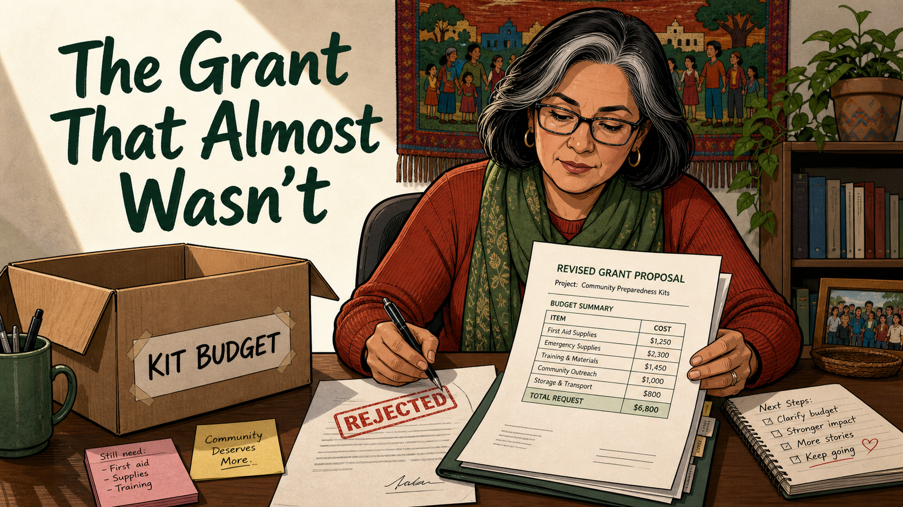
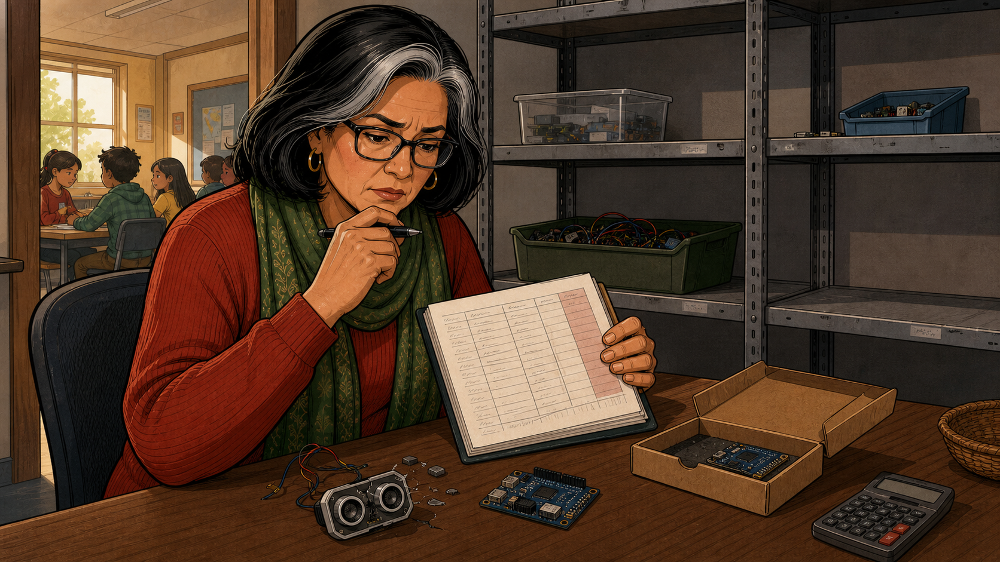
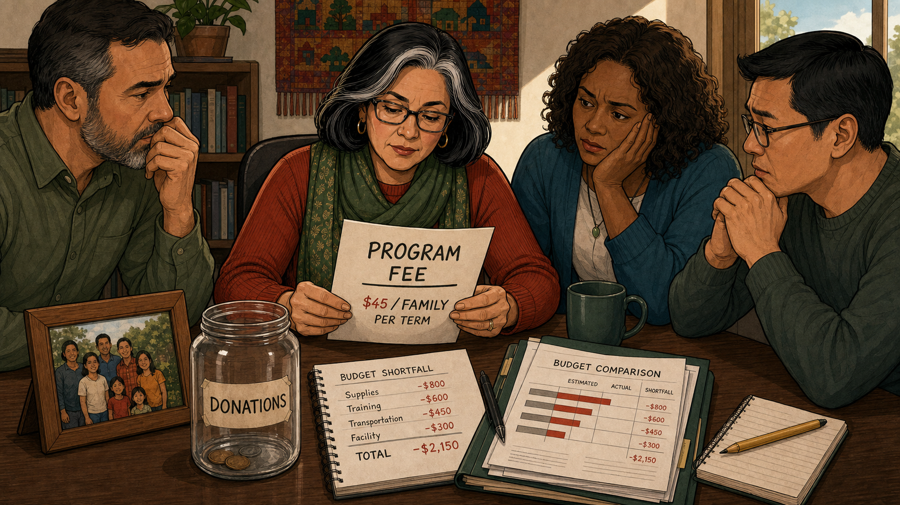
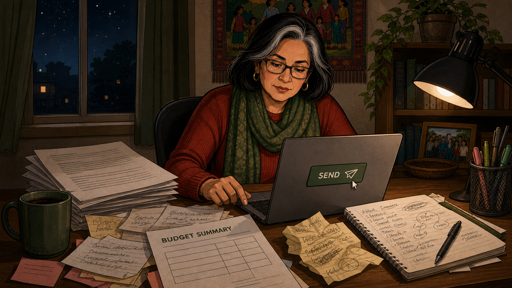
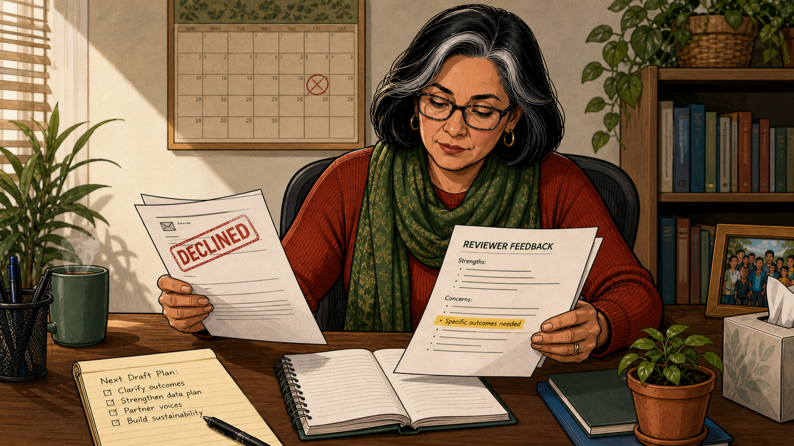
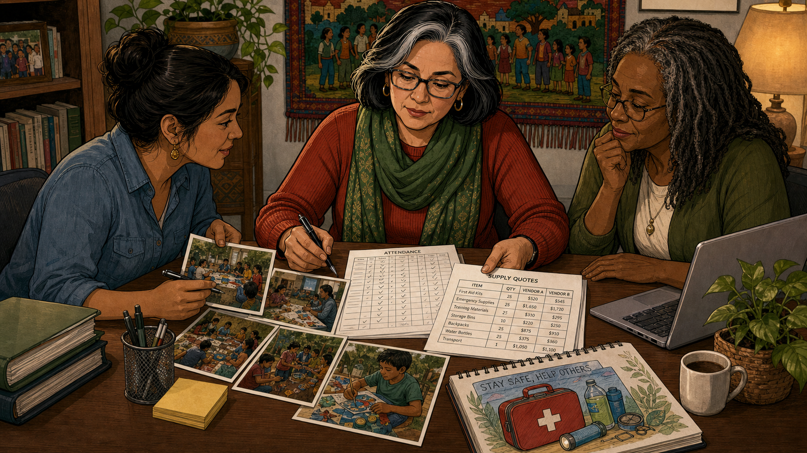
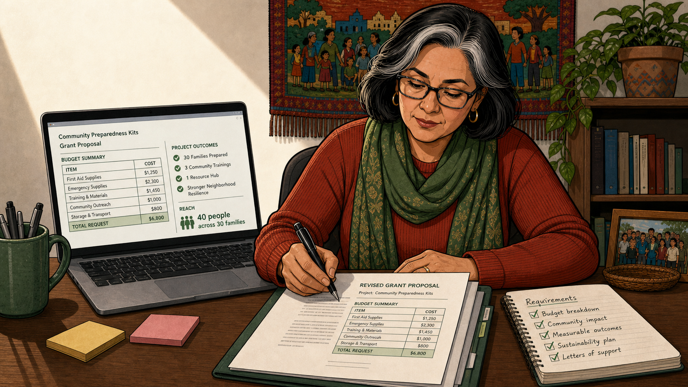
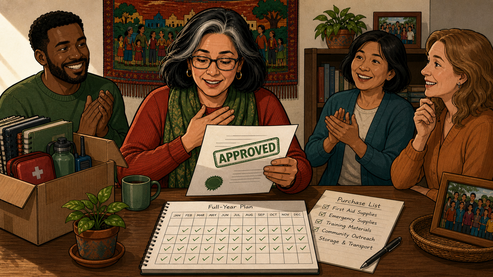
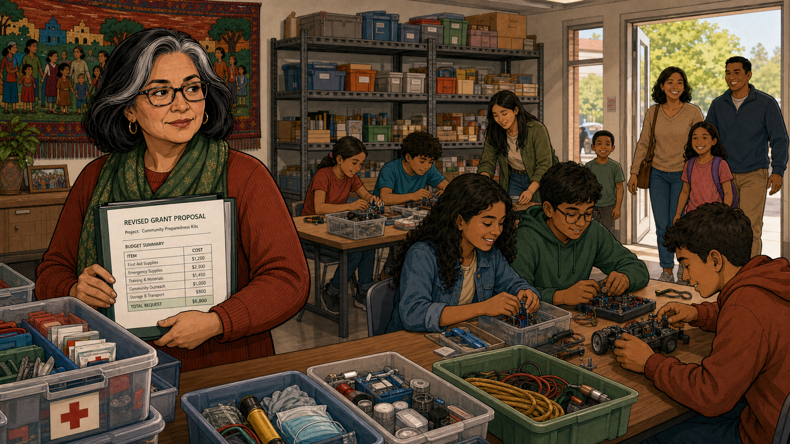

# The Grant That Almost Wasn't

Cover Image Prompt

(This is the Cover Image. Do not include this label in the image.)
Please generate a wide-landscape 16:9 cover image in a warm, contemporary
educational-graphic-novel style. The scene should show Elena, a woman in
her 50s with dark shoulder-length hair streaked gray, black rectangular
glasses, gold hoop earrings, a rust-red ribbed sweater, and a green
leaf-patterned scarf, seated at a wood desk holding open a folder labeled
"REVISED GRANT PROPOSAL" with a visible budget summary table and a total
figure at the bottom. On the desk in front of her sits an open cardboard
box labeled "KIT BUDGET," a green ceramic mug, a stamped page reading
"REJECTED," pink and yellow sticky notes reading "Still need: First aid,
Supplies, Training" and "Community Deserves More," and an open spiral
notebook with a handwritten "Next Steps" checklist ending in "Keep going"
beside a small drawn heart. Behind her hangs a woven textile wall-hanging
depicting children holding hands in a village scene, and a bookshelf with
a potted plant. Render the title text "The Grant That Almost Wasn't" in
large, warm dark-green hand-lettered type in the upper-left third of the
frame, on a soft cream background. Color palette: warm rust red, forest
and olive green, cream, and honey-brown wood tones. Emotional tone:
quiet determination after a setback - tired but not defeated. Generate
the image immediately without asking clarifying questions.

Narrative Prompt

This is a fictional composite story, not a depiction of a specific real
club, school, grant program, or real named individuals. "Elena Reyes"
(volunteer club treasurer, gray-streaked dark hair, black glasses,
rust-red sweater, green scarf - the same outfit in every panel for
visual continuity) and her small volunteer board - "Tom" (bearded man,
green shirt), "Priya" (curly hair, teal cardigan), "David" (glasses,
gray sweater) - along with volunteers "Naomi" (young woman, hair in a
low bun, denim shirt) and "Carla" (older woman, gray locs, olive
cardigan) represent a pattern seen at many volunteer-run, no-fee youth
programs: the money runs quietly short long before anyone announces it,
and the fix usually isn't a fee, it's a better-written ask. Setting: a
present-day coding club operating out of a modest classroom/storefront
space in the USA. Central theme: persistence through paperwork and one
rejection is what funds a no-fee club. Art style: warm, contemporary
educational-graphic-novel illustration, clean linework, soft
cel-shading, a warm rust-red/forest-green/honey-wood color palette, and
consistent character design across all panels - Elena and her recurring
green-and-rust outfit should be immediately recognizable from panel to
panel, even though (per the known limits of AI image generation) exact
facial features vary slightly panel to panel.

### Prologue – The Shelf Gets Quieter

Elena Reyes never set out to be a treasurer. She just happened to be
the parent who was good with spreadsheets, and someone had to keep the
club's books. Above her desk hung a woven tapestry from her
grandmother's village, a reminder of why she'd said yes to "no fees,
ever" the day she joined the board. What she hadn't planned for was
watching that promise get harder to keep, one restocking order at a
time, until the shelves in the supply closet started going quiet.

## Panel 1: The Shelves Are Emptying

Image Prompt

(This is Panel 01. Do not include the panel number in the image.)
I am about to ask you to generate a series of images for a graphic
novel. Please make the images have a consistent style and consistent
characters. Do not ask any clarifying questions. Just generate the
image immediately when asked.

Please generate a 16:9 image in a warm, contemporary
educational-graphic-novel style depicting panel 1 of 8. The scene
should show Elena (50s, dark hair streaked gray, black rectangular
glasses, gold hoop earrings, rust-red ribbed sweater, green scarf)
sitting at a desk in the club's cramped supply closet, chin resting on
a hand holding a pen, studying a clipboard attendance sheet with a
worried expression. On the desk in front of her: a cracked ultrasonic
sensor with loose wires, a small microcontroller board, an open
cardboard shipping box with another board inside, and a calculator.
Metal shelving behind her holds a few plastic bins near the top but
sits conspicuously empty on the lower shelves. Through an open doorway
to the left, a sunlit classroom is visible with several students seated
at a table. Setting: present-day USA, a small coding-club storage room,
daytime. Color palette: warm wood tones and rust red against cool gray
shelving. Emotional tone: quiet worry, a problem she can no longer
ignore. Generate the image immediately without asking clarifying
questions.

Elena sat half-turned toward the sunlit classroom, only half-listening
to Saturday's session while she stared down an attendance sheet that
had turned the season's numbers against her. On the desk in front of
her lay the casualties of a kit budget stretched too thin: a cracked
sensor, a lone replacement board still in its shipping box. Behind her,
the shelves that used to be stacked three bins deep now showed bare
metal on every lower row. If nothing changed before spring, she was
going to have to tell twenty families that their free club wasn't free
anymore.

## Panel 2: The Fee Nobody Wanted to Charge

Image Prompt

(This is Panel 02. Do not include the panel number in the image.)
Please generate a 16:9 image in the same style depicting panel 2 of 8.
Make Elena consistent with the prior panel. The scene should show four
people seated around a table: Elena in the center holding up a paper
that reads "PROGRAM FEE — $45 / FAMILY PER TERM," flanked by Tom
(bearded man, green shirt, chin on fist, worried), Priya (curly dark
hair, teal cardigan, resting her head on her hand), and David (glasses,
gray sweater, hands clasped in thought). On the table: a nearly-empty
glass jar labeled "DONATIONS" holding a few coins, a framed photo of
past students, a spiral notebook page headed "BUDGET SHORTFALL" listing
Supplies, Training, Transportation, and Facility each in the red with a
Total of -$2,150, and a printed "BUDGET COMPARISON" bar chart showing
Estimated versus Actual costs. Setting: present-day USA, a small
meeting room, daytime. Color palette: warm neutral tones with red
numbers as the visual focus. Emotional tone: shared reluctance, nobody
wants to say yes to this fix. Generate the image immediately without
asking clarifying questions.

Elena laid the number on the table like it might bite someone: forty-
five dollars a family, per term, just to keep the shelves stocked. Tom,
Priya, and David studied the budget comparison in silence, a two-
thousand-dollar gap staring back at them in red ink no one could argue
with. The donation jar beside a photo of past students held exactly a
handful of loose change. Nobody in that room wanted to be the one who
turned "everyone welcome" into "everyone welcome who can pay."

## Panel 3: Send

Image Prompt

(This is Panel 03. Do not include the panel number in the image.)
Please generate a 16:9 image in the same style depicting panel 3 of 8.
Make Elena consistent with prior panels. The scene should show Elena
alone at her home desk late at night, lit mainly by a desk lamp, typing
on a laptop whose screen shows a large green "SEND" button beneath her
cursor. The desk is covered in a thick stack of printed pages, loose
pink and yellow sticky notes with scribbled notes, a page headed
"BUDGET SUMMARY" with an empty table, an open spiral notebook full of
handwritten brainstorming with circled words, a pen, and a mug of
coffee. Outside the window behind her, a dark night sky with stars and
distant lit windows. Setting: present-day USA, a home office at night.
Color palette: cool nighttime blues outside contrasted with warm lamp
light on Elena and her desk. Emotional tone: tired determination, a
leap of faith. Generate the image immediately without asking
clarifying questions.

Elena stayed up long after the neighborhood outside her window went
dark, no committee left to consult, just her, a laptop, and a stack of
notes that refused to organize themselves into anything more than a
hopeful paragraph. She'd found a small community grant that funded
exactly this kind of program and figured sincerity would carry the
rest. At midnight she typed the closing line, swept her scattered
sticky notes into something resembling a plan, and clicked send before
she could talk herself out of it.

## Panel 4: Declined

Image Prompt

(This is Panel 04. Do not include the panel number in the image.)
Please generate a 16:9 image in the same style depicting panel 4 of 8.
Make Elena consistent with prior panels. The scene should show Elena at
her desk in daytime light, holding up a letter stamped "DECLINED" in
red in one hand and a page headed "REVIEWER FEEDBACK" with "Strengths"
and "Concerns" sections in the other, one line under Concerns
highlighted in yellow reading "Specific outcomes needed." Behind her, a
wall calendar shows a date circled and crossed out in red marker. On
the desk, a yellow legal pad reads "Next Draft Plan: Clarify outcomes,
Strengthen data plan, Partner voices, Build sustainability," beside an
open notebook, a mug of coffee, and a small potted plant. Setting:
present-day USA, the same home office, daytime. Color palette: warm
morning light, the red "DECLINED" stamp as the sharp visual note.
Emotional tone: disappointment settling quickly into resolve. Generate
the image immediately without asking clarifying questions.

The reply came back faster than she expected, and colder: DECLINED,
stamped across the top of a one-page letter. Attached was a reviewer
feedback sheet that praised her enthusiasm in one line and then, in the
very next, named the real problem - "specific outcomes needed." Elena
read it twice, the crossed-out date on her calendar marking how long
she'd waited for this answer. By the time she set the letter down,
disappointment had already turned into a checklist: clarify outcomes,
strengthen the data, bring in partner voices, build something that
would outlast one grant cycle.

## Panel 5: Building the Real Numbers

Image Prompt

(This is Panel 05. Do not include the panel number in the image.)
Please generate a 16:9 image in the same style depicting panel 5 of 8.
Make Elena consistent with prior panels, and introduce Naomi (young
woman, hair in a low bun, denim shirt, gold hoop earrings) and Carla
(older woman, gray locs, glasses, olive cardigan). The scene should
show the three seated together at a table: Naomi on the left pointing
to a spread of printed photographs showing students working together
outdoors, Elena in the center filling in a sheet headed "ATTENDANCE"
with checkmarks, and Carla on the right studying a "SUPPLY QUOTES"
table comparing item, quantity, and pricing from two vendors, a laptop
open beside her. A mug of coffee, a small potted plant, and a stack of
books sit nearby. Setting: present-day USA, the same small meeting
room, daytime. Color palette: warm collaborative tones, documents as
the visual focus. Emotional tone: focused teamwork, momentum building.
Generate the image immediately without asking clarifying questions.

If the first application had been a hopeful paragraph, the second one
would be a spreadsheet. Naomi spread photographs from the fall sessions
across the table while Elena filled in an attendance sheet checkmark by
checkmark, and Carla cross-referenced supply quotes from two different
vendors line by line. What had felt like an abstract ask three weeks
earlier now had a face, a number, and a receipt behind every claim.

## Panel 6: The Revised Ask

Image Prompt

(This is Panel 06. Do not include the panel number in the image.)
Please generate a 16:9 image in the same style depicting panel 6 of 8.
Make Elena consistent with prior panels. The scene should show Elena at
her desk, pen in hand, signing a bound "REVISED GRANT PROPOSAL"
document with a visible budget summary table and total figure. Beside
it, an open laptop displays the same proposal on-screen with a budget
summary column and a "PROJECT OUTCOMES" column of checked items,
alongside a "REACH" figure. To her right, an open notebook headed
"Requirements" lists five items, every one checked off. Pink and yellow
sticky notes sit nearby, a mug of coffee, and the same tapestry visible
on the wall behind her. Setting: present-day USA, the same home office,
daytime. Color palette: warm and organized, a calmer mirror of panel 3.
Emotional tone: quiet confidence, a plan finally complete. Generate the
image immediately without asking clarifying questions.

The new draft looked nothing like the first. On her laptop screen sat a
full budget summary next to a short list of outcomes a reviewer could
actually verify, backed by the attendance numbers and vendor quotes the
team had spent weeks gathering. Beside her, the checklist she'd built
straight out of the rejection letter's feedback was completely checked
off - budget breakdown, community impact, measurable outcomes, a
sustainability plan, letters of support. This time, nothing in the
proposal asked a stranger to simply take her word for it.

## Panel 7: Approved

Image Prompt

(This is Panel 07. Do not include the panel number in the image.)
Please generate a 16:9 image in the same style depicting panel 7 of 8.
Make Elena, Tom, Priya, and Carla consistent with prior panels. The
scene should show Elena holding up a letter stamped "APPROVED" in
green, her free hand pressed to her chest, smiling, while Tom claps on
one side and Priya and Carla smile and clap on the other. On the table:
an open box holding club supplies, a mug of coffee, a potted plant, a
spiral-bound "Full-Year Plan" calendar with every month checked off,
and a "Purchase List" with five line items all checked. Setting:
present-day USA, the same small meeting room, daytime. Color palette:
warm and celebratory, brighter than earlier panels. Emotional tone:
relief and shared joy. Generate the image immediately without asking
clarifying questions.

Six weeks of silence ended with a single word stamped across a letter:
APPROVED. Elena pressed a hand to her chest before she'd even finished
reading it aloud, and Tom, Priya, and Carla were already clapping
before she looked up to tell them. Spread across the table was
everything the grant would now cover for a full year - month after
month checked off on a calendar that used to have far too many blank
squares.

## Panel 8: A Full Year, No Fee

Image Prompt

(This is Panel 08. Do not include the panel number in the image.)
Please generate a 16:9 image in the same style depicting panel 8 of 8,
a wide closing shot. Make Elena consistent with prior panels. The scene
should show Elena standing near the doorway of the club's classroom
holding the "REVISED GRANT PROPOSAL" folder, watching students at
tables building projects with restocked kits - wiring circuits,
assembling a small robot, working with a mentor at a back table.
Shelves behind her are now fully stocked with labeled bins. Through an
open door on the right, a new family - two parents and two children,
one with a backpack - arrives, smiling, on a sunny day outside. Setting:
present-day USA, the coding club's classroom, daytime. Color palette:
bright and warm, the fullest and most colorful palette of the story.
Emotional tone: quiet triumph, welcome, abundance after scarcity.
Generate the image immediately without asking clarifying questions.

Weeks later, the shelves told a different story - bins restocked and
labeled, kits ready for every table instead of every other table.
Elena stood near the doorway holding the proposal that had made it
possible, watching students bend over robots and blinking circuits
exactly the way they had before the budget ever got tight. Through the
open door, another family arrived for their first Saturday, and nobody
in that room would ever be asked to pay to walk through it.

### Epilogue – A Rejection Is Not a No Forever

Elena's club never charged a single family a program fee - not because
the money problem magically disappeared, but because she treated one
rejection as an editing note instead of a verdict. The second proposal
wasn't more inspired than the first. It was more specific, built on
real numbers instead of good intentions, and that turned out to be the
entire difference between a form letter and a funded year.

| Challenge | How Elena Responded | Lesson for Today |
|-----------|----------------------|-------------------|
| The kit budget quietly ran dry mid-year, and charging a fee looked like the fastest fix | Brought the real shortfall numbers to the board and looked for outside funding before raising fees | A budget shortfall is a math problem to solve, not automatically a reason to start charging families |
| The first grant application was declined for being too vague about outcomes | Read the reviewer feedback as a checklist instead of a rejection, and rewrote the proposal around it | A "no" from a funder that comes with feedback is often an invitation to reapply, not a closed door |
| A sincere, hopeful paragraph wasn't enough to convince a stranger to write a check | Rebuilt the second proposal from real attendance data, vendor quotes, and photos of actual sessions | Reviewers fund proof, not enthusiasm alone - concrete numbers earn trust that good intentions can't |
| Rewriting the proposal from scratch felt like too much work for one volunteer | Split the evidence-gathering across the team, with each person owning one part of the case | Grant writing doesn't have to be a solo effort - it scales better as a shared project across a board |

### Call to Action

If your club's budget is quietly running dry, don't let a fee be your
first move - look hard at what a rewritten grant proposal, built on
real numbers instead of good intentions, might do instead. And if a
rejection letter still stings, read it again for the feedback hiding
inside it; that feedback is often the entire recipe for the version
that gets funded.

---

*"Specific outcomes needed."*
—Reviewer feedback, first grant application

*"Forty-five dollars a family was the fastest fix on the table. It just
wasn't the right one."*
—Elena Reyes, club treasurer

*"The second proposal didn't ask anyone to take our word for it - it
showed them the numbers."*
—Elena Reyes, on the revised proposal

---

## References

1. [Wikipedia: Grant writing](https://en.wikipedia.org/wiki/Grant_writing) - Background on how grant proposals are researched, drafted, and revised after rejection
2. [Wikipedia: Fundraising](https://en.wikipedia.org/wiki/Fundraising) - The broader practice of raising money for nonprofit and community programs like a volunteer-run coding club
3. [Wikipedia: 501(c)(3) organization](https://en.wikipedia.org/wiki/501(c)(3)_organization) - The US tax-exempt nonprofit status that typically underlies grant eligibility for community programs
4. [Grants.gov](https://www.grants.gov/) - The official US government portal for finding and applying to federal grant opportunities
5. [STEM Classroom Administration](http://dmccreary.github.io/stem-classroom-admin/) - The companion textbook on managing budgets, kits, and logistics for a STEM classroom or club
