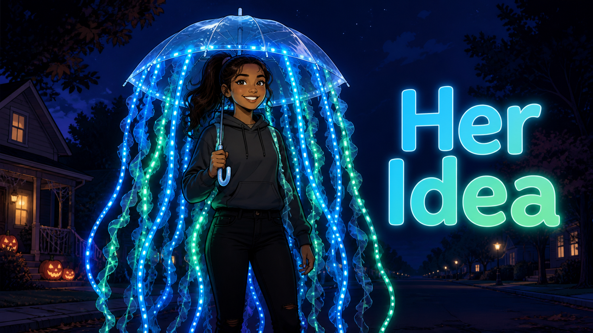
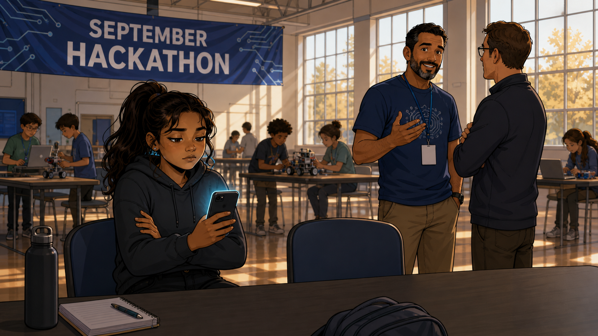
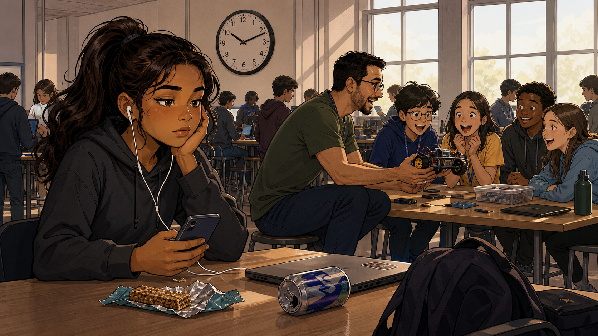
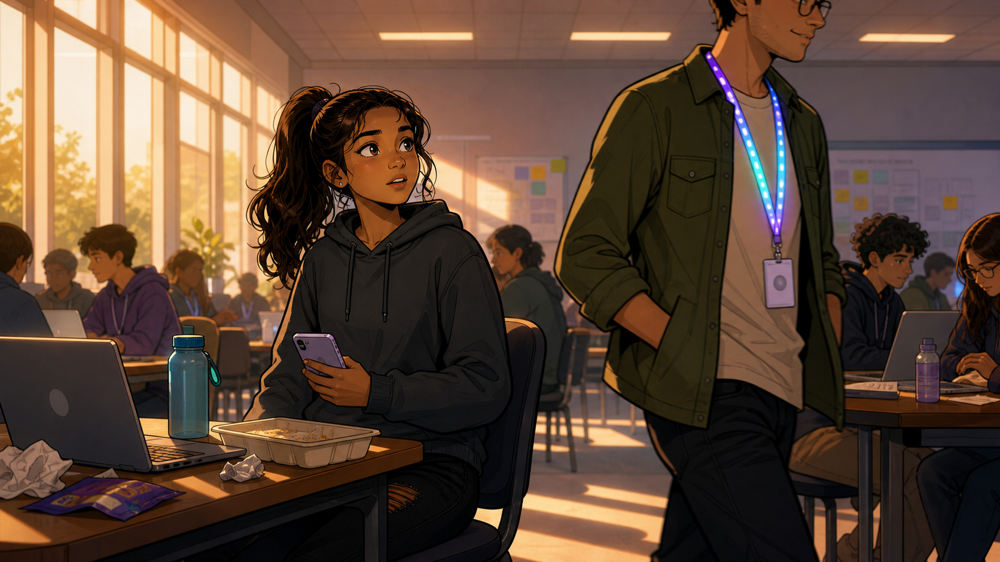
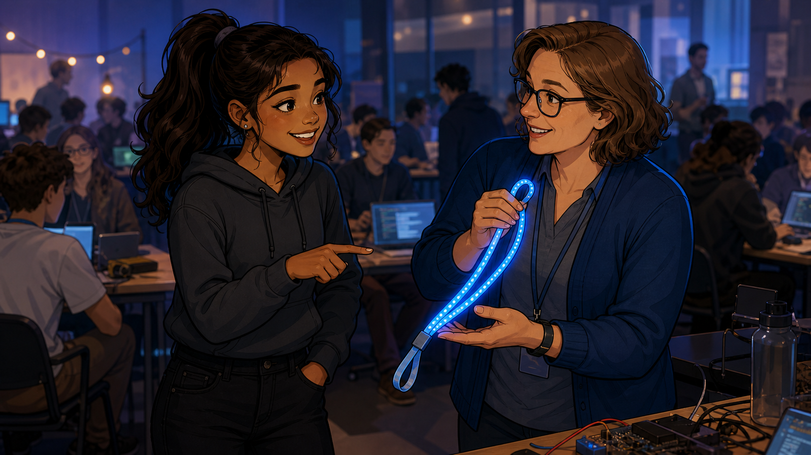
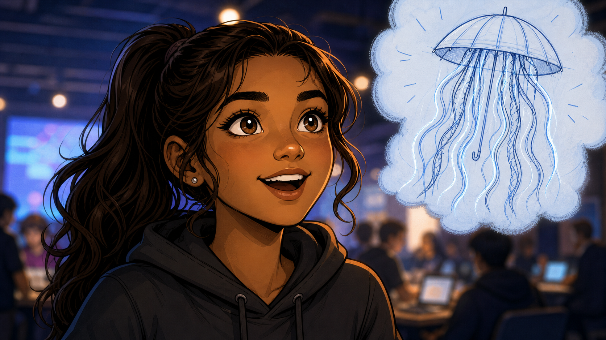
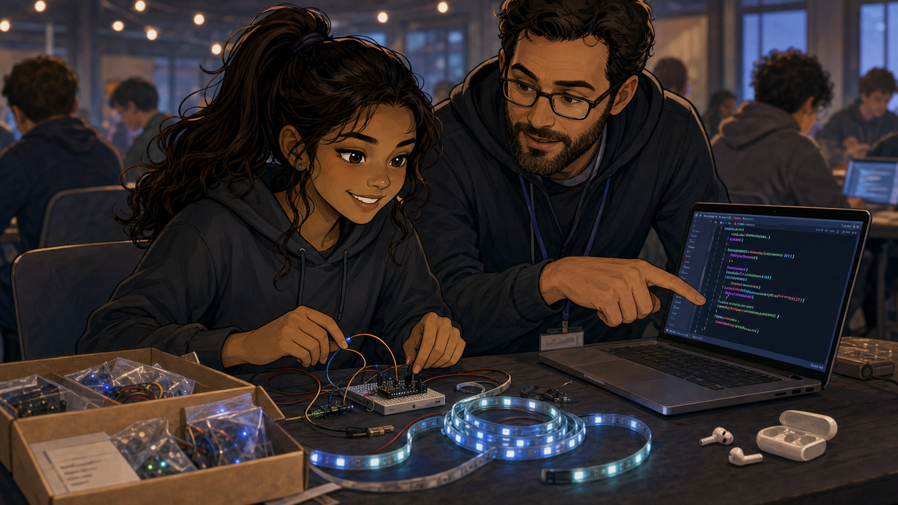
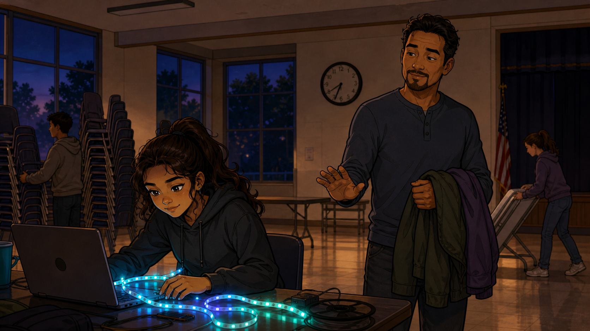
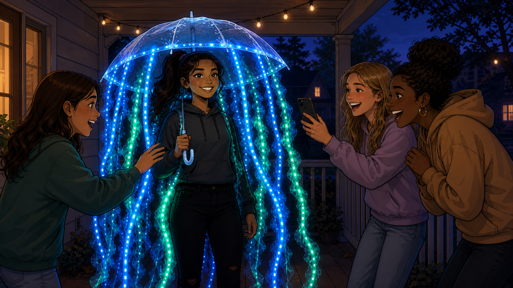

# Her Idea

Cover Image Prompt

(This is the Cover Image. Do not include this label in the image.)
Please generate a wide-landscape 16:9 cover image in a warm,
contemporary educational-graphic-novel style — clean linework, soft
cel-shading, grounded realistic proportions. Scene: nighttime, a
teenage girl (Laura, around 15) stands proudly in a homemade jellyfish
Halloween costume made from a clear upside-down umbrella, with
glowing blue and green LED-strip tentacles draped down around her,
her face lit softly by the LED glow, a wide confident smile. Title
text "Her Idea" rendered in a bold, rounded, friendly sans-serif
typeface with a soft glow matching the LEDs. Color palette: deep
night blues and purples punctuated by bright glowing blue and green
LED light. Emotional tone: pride, wonder, quiet triumph. Generate the
image immediately without asking clarifying questions.

Narrative Prompt

This is a fictional composite story, not a depiction of a specific
real named individual, though it draws on real, commonly reported
patterns from hackathon and coding-club recruitment. "Laura"
represents a reluctant first-time participant whose engagement is
sparked by one personally meaningful idea rather than by
instruction. Setting: a present-day September hackathon event in the
United States, followed by a November costume reveal. Art style:
warm, contemporary educational-graphic-novel illustration, clean
linework, soft cel-shading, consistent character design and color
palette across all panels — Laura should be immediately recognizable
from panel to panel (same hairstyle, same hoodie in early panels).

### Prologue – Dragged, Not Invited

Laura didn't ask to be at the hackathon. Her father, a lifelong
programmer, had signed her up weeks earlier without really asking,
and she'd spent the car ride making it clear exactly how she felt
about that. She had no interest in learning to code — and she had a
full phone battery to prove it.

## Panel 1: Arms Crossed, Phone Out

Image Prompt

(This is Panel 01. Do not include the panel number in the image.)
I am about to ask you to generate a series of images for a graphic
novel. Please make the images have a consistent style and consistent
characters. Do not ask any clarifying questions. Just generate the
image immediately when asked.

Please generate a 16:9 image in a warm, contemporary
educational-graphic-novel style depicting panel 1 of 8. The scene
should show a large hackathon event hall, tables full of animated
kids building robots and projects in the background, while in the
foreground a teenage girl (Laura, around 15, hoodie, ponytail) sits
with arms crossed and eyes fixed on her phone, clearly uninterested,
at a table otherwise empty. Her father, a man in his 40s wearing a
company hackathon t-shirt, stands a few feet away talking eagerly
with another adult, glancing back at Laura with a hopeful but
slightly awkward expression. Setting: present-day USA hackathon event,
September, morning light through large windows. Color palette: bright
energetic event colors in the background contrasted with Laura's
muted, closed-off hoodie tones. Emotional tone: reluctance, boredom,
social discomfort. Six visual details: Laura's crossed arms, her
phone screen glowing, an empty seat beside her, her father's
hackathon lanyard, distant tables with kids building robots, a
hand-lettered event banner reading "September Hackathon" in the
background. Generate the image immediately without asking clarifying
questions.

Laura's dad was the kind of programmer who got genuinely excited
about hackathons, and he'd brought her along the way he brought his
laptop everywhere — assuming she'd be just as thrilled. She wasn't.
She found a seat near the back, put her earbuds in, and made it very
clear she planned to stay exactly where she was.

## Panel 2: The Morning Nobody Convinces Her

Image Prompt

(This is Panel 02. Do not include the panel number in the image.)
Please generate a 16:9 image in the same style depicting panel 2 of
8. Make Laura consistent with the prior panel. The scene should show
the late morning of the same hackathon, Laura still at her table,
still on her phone, now with a half-eaten granola bar and an empty
soda can nearby, while a mentor demonstrates a small robot to an
enthusiastic cluster of younger kids just a few tables away, none of
whom is Laura. Setting: same present-day USA hackathon hall, late
morning, busier and louder than panel 1. Color palette: same
contrast between the lively background and Laura's muted foreground.
Emotional tone: persistent disengagement, time passing slowly for
her. Six visual details: a half-eaten granola bar, an empty soda can,
a small demo robot a few tables away, an enthusiastic cluster of
younger kids, a wall clock showing late morning, Laura's earbuds
still in. Generate the image immediately without asking clarifying
questions.

The morning dragged on exactly the way Laura expected it to. Robots
rolled across tables, kids cheered over blinking lights, and none of
it registered as anything she wanted to be part of. She checked the
time more than she checked anything happening in the room.

## Panel 3: A Lanyard That Glows

Image Prompt

(This is Panel 03. Do not include the panel number in the image.)
Please generate a 16:9 image in the same style depicting panel 3 of
8. Make Laura consistent with prior panels. The scene should show
early afternoon, Laura looking up from her phone for the first time,
her eyes drawn toward a mentor walking past wearing a lanyard woven
with a small addressable LED strip that glows in a slow, colorful
shifting pattern. The mentor, a young adult in casual clothes, is
mid-stride, unaware of being watched. Setting: same present-day USA
hackathon hall, just after lunch, sunlight now angled lower through
the windows. Color palette: the glowing lanyard as the single vivid
color accent against an otherwise ordinary scene. Emotional tone: the
first spark of genuine curiosity. Six visual details: the glowing LED
lanyard, Laura's phone lowered slightly in her hand, her widened
eyes, the mentor mid-stride, lunch trash on nearby tables, afternoon
light through windows. Generate the image immediately without asking
clarifying questions.

Then, just after lunch, Laura looked up — not because anyone told her
to, but because something caught the corner of her eye. A mentor
walked past wearing a lanyard woven with a thin strip of lights,
shifting slowly through blue, purple, and green. For the first time
all day, she actually wanted to know how something worked.

## Panel 4: The Question She Didn't Plan to Ask

Image Prompt

(This is Panel 04. Do not include the panel number in the image.)
Please generate a 16:9 image in the same style depicting panel 4 of
8. Make Laura and the mentor consistent with prior panels. The scene
should show Laura standing up and approaching the mentor, pointing
at the glowing lanyard and asking a question, the mentor turning
warmly to answer, holding the lanyard out slightly so Laura can see
it up close. Setting: same present-day USA hackathon hall,
mid-afternoon. Color palette: the glowing lanyard now large in frame,
warm and inviting. Emotional tone: eager curiosity replacing earlier
boredom. Six visual details: Laura standing (no longer seated), her
phone now pocketed, her hand pointing at the lanyard, the mentor's
friendly open posture, the lanyard's LED strip up close, other
hackathon activity blurred in the background. Generate the image
immediately without asking clarifying questions.

Laura got up before she'd really decided to. "What is that?" she
asked, pointing at the lanyard, and the mentor lit up just as much as
the strip did — happy to explain that it was just a few dollars of LED
strip and a small microcontroller, the same kind sitting on tables
all around the room that she'd been ignoring all day.

## Panel 5: The Idea Arrives

Image Prompt

(This is Panel 05. Do not include the panel number in the image.)
Please generate a 16:9 image in the same style depicting panel 5 of
8. Make Laura consistent with prior panels. The scene should show a
close-up of Laura's face mid-realization, eyes bright, a small
thought-bubble-style inset in the upper corner showing a rough sketch
of a jellyfish costume with glowing tentacles made from an umbrella,
rendered in a lighter sketch-line style within the bubble to suggest
it is an idea rather than reality yet. Setting: same present-day USA
hackathon hall, mid-afternoon. Color palette: warm excited tones on
Laura's face, cooler sketch-blue tones inside the idea bubble.
Emotional tone: sudden inspiration, a lightbulb moment. Six visual
details: Laura's wide bright eyes, a slight open-mouthed smile, the
sketch-style thought bubble, a rough umbrella shape in the sketch,
rough tentacle lines in the sketch, the hackathon room blurred behind
her. Generate the image immediately without asking clarifying
questions.

That's when the idea hit her all at once: a clear umbrella, turned
upside down, with LED-strip tentacles trailing down in blue and
green. A jellyfish costume — her own idea, not an assignment, not
something her dad suggested. She wanted to build it before she'd even
finished the thought.

## Panel 6: Hands On a Kit for the First Time

Image Prompt

(This is Panel 06. Do not include the panel number in the image.)
Please generate a 16:9 image in the same style depicting panel 6 of
8. Make Laura and the mentor consistent with prior panels. The scene
should show Laura seated at a table now, a Moving-Rainbow-style LED
kit and small microcontroller board open in front of her, the mentor
leaning in beside her pointing at a line of code on a laptop screen,
Laura's hands actively wiring an LED strip, fully focused. Setting:
same present-day USA hackathon hall, mid-to-late afternoon. Color
palette: warm collaborative tones, the LED strip glowing faintly even
mid-assembly. Emotional tone: immersion, focus, genuine engagement.
Six visual details: an open LED-strip kit, a small microcontroller
board, a laptop with code visible, Laura's hands mid-wiring, the
mentor pointing at the screen, Laura's earbuds now removed and set
aside. Generate the image immediately without asking clarifying
questions.

She grabbed a Moving Rainbow kit off the supply table and sat down
across from the mentor, who showed her how to change the code so the
pattern flowed the way jellyfish tentacles actually drift. For the
first time all day, her phone stayed in her pocket completely
forgotten.

## Panel 7: Still Coding at the Very End

Image Prompt

(This is Panel 07. Do not include the panel number in the image.)
Please generate a 16:9 image in the same style depicting panel 7 of
8. Make Laura consistent with prior panels. The scene should show
early evening, the hackathon hall now mostly empty and being packed
up around her, volunteers stacking chairs and folding tables in the
background, while Laura remains hunched over her laptop and LED
strip, clearly reluctant to stop, her father visible nearby holding
both their jackets and gently gesturing that it's time to go. Setting:
same present-day USA hackathon hall, early evening, event winding
down. Color palette: warm LED glow from Laura's project standing out
against a room going dim as lights are turned off. Emotional tone:
reluctant determination, a full reversal of panel 1's reluctance.
Six visual details: chairs being stacked in the background, a
volunteer folding a table, Laura's father holding two jackets, the
still-glowing LED strip in front of Laura, a nearly empty room, a
clock showing the event has run long. Generate the image immediately
without asking clarifying questions.

By the time volunteers started stacking chairs around her, Laura was
still coding, adjusting the timing of her pattern one more time
before she'd let herself stop. Her father stood nearby holding both
their jackets, smiling in a way he hadn't dared to that morning.

## Panel 8: The Costume, and the Friends It Brought

Image Prompt

(This is Panel 08. Do not include the panel number in the image.)
Please generate a 16:9 image in the same style depicting panel 8 of
8. Make Laura consistent with prior panels, now in costume. The scene
should show a November evening, Laura standing proudly in her
finished jellyfish costume — a clear upside-down umbrella overhead
with trailing blue and green LED-lit tentacle strips — surrounded by
three delighted friends examining the costume closely, one friend
reaching out to touch a glowing tentacle, all four teenagers smiling
under porch or string lighting. Setting: present-day USA, a
neighborhood driveway or porch at dusk in November. Color palette:
cool evening dusk blues punctuated by the vivid blue and green glow
of the costume. Emotional tone: pride, joy, contagious excitement.
Six visual details: the umbrella-jellyfish costume structure, glowing
LED tentacles, three admiring friends, one friend's hand reaching
toward a tentacle, string lights on a porch in the background, a
phone being held up by someone taking a photo. Generate the image
immediately without asking clarifying questions.

In November, Laura's father sent the event organizer a photo of his
daughter in her finished jellyfish costume, glowing tentacles of blue
and green trailing from a clear umbrella above her head. She was very
proud of it — and so was he. Three of her friends showed up at the
next club meeting, each one already planning a costume of their own.

### Epilogue – Recruiting Isn't Convincing

Nobody talked Laura into caring about code. A mentor's lanyard did
what no lecture could have: it showed her one specific, personally
meaningful thing she wanted to build, and the coding followed on its
own. The three friends who showed up in the spring hadn't been
recruited by a flyer — they'd been recruited by a photo of a glowing
jellyfish costume.

| Challenge | How the Situation Resolved | Lesson for Today |
|-----------|------------------------------|-------------------|
| A reluctant participant had no interest in coding as a subject | A mentor's visible, wearable LED project sparked personal curiosity | Recruiting rarely works through explanation — it works through one visible thing a specific person wants for themselves |
| Laura had no project idea of her own to attach to a lesson | She was allowed to invent her own idea (a costume) rather than follow an assigned one | Ownership of the idea, not just the code, is what turns a participant into a builder |
| The club had no obvious way to turn one success into future turnout | A parent's proud photo and word of mouth did the recruiting | A single visible, shareable success story often outperforms formal promotion for reaching new families |

### Call to Action

The next reluctant kid at your table doesn't need a better
explanation of what coding is — they need one project idea that's
actually theirs. Find it, hand them the parts, and get out of the
way.

---

*"How can I make one of these?"*
—Laura, on first seeing the LED lanyard

*"She was VERY proud."*
—from her father's note to the event organizer

---

Note: This story is based on a real event that happened to me in hackathon event in 2014.  The name of the student and the actual costume have been changed.  What has not changed is that LED costumes are great tools for engagement of creative students.

## References

1. [Wikipedia: Wearable technology](https://en.wikipedia.org/wiki/Wearable_technology) - Background on LED-based wearable projects like Laura's costume
2. [Wikipedia: Light-emitting diode](https://en.wikipedia.org/wiki/Light-emitting_diode) - The core technology behind the glowing lanyard and tentacles
3. [Wikipedia: Halloween costume](https://en.wikipedia.org/wiki/Halloween_costume) - Background on costume-making traditions this project builds on
4. [Moving Rainbow](http://dmccreary.github.io/moving-rainbow/) - The companion textbook built around the exact LED-strip kit Laura used
5. [Learning MicroPython](http://dmccreary.github.io/learning-micropython/) - The companion textbook on the physical-computing platform behind the kit
