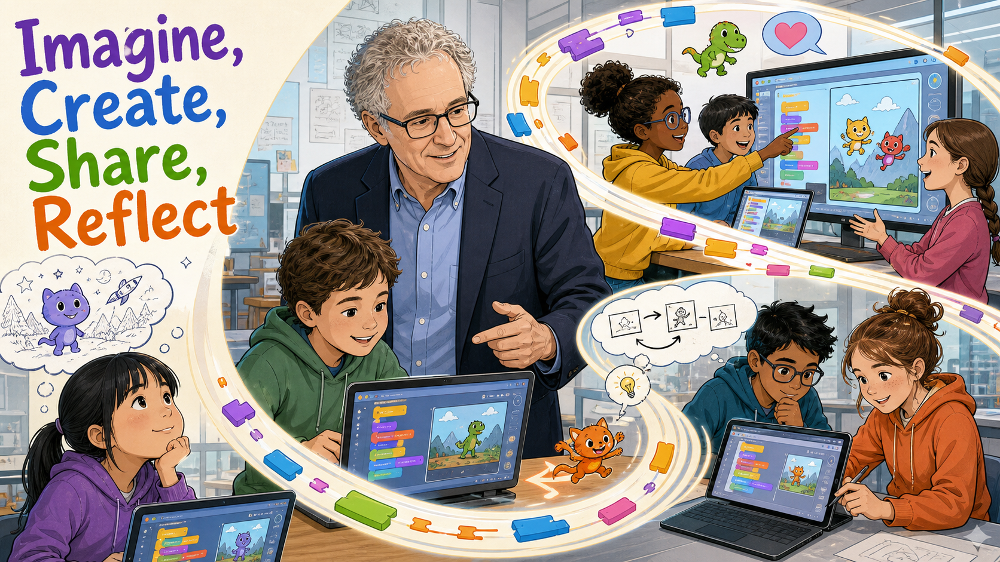
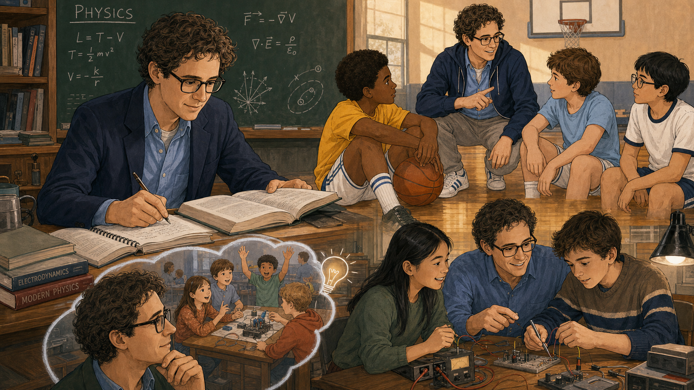
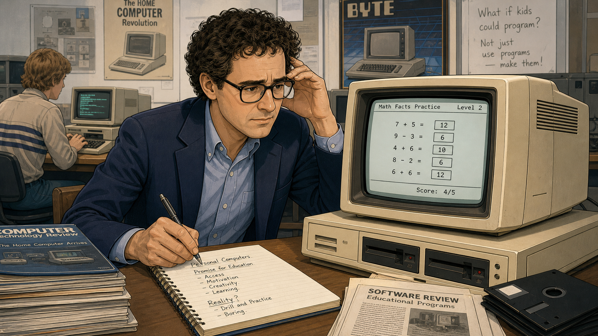
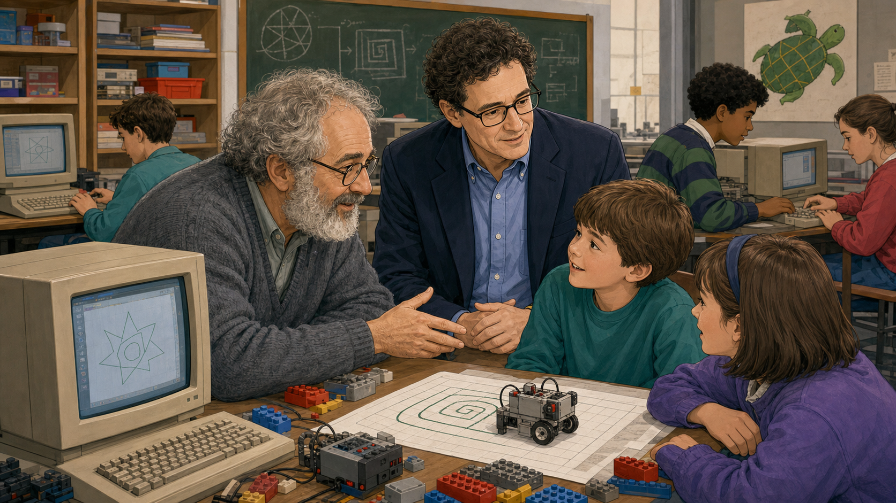
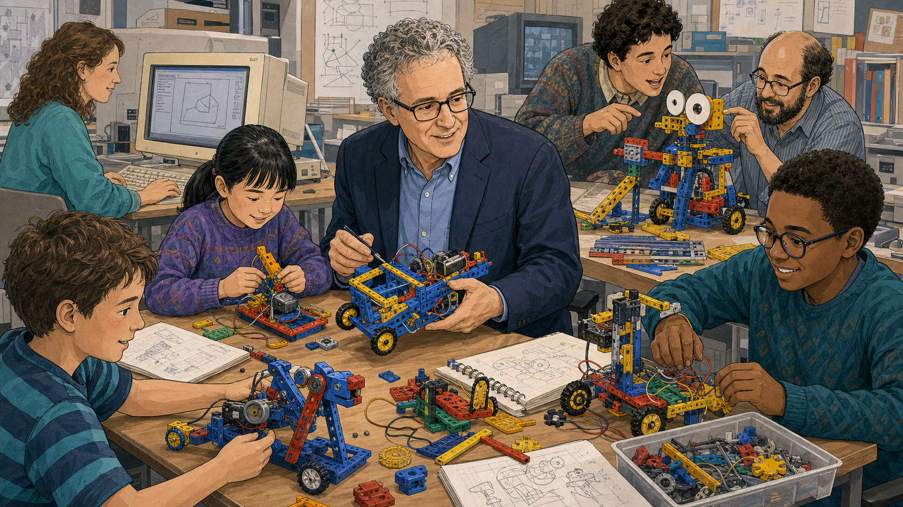
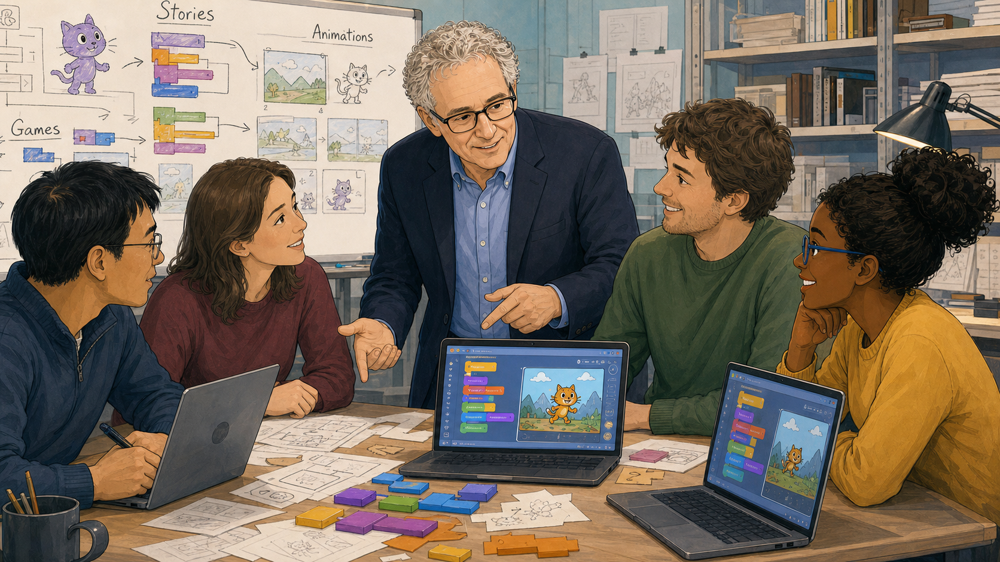
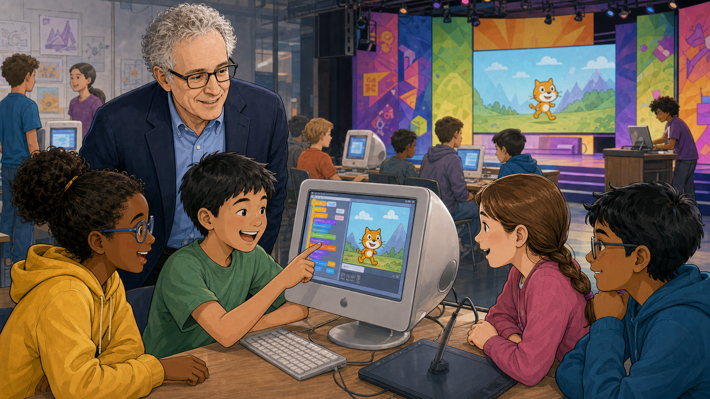
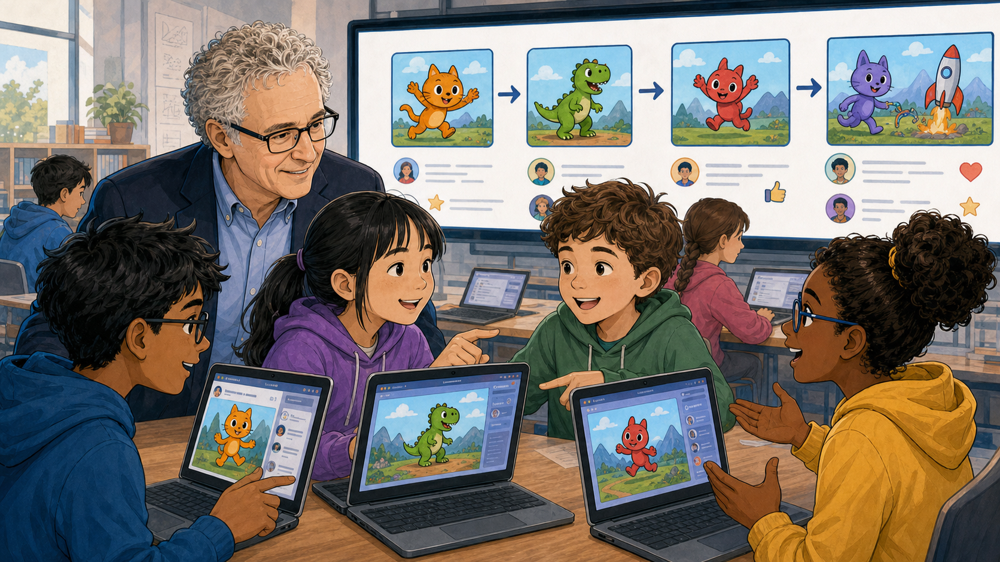
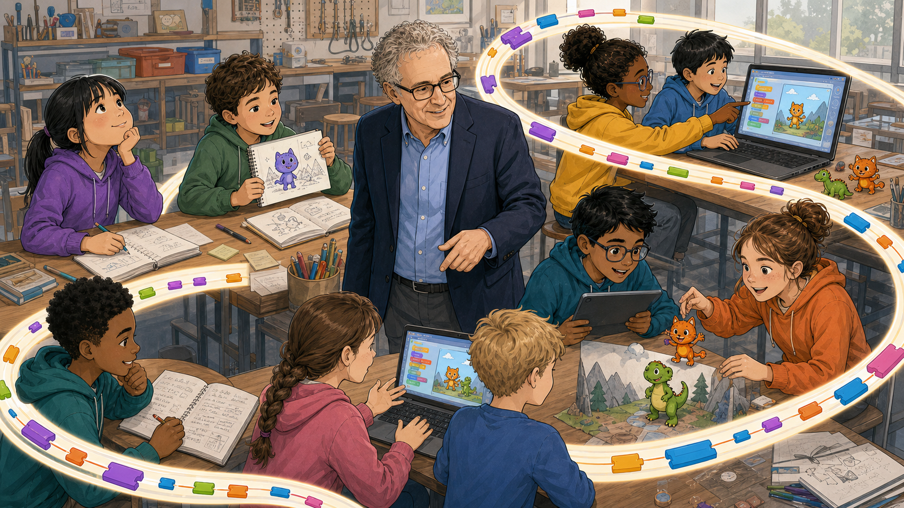
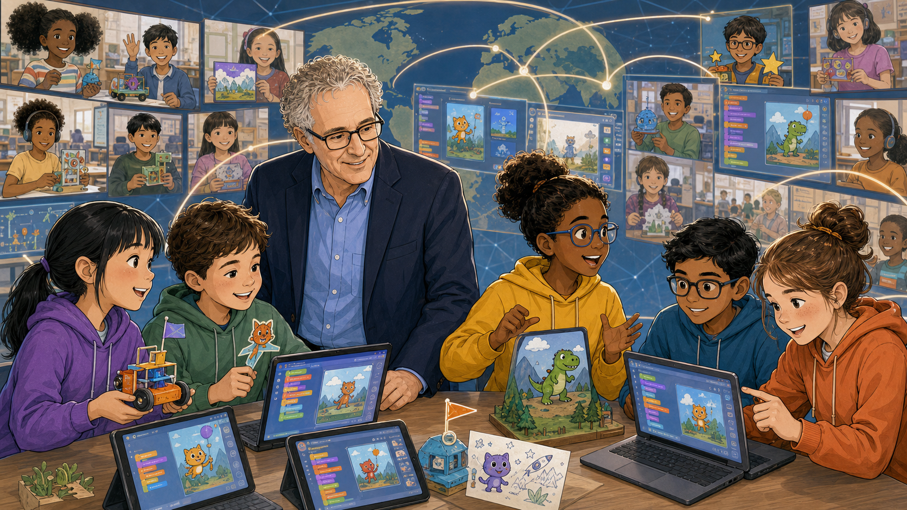

# Imagine, Create, Share, Reflect

Cover Image Prompt

(This is the Cover Image. Do not include this label in the image.)
Please generate a wide-landscape 16:9 cover image in a warm, contemporary
educational-graphic-novel style — clean linework, soft cel-shading,
grounded realistic proportions. On the left third, render the title
"Imagine, Create, Share, Reflect" as bold, hand-lettered stacked text in
purple, blue, green, and orange, with a small chalkboard-style doodle
beneath it of a smiling purple cat character, stars, and a rocket, and a
girl with dark hair resting her chin on her hand as she looks up at the
words thoughtfully. In the center, an older man with curly white-gray
hair, glasses, and a navy blazer over a blue button-down shirt (Mitchel
Resnick) stands smiling warmly among students, gesturing with one hand.
A glowing golden ribbon spirals through the whole composition, linking
several small vignettes: a boy in a green hoodie at a laptop showing a
block-based coding interface with an orange dinosaur character and a
mountain backdrop; two students pointing at a large classroom display
showing an orange cat character and a heart icon; a girl clapping with
delight; a thought bubble with a sequence of sketch-to-character frames
and a glowing lightbulb, watched by a boy in glasses and a girl in an
orange hoodie; more students at laptops with colorful code blocks and
character sprites. Color palette: warm cream and wood-tone classroom
backdrop punctuated by bright primary and secondary colors from the
title text, character sprites, and glowing ribbon. Emotional tone:
warmth, wonder, mentorship, and creative energy. Generate the image
immediately without asking clarifying questions.

Narrative Prompt

This is a nonfiction story about a real, living person: Mitchel Resnick
(born 1956), the LEGO Papert Professor of Learning Research at the MIT
Media Lab and director of its Lifelong Kindergarten research group. The
story spans the United States from the late 1970s to the present day —
his physics studies, his years as a technology journalist, his doctoral
work under Seymour Papert, his group's programmable-brick research, the
creation and 2007 launch of Scratch, and Scratch's ongoing global reach.
Art style: warm, contemporary educational-graphic-novel illustration,
consistent linework and color palette across all panels. Resnick is
drawn with dark curly hair in the earlier (pre-2000) panels and
white-gray curly hair with glasses and a navy blazer in the later
panels, reflecting his real aging across the decades — this is
intentional, not an inconsistency. Creative liberties: panel 1 shows
young Resnick mentoring neighborhood kids at a basketball court and an
electronics workbench alongside his physics studies; these specific
scenes are illustrative composites representing his early, well-documented
instinct for hands-on teaching and tinkering rather than a documented
single event. The title used throughout this story shortens Resnick's
actual five-step "Creative Learning Spiral" — Imagine, Create, Play,
Share, Reflect — to four words for the title text; the word "Play" is
preserved and explained in the narrative prose even though it does not
appear in the title itself. No real brand or product names appear in
any image; the narrative prose names specific products (Scratch, LEGO
Mindstorms) where historically accurate.

### Prologue – A Language Built From a Philosophy

Somewhere near you, a kid is probably making a cat dance across a screen
using colorful blocks that snap together like puzzle pieces. That
language is Scratch, and more than 150 million people have used it to
build their first games, animations, and stories. Behind it stands one
MIT researcher who spent decades arguing that the best model for
learning isn't a lecture hall or a worksheet — it's a kindergarten
classroom, where children imagine, build, play, share what they've made,
and start imagining again. His name is Mitchel Resnick, and this is the
story of how that belief became a tool now sitting on your own coding
club's tables.

## Panel 1: A Physicist Who Kept Wondering "What If"

Image Prompt

(This is Panel 01. Do not include the panel number in the image.)
I am about to ask you to generate a series of images for a graphic
novel. Please make the images have a consistent style and consistent
characters. Do not ask any clarifying questions. Just generate the
image immediately when asked.

Please generate a 16:9 image in a warm, contemporary
educational-graphic-novel style depicting panel 1 of 9. Divide the
scene into three linked vignettes around one recurring young man in his
20s with dark curly hair, glasses, and a navy blazer over a blue
button-down shirt: (1) at a desk writing in a notebook in front of a
chalkboard covered in physics equations and orbital diagrams, stacks of
physics textbooks nearby; (2) crouched on an outdoor basketball court
in a hoodie, pointing and talking animatedly to a small group of boys
sitting on the gym floor, one boy hugging a basketball and watching him
with admiration; (3) seated at a workbench with a girl and another
young man, soldering irons and multimeters and circuit boards spread
across the table, all three focused and smiling. Setting: a
university physics department and a nearby neighborhood gym and
workshop, United States, late 1970s. Color palette: warm sepia-tinted
classroom browns and chalkboard greens, contrasted with brighter
primary colors on the electronics and basketball. Emotional tone:
curiosity, quiet mentorship, restless intelligence. Six visual details:
chalkboard equations, a basketball tucked under a boy's arm, a stack of
physics textbooks, soldering irons and wires on the workbench, a
gymnasium hoop in the background, the young man's consistent glasses
and blazer across all three vignettes. Generate the image immediately
without asking clarifying questions.

Mitchel Resnick studied physics at Princeton, filling notebooks with
equations about orbits and forces. But even while he was deep in
formal coursework, the pull toward something else was already there —
the version of him who couldn't stop drawing curious kids into whatever
he was building or explaining, whether that meant a pickup basketball
game or an evening spent wiring a circuit. Long before he had a job
title in education, Resnick already had the instincts of a teacher who
would rather hand someone a tool than a lecture. It would take a
detour through journalism before he realized that instinct could become
a career.

## Panel 2: The Journalist Who Wasn't Convinced

Image Prompt

(This is Panel 02. Do not include the panel number in the image.)
Please generate a 16:9 image in the same style depicting panel 2 of 9.
Keep the young man consistent with the prior panel — dark curly hair,
glasses, navy blazer over a blue shirt. The scene should show him
seated at a cluttered desk in a technology-magazine newsroom, chin
resting on one hand, brow furrowed, writing notes on a legal pad that
reads "Personal Computers — Promise for Education: Access, Motivation,
Creativity, Learning. Reality? Drill and Practice. Boring." beside him
sits a beige early-1980s desktop computer whose screen displays a
simple math drill program with a score counter. On the wall behind him,
a hand-lettered sign reads "What if kids could program? Not just use
programs — make them!" among stacks of technology magazines and
industry posters. A second young journalist works at another computer
in the background. Setting: a magazine office in the United States,
early 1980s, personal-computer era. Color palette: muted beige and
brown office tones with the pale glow of the CRT screen as an accent.
Emotional tone: skepticism, restless dissatisfaction, an idea forming.
Six visual details: the beige CRT monitor with a drill-and-practice
program, the handwritten legal pad notes, the hand-lettered wall
question, stacks of computer magazines, floppy disks on the desk, a
second journalist typing in the background. Generate the image
immediately without asking clarifying questions.

By the late 1970s, Resnick was working as a science and technology
correspondent, covering the personal-computer boom for a national
business magazine. He watched schools rush to buy the new machines, and
then watched most of that promise shrink down to programs that drilled
kids on math facts and graded them like a machine grading a worksheet.
It wasn't that Resnick doubted computers belonged in classrooms — he
doubted this particular use of them. The question he kept scribbling in
the margins of his notes was simple: what if kids didn't just run the
software, but built it?

## Panel 3: A Professor Who Saw Learning Differently

Image Prompt

(This is Panel 03. Do not include the panel number in the image.)
Please generate a 16:9 image in the same style depicting panel 3 of 9.
Show two men at a classroom table: an older man in his 50s with gray
curly hair, a full gray beard, glasses, and a gray cardigan (Seymour
Papert), and the same young man from prior panels, now with a few more
years on him, dark curly hair, glasses, navy blazer (Resnick), both
leaning in and talking with a boy and a girl seated at the table. On
the table sits a small wheeled robot built from colorful construction
pieces, motors, and wires, rolling along a hand-drawn spiral path on
graph paper. Behind them, a chalkboard shows a geometric spiral and
simple flowchart-style diagrams, and a wall poster shows a friendly
cartoon turtle inside a hexagon shape. In the background, other
students work at boxy beige computer terminals displaying simple
geometric line-drawings. Setting: an MIT research classroom, United
States, early-to-mid 1980s. Color palette: warm wood tones, chalkboard
green, with bright primary-colored construction pieces and wiring as
accents. Emotional tone: mentorship, discovery, intellectual excitement
passing from one generation to the next. Six visual details: the small
wheeled robot on the spiral path, the turtle poster, chalkboard
geometric diagrams, beige computer terminals with line-drawings, the
older mentor's gray cardigan, the students' rapt attention. Generate
the image immediately without asking clarifying questions.

In 1982, at a conference on the emerging personal-computer market,
Resnick heard MIT professor Seymour Papert describe an entirely
different vision: computers as material for children to build with, not
programs that built children into passive users. Papert's own language,
Logo, let kids steer an on-screen "turtle" by writing simple commands —
and the ideas behind it, that people learn best by constructing things
they care about, hit Resnick like the missing piece of an argument he'd
been having with himself for years. He left journalism, enrolled at
MIT, and became Papert's doctoral student, earning his PhD in 1992 under
Papert and fellow computer scientist Hal Abelson.

## Panel 4: Turning Bricks Into a Building Block for Ideas

Image Prompt

(This is Panel 04. Do not include the panel number in the image.)
Please generate a 16:9 image in the same style depicting panel 4 of 9.
Show the same man, now with gray-streaked curly hair, glasses, navy
blazer over a blue shirt, seated at a workshop table crowded with
children building small robots out of colorful interlocking
construction pieces, gears, wheels, and small motors wired to
controller boxes. A girl and a boy work with him directly at the
center of the table, while at the far end a bearded engineer in his
40s helps two more students attach large plastic eyes to a walking
robot. A young woman researcher works at a nearby computer displaying
simple geometric shapes. Blueprints and hand-drawn robot sketches are
scattered across the table and pinned to the wall behind them. Setting:
an MIT Media Lab workshop, United States, early-to-mid 1990s. Color
palette: warm wood-tones with bright primary-colored construction
pieces (red, yellow, blue) as focal accents. Emotional tone: hands-on
collaboration, delighted discovery, engineering playfulness. Six visual
details: interlocking construction pieces and gears, wired controller
boxes, a robot with large plastic eyes, hand-drawn robot blueprints
pinned to the wall, a computer screen with geometric shapes, motors and
loose wheels scattered on the table. Generate the image immediately
without asking clarifying questions.

Back at MIT, Resnick's research group asked a bigger question: could
Papert's building-block philosophy live inside an actual building
block? Working with Papert and engineers at the LEGO company, the team
built the "programmable brick" — a plastic block containing a tiny
computer that kids could wire to motors and sensors and control with
their own code. Kids didn't just assemble a robot from instructions;
they programmed how it behaved. In 1998, that research became a
commercial product, LEGO Mindstorms, and thousands of classrooms
suddenly had access to robotics that responded to code a ten-year-old
had written.

## Panel 5: Designing a Language Any Kid Could Speak

Image Prompt

(This is Panel 05. Do not include the panel number in the image.)
Please generate a 16:9 image in the same style depicting panel 5 of 9.
Show a man in his mid-40s with curly gray hair and glasses, wearing a
navy blazer over a blue shirt (Resnick), standing and gesturing warmly
toward four younger researchers seated around a table cluttered with
laptops and sketches. A whiteboard behind them is divided into three
labeled columns — "Stories," "Animations," "Games" — each showing rough
sketches of colorful interlocking command blocks leading to simple
character drawings (a cat, a mountain landscape). Two laptop screens on
the table show an early block-based coding interface with an orange cat
character standing in a grassy, mountainous scene. Loose colorful paper
cutouts shaped like puzzle-piece blocks are scattered on the table.
Setting: an MIT Media Lab design studio, United States, early 2000s.
Color palette: cool studio grays and blues warmed by the bright primary
and secondary colors of the whiteboard sketches and block cutouts.
Emotional tone: collaborative excitement, creative problem-solving.
Six visual details: the three-column whiteboard diagram, paper
block-shaped cutouts, laptops showing the cat character and mountain
scene, sketch drawings of the cat in different poses, a coffee mug on
the table, bookshelves in the background. Generate the image
immediately without asking clarifying questions.

By the early 2000s, Resnick led the Lifelong Kindergarten research
group, and its biggest challenge was reaching kids who would never sit
through a robotics workshop. The team wanted a programming language
that felt like snapping together LEGO bricks instead of memorizing
syntax — one where a wrong move couldn't produce a cryptic error, only
a chance to try again. They sketched command blocks shaped like
puzzle pieces that only fit together in ways that made sense, and built
in support for stories, animations, and games from day one, so kids
with wildly different interests could all find a reason to start.

## Panel 6: The First Time Kids Saw It Come Alive

Image Prompt

(This is Panel 06. Do not include the panel number in the image.)
Please generate a 16:9 image in the same style depicting panel 6 of 9.
Show the man with curly gray hair, glasses, and navy blazer (Resnick)
standing behind a boy seated at a bulbous early-2000s all-in-one
computer, the boy pointing excitedly at the screen where a block-based
coding interface displays an orange cat character in a grassy,
mountainous scene. A girl and another boy lean in from the right,
delighted. Behind them, a large classroom display screen shows the same
orange cat character enlarged, and several more children work at
similar computers at other tables. Colorful geometric banners and stage
lighting suggest a launch or showcase event. Setting: a computer lab or
community showcase space, United States, mid-2000s. Color palette:
bright, celebratory blues, purples, oranges, and greens from the event
banners and screen glow. Emotional tone: excitement, first discovery,
communal celebration. Six visual details: the bulbous all-in-one
computer, the enlarged cat character on the big screen, colorful
geometric event banners, other children at computers in the
background, stage-style lighting, the boy's pointing hand. Generate the
image immediately without asking clarifying questions.

Scratch launched publicly in 2007, and Resnick got to watch the moment
he had spent two decades working toward: a kid who had never written a
line of code, snapping blocks together, and watching a character move
because of a decision that kid had made. There was no drill-and-practice
scorecard, no single correct answer to reach — just a cat on a
mountainside doing exactly what its young programmer told it to do.
Word spread through classrooms and after-school computer clubhouses
fast, because the tool didn't need to be explained; it needed to be
touched.

## Panel 7: A World Where Every Project Gets an Audience

Image Prompt

(This is Panel 07. Do not include the panel number in the image.)
Please generate a 16:9 image in the same style depicting panel 7 of 9.
Show the man with curly gray hair, glasses, and navy blazer (Resnick)
standing behind four children gathered around a large classroom
display screen. The screen shows a row of four shared project
thumbnails — an orange cat, a green dinosaur, a red creature, and a
purple cat beside a rocket launch — each with a small user avatar,
comment lines, and icons for a star, a thumbs-up, and a heart beneath
it. Two children in the foreground hold open laptops showing the same
thumbnails on their own screens, comparing notes. Setting: a modern
classroom with laptops on the desks, United States, present day. Color
palette: bright, cheerful character colors (orange, green, red,
purple) against a clean white display background. Emotional tone:
pride, community, the joy of being seen and appreciated by peers. Six
visual details: the four project thumbnails, comment and like icons
beneath each, laptops showing matching thumbnails, a heart icon, a star
icon, the children's animated pointing and talking. Generate the image
immediately without asking clarifying questions.

The most radical decision on the team wasn't a feature of the
programming language — it was building an online community around it
from the very start. Every Scratch project could be shared, and every
shared project could be viewed, commented on, and remixed by any other
member, whether they lived down the hall or across an ocean. A ten-year-old's
dinosaur animation could get a comment from a kid in another
country who had turned it into something new. Sharing wasn't an
add-on feature; it was, in Resnick's words, one full turn of the
process he wanted every young creator to experience.

## Panel 8: The Spiral, Spinning in Real Time

Image Prompt

(This is Panel 08. Do not include the panel number in the image.)
Please generate a 16:9 image in the same style depicting panel 8 of 9.
Show the man with curly gray hair, glasses, and navy blazer (Resnick)
standing at the center of a workshop room, gesturing toward a wide
table of children engaged in different stages of a project: on the
left, two children sketch character drawings of a purple cat in open
notebooks; at the laptop in front of Resnick, two children type code
blocks while a screen shows an orange cat and green dinosaur character;
on the right, two more children hold up a paper diorama with a small
cardboard dinosaur figure while a third child reaches out to touch it,
delighted. A glowing golden ribbon spiral loops through the whole scene,
connecting the sketching, coding, and sharing groups into one visual
loop. Setting: a contemporary classroom workshop, United States, present
day. Color palette: warm wood-tones with the golden ribbon and bright
character colors as the visual accents. Emotional tone: joyful
momentum, an idea moving continuously from thought to object to
audience. Six visual details: open sketchbooks with character
drawings, laptops with the cat and dinosaur characters, a paper
diorama with a small figure, the glowing golden ribbon spiral, a
pencil cup and sticky notes on the table, children at multiple stages
of the same creative process. Generate the image immediately without
asking clarifying questions.

Resnick came to describe this whole process as a spiral: imagine an
idea, create something from it, play with what you've made, share it
with other people, reflect on what worked and what didn't — and land
right back at imagine, this time with a better idea than before. It
isn't a one-time assignment with a grade at the end; it's a loop kids
can spin through again and again in a single afternoon. Watching a
table of students sketch, code, and hand projects to each other all at
once, you can see the spiral running in real time, powered by nothing
more than curiosity and an audience.

## Panel 9: Millions of Kids, One Idea

Image Prompt

(This is Panel 09. Do not include the panel number in the image.)
Please generate a 16:9 image in the same style depicting panel 9 of 9.
Show the man with curly gray hair, glasses, and navy blazer (Resnick)
standing among a diverse group of five children at a table full of
laptops and tablets displaying the orange cat and green dinosaur
characters, one child holding a small handmade robot. Behind them, a
glowing world map stretches across the background wall, with thin
lines of light connecting it to a grid of small screens showing
children of many different backgrounds in classrooms around the globe,
each holding up or working on their own character-based project.
Setting: a modern classroom opening onto a symbolic global network
visualization, present day. Color palette: deep blue map background
with warm golden connection lines and the bright character colors of
each small screen. Emotional tone: legacy, global reach, quiet pride in
an idea that outgrew its origin. Six visual details: the glowing world
map, golden connection lines linking distant screens, the small
handmade robot, laptops and tablets on the table, the grid of diverse
children's screens, the character sprites repeated across multiple
screens. Generate the image immediately without asking clarifying
questions.

Today, more than 150 million people have created a Scratch account, and
the language has been translated into more than 70 languages, reaching
kids in almost every country on Earth. Most of them will never meet
Mitchel Resnick, and most won't know his name — but every time one of
them snaps two blocks together and watches something happen because of
it, they're standing inside an idea he spent his whole career building.
That idea is probably sitting on a table in your own coding club right
now, waiting for the next kid to imagine something with it.

### Epilogue – What Made Resnick's Approach Different?

Resnick didn't set out to build a piece of software. He set out to
change what "using a computer" meant for a kid — from following
instructions to giving them. Every decision that followed, from the
programmable brick to Scratch's sharing community, was in service of
one belief: that creativity, not correctness, is what real learning
should train.

| Challenge | How Resnick Responded | Lesson for Today |
|-----------|------------------------|-------------------|
| Early educational software mostly drilled kids with flashcard-style questions instead of letting them build anything | He left journalism to study under Seymour Papert and helped design tools where kids programmed rather than were programmed at | The best learning tools hand control to the learner, not just information |
| Programming languages for kids were often too rigid for beginners to start creating quickly, or too simple to grow with them | His team designed Scratch around "low floors, high ceilings, and wide walls," so any child could start immediately and keep growing | Good tools should be easy to start, hard to outgrow, and open to many kinds of projects |
| A tool used alone, on one computer, in one classroom, only ever reaches the kids sitting in front of it | Scratch launched as an online community from day one, so every project could be shared, remixed, and commented on by kids worldwide | Sharing turns a solitary skill into a global creative conversation |
| Even great tools can leave kids stuck after one pass at an idea, with nowhere to take it next | Resnick frames learning as a spiral — imagine, create, play, share, reflect, and imagine again — so every finished project seeds the next one | Reflection isn't the end of a project; it's the beginning of the next one |

### Call to Action

The next time your coding club opens Scratch, you're not just running a
piece of software — you're stepping into a philosophy that took one
researcher three decades to build. Let your members imagine before they
click "start," share what they make even when it's unfinished, and
circle back to imagine again. That spiral is the whole point.

---

*"Instead of making kindergarten like the rest of school, we need to make the rest of school (indeed, the rest of life) more like kindergarten."*
—Mitchel Resnick

*"Computers will not live up to their potential until we start to think of them less like televisions and more like paintbrushes."*
—Mitchel Resnick, "Computer as Paintbrush" (2006)

*"We believe the best way to cultivate creativity is to support people working on projects based on their passions, in collaboration with peers and in a playful spirit."*
—Mitchel Resnick, *Lifelong Kindergarten* (2017)

---

## References

1. [Wikipedia: Mitchel Resnick](https://en.wikipedia.org/wiki/Mitchel_Resnick) - Biography of the MIT Media Lab researcher who led the creation of Scratch
2. [Wikipedia: Scratch (programming language)](https://en.wikipedia.org/wiki/Scratch_(programming_language)) - History and design of the block-based language Resnick's team built
3. [Wikipedia: Seymour Papert](https://en.wikipedia.org/wiki/Seymour_Papert) - Biography of Resnick's doctoral advisor and the constructionist-learning pioneer behind Logo
4. [MIT Media Lab: Mitchel Resnick - Person Overview](https://www.media.mit.edu/people/mres/overview/) - Official MIT Media Lab biography, current research, and awards
5. [GBH: Mitchel Resnick](https://www.wgbh.org/people/mitchel-resnick) - Boston public-media profile covering his journalism background, LEGO Mindstorms work, and the Computer Clubhouse network
