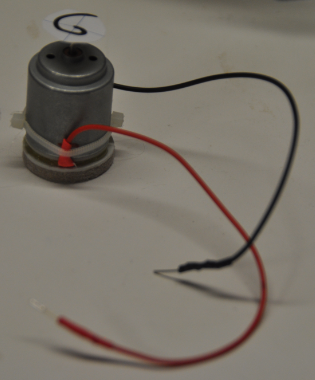
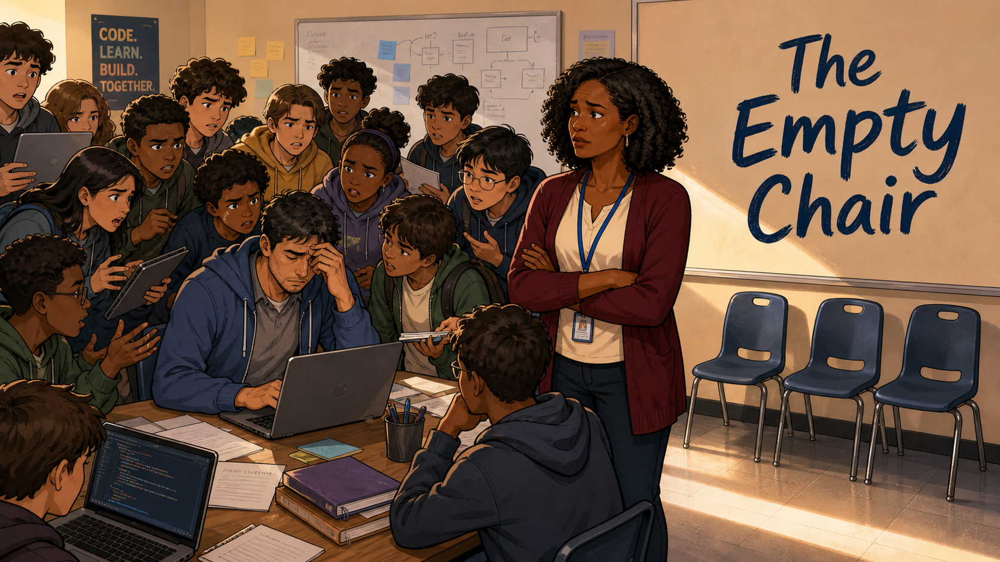
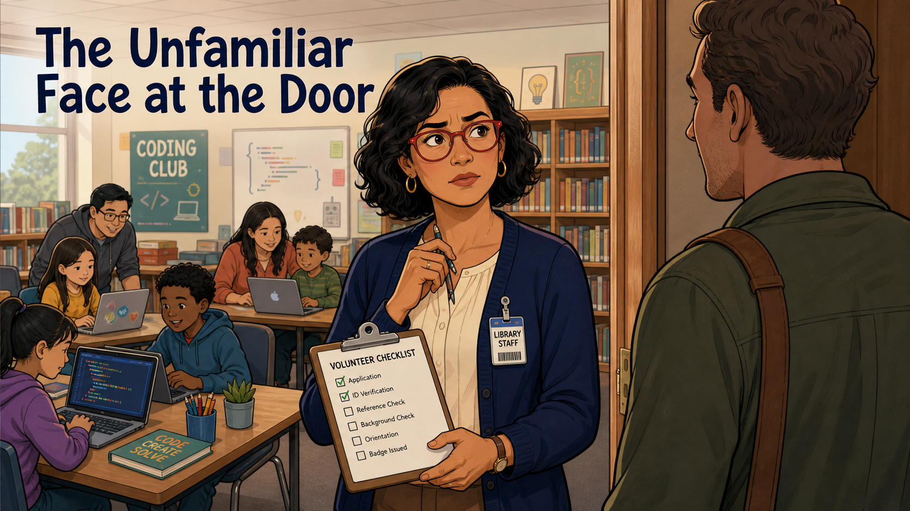
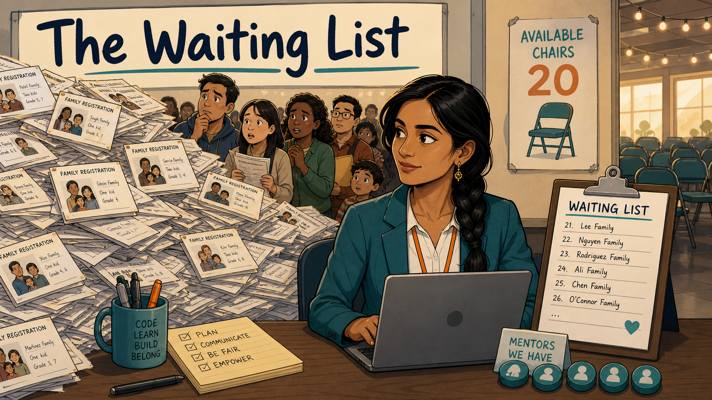
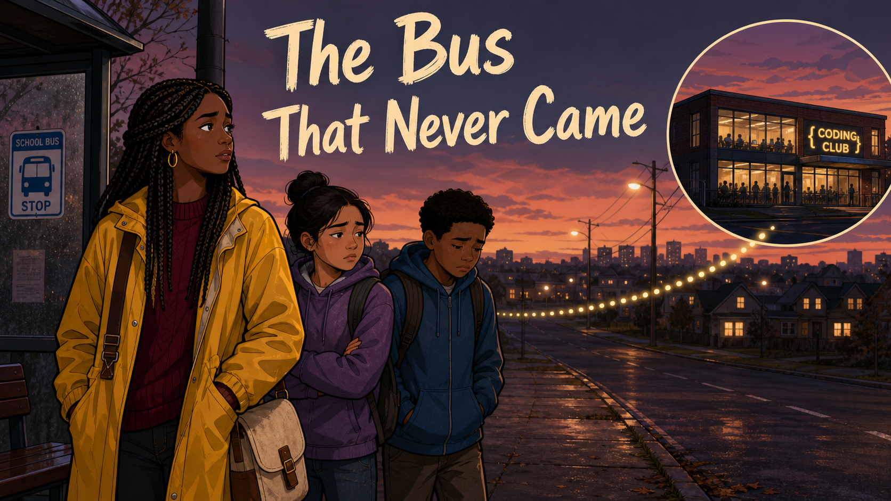
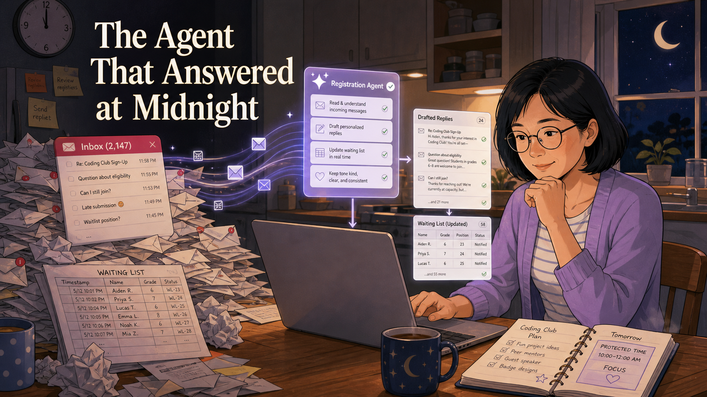
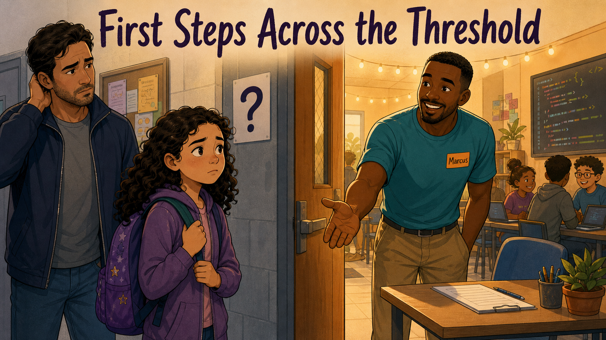
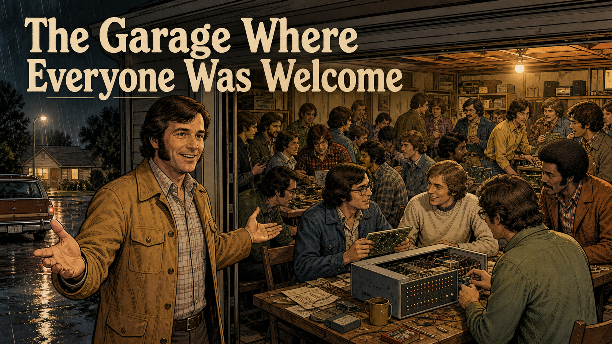

# Stories

Short, illustrated graphic-novel stories that connect the lessons in
this book to the people who actually lived them — real founders of
the coding-club movement, and grounded case studies drawn from common
situations club leaders and mentors will recognize. See
[Story Ideas](./story-ideas.md) for the full list of stories planned
for this book.

-   **[The Broken Wires on the Motors](./broken-wires/index.md)**

    

    A true account of how one volunteer traced student frustration to broken motor wires, then rebuilt every motor with solder, heat shrink, and a golden spiral.

-   **[Lights, Color, Motion!](./lights-color-motion/index.md)**

    

    A mentor discovers that light, color, and motion pull students across the room faster than any lecture -- and rebuilds her labs around that idea.

-   **[Challenge Cards Bring Focus](./challenge-cards/index.md)**

    Distracted students, phones out, nothing pulling them back -- until a tiered set of green, blue, and black challenge cards gives every student an obvious next move.

-   **[Her Idea](./her-idea/index.md)**

    

    A reluctant hackathon teenager ignores every project in the room -- until a glowing LED lanyard sparks an idea for a jellyfish Halloween costume.

-   **[The Empty Chair](./empty-chair/index.md)**

    

    One overwhelmed mentor, fifteen students, and a crying kid at his desk -- until a strict 3:1 ratio brings the room back under control.

-   **[The Unfamiliar Face at the Door](./unfamiliar-face-at-door/index.md)**

    

    A volunteer coordinator realizes she has no way to vet a stranger who wants to mentor -- and builds a real policy before the next one arrives.

-   **[The Waiting List](./waiting-list/index.md)**

    

    Three hundred families apply for twenty seats in one morning -- and a mentor-gated registration system turns the chaos fair.

-   **[The Sticky Notes on the Whiteboard](./sticky-notes-whiteboard/index.md)**

    

    Exhausted mentors used to leave every session in silence -- until a five-minute sticky-note debrief turned mistakes into a wall that remembers.

-   **[The Bus That Never Came](./bus-that-never-came/index.md)**

    

    A club proud of its open-door policy can't explain one neighborhood's empty seats -- until a mentor finds the invisible barrier at a bus stop.

-   **[The Grant That Almost Wasn't](./grant-that-almost-wasnt/index.md)**

    

    A volunteer treasurer watches the kit budget run dry -- her first grant application is rejected, but a rewritten proposal funds a full year of free coding sessions.

-   **[The Notebook Dan Left Behind](./notebook-dan-left-behind/index.md)**

    

    A founding leader has to step away with two weeks' notice -- and three years of written-down charter, curriculum, and training notes let a co-leader take over without missing a session.

-   **[The Agent That Answered at Midnight](./agent-answered-at-midnight/index.md)**

    

    A club leader drowning in midnight registration email builds a carefully guardrailed AI agent -- and gets her evenings back for the kids.

-   **[First Steps Across the Threshold](./first-steps-across-threshold/index.md)**

    

    A nervous family nearly leaves a coding club's doorway -- until a small welcome ritual decides whether they come back.

-   **[The Wall of Badges](./wall-of-badges/index.md)**

    

    A student who quietly believes coding "isn't for people like her" earns one small badge -- and starts choosing harder challenges on purpose.

-   **[Turtles All the Way Down](./turtles-all-the-way-down/index.md)**

    

    Seymour Papert studies with Piaget, co-creates LOGO and turtle graphics at MIT, and coins "constructionism" -- the philosophy every hands-on coding club is built on.

-   **[Imagine, Create, Share, Reflect](./imagine-create-share-reflect/index.md)**

    

    MIT researcher Mitchel Resnick turns a "Lifelong Kindergarten" philosophy into Scratch, the block-based language that gave millions of kids their first taste of coding.

-   **[The Garage Where Everyone Was Welcome](./garage-where-everyone-was-welcome/index.md)**

    

    Thirty unpaid hobbyists pack a Menlo Park garage in 1975 to trade parts and teach each other -- and help spark the personal computer revolution.

-   **[Each One Teach One](./each-one-teach-one/index.md)**

    

    A teenage iPod hacker in Cork and an entrepreneur-mentor turn an after-school habit into CoderDojo, the free coding-club movement now spanning the world.

-   **[Code for Every Kid](./code-for-every-kid/index.md)**

    

    A lawyer notices computer science classrooms full of boys and almost no girls -- and leaves politics to found Girls Who Code.

-   **[The Clubhouse With No Locked Doors](./clubhouse-with-no-locked-doors/index.md)**

    

    MIT Media Lab and Boston's Computer Museum open an after-school space with no fixed curriculum -- just real tools, real mentors, and teens who decide what to make.

