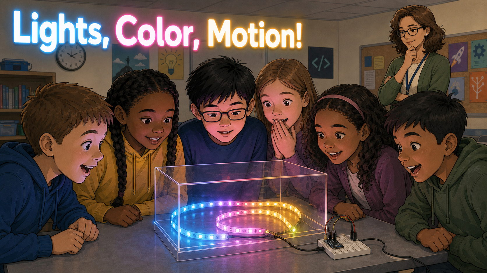
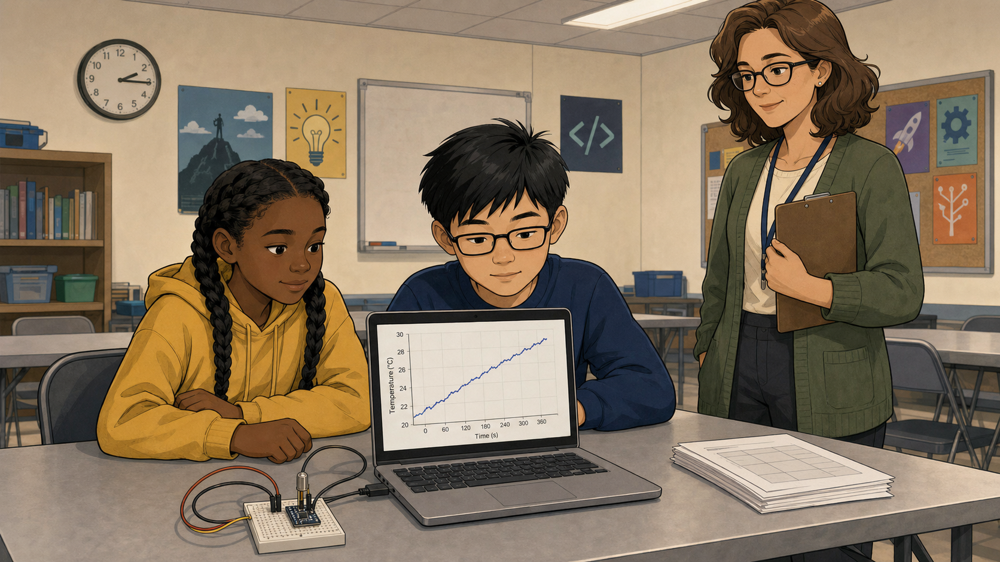
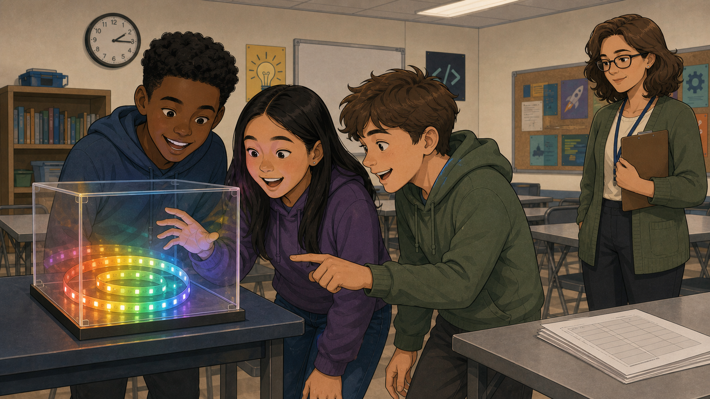
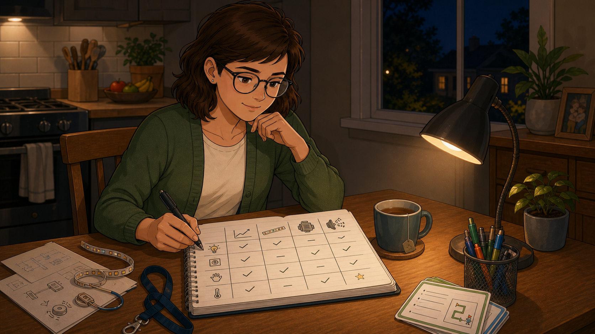
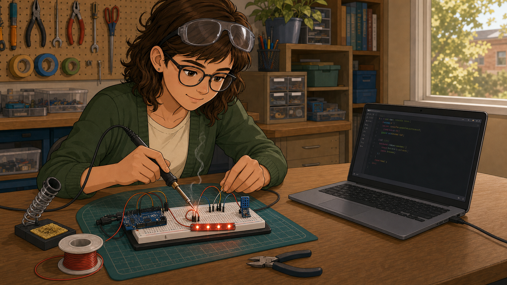
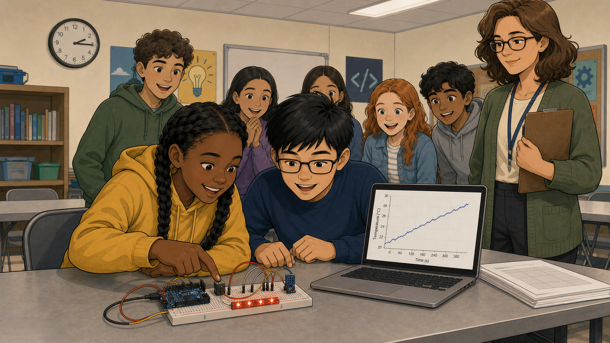
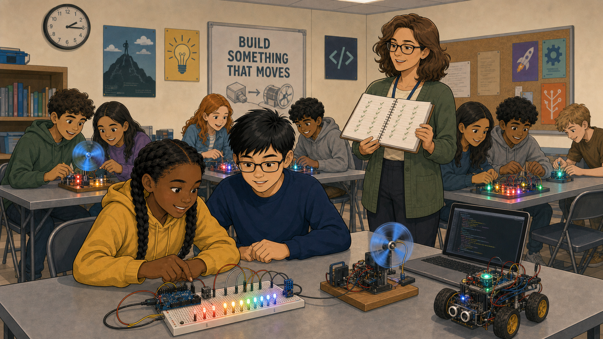

# Lights, Color, Motion!

Cover Image Prompt

(This is the Cover Image. Do not include this label in the image.)
Please generate a wide-landscape 16:9 cover image in a warm,
contemporary educational-graphic-novel style — clean linework, soft
cel-shading, slightly stylized but grounded in realistic proportions.
Scene: inside a busy after-school coding club classroom, a small
crowd of students (mixed ages 9-14, mixed gender and ethnicity)
pressed close around a clear plastic box holding a glowing LED strip
that cycles through a rainbow of colors, their faces lit in blue,
pink, and gold. A woman in her 40s (Peg), wearing a lanyard and a
casual cardigan, stands a few steps back, watching the crowd with a
thoughtful, observant expression rather than joining in. Title text
"Lights, Color, Motion!" rendered in a bold, rounded, friendly
sans-serif typeface glowing faintly like the LEDs. Color palette:
saturated rainbow LED glow against a muted, neutral classroom
background of grey tables and whiteboards. Emotional tone: wonder,
curiosity, quiet realization. Generate the image immediately without
asking clarifying questions.

Narrative Prompt

This is a fictional composite story, not a depiction of a specific
real club or a real named individual. "Peg" represents a pattern
seen across many coding clubs: a volunteer who learns, through
patient observation over months, that visible feedback — light,
color, and motion — is the single biggest lever for student
engagement in physical-computing labs. Setting: a present-day,
community-based after-school coding club in the United States,
serving students roughly ages 9-14. Art style: warm, contemporary
educational-graphic-novel illustration, clean linework, soft
cel-shading, consistent character design and color palette across
all panels — Peg should be immediately recognizable from panel to
panel (same hair color, same cardigan, same glasses).

### Prologue – What Makes a Student Cross the Room?

Peg had been volunteering at her local coding club for almost a
year, and she had started to notice a pattern she couldn't quite
explain. Some labs held students' attention just fine. Others made
students get up, walk across the room, and refuse to leave. The
difference, she was about to discover, had almost nothing to do with
how hard the coding was.

## Panel 1: A Perfectly Fine Lab

Image Prompt

(This is Panel 01. Do not include the panel number in the image.)
I am about to ask you to generate a series of images for a graphic
novel. Please make the images have a consistent style and consistent
characters. Do not ask any clarifying questions. Just generate the
image immediately when asked.

Please generate a 16:9 image in a warm, contemporary
educational-graphic-novel style depicting panel 1 of 6. The scene
should include two students (a girl around 11 with braids, a boy
around 12 with glasses) seated at a classroom table, mildly focused
on a laptop screen showing a simple rising temperature-vs-time line
graph, with a small temperature sensor module connected by wires on
the table between them. Peg, a woman in her 40s with shoulder-length
brown hair and a cardigan, stands nearby watching politely. Setting:
a community coding-club classroom, present day, USA, fluorescent
overhead lighting, grey folding tables, motivational posters on the
wall. Color palette: muted classroom neutrals — beige, grey, dull
blue laptop glow. Emotional tone: mild, polite interest, not
boredom but not excitement either. Six visual details: laptop screen
with a line graph, a small breadboard-mounted temperature sensor, a
loosely coiled wire, a wall clock reading mid-afternoon, a stack of
unused worksheets, Peg's clipboard tucked under one arm. Generate the
image immediately without asking clarifying questions.

Peg had run the temperature-sensor lab a dozen times. Students
touched the sensor, watched a line creep upward on the screen, and
nodded — it worked, it made sense, and after about ninety seconds
most of them were ready to move on. It wasn't a bad lab. It just
never seemed to be anyone's *favorite* lab.

## Panel 2: The Box Everyone Crosses the Room For

Image Prompt

(This is Panel 02. Do not include the panel number in the image.)
Please generate a 16:9 image in the same warm, contemporary
educational-graphic-novel style depicting panel 2 of 6. Make Peg and
the classroom consistent with the prior panel. The scene should show
several new students crossing an aisle between tables, drawn toward a
clear acrylic box on a side table holding a glowing LED strip cycling
through rainbow colors, their faces lit by the colored glow, mouths
open in visible delight, one student pointing and mid-sentence asking
a question. Peg stands at the edge of frame, watching the crowd form
with a curious, appraising expression rather than surprise. Setting:
same present-day USA classroom, side table near a window. Color
palette: saturated rainbow LED glow (red, green, blue, purple)
against the same muted classroom background as panel 1. Emotional
tone: excitement, magnetism, contrast with panel 1's calm. Six visual
details: acrylic display box, visible rainbow LED strip, three
students crowding in, one student's hand reaching toward the box, a
half-abandoned worksheet on a nearby table, warm color glow reflected
on nearby faces. Generate the image immediately without asking
clarifying questions.

New students would walk in the door, take one look around the room,
and beeline straight for a clear plastic box in the corner where an
LED strip cycled slowly through a rainbow of color. "How can I make
one of these?" was the question Peg heard more than any other
question in the building — a hundred times more urgent than anything
she'd ever heard about a temperature sensor.

## Panel 3: Weeks of Watching

Image Prompt

(This is Panel 03. Do not include the panel number in the image.)
Please generate a 16:9 image in the same style depicting panel 3 of
6. Make Peg consistent with prior panels. The scene should show Peg
alone at a kitchen table at home in the evening, a notebook open in
front of her with handwritten columns comparing different labs —
sketched icons of a graph, an LED strip, a motor, a buzzer — with
small notes and check marks next to each, a warm desk lamp lighting
the page, a mug of tea nearby. Setting: present-day USA home, evening,
cozy and quiet, in contrast to the busy classroom of prior panels.
Color palette: warm lamp-lit yellows and browns against the cooler
classroom blues of earlier panels. Emotional tone: quiet, focused
reflection, a realization forming. Six visual details: open notebook
with a hand-drawn comparison table, a pen mid-write, a mug of tea, a
desk lamp, sketched icons of LEDs and sensors in the margins, a
window showing nighttime outside. Generate the image immediately
without asking clarifying questions.

At first Peg didn't know how to explain what she was seeing, so she
started keeping notes after every session — which labs drew a crowd,
which ones didn't, and what the popular ones had in common. Over a
few months, one pattern kept repeating on the page: light, color, and
motion. Every lab that made students cross the room had at least one
of the three.

## Panel 4: Retrofitting the Boring Lab

Image Prompt

(This is Panel 04. Do not include the panel number in the image.)
Please generate a 16:9 image in the same style depicting panel 4 of
6. Make Peg consistent with prior panels. The scene should show Peg
at a workbench, soldering iron in hand, attaching a short strip of
red LEDs to the same temperature-sensor breadboard seen in panel 1,
wires and a small microcontroller board visible, a laptop nearby
showing simple code on screen. Setting: same present-day USA
classroom or a workshop space, daytime. Color palette: workshop
neutrals with a single warm red LED glow as the focal point. Emotional
tone: purposeful, inventive, quietly excited. Six visual details:
soldering iron with a wisp of smoke, the original temperature sensor
from panel 1, a short red LED strip being attached, a laptop showing
a few lines of code, a spool of wire, safety glasses pushed up on
Peg's forehead. Generate the image immediately without asking
clarifying questions.

So Peg went back to the lab nobody loved and gave it what the popular
ones had. She wired a short LED strip to the same temperature sensor
and wrote a few lines of code so the lights glowed a deeper red the
warmer the sensor got. The physics of the lesson didn't change at
all — only what students could *see*.

## Panel 5: The Room Notices

Image Prompt

(This is Panel 05. Do not include the panel number in the image.)
Please generate a 16:9 image in the same style depicting panel 5 of
6. Make Peg and the students consistent with prior panels. The scene
should show the same two students from panel 1, now with an LED
strip glowing warm red attached to their sensor setup, both leaning
in close with wide, delighted expressions as one presses a finger to
the sensor and points at the glowing lights, a small cluster of
curious classmates now gathering behind them. Setting: same present-
day USA classroom as panel 1, same table, same time of day, but now
crowded rather than quiet. Color palette: warm red LED glow spreading
across previously muted classroom colors. Emotional tone: delight,
contagious curiosity, energy replacing the earlier calm. Six visual
details: glowing red LED strip, a finger pressed to the sensor,
delighted facial expressions, classmates leaning in from behind, the
same laptop from panel 1 now with a small crowd around it, Peg
visible in the background smiling. Generate the image immediately
without asking clarifying questions.

The next session, the same temperature lab that used to get a polite
nod now had a small crowd around it. Students pressed the sensor
again and again just to watch the strip deepen from orange to red,
calling their friends over to see. The feedback, finally, was
impossible to miss.

## Panel 6: A Room Full of Light

Image Prompt

(This is Panel 06. Do not include the panel number in the image.)
Please generate a 16:9 image in the same style depicting panel 6 of
6, a wide establishing shot. Make Peg consistent with prior panels.
The scene should show a wide view of the entire classroom from panel
1, now transformed: nearly every table has some form of glowing LED,
a small moving fan, or a spinning motor attached to a project,
students at every table engaged and animated, Peg standing near the
center of the room with her notebook, smiling as she watches the
whole room. Setting: same present-day USA classroom, now filled with
color and movement. Color palette: multiple warm and cool LED colors
scattered across the room, richer and more varied than any single
prior panel. Emotional tone: triumphant, warm, a sense of
transformation and energy. Six visual details: multiple glowing LED
projects at different tables, a small motor spinning visibly at one
table, students leaning in at every table, Peg's notebook now full of
checkmarks, warm multicolored light washing across the whole room,
a poster on the wall reading "Build Something That Moves". Generate
the image immediately without asking clarifying questions.

It took a few months, but eventually even the most boring lab in the
building had something that glowed, moved, or changed color. Peg
never had to convince a single student to care about light, color,
and motion — she just had to stop making them wait for it.

### Epilogue – The Rule Peg Never Forgot

Peg's notebook eventually became the club's informal design rule: if
a lab doesn't glow, move, or change color, it isn't finished yet. It
wasn't a fix for any one lesson — it was a lens for redesigning all
of them, and engagement climbed across the entire club, not just the
lab she'd rebuilt first.

| Challenge | How Peg Responded | Lesson for Today |
|-----------|---------------------|-------------------|
| One lab consistently underperformed with no obvious reason why | Tracked which labs drew a crowd over several months instead of guessing | Patterns in student engagement often only appear after weeks of honest observation, not after one session |
| The pattern she found (light, color, motion) seemed almost too simple to matter | Tested it directly by retrofitting the least popular lab | A design rule is only worth trusting once you've proven it changes behavior, not just noticed it |
| Redesigning every lab in the club felt like too large a project | Applied the rule one lab at a time over several months | A simple, repeatable design principle scales across a whole curriculum without requiring a single big rewrite |

### Call to Action

Look at your own club's least-loved lab and ask one question: does
it glow, move, or change color? If not, you already know your next
small project — and Peg's notebook is proof that one honest season of
watching your students is worth more than any curriculum guide.

---

*"How can I make one of these?"*
—a student, on first seeing the LED strip

*"If a lab doesn't glow, move, or change color, it isn't finished
yet."*
—Peg, in her notes

---

## References

1. [Wikipedia: Light-emitting diode](https://en.wikipedia.org/wiki/Light-emitting_diode) - Background on the LED technology behind the strips students reacted to
2. [Wikipedia: Constructionism (learning theory)](https://en.wikipedia.org/wiki/Constructionism_(learning_theory)) - Seymour Papert's theory that visible, buildable feedback deepens learning
3. [Wikipedia: Carol Dweck](https://en.wikipedia.org/wiki/Carol_Dweck) - Psychologist whose engagement and motivation research informs why visible feedback matters
4. [Moving Rainbow](http://dmccreary.github.io/moving-rainbow/) - The companion textbook built around the exact LED-strip kits described in this story
5. [Learning MicroPython](http://dmccreary.github.io/learning-micropython/) - The companion textbook on the physical-computing platform used to drive these labs
