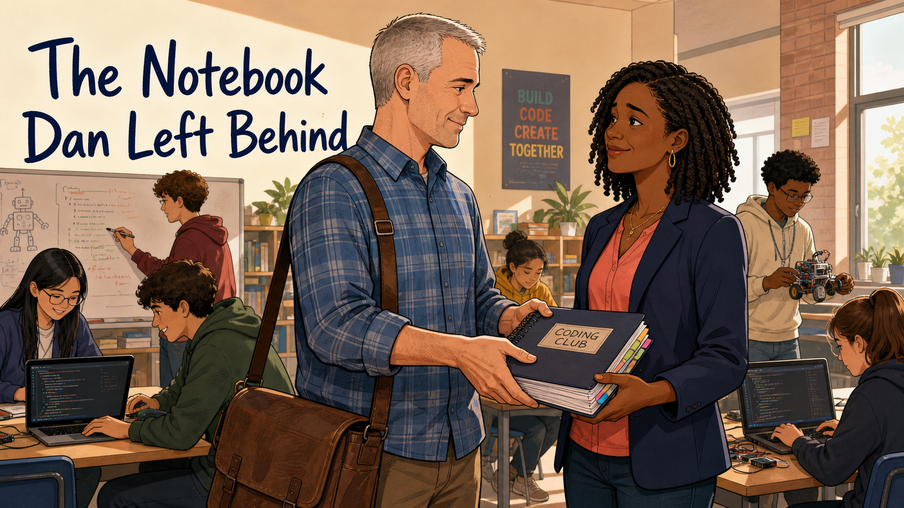
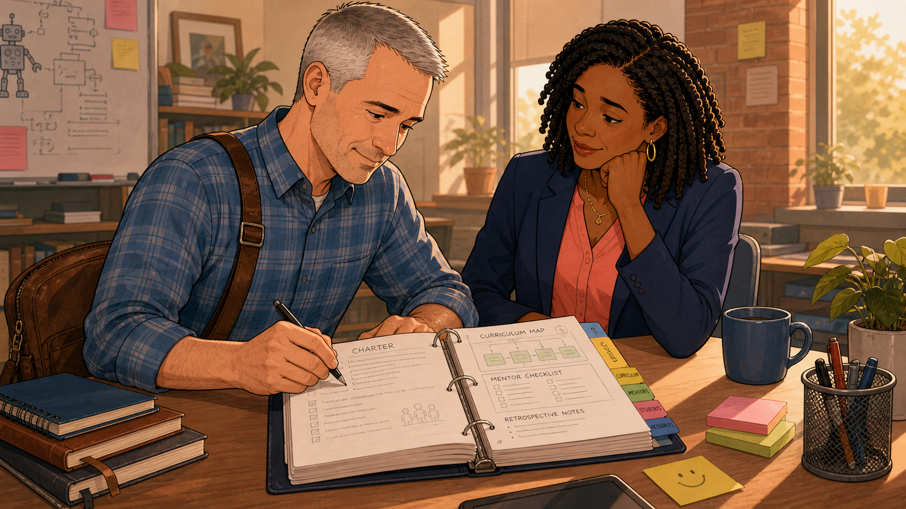
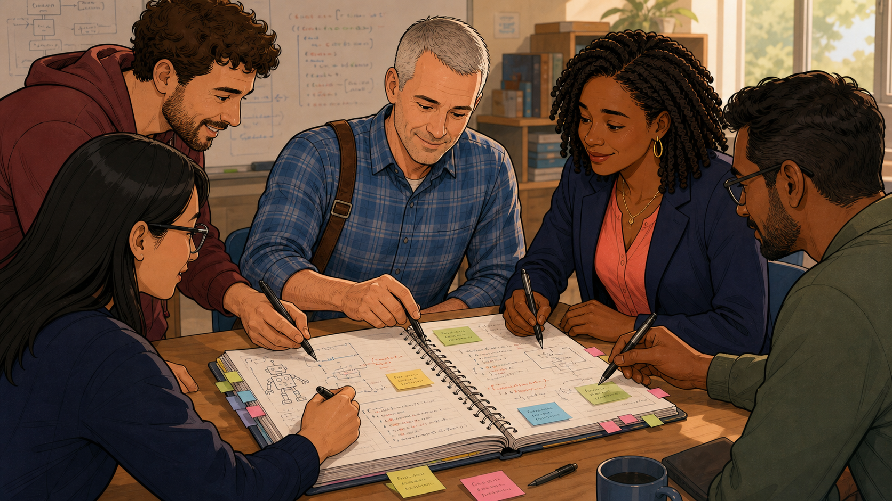
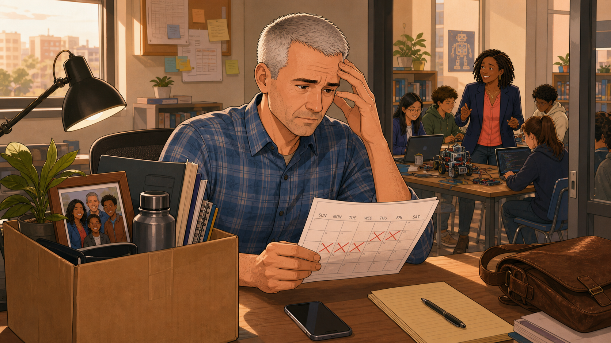
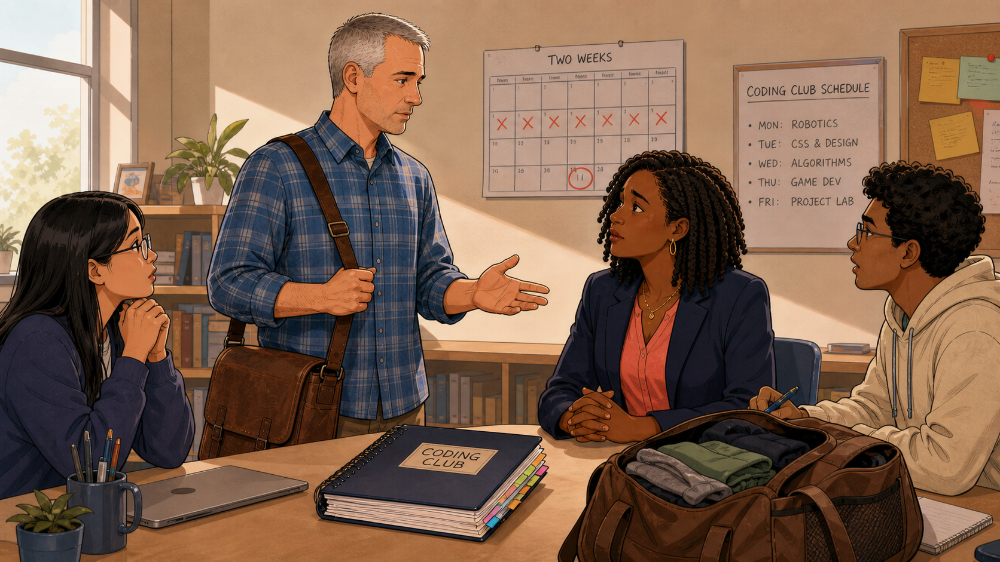
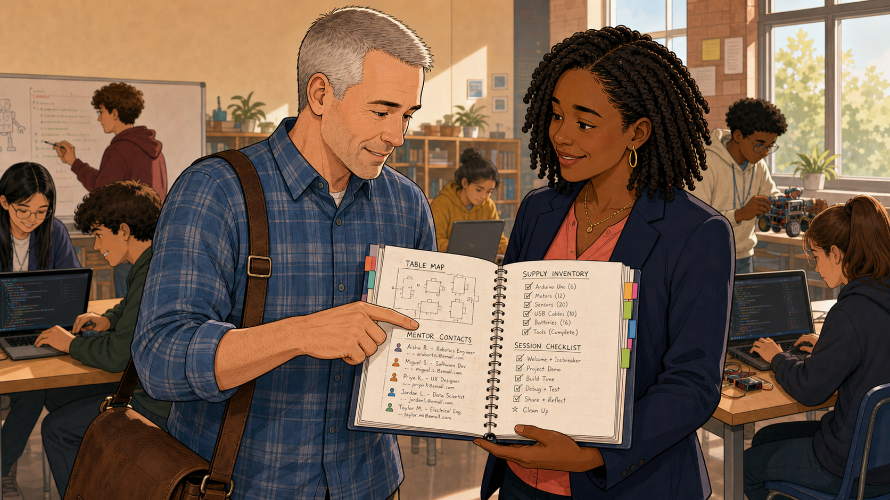
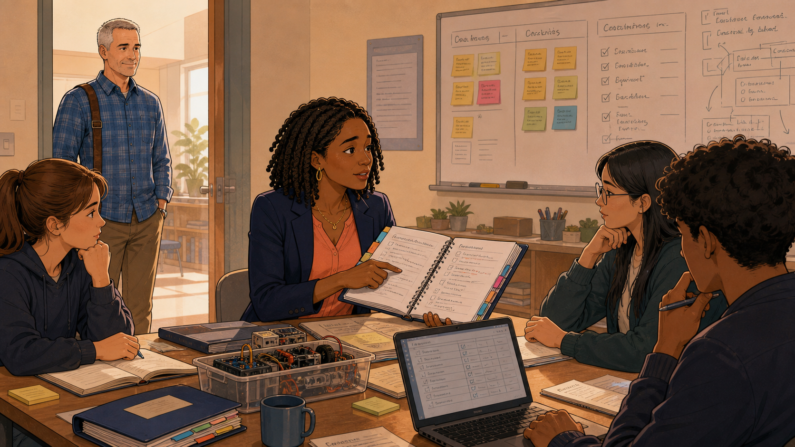
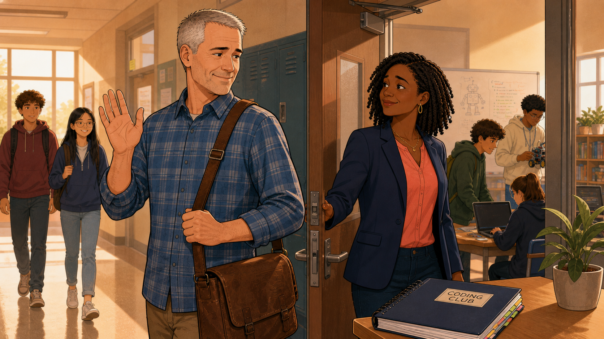
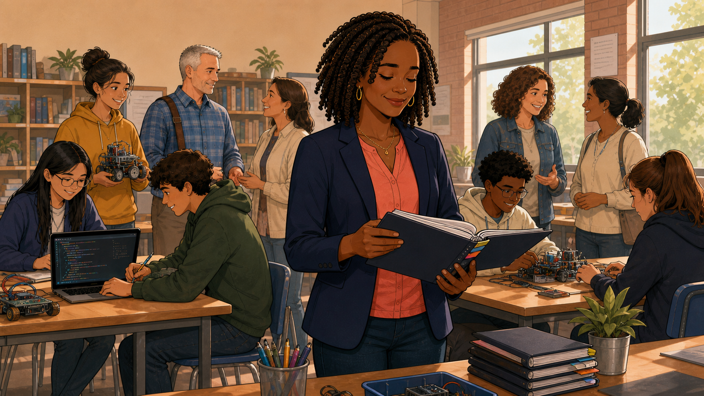

# The Notebook Dan Left Behind

Cover Image Prompt

(This is the Cover Image. Do not include this label in the image.)
Please generate a wide-landscape 16:9 cover image in a warm, contemporary
educational-graphic-novel style. The scene shows Dan, a man in his fifties
with short gray hair and a blue plaid button-up shirt, a brown leather
messenger bag over one shoulder, handing a thick navy spiral-bound binder
labeled "CODING CLUB" with colorful tab dividers to Simone, a Black woman in
her thirties with shoulder-length dark curly hair, wearing a navy blazer
over a coral blouse with gold hoop earrings and a thin gold necklace, who
receives it with both hands and a warm, confident smile. They stand at the
front of a bright classroom with a "BUILD CODE CREATE TOGETHER" poster and
a whiteboard sketch of a robot behind them, while students work at laptops
and one boy in a cream hoodie holds a small wheeled robot near a window
with afternoon light. Render the title text "The Notebook Dan Left Behind"
in a warm navy hand-lettered typeface in the upper left. Color palette:
warm ambers, honey browns, and navy blue accents. Emotional tone: a
hopeful, trust-filled handoff, not a sad goodbye. Generate the image
immediately without asking clarifying questions.

Narrative Prompt

This is a fictional composite story, not a depiction of a real coding club,
a real founder, or real named individuals — despite the title's use of the
name "Dan," the character is a fictional founding leader invented for this
case study, not the real-world author of this book. "Dan" (club founder,
short gray hair, blue plaid shirt, brown leather messenger bag) and
"Simone" (fellow mentor and eventual co-leader, navy blazer, coral blouse,
gold jewelry, dark curly hair) represent a pattern seen across many
single-leader-dependent clubs: a founder's know-how is usually trapped in
one head until someone deliberately writes it down. Recurring background
students include "Priya" (glasses, long dark hair) and "Jordan" (curly
hair, hoodie), both club regulars who appear across several panels. The
central prop is a navy spiral-bound binder labeled "CODING CLUB" with
color-coded tabs (Charter, Curriculum, Mentors, Students, Resources).
Setting: a present-day mid-sized American public-school coding club, during
the two weeks after the founder accepts a job offer that requires
relocating out of state. Art style: warm, contemporary educational-graphic-
novel illustration, clean linework, soft cel-shading, consistent character
design and color palette across all panels — Dan and Simone should be
immediately recognizable from panel to panel.

### Prologue – A Binder Nobody Asked For

Nobody had told Dan to keep a binder. He just did it, session after
session, for three years: the charter he wrote the week the club started,
a curriculum map sketched and re-sketched, a mentor checklist, and pages
of retrospective notes after every single meeting. Other mentors teased
him for it sometimes — "that's just Dan being Dan." Nobody expected to
find out, on fourteen days' notice, exactly how much that habit was worth.

## Panel 1: The Phone Call

Image Prompt

(This is Panel 01. Do not include the panel number in the image.)
I am about to ask you to generate a series of images for a graphic novel.
Please make the images have a consistent style and consistent characters.
Do not ask any clarifying questions. Just generate the image immediately
when asked.

Please generate a 16:9 image in a warm, contemporary educational-graphic-
novel style depicting panel 1 of 9. The scene shows Dan, alone in the
coding club's empty classroom after hours, a phone pressed to one ear
while he uses a small screwdriver to tinker with a wheeled robot wired to
an open laptop, wearing his signature blue plaid shirt and messenger bag,
with a thoughtful half-smile as he listens. Setting: present-day USA, a
school classroom at dusk, empty student chairs in soft shadow behind him,
a whiteboard sketch of a robot and meeting notes on the wall, a shelf of
books and a small potted plant to one side, warm desk-lamp light mixing
with fading window light. Color palette: warm amber and honey tones
against cooling blue dusk light through the window. Emotional tone: quiet,
reflective, a moment about to change everything. Six visual details: the
phone at his ear, the wheeled robot wired to the laptop, the screwdriver
in his hand, the whiteboard robot sketch, a plastic bin of loose
electronics parts, his messenger bag still over his shoulder. Generate the
image immediately without asking clarifying questions.

It was an ordinary Tuesday evening, Dan alone with a stubborn wheeled
robot long after the last student had gone home, when his phone rang. An
old colleague was on the line with an offer: lead a new engineering
program two states away, start date in three weeks. Dan said yes before
he'd finished picturing what saying yes would cost the club he'd spent
three years building. The screwdriver kept turning in his hand while his
mind was already somewhere else entirely.

## Panel 2: Not a Plan He Was Inventing

Image Prompt

(This is Panel 02. Do not include the panel number in the image.)
Please generate a 16:9 image in the same style depicting panel 2 of 9.
Make Dan consistent with the prior panel and introduce Simone for the
first time. The scene shows Dan and Simone seated together at a desk, Dan
writing with a pen in an open navy binder labeled "CODING CLUB" with
color-coded tab dividers, its pages showing a "CHARTER" section, a
"CURRICULUM MAP" flowchart, a "MENTOR CHECKLIST," and "RETROSPECTIVE
NOTES," while Simone rests her chin on her hand and watches with warm,
attentive interest. Setting: present-day USA, the same classroom, golden
late-afternoon light through a window, a whiteboard robot sketch faintly
visible behind them, a coffee mug and a small stack of notebooks on the
desk. Color palette: warm honey tones, navy binder as a visual anchor.
Emotional tone: calm, trusting, unhurried. Six visual details: the open
binder's colored tab dividers, the "CHARTER" and "CURRICULUM MAP" pages,
Dan's pen mid-note, Simone's chin resting on her hand, the coffee mug, a
small sticky note with a smiley face on the desk. Generate the image
immediately without asking clarifying questions.

Before he told anyone else, Dan sat down with Simone, the mentor he
trusted most, and opened the binder he'd kept since the club's first
semester. The charter. The curriculum map. The mentor checklist. Three
years of retrospective notes in his own handwriting. This wasn't a plan
he was inventing under pressure, he told her; it already existed, page by
page, and it had just been waiting for a moment exactly like this one.

## Panel 3: The Whole Team, Not Just One

Image Prompt

(This is Panel 03. Do not include the panel number in the image.)
Please generate a 16:9 image in the same style depicting panel 3 of 9.
Make Dan and Simone consistent with prior panels. The scene shows five
people crowded closely around the same open "CODING CLUB" binder on a
table: Dan in the center pointing with a pen, Simone beside him, and
three more mentors and senior student volunteers leaning in from either
side, all writing notes or adding colorful sticky notes to the binder's
pages. Setting: present-day USA, the same classroom, a whiteboard with
code notes and a small robot sketch behind them, a coffee mug on the
table. Color palette: warm collaborative tones, pops of colorful sticky
notes against the navy binder. Emotional tone: energetic teamwork, shared
ownership. Six visual details: five sets of hands and pens around the
binder, colorful sticky notes being added to its pages, Dan's explaining
gesture, the whiteboard code notes in the background, a coffee mug on the
table, the binder's visible tab dividers. Generate the image immediately
without asking clarifying questions.

Word spread fast, and by the end of the week the whole mentor team, not
just Simone, was crowded around that same binder, pens in hand, adding
sticky notes of their own. Dan wanted every mentor to know where the
answers lived, not only the one person he'd asked to lead next. A club
that depended on a single hand-picked successor, he realized, was still a
club with just one point of failure.

## Panel 4: Fourteen Days

Image Prompt

(This is Panel 04. Do not include the panel number in the image.)
Please generate a 16:9 image in the same style depicting panel 4 of 9.
Make Dan consistent with prior panels. The scene shows Dan alone at his
desk, packing a cardboard box with a framed family photo, a water bottle,
and notebooks, while he holds up a printed weekly calendar covered in red
X marks, resting his forehead against his other hand with a heavy,
worried expression. Setting: present-day USA, the same classroom, morning
light through a window with a city skyline visible outside, a corkboard
with sticky notes and a schedule sheet on the wall. Through an open door
in the background, Simone works with three students at a table with a
laptop and a small robot kit, club life continuing normally. Color
palette: warm desk-lamp amber in the foreground against cooler daylight
in the background. Emotional tone: quiet overwhelm, the real cost of the
timeline sinking in. Six visual details: the packing box with a family
photo, the calendar covered in red X marks, his phone face-down on the
desk, the corkboard behind him, Simone and students visible working
through the open door, his leather messenger bag on the desk. Generate
the image immediately without asking clarifying questions.

Fourteen days. That was the real number once the moving truck was booked
and the calendar came out — fourteen days to close out a job, pack a
house, and hand off three years of work. Dan sat with the countdown in
his hand, more rattled by the goodbye than by the workload. Through the
open door behind him, the club carried on exactly as it should, because
it no longer needed him in the room to keep running.

## Panel 5: Saying the Number Out Loud

Image Prompt

(This is Panel 05. Do not include the panel number in the image.)
Please generate a 16:9 image in the same style depicting panel 5 of 9.
Make Dan and Simone consistent with prior panels, and add two student
mentors-in-training, Priya (glasses, long dark hair) and Jordan (curly
hair, hoodie), seated at the table. The scene shows Dan standing and
gesturing as he speaks, the navy "CODING CLUB" binder on the table in
front of the group along with Dan's own half-packed duffel bag showing
folded clothes, while a wall calendar behind him reads "TWO WEEKS" with a
row of red X marks leading to one circled date, beside a poster reading
"CODING CLUB SCHEDULE" listing Mon: Robotics, Tue: CSS & Design, Wed:
Algorithms, Thu: Game Dev, Fri: Project Lab. Setting: present-day USA, the
same classroom, midday light. Color palette: warm neutral tones with the
red calendar X marks as a visual accent. Emotional tone: candid,
matter-of-fact, determined rather than sad. Six visual details: the "TWO
WEEKS" calendar with the circled date, the weekly schedule poster, Dan's
half-packed duffel bag on the table, the open binder, Priya and Jordan's
attentive expressions, Simone listening with clasped hands. Generate the
image immediately without asking clarifying questions.

Dan gathered the team once more, this time saying the number out loud
instead of just carrying it in his head: two weeks, ending on a date
circled in red on the wall calendar behind him. His own duffel bag,
half-packed, sat right there on the table as proof he wasn't exaggerating.
But he pointed at the schedule poster, not at himself, promising that
Monday Robotics and every session after it would run on time, with or
without him in the building.

## Panel 6: Every Page That Never Makes It Into Memory

Image Prompt

(This is Panel 06. Do not include the panel number in the image.)
Please generate a 16:9 image in the same style depicting panel 6 of 9.
Make Dan and Simone consistent with prior panels. The scene shows Dan and
Simone standing close together, both looking down at the open "CODING
CLUB" binder, Dan pointing at a "TABLE MAP" diagram and a "MENTOR
CONTACTS" list on the left page, while the right page shows a "SUPPLY
INVENTORY" checklist and a "SESSION CHECKLIST" running from welcome
icebreaker to clean-up. Setting: present-day USA, the same classroom,
students working at laptops and a boy building a small robot visible in
the background, warm afternoon light. Color palette: warm honey tones,
the binder's checklists as the visual focus. Emotional tone: focused,
practical, reassuring. Six visual details: the table map diagram, the
mentor contacts list with names and emails, the supply inventory
checklist, the session checklist, Dan's pointing finger, students working
at laptops in the background. Generate the image immediately without
asking clarifying questions.

They went page by page through the parts nobody remembers to mention: a
table map showing exactly where each mentor sits, a supply inventory down
to the battery count, a session checklist running from welcome icebreaker
to final clean-up. Simone realized she wasn't being handed vague
encouragement. She was being handed the answer to every "wait, how did
Dan do this?" question she might ever face.

## Panel 7: Watching From the Doorway

Image Prompt

(This is Panel 07. Do not include the panel number in the image.)
Please generate a 16:9 image in the same style depicting panel 7 of 9.
Make Dan and Simone consistent with prior panels. The scene shows Simone
standing and leading a small mentor meeting, holding open a notebook page
and talking to two student mentors seated at a table covered in colorful
sticky notes, with a whiteboard behind her organized into labeled columns
filled with sticky notes and a rough diagram, a laptop open on the table,
and a bin of electronics parts nearby. Dan stands in the doorway in the
background, relaxed, arms loose at his sides, watching with a quiet,
proud smile without stepping into the room. Setting: present-day USA, the
same classroom, warm afternoon light. Color palette: warm tones, colorful
sticky notes as an accent against the whiteboard. Emotional tone: quiet
pride, a successful handoff caught mid-motion. Six visual details: the
labeled whiteboard columns full of sticky notes, Simone's open notebook,
the two student mentors taking notes, the bin of electronics parts, the
laptop on the table, Dan watching from the doorway. Generate the image
immediately without asking clarifying questions.

A few days before he left, Dan didn't run the retrospective meeting. He
watched Simone run it, standing in the doorway instead of at the
whiteboard. She sorted the week's sticky notes into the same categories
his notes had taught her: what went well, what got in the way, what to
try next time. He didn't say a word, because for the first time, the room
genuinely didn't need him to.

## Panel 8: The Last Goodbye

Image Prompt

(This is Panel 08. Do not include the panel number in the image.)
Please generate a 16:9 image in the same style depicting panel 8 of 9.
Make Dan and Simone consistent with prior panels. The scene shows Dan in
a school hallway, one hand raised in an easy wave, his messenger bag over
one shoulder, smiling warmly as students walk past him toward the
classroom in soft morning light. Simone stands at the open classroom
doorway across from him, one hand on the door, smiling back, with the
navy "CODING CLUB" binder resting on a table just inside the room, where
students are already at work on laptops and a small robot beneath a
whiteboard robot sketch. Setting: present-day USA, a school hallway and
classroom doorway, morning. Color palette: warm golden morning light,
navy and amber accents. Emotional tone: warm, unsentimental, forward-
looking rather than sad. Six visual details: Dan's raised waving hand,
students walking past him with backpacks, Simone holding the door open,
the binder resting on the table inside, students already working at
laptops, the whiteboard robot sketch visible through the doorway.
Generate the image immediately without asking clarifying questions.

On his last morning, Dan didn't linger. He gave one raised hand and an
easy smile from the hallway, already turning toward the exit while a
fresh wave of students filed past him into the classroom. Simone held the
door open behind him, not really for him, but for the club, which was
already back at its tables, opening the same binder to the same Tuesday
page it always turned to.

## Panel 9: The Club That Outgrew Him

Image Prompt

(This is Panel 09. Do not include the panel number in the image.)
Please generate a 16:9 image in the same style depicting panel 9 of 9, a
wide closing shot. Make Simone and Dan consistent with prior panels. The
scene shows Simone standing centrally, holding open a well-worn navy
"CODING CLUB" binder with visibly more colored tabs than before, smiling
down at its pages, surrounded by a full, lively classroom: students
working at laptops and with small robots on either side, and, further
back, a cluster of several adult mentors talking and helping, including
Dan, now just one face among the larger mentor group rather than standing
at the front. A small stack of matching navy binders sits on a table in
the foreground. Setting: present-day USA, the same classroom, months
later, bright daylight through large windows, bookshelves and potted
plants around the room. Color palette: warm, bright, celebratory tones,
more colorful than earlier panels. Emotional tone: quiet triumph, growth,
continuity. Six visual details: the well-worn binder with extra tabs,
the stack of matching binders on the table, the larger cluster of adult
mentors in the background, Dan blended into that group rather than
centered, students actively working throughout the room, bright window
light. Generate the image immediately without asking clarifying
questions.

Months later, the room had outgrown even the plan. Simone stood at the
center of a Tuesday session with a full bench of mentors behind her, more
adults helping than the club had ever had at once, while Dan, back for a
visit, blended into the crowd instead of standing at the front of it. On
the table beside her sat a small stack of binders now, not one — the club
had copied Dan's original before it grew too valuable to risk on a single
spine.

### Epilogue – What the Binder Actually Handed Over

Dan's club never missed a Tuesday. Not because Simone was a perfect copy
of Dan, but because she never had to be: the charter, the curriculum, the
mentor contacts, and three years of retrospective notes did the work that
a single irreplaceable leader usually has to do alone. The binder outlived
the emergency it was built for and kept paying off long after Dan had
unpacked his last box in a different state.

| Challenge | How Dan Responded | Lesson for Today |
|-----------|--------------------|-------------------|
| Dan had to leave with only two weeks' notice, far less time than any founder would choose | He didn't scramble to write a plan from scratch — he had been writing it, one retrospective at a time, for three years | Document your club's charter, curriculum, and procedures continuously, not only once a departure is already on the calendar |
| Knowledge that lives in one founder's head disappears the moment that founder does | He handed the binder to Simone, then walked the whole mentor team through it together, not just his chosen successor | Spread institutional knowledge across the whole team, not a single heir, so no one person becomes the new single point of failure |
| A new leader taking over could easily have felt like she was guessing at what "running it right" meant | The binder specified the table map, the supply inventory, mentor contacts, and a session checklist in writing | Written procedures turn "how does the founder do this" into "what does the plan say," removing guesswork from a leadership transition |
| Readers might expect a club to shrink or struggle once its founding leader leaves | Months later the club needed more mentors than ever, and Dan returned only as a guest, not as a linchpin | A club that survives a change of leadership was never really about one person — sustainable infrastructure, not a single hero, is what keeps it alive |

### Call to Action

Start your own binder today, even if you have no plans to ever leave.
Write down your charter, your curriculum map, your mentor contacts, and
what worked and what didn't after every session. The real test of a
coding club isn't how well it runs when its founder is in the room — it's
whether the next person can open the same binder and keep every kid's
Tuesday exactly as good as the week before.

---

*"I didn't build a club. I built a binder that happens to run a club."*
—Dan, on his last day

*"He didn't hand me a job. He handed me an answer key."*
—Simone, after her first solo session

*"A club that only works when one person is in the room isn't finished
being built yet."*
—Dan, from his own retrospective notes

---

## References

1. [Wikipedia: Succession planning](https://en.wikipedia.org/wiki/Succession_planning) - Background on how organizations prepare for the planned or unplanned departure of a leader
2. [Wikipedia: Knowledge management](https://en.wikipedia.org/wiki/Knowledge_management) - The practice of capturing institutional know-how, like Dan's binder, so it survives staff and volunteer turnover
3. [Wikipedia: Standard operating procedure](https://en.wikipedia.org/wiki/Standard_operating_procedure) - Documented step-by-step instructions similar to Dan's session checklist and supply inventory
4. [National Council of Nonprofits: Succession Planning for Nonprofits](https://www.councilofnonprofits.org/running-nonprofit/governance-leadership/succession-planning-nonprofits-managing-leadership) - Practical guidance volunteer-run and nonprofit organizations use to plan leadership transitions
5. [Coding Club: Training Mentors and Building a Club That Outlasts You](https://dmccreary.github.io/coding-club/chapters/35-training-mentors-and-succession/) - This book's own capstone chapter on writing a club playbook and succession plan, the concept this story dramatizes
