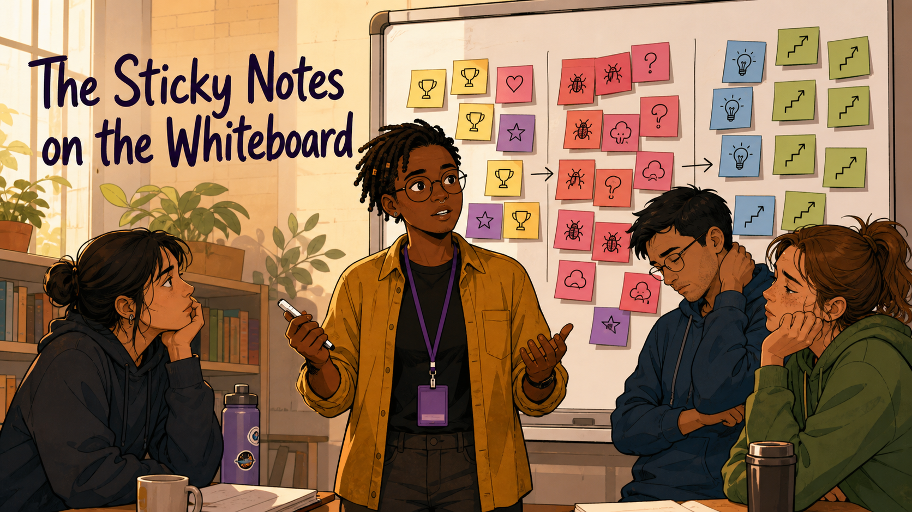
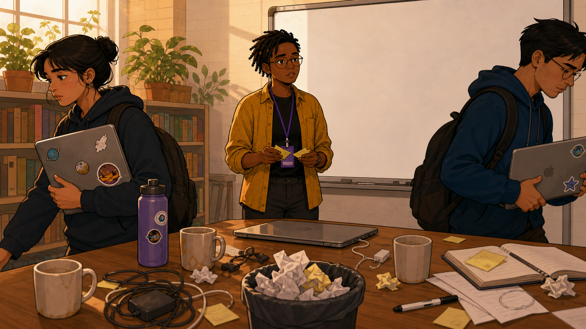
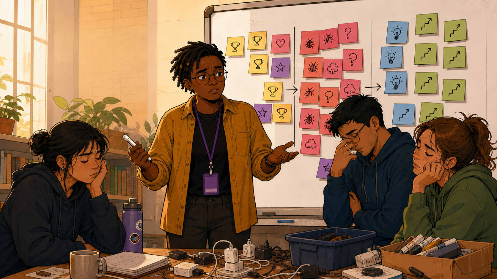
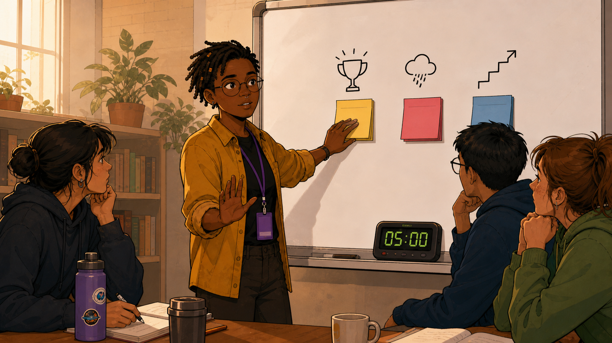
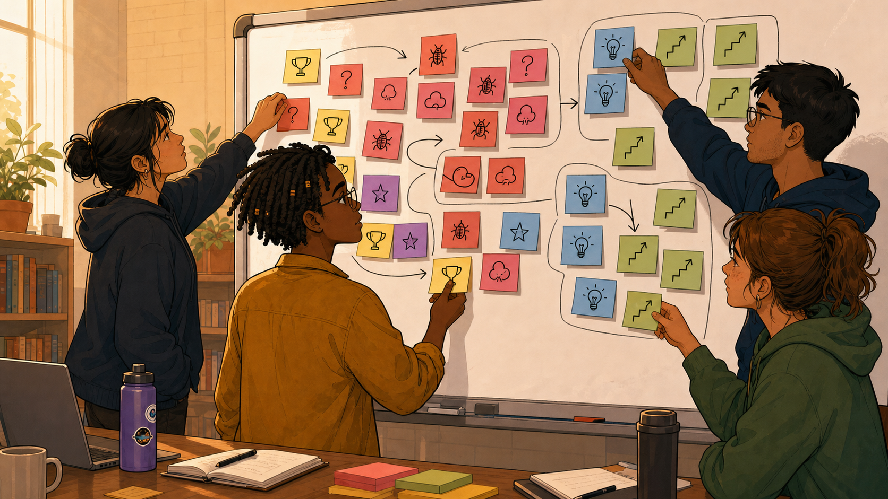
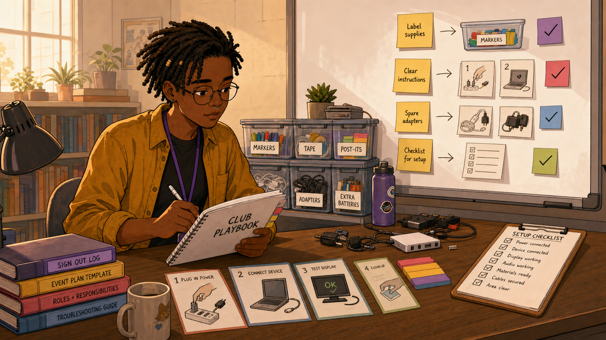
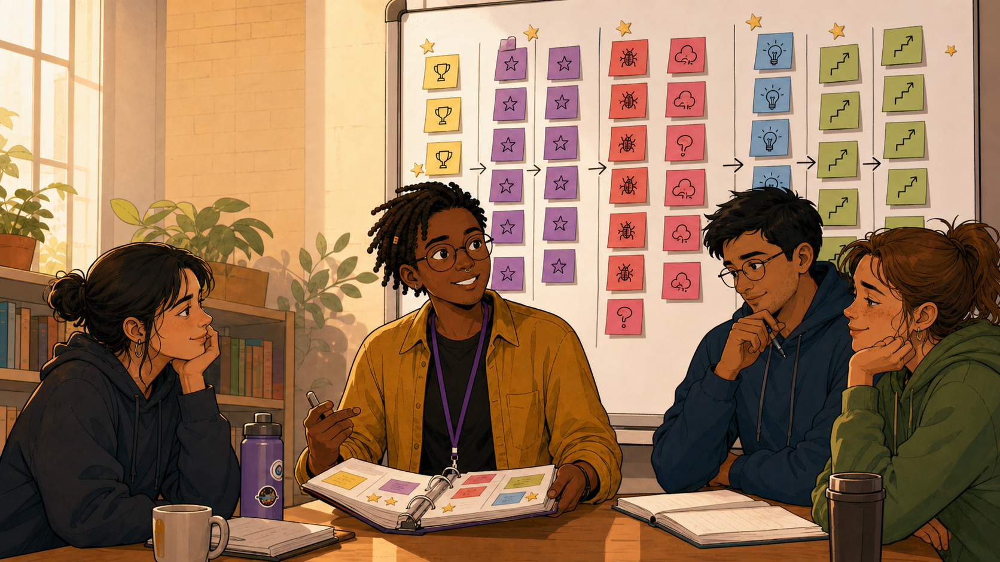

# The Sticky Notes on the Whiteboard

Narrative Prompt

This is a fictional composite story, not a depiction of a specific
real club or a real named individual. "Sam" (facilitator, short
locs, glasses, mustard-yellow shirt, purple lanyard, they/them)
represents a pattern seen across many coding clubs: mentors leave
each session exhausted and say nothing out loud, repeating the same
avoidable mistakes term after term, until someone starts a short,
structured retrospective habit. Setting: a present-day, community-
based after-school coding club in the United States. Art style:
warm, contemporary educational-graphic-novel illustration, clean
linework, soft cel-shading, consistent character design and color
palette across all panels — Sam should be immediately recognizable
from panel to panel.

### Prologue – Exhausted and Silent

Every Saturday ended the same way: mentors packed up their bags,
said a tired goodbye, and drove home without ever comparing notes on
what had actually happened that day. Sam had noticed the pattern for
months before deciding it was worth fixing.

## Panel 1: Everyone Leaves, Nobody Talks

<!--  -->

Image Prompt

(This is Panel 01. Do not include the panel number in the image.)
I am about to ask you to generate a series of images for a graphic
novel. Please make the images have a consistent style and consistent
characters. Do not ask any clarifying questions. Just generate the
image immediately when asked.

Please generate a 16:9 image in a warm, contemporary
educational-graphic-novel style depicting panel 1 of 6. The scene
should show a coding-club classroom at the end of a session, several
mentors silently packing bags and putting on jackets, avoiding eye
contact, visibly tired, a few stray sticky notes and papers left
scattered on tables, evening light through the windows. Sam, a person
with short locs and glasses wearing a mustard-yellow shirt and purple
lanyard, stands near the door watching the quiet exit with a
thoughtful expression. Setting: present-day USA after-school
classroom, early evening. Color palette: muted evening tones, warm
lamp light contrasted with tired body language. Emotional tone:
quiet exhaustion, missed opportunity. Six visual details: mentors
zipping up bags, avoided eye contact, scattered papers on tables,
evening light through windows, a wall clock reading past closing
time, Sam's thoughtful expression near the door. Generate the image
immediately without asking clarifying questions.

Every week ended the same way. Mentors packed up in near silence,
each one carrying some frustration or small triumph nobody else
would ever hear about, and drove home without comparing a single
note. Whatever had gone wrong that day would almost certainly go
wrong again next week, because nobody was writing it down.

## Panel 2: The Same Mistake, Three Terms Running

<!--  -->

Image Prompt

(This is Panel 02. Do not include the panel number in the image.)
Please generate a 16:9 image in the same style depicting panel 2 of
6. Make Sam consistent with the prior panel. The scene should show a
split composition or layered classroom implying repetition across
three different sessions — the same tangled charging cables causing
problems, the same confused student expression, the same frustrated
mentor gesture — subtly time-stamped by different lighting (morning,
afternoon, evening) to suggest weeks apart. Sam stands to one side
holding a notebook, frowning slightly as they notice the repetition.
Setting: present-day USA classroom, same room across different
sessions. Color palette: muted, slightly desaturated to suggest
frustration and déjà vu. Emotional tone: quiet frustration,
recognition of a repeating pattern. Six visual details: tangled
charging cables, a repeated confused student expression, a repeated
frustrated mentor gesture, subtle lighting differences suggesting
different days, Sam's notebook, a faint circular arrow motif
suggesting repetition. Generate the image immediately without asking
clarifying questions.

Sam started noticing it directly: the same tangle of charging cables
tripping up setup, the same confusion over which laptop belonged to
which login, the same rushed goodbye before anyone could mention it
out loud. None of it was written down anywhere, so none of it ever
got fixed — it just happened again, and again.

## Panel 3: Five Minutes, That's All

<!--  -->

Image Prompt

(This is Panel 03. Do not include the panel number in the image.)
Please generate a 16:9 image in the same style depicting panel 3 of
6. Make Sam consistent with prior panels. The scene should show Sam
standing at a blank whiteboard, marker in hand, gesturing to a small
group of three mentors gathered loosely around, proposing something
with an open, inviting posture, a small clock icon or timer sketched
in the corner of the whiteboard suggesting "5 minutes." Setting:
present-day USA classroom, just after a session has ended, other
mentors mid-packing in the background. Color palette: warm, slightly
brighter than panel 2, suggesting a small shift in energy. Emotional
tone: tentative hope, a small proposal being floated. Six visual
details: a mostly blank whiteboard, a marker in Sam's hand, a
sketched clock/timer icon, three mentors gathered loosely, other
mentors still packing bags in the background, Sam's open inviting
gesture. Generate the image immediately without asking clarifying
questions.

"Five minutes," Sam said, marker in hand at a blank whiteboard.
"Before anyone leaves, just five minutes — what worked, what didn't,
one idea for next time." Nobody had time for a meeting. Everybody had
time for five minutes.

## Panel 4: Three Columns Fill In

<!--  -->

Image Prompt

(This is Panel 04. Do not include the panel number in the image.)
Please generate a 16:9 image in the same style depicting panel 4 of
6. Make Sam and the room consistent with prior panels. The scene
should closely resemble a lively debrief session: Sam standing at a
whiteboard now filling with three columns of color-coded sticky
notes — yellow notes with trophy and heart icons on the left, pink
and red notes with bug and question-mark icons in the middle, blue
and green notes with lightbulb and upward-arrow icons on the right —
while three mentors sit nearby, one resting a hand on the back of
their neck looking tired but engaged, another leaning in thoughtfully.
Setting: same present-day USA classroom, warm late-afternoon light,
potted plants near a window. Color palette: warm yellows, pinks, and
blues from the sticky notes standing out against a neutral room.
Emotional tone: focused, collaborative, cathartic. Six visual
details: yellow sticky notes with trophy/heart icons, pink sticky
notes with bug/question icons, blue sticky notes with lightbulb/arrow
icons, a marker in Sam's hand, a mentor resting a hand on their neck,
potted plants near a window. Generate the image immediately without
asking clarifying questions.

The first debrief felt awkward for about thirty seconds. Then the
notes started coming: a yellow one for the robot demo that finally
worked, a pink one for the login problem that ate fifteen minutes
again, a blue one for an idea nobody had tried yet. Three columns —
what worked, what didn't, what to try next — turned a vague week into
something the whole team could actually see.

## Panel 5: A Wall That Remembers

<!--  -->

Image Prompt

(This is Panel 05. Do not include the panel number in the image.)
Please generate a 16:9 image in the same style depicting panel 5 of
6. Make Sam consistent with prior panels. The scene should show the
same whiteboard now much fuller than panel 4, weeks of sticky notes
layered and organized, with a visible "resolved" section where
several pink issue-notes have been moved and stacked under a green
checkmark heading, implying problems getting fixed over time. Sam
stands back, arms crossed, satisfied, looking at the wall of
accumulated notes. Setting: same present-day USA classroom, a
different, later time of day (perhaps golden late-afternoon light)
suggesting time has passed. Color palette: rich, full board of
color-coded notes contrasted against panel 1's near-empty room.
Emotional tone: quiet satisfaction, visible progress. Six visual
details: a densely packed whiteboard, a "resolved" section with a
green checkmark heading, stacked pink notes under that heading, Sam's
crossed-arm satisfied posture, golden late-afternoon light, a small
stack of blank sticky notes ready for the next debrief. Generate the
image immediately without asking clarifying questions.

By the end of the season, the whiteboard wasn't just full — it
remembered things. A whole section of once-recurring problems now sat
under a hand-drawn checkmark: resolved. The tangled cables had a
labeling system. The login confusion had a printed cheat sheet taped
to every laptop. Nobody had to rediscover the same fix twice.

## Panel 6: A Season Handed Off in One Photo

<!--  -->

Image Prompt

(This is Panel 06. Do not include the panel number in the image.)
Please generate a 16:9 image in the same style depicting panel 6 of
6. Make Sam consistent with prior panels. The scene should show a
new, unfamiliar mentor holding up a phone photographing the full
sticky-note whiteboard, an expression of pleasant surprise and
understanding on their face, while Sam stands nearby explaining
something with a relaxed, welcoming posture, other mentors visible
working calmly with students in the background. Setting: same
present-day USA classroom, a new term, bright and orderly. Color
palette: bright, optimistic, warm classroom tones. Emotional tone:
continuity, successful handoff, quiet pride. Six visual details: a
new mentor's phone photographing the whiteboard, the new mentor's
surprised and pleased expression, Sam's relaxed explaining posture,
students working calmly in the background, the fully organized
sticky-note board, a fresh stack of blank notes ready for the new
term. Generate the image immediately without asking clarifying
questions.

When a brand-new mentor joined the following term, she didn't need a
week to catch up — she took one photo of the whiteboard and understood
more about how the club actually ran than any handbook could have
told her. Five minutes a week, it turned out, was enough to build
something that outlasted any single season.

### Epilogue – The Meeting Too Small to Skip

Sam never called it a "retrospective" out loud — that word would
have scared people off. It was just five minutes, every week, on a
whiteboard nobody was allowed to erase without a photo first. That
was the whole system, and it was enough to turn a room full of tired,
silent mentors into a team that kept getting better.

| Challenge | How Sam Responded | Lesson for Today |
|-----------|------------------------|-------------------|
| Mentors left every session exhausted without ever comparing notes | Proposed a five-minute debrief, small enough that nobody could claim they didn't have time | The right size for a habit that needs to survive volunteer fatigue is the smallest size that still works |
| The same mistakes kept recurring term after term with nobody tracking them | Structured the debrief into three simple columns — what worked, what didn't, what to try next | A retrospective doesn't need to be complicated to be useful — it needs to be repeatable |
| Institutional knowledge lived only in individual mentors' memories | Kept every week's notes visible on the same whiteboard instead of erasing it | A wall that remembers outlives any single mentor's tenure — and hands off cleanly to whoever comes next |

### Call to Action

Before your mentors leave your next session, give them five minutes
and three colors of sticky notes. You don't need a formal process —
you need a habit small enough that nobody skips it, and honest
enough that the same mistake only has to happen once.

---

*"Five minutes. That's all I'm asking."*
—Sam, proposing the first debrief

*"She took one photo of the whiteboard and understood more than any
handbook could have told her."*
—from the club's notes, on a new mentor's first day

---

## References

1. [Wikipedia: Sprint retrospective](https://en.wikipedia.org/wiki/Sprint_retrospective) - Background on the short, structured team debrief format this habit adapts
2. [Wikipedia: After-action review](https://en.wikipedia.org/wiki/After-action_review) - The military-derived practice of briefly reviewing what worked and what didn't right after an event
3. [Wikipedia: Continual improvement process](https://en.wikipedia.org/wiki/Continual_improvement_process) - The broader principle behind turning small, regular reviews into lasting change
4. [STEM Classroom Administration](http://dmccreary.github.io/stem-classroom-admin/) - The companion textbook on managing classroom routines and technology
5. [Wikipedia: CoderDojo](https://en.wikipedia.org/wiki/CoderDojo) - A global volunteer coding-club movement built on shared mentor knowledge across sessions
