# Turtles All the Way Down

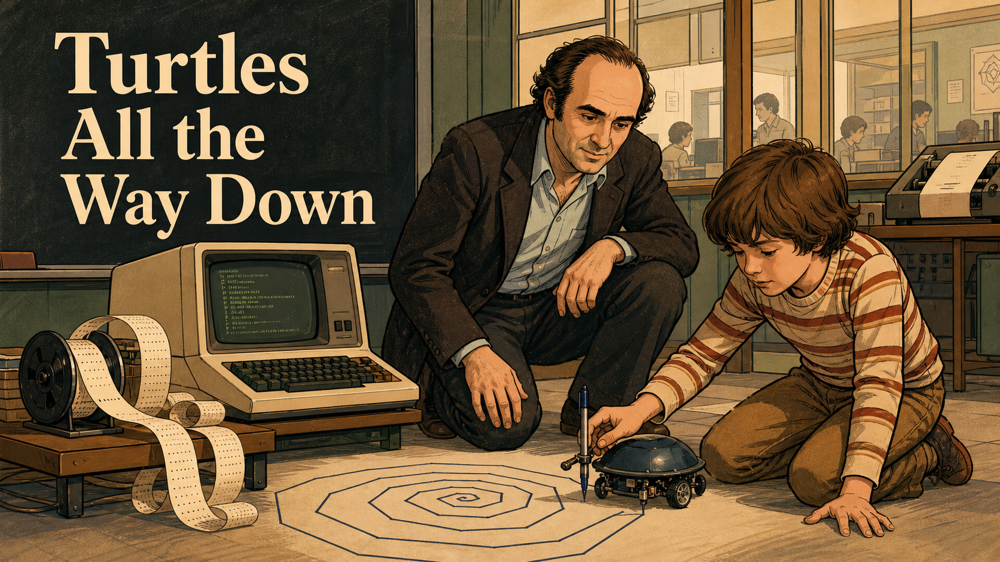

Cover Image Prompt

(This is the Cover Image. Do not include this label in the image.)
Please generate a wide-landscape 16:9 cover image in a warm, sepia-toned
educational graphic-novel illustration style with detailed pen-and-ink
linework and muted earth-tone digital coloring. Scene: an MIT lab in the
early 1970s. A man in his early forties with curly dark brown hair, in a
dark brown suit jacket over an open-collar light blue shirt, crouches
beside a boy of about ten in a red-and-cream striped sweater, both
watching intently as a small dome-shelled, wheeled robot traces a spiral
path on a large sheet of paper on the floor. Behind them, an early
computer terminal with a green-on-black screen sits on a wooden stand,
coiled punched paper tape spilling onto the floor beside it. A chalkboard
on the left carries the hand-lettered title "Turtles All the Way Down" in
a warm cream serif typeface. Through a glass partition behind the pair,
other researchers work at desks and a printer in a busy lab, with a
cityscape visible farther back. Color palette: warm sepia browns, tans,
and olive greens, with the cream title text and a pale blue-green
terminal glow as accents. Emotional tone: quiet concentration, discovery,
mentorship. Six visual details: the spiral drawn in dark ink on butcher
paper, the small pen mounted under the robot's shell, the coiled punch
tape, the man's rolled-up shirt sleeve, the boy's focused pointing hand,
the busy lab visible through the glass behind them. Generate the image
immediately without asking clarifying questions.

Narrative Prompt

This is a biographical story about a real historical figure, Seymour
Papert (1928-2016), mathematician and educator, born in Pretoria, South
Africa, who later worked in Geneva, Switzerland and at MIT in Cambridge,
Massachusetts, USA. The story spans roughly the 1930s to the present day.
Central themes: children learn best by building, testing, and debugging
their own constructions rather than being told the right answer
("constructionism"); the computer as a material for children to think
with, not a machine that drills them. Art style: warm, sepia-toned
educational graphic-novel illustration, detailed pen-and-ink linework,
muted earth-tone palette (browns, tans, olive) with selective pale
blue/turquoise accents for screens, consistent across all panels.
Character-consistency note: Papert is drawn with curly dark brown hair
through his middle years, receding and turning gray/white by the 1990s,
generally in a dark jacket over an open-collar light shirt; his build and
jacket style stay consistent within each era. Creative liberties: Panel 8's
notebook cover reading "Turtles All the Way Down / Seymour Papert" is an
artistic stand-in for the real book he was drafting at that desk,
*Mindstorms: Children, Computers, and Powerful Ideas* (1980) - it is not
the actual title of his book. Panel 12 depicts a present-day coding club
with an elder mentor whose likeness echoes Papert's; this is a symbolic
legacy device representing his enduring influence, not a claim that
Papert (who died in 2016) was literally present. Likenesses of Piaget,
Minsky, and Papert's LOGO collaborators are dramatized approximations for
a general audience, not verified portraiture. Several panels compress
years of collaborative work into one representative scene for pacing.

### Prologue – The Boy Who Loved Gears

Before he was two years old, Seymour Papert was obsessed with the
differential gear in his family's car — long before he had the words to
explain why. That early, wordless fascination with how spinning parts
turn together became the seed of an idea that would reshape how the
world teaches children: that people build understanding the same way
they build machines, piece by piece, with their own hands. Decades
later, working first with the century's most famous child psychologist
and then with a room full of MIT engineers, Papert turned that instinct
into a programming language, a robot, and a philosophy of learning
called constructionism. Every coding club that hands a kid a laptop and
steps back — instead of lecturing — is quietly living out an idea Papert
spent sixty years arguing for.

## Panel 1: The Gears of Pretoria

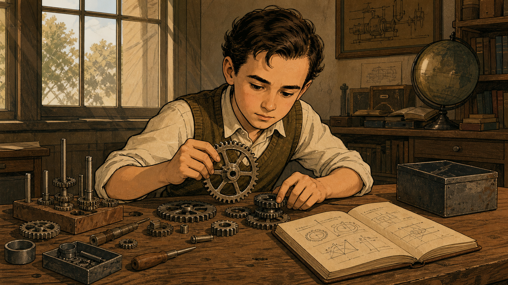

Image Prompt

(This is Panel 01. Do not include the panel number in the image.)
I am about to ask you to generate a series of images for a graphic
novel. Please make the images have a consistent style and consistent
characters. Do not ask any clarifying questions. Just generate the
image immediately when asked.

Please generate a 16:9 image in a warm, sepia-toned educational
graphic-novel style depicting panel 1 of 12. The scene should show a
boy of about ten, with neat dark brown hair, wearing a buttoned vest
over a white shirt with rolled sleeves, seated at a wooden desk in a
1930s South African study, carefully fitting together a large metal
gear with his hands while smaller gears, shafts, and a metal toolbox
sit scattered across the desk. An open notebook beside him shows
hand-drawn mechanical diagrams and geometric sketches. A globe, stacked
books, and a framed technical drawing sit on shelves behind him, with
warm daylight coming through a window. Color palette: warm browns,
tans, and muted olive greens. Emotional tone: quiet, absorbed
concentration and curiosity. Six visual details: the large gear held
in his hands, smaller gears and shafts scattered on the desk, the open
notebook with mechanical sketches, a globe on the shelf, a framed
technical diagram on the wall, sunlight through the window. Generate
the image immediately without asking clarifying questions.

In the 1930s, in Pretoria, South Africa, a boy named Seymour Papert
spent hours at a desk covered in salvaged gears, sprockets, and spare
machine parts, fitting them together and watching how one wheel's turn
became another's. He later wrote plainly about that fascination: "I
fell in love with the gears." Long before he had any theory of
learning, gears simply made sense to his hands and eyes in a way no
lecture ever had. That private, hands-on obsession became the model he
would spend his career building for other children — understanding is
something you construct, not something poured into you.

## Panel 2: A Mathematician's Mind

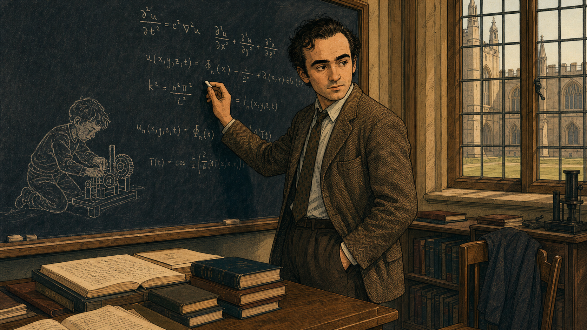

Image Prompt

(This is Panel 02. Do not include the panel number in the image.)
Please generate a 16:9 image in the same style depicting panel 2 of 12.
Make the young-adult version of the boy from panel 1 consistent with
his likely adult appearance: a man in his late twenties with dark
curly hair, wearing a herringbone jacket, tie, and light shirt,
standing at a large chalkboard covered in handwritten equations,
mid-stride writing another line with chalk. To the left of the
equations, rendered as a faint pale chalk sketch rather than solid
color, is a ghostly image of the same boy from panel 1 kneeling over
his gears — a visual echo of memory. Stacks of open books and bound
journals sit on a desk in the foreground. Through a large leaded-glass
window behind him, Gothic university buildings and a lawn are visible
in daylight. Color palette: warm browns and tans, with the chalk
equations and ghostly boy in pale cream against the dark chalkboard.
Emotional tone: focused intellectual absorption, a quiet thread
connecting past and present. Six visual details: the handwritten
equations, the pale ghost-sketch of the boy with gears, the chalk in
his hand, stacked open books on the desk, his jacket and tie, the
Gothic buildings through the window. Generate the image immediately
without asking clarifying questions.

By the time Papert reached the University of Cambridge in England to
complete a second doctorate in mathematics, gears had given way to
equations on the chalkboard. Colleagues remembered a mind that moved
fluidly between abstract proof and concrete tinkering, as if the two
were never really separate — the same instinct that had once fitted
gear to gear was now fitting theorem to theorem. That conviction, that
abstract ideas grow out of concrete experience, would soon carry him to
Geneva, Switzerland, and into a collaboration that changed the course
of his career.

## Panel 3: Learning From Piaget

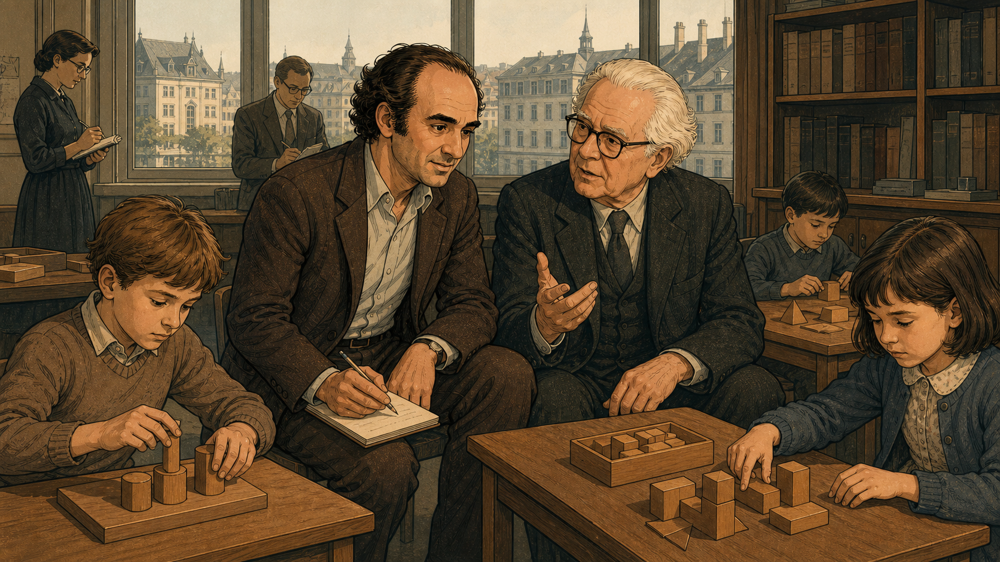

Image Prompt

(This is Panel 03. Do not include the panel number in the image.)
Please generate a 16:9 image in the same style depicting panel 3 of 12.
Make the man from panel 2 consistent, now in his early thirties, curly
dark hair, brown jacket, seated beside an elderly man with white hair,
round wire-frame glasses, and a dark three-piece suit, mid-conversation
and gesturing as he speaks. Around them, in a research room with tall
windows overlooking a European city, several children sit at low
tables building structures out of wooden blocks and geometric shapes,
while two researchers in the background take notes on clipboards.
Bookshelves line the back wall. Setting: a child-development research
center in Geneva, Switzerland, late 1950s. Color palette: warm browns
and muted blue-grays, with soft daylight through the windows. Emotional
tone: intellectual exchange, mutual respect, attentive observation.
Six visual details: the elderly man's expressive gesturing hand, the
children's wooden building blocks, a researcher taking notes in the
background, tall windows with a city view, the bookshelves, the young
man's notebook and pencil. Generate the image immediately without
asking clarifying questions.

In 1958, Papert joined the Swiss psychologist Jean Piaget's research
center in Geneva, where children building towers of wooden blocks were
studied as seriously as any laboratory experiment. For five years he
absorbed Piaget's central insight: that children are not empty vessels
waiting to be filled, but active builders who construct their own
understanding of the world through their own actions on it. Piaget was
reportedly so impressed that he said no one understood his ideas as
well as Papert did. But Papert left Geneva troubled by one gap in the
theory — it explained brilliantly how children learn on their own, yet
said almost nothing about how a teacher, a tool, or a machine might
help that process along.

## Panel 4: Founding the AI Lab

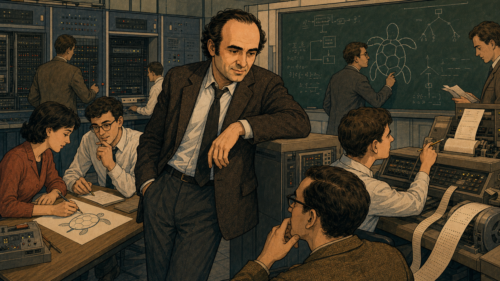

Image Prompt

(This is Panel 04. Do not include the panel number in the image.)
Please generate a 16:9 image in the same style depicting panel 4 of 12.
Make the man consistent with prior panels, now in his early forties,
curly dark hair, dark suit jacket, standing with one arm resting on a
large computer cabinet in a busy research lab, surrounded by young
researchers: one man and one woman writing notes at a desk with a hand
-drawn turtle sketch, a researcher drawing a turtle diagram and
flowchart on a large chalkboard, and two others working at a punch-tape
teleprinter station. Wall-mounted equipment racks with blinking
indicator lights line the back wall. Setting: an MIT computer research
laboratory, early 1970s. Color palette: warm browns and tans with cool
gray-blue machine accents. Emotional tone: purposeful energy, shared
intellectual excitement. Six visual details: the turtle diagram and
flowchart on the chalkboard, the hand-drawn turtle sketch on the desk,
the punch-tape teleprinter, the equipment racks with indicator lights,
the standing man's contemplative expression, researchers actively
writing and typing. Generate the image immediately without asking
clarifying questions.

In 1963, Papert crossed the Atlantic to MIT, where mathematician and AI
researcher Marvin Minsky was building one of the first laboratories
dedicated to machine intelligence. The two co-authored a landmark book
on perceptrons together, and in 1970 became co-directors of the newly
formed MIT Artificial Intelligence Laboratory — a room full of
room-sized computers, punch tape, and researchers convinced that
thinking itself could be studied like an engineering problem. But
Papert's question was never quite the same as his colleagues': he was
less interested in making machines think like people, and more
interested in what happens when children get their hands on a machine
that thinks. On the chalkboard behind him, a small drawn turtle was
already starting to share space with the equations.

## Panel 5: Inventing LOGO

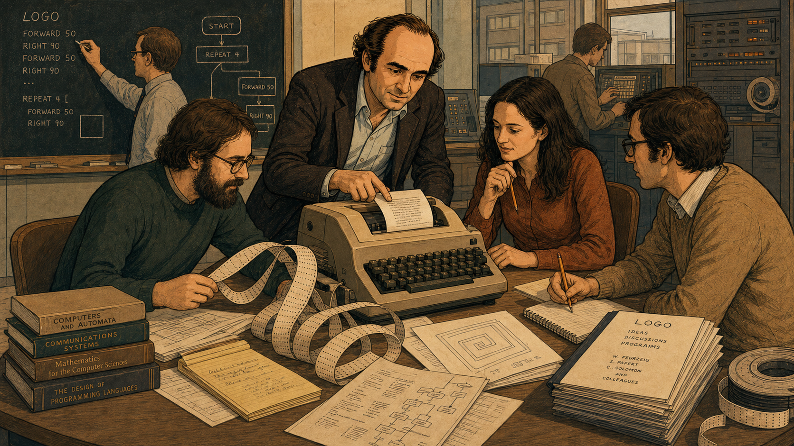

Image Prompt

(This is Panel 05. Do not include the panel number in the image.)
Please generate a 16:9 image in the same style depicting panel 5 of 12.
Make the man consistent with prior panels, curly dark hair, dark
jacket, leaning over a teletype machine and pointing at a printed line
of text, surrounded by three colleagues: a bearded man in a dark green
sweater holding a length of punched paper tape, a woman with long dark
hair in a rust-colored blouse resting her chin thoughtfully on her
hand, and another man in a tan sweater writing in a notebook. A
chalkboard behind them reads "LOGO," a short list of simple movement
commands, and a flowchart. Stacked reference books and a notebook
labeled with the team's names sit on the cluttered table amid loose
punch tape. Setting: a research office at a computing company, late
1960s. Color palette: warm browns and tans with the chalkboard's pale
cream lettering as an accent. Emotional tone: collaborative discovery,
focused teamwork. Six visual details: the printed teletype output, the
coiled punch tape, the chalkboard command list and flowchart, the
stacked reference books, the notebook with the team's names, the
woman's thoughtful pose. Generate the image immediately without asking
clarifying questions.

Working alongside Wally Feurzeig and Cynthia Solomon at the research
firm Bolt Beranek and Newman, Papert helped design a programming
language built entirely around a child's-eye view of the world: type
FORWARD 50 and something moves forward fifty steps; type RIGHT 90 and
it turns a quarter circle. They called it LOGO, and its first commands
were embarrassingly simple on purpose. The team's real invention wasn't
the syntax — it was giving every command a body a child could act out
by walking it themselves, so geometry stopped being a page of proofs
and became something felt in your own arms and legs. Within a few
years, those same commands would be steering not just text on a
screen, but an actual robot across a classroom floor.

## Panel 6: Turtles in the Classroom

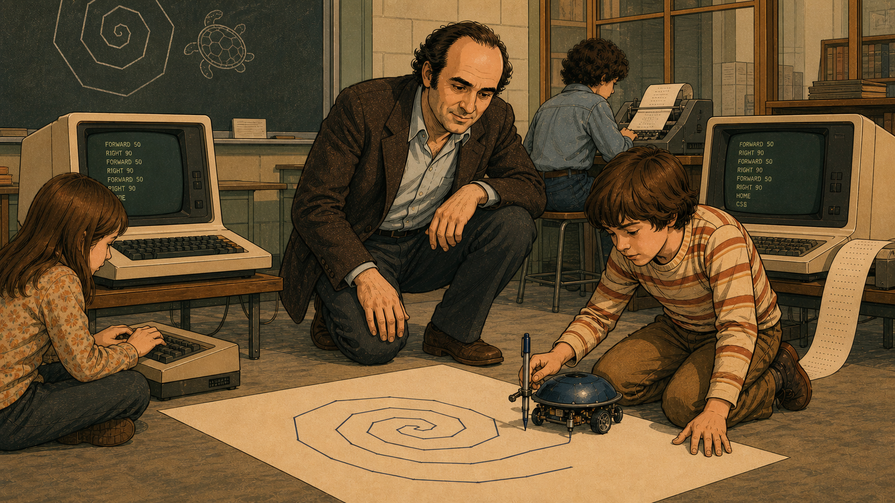

Image Prompt

(This is Panel 06. Do not include the panel number in the image.)
Please generate a 16:9 image in the same style depicting panel 6 of 12.
Make the man consistent with prior panels, kneeling on a classroom
floor beside a boy in a striped sweater who is guiding a small
dome-shelled wheeled robot along a spiral drawn in ink on a large
sheet of paper. To the left, a girl sits cross-legged typing on a
boxy terminal keyboard displaying simple movement commands, with a
chalkboard behind showing a hand-drawn spiral and turtle sketch.
Another child works at a second terminal in the background, its
screen also showing a list of movement commands. Setting: an American
school classroom, mid-1970s. Color palette: warm browns and tans with
a pale green terminal glow as an accent. Emotional tone: playful
concentration, hands-on discovery. Six visual details: the spiral
drawn on paper, the small wheeled turtle robot with its pen, the
girl's terminal showing command text, the chalkboard sketch, coiled
punch tape beside one terminal, the kneeling man's encouraging
posture. Generate the image immediately without asking clarifying
questions.

By the mid-1970s, LOGO had grown a body: a small dome-shelled robot
nicknamed the "turtle," wired to carry a pen and trace whatever path
its program described. In classrooms, kids who had never enjoyed math
knelt on the floor beside their turtles, typing FORWARD and RIGHT
commands and watching spirals bloom across butcher paper. Papert
crouched beside them not as a teacher checking answers, but as a
fellow investigator, curious what the turtle would do next. For a
child who could already walk in a square, programming a turtle to draw
one wasn't abstract at all — it was just describing, out loud,
something their own body already knew how to do.

## Panel 7: The Bug Is Not a Failure

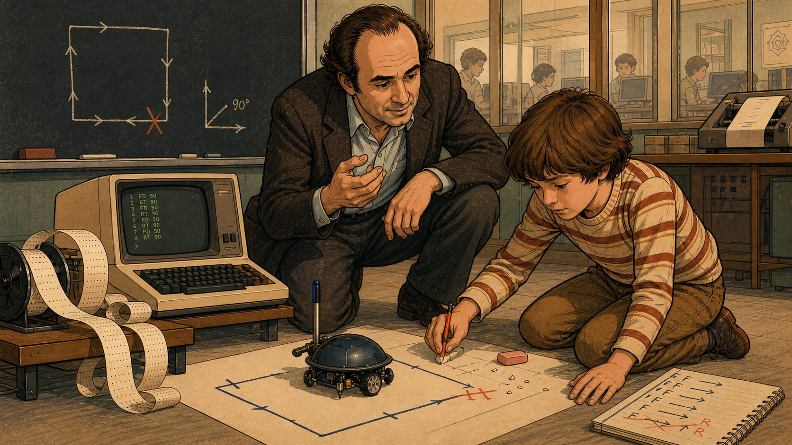

Image Prompt

(This is Panel 07. Do not include the panel number in the image.)
Please generate a 16:9 image in the same style depicting panel 7 of 12.
Make the man consistent with prior panels, kneeling beside a boy in a
striped sweater who is pointing with a pencil at a broken, incomplete
square path drawn on paper, with a small red X marking the gap where
the path went wrong, and a spiral-bound notebook beside him showing
crossed-out movement commands. A computer terminal to the left
displays a short numbered list of movement commands. A chalkboard
behind shows a hand-drawn square with directional arrows and a
90-degree angle diagram, with one arrow marked by a red X. Setting: the
same school classroom, mid-1970s. Color palette: warm browns and tans
with the red X and pale green terminal glow as sparing accents.
Emotional tone: patient curiosity, a puzzle being worked out rather
than corrected. Six visual details: the broken square path, the red X
mark, the notebook with crossed-out commands, the terminal's command
list, the chalkboard angle diagram, the boy's own pointing hand tracing
the error. Generate the image immediately without asking clarifying
questions.

When a student's turtle veered off course and left a broken, lopsided
square instead of a clean one, Papert didn't reach for the pencil to
fix it himself. He asked the boy what the turtle had actually done,
command by command, until the error revealed itself in the gap between
the intended path and the real one. In Papert's classroom vocabulary
there was no such thing as a wrong answer, only a "bug" — information
the program handed back to you, waiting to be understood rather than
punished. That single reframing, borrowed from computer programming and
pointed at learning itself, is arguably his most quietly radical idea:
mistakes are data, not verdicts.

## Panel 8: Writing Mindstorms

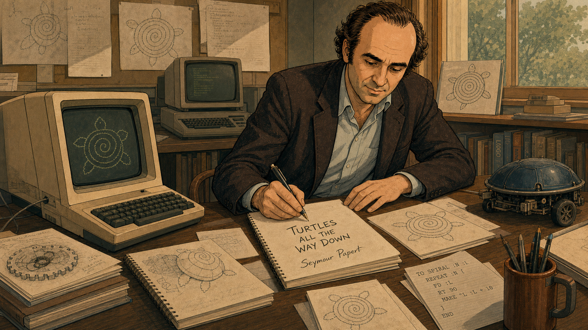

Image Prompt

(This is Panel 08. Do not include the panel number in the image.)
Please generate a 16:9 image in the same style depicting panel 8 of 12.
Make the man consistent with prior panels, seated at a cluttered desk,
writing by hand in a spiral notebook, with two computer terminals
beside him — one displaying a spiral turtle-graphics pattern — and a
small dome-shelled robot resting at the edge of the desk. Sheets of
paper covered in spiral turtle drawings and hand-lettered notes are
pinned to the wall and propped against the window behind him, along
with bookshelves holding reference volumes. A mug of pencils and loose
sheets with simple programming code sit near his writing hand. Setting:
a home or campus study, late 1970s, daylight through the window. Color
palette: warm browns and tans, with the pale terminal glow as an
accent. Emotional tone: focused, satisfied absorption in a long project
nearing completion. Six visual details: the spiral notebook he is
writing in, the pinned turtle drawings on the wall, the small robot on
the desk, the terminal showing a spiral pattern, the mug of pencils,
the sheet of simple code beside his hand. Generate the image
immediately without asking clarifying questions.

Through the late 1970s, Papert filled notebook after notebook — turtle
spirals pinned to the wall around him, a physical turtle robot resting
within arm's reach — working out how to explain a decade of classroom
experiments to people who had never seen a child program a computer.
The book taking shape at that desk would become *Mindstorms: Children,
Computers, and Powerful Ideas*, published in 1980, the work that
finally gave his classroom philosophy a name: constructionism, the idea
that people build knowledge most effectively when they are actively
engaged in constructing things in the world. He put his ambition
plainly on its pages: "the child programs the computer, and, in doing
so, both acquires a sense of mastery over a piece of the most modern
and powerful technology and establishes an intimate contact with some
of the deepest ideas from science, from mathematics, and from the art
of intellectual model building."

## Panel 9: Turtle Fever

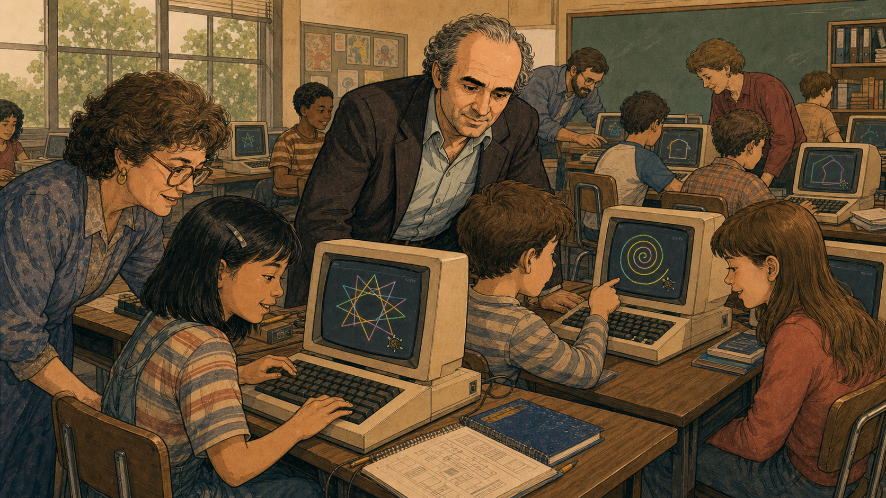

Image Prompt

(This is Panel 09. Do not include the panel number in the image.)
Please generate a 16:9 image in the same style depicting panel 9 of 12.
Make the man consistent with prior panels, now balding with gray-white
curly hair at the temples, leaning over two children at adjacent
computer terminals — one screen showing a colorful star pattern drawn
in overlapping lines, the other showing a colorful spiral with a small
turtle icon. A teacher with curly brown hair leans in beside a girl at
a third terminal. Several more children work at terminals in the
background of a busy classroom with large windows and children's
artwork on the walls. Setting: an American school computer lab,
mid-1980s. Color palette: warm browns and tans with bright multicolor
screen graphics as vivid accents. Emotional tone: widespread
enthusiasm, a classroom alive with independent exploration. Six visual
details: the colorful star pattern on screen, the spiral with turtle
icon, the teacher assisting a student, children's artwork on the wall,
multiple terminals in use, notebooks open beside the keyboards.
Generate the image immediately without asking clarifying questions.

*Mindstorms* landed at the exact moment personal computers were arriving
in American classrooms, and LOGO software spread through schools by the
thousands of copies. Papert crisscrossed the country visiting
classrooms where kids programmed spirals, stars, and polygons on screen
instead of on the floor, delighted to see teachers stepping back and
letting students direct their own turtles. Not every school grasped the
philosophy behind the software — some reduced LOGO to just another
drill program — but wherever a teacher truly let a class explore,
Papert saw exactly the kind of self-directed, hands-on learning he had
argued for since Geneva. The turtle, once a single robot in one MIT
lab, was now a shared icon in classrooms most of its inventors would
never visit.

## Panel 10: Bricks, Wires, and Code

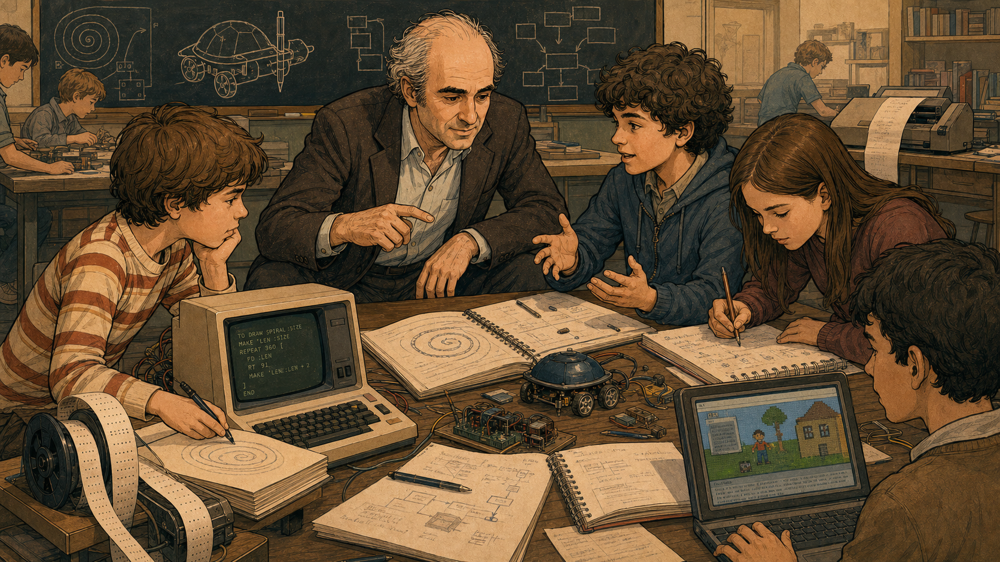

Image Prompt

(This is Panel 10. Do not include the panel number in the image.)
Please generate a 16:9 image in the same style depicting panel 10 of 12.
Make the man consistent with prior panels, now with fuller white-gray
hair, seated among a group of teenagers gathered around a table
covered in spiral-bound notebooks, a small wheeled robot wired to a
circuit board, and loose electronic components, with one boy's laptop
screen showing a simple on-screen scene with a character, a tree, and
a house. A computer terminal to the left displays a short block of
programming code describing a spiral. A chalkboard behind them shows a
turtle-shaped toy car sketch and a flowchart diagram. Setting: an MIT
research workshop, 1990s. Color palette: warm browns and tans with
soft screen-glow accents. Emotional tone: collaborative, hands-on
engineering enthusiasm. Six visual details: the wired robot on
circuit board, the loose electronic components, the terminal's spiral
code, the laptop's on-screen scene, the chalkboard turtle-car sketch,
the coiled punch tape nearby. Generate the image immediately without
asking clarifying questions.

At the MIT Media Lab in the 1990s, Papert and colleagues extended
turtle geometry from drawings into physical machines, wiring small
programmable bricks with motors and sensors that students could
command directly. Teenagers who had grown up on LOGO code now built
small robots that reacted to light and touch, watching their own
written instructions turn into movement they could push, adjust, and
rebuild. That research became the direct ancestor of a commercial
robotics kit released in 1998 and deliberately named after Papert's
book — a rare case of an educational philosophy naming a toy instead of
the other way around. The debugging lesson from decades earlier still
applied: a robot that rolled the wrong way was not a failure, just the
next problem to solve.

## Panel 11: A Laptop for Every Child

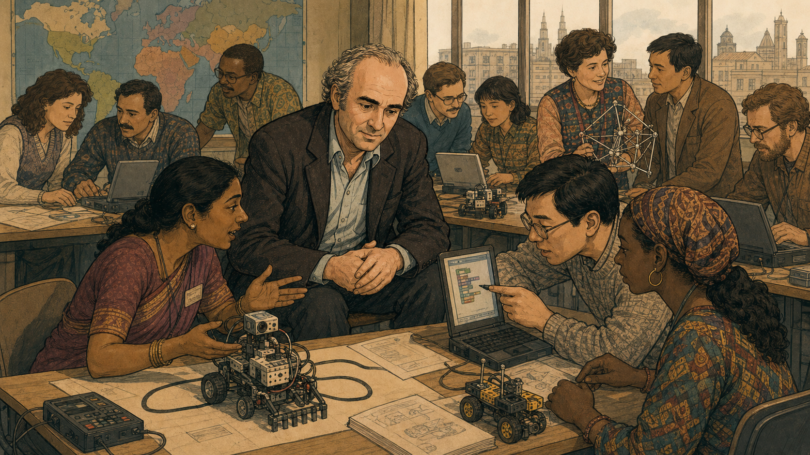

Image Prompt

(This is Panel 11. Do not include the panel number in the image.)
Please generate a 16:9 image in the same style depicting panel 11 of 12.
Make the man consistent with prior panels, now elderly with white
curly hair, seated at the center of a diverse group of adults from
different parts of the world gathered around a table, gesturing as he
speaks with a woman in a patterned sari beside him who is examining a
small rugged laptop with an antenna, while across the table two more
colleagues examine a second small laptop and a wire-frame model
structure. A large world map hangs on the wall behind them, and a city
skyline is visible through tall windows. Setting: an international
workshop room, mid-2000s. Color palette: warm browns and tans with the
map's muted colors and small laptop screens as accents. Emotional
tone: shared global purpose, warm collaborative energy. Six visual
details: the world map on the wall, the small rugged laptop with
antenna, the second laptop showing simple on-screen shapes, the
wire-frame model structure, the sari-clad woman's engaged expression,
the city skyline through the windows. Generate the image immediately
without asking clarifying questions.

In his seventies, Papert turned to a problem that had nagged him for
years: constructionist learning meant little to children who had never
touched a computer at all. Working with Nicholas Negroponte and Alan
Kay, he helped shape One Laptop per Child, a nonprofit founded in 2005
to design a rugged, low-cost laptop — eventually reaching millions of
children across more than forty countries — built to run programming
environments in the spirit of LOGO. For Papert, the project was really
his oldest argument at a global scale: that every child, not just the
well-funded ones, deserves the chance to build ideas rather than simply
receive them. In December 2006, while in Hanoi for a mathematics
education conference tied to this same work, Papert was struck by a
motorbike and suffered a severe brain injury that would slow him for
the rest of his life.

## Panel 12: The Idea Outlives the Man

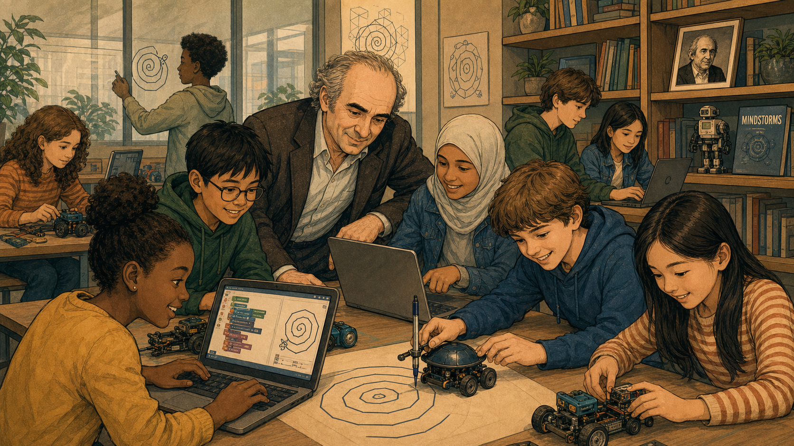

Image Prompt

(This is Panel 12. Do not include the panel number in the image.)
Please generate a 16:9 image in the same style depicting panel 12 of 12.
Make the elder man consistent with panel 11's likeness, leaning in
warmly among a diverse group of teenagers at a table covered in
laptops showing colorful block-based code and spiral turtle graphics,
small wheeled robots, and a dome-shelled turtle robot tracing a spiral
on paper. In the background, one teen draws a spiral and turtle shape
on a glass wall, another works at a laptop near a bookshelf holding a
framed portrait of an older curly-haired man and a book with a small
robot figure beside it. Potted plants and large windows suggest a
bright, modern maker space. Setting: a present-day coding club. Color
palette: warm browns and tans with soft laptop-screen glow as accents,
slightly brighter and more contemporary than earlier panels. Emotional
tone: joyful collaboration, a legacy carried forward. Six visual
details: the block-based code on a laptop screen, the spiral turtle
graphic on another screen, the dome-shelled robot tracing paper, the
framed portrait on the shelf, the book with the small robot figure, the
teen drawing a spiral on the glass wall. Generate the image immediately
without asking clarifying questions.

Papert never fully recovered from the accident in Hanoi, and he died in
Blue Hill, Maine, in 2016, at the age of eighty-eight. But walk into
almost any coding club today — kids clustered around laptops running
block-based code, a small wheeled robot tracing a spiral across a
table, a mentor who asks "what do you think went wrong?" instead of
just fixing it — and you are standing inside his idea, whether or not
anyone in the room has ever heard his name. His portrait and his book
sit on a shelf in clubs that carry his philosophy forward without a
manual, because the philosophy was never really about the turtle. It
was about handing the controls to the kid and trusting them to build
something real.

### Epilogue – What Made Papert Different?

Papert didn't invent a teaching trick; he inverted an entire
relationship. Where most educational technology tried to make the
computer teach the child, Papert insisted the child should teach the
computer — and, in doing so, teach themselves something no worksheet
could reach. From a boy alone with a box of gears to a scientist
rebuilding education on three continents, his sixty-year argument never
really changed: give a learner something real to build, let them find
their own mistakes, and stand back.

| Challenge | How Papert Responded | Lesson for Today |
|-----------|------------------------|-------------------|
| Schools treated computers as devices that "taught" children through drills | He flipped the relationship: the child would program the computer, not the other way around | Give learners the controls, not just the content |
| Piaget's theory explained how children construct understanding in their own minds, but offered no bridge to the classroom | Papert extended it into constructionism: learning sticks best when the "construction" is a tangible, shareable object | Design projects that end in something a learner can point to and say "I made that" |
| A wrong turtle command produced a visibly broken drawing, not a red mark on a test | He treated the broken drawing as useful information, not failure, and let the child work out the fix | Treat every bug as a clue, not a verdict on the learner |
| Bringing computers to well-funded schools left millions of children out entirely | In his seventies he helped launch One Laptop per Child to put low-cost, LOGO-capable machines in children's hands worldwide | Access is not a footnote to good teaching — it is part of the design problem |

### Call to Action

The next time a kid in your club hits a bug, resist the urge to just
fix it for them. Ask what the code actually did, hand back the
controls, and let them find the gap between what they meant and what
happened — Papert built an entire philosophy of learning on exactly
that pause.

---

*"I fell in love with the gears."*
—Seymour Papert, "The Gears of My Childhood," foreword to *Mindstorms* (1980)

*"In my vision, the child programs the computer and, in doing so, both acquires a sense of mastery over a piece of the most modern and powerful technology and establishes an intimate contact with some of the deepest ideas from science, from mathematics, and from the art of intellectual model building."*
—Seymour Papert, *Mindstorms: Children, Computers, and Powerful Ideas* (1980)

*"You can't think about thinking without thinking about thinking about something."*
—Seymour Papert

---

## References

1. [Wikipedia: Seymour Papert](https://en.wikipedia.org/wiki/Seymour_Papert) - Biography of the mathematician and educator who co-created LOGO and constructionism
2. [Wikipedia: Logo (programming language)](https://en.wikipedia.org/wiki/Logo_(programming_language)) - The educational programming language and turtle graphics Papert co-created at BBN
3. [Wikipedia: Constructionism (learning theory)](https://en.wikipedia.org/wiki/Constructionism_(learning_theory)) - Papert's learning theory that people build knowledge best by constructing real things
4. [MIT Media Lab: In Memory of Seymour Papert](https://www.media.mit.edu/posts/in-memory-seymour-papert/) - MIT Media Lab's memorial tribute covering his career and influence
5. [Encyclopaedia Britannica: Seymour Papert](https://www.britannica.com/biography/Seymour-Papert) - Overview of Papert's life, LOGO, and educational philosophy
