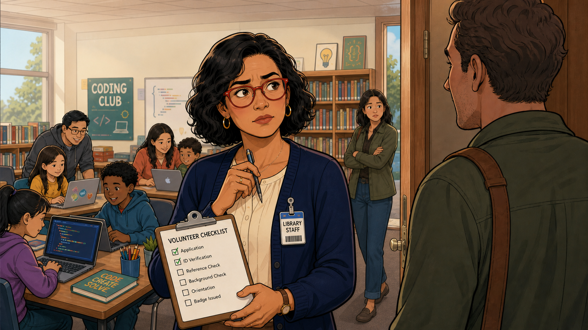
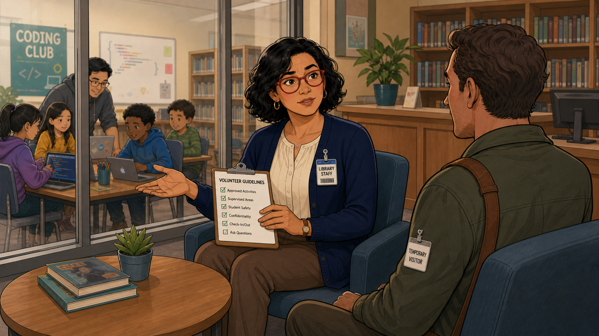
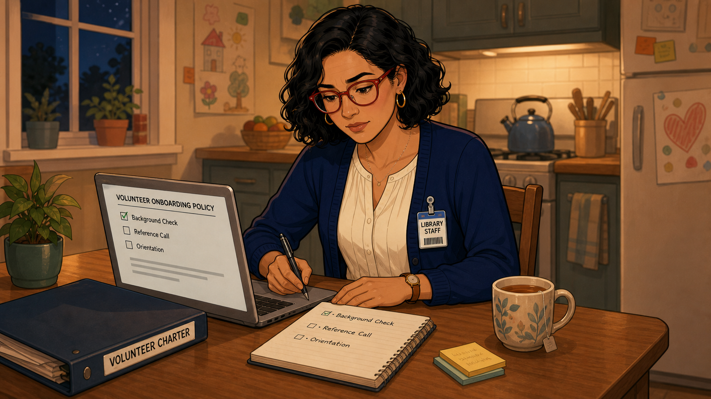
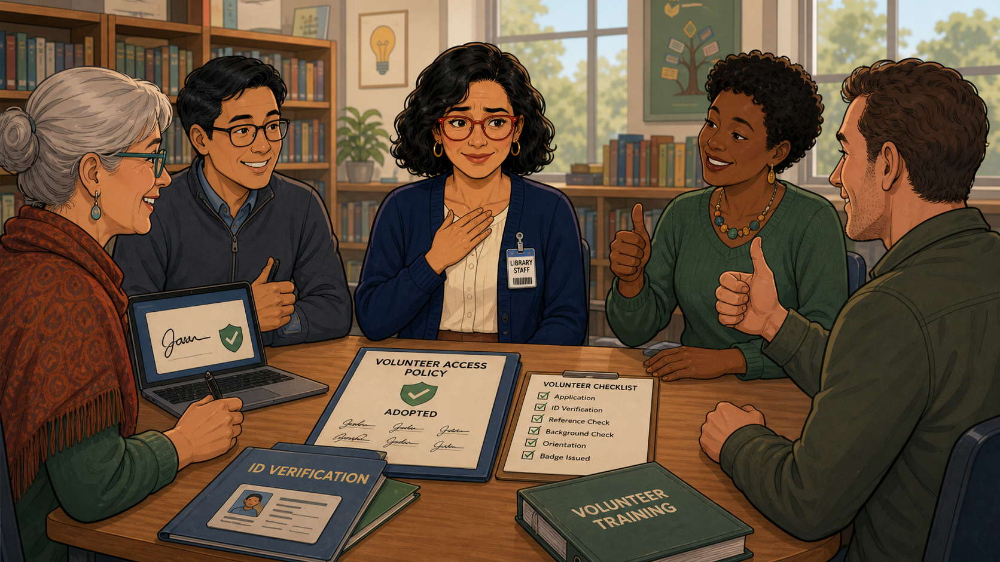

# The Unfamiliar Face at the Door

Narrative Prompt

This is a fictional composite story, not a depiction of a specific
real club or a real named individual. "Marisol" (library staff
coordinator, red glasses, navy cardigan) represents a pattern seen
across many volunteer-run clubs: a well-meaning adult shows up ready
to help with no vetting process in place, exposing a policy gap that
has to be closed before trust can be extended safely. Setting: a
present-day public library hosting a community coding club in the
United States. Art style: warm, contemporary educational-graphic-
novel illustration, clean linework, soft cel-shading, consistent
character design and color palette across all panels — Marisol
should be immediately recognizable from panel to panel.

### Prologue – A System Built for Students, Not Adults

Marisol ran the library's coding club the way she ran everything
else: carefully. Every student had a name badge waiting, every
laptop was charged, every session started on time. What she hadn't
built yet was a system for the adults who wanted to help run it.

## Panel 1: A Badge for Every Student

Marisol sorted through a bin of laminated name badges — Noah, Zoe,
Liam, Jordan, Ari, Maya — setting each one out before the first
student arrived. Behind her, a volunteer helped two kids unpack a box
of parts. Through the glass door, a family was already approaching:
two parents, two kids, and a man she didn't recognize a few steps
behind them.

## Panel 2: A Handshake and a Question Mark

"I heard you could use another mentor," the man said, extending his
hand with an easy smile, a messenger bag slung over one shoulder.
Marisol shook it and smiled back — and then realized, with a small
jolt, that she had absolutely no process for what came next. He
seemed perfectly nice. That wasn't the same thing as knowing.

## Panel 3: The Checklist With Four Empty Boxes

Marisol pulled out the closest thing the club had to a process: a
checklist meant for tracking student attendance, hastily repurposed.
Application, checked. ID verification, checked, because he'd shown
her his license. Reference check, background check, orientation,
badge issued — four empty boxes stared back at her, and a colleague
in the doorway crossed her arms, watching the exchange with the same
unease Marisol felt.

## Panel 4: A Supervised Yes, Not a Blind One

Marisol didn't turn him away, and she didn't wave him through
unsupervised either. She sat him down with a short list of
guidelines — approved activities, supervised areas, student safety,
confidentiality, check-in and check-out — and clipped a plain
"Temporary Visitor" badge to his shirt. It was a stopgap, not a
policy, and she knew it the moment she wrote it.

## Panel 5: Writing the Real Policy at Midnight

That night, after the kids' drawings on the fridge had gone dark and
quiet, Marisol sat down with tea and her laptop and did the work she
should have done months earlier: a real Volunteer Onboarding Policy,
with background check, reference call, and orientation as required
steps, not afterthoughts — filed right next to the club's Volunteer
Charter.

## Panel 6: Five Signatures on One Page

Marisol brought the finished policy to the club's small oversight
group — an older volunteer, two fellow mentors, and a longtime
parent supporter — and watched them read it, nod, and sign it one by
one. "Volunteer Access Policy: Adopted" sat on the table next to a
now fully-checked Volunteer Checklist and a new Volunteer Training
binder. It wasn't just her rule anymore; it was the club's.

## Panel 7: The Next Stranger at the Door

Weeks later, another new face showed up ready to help — and this
time Marisol had an actual answer ready. Application, ID
verification, reference check, background check, orientation, badge
issued: every box checked before he ever stepped past the "Mentor
Sign-In" table. His family watched him get properly welcomed, and
behind them, another family walked in trusting the same process
would protect their kids too.

### Epilogue – Trust Is a Process, Not a Feeling

Marisol's first instinct with the stranger at the door had been to
trust her gut, because he seemed like a good person. He probably
was. But a club that runs on gut feelings about strangers isn't
protecting anyone — including the volunteers themselves, who deserve
a clear process just as much as the families do.

| Challenge | How Marisol Responded | Lesson for Today |
|-----------|--------------------------|-------------------|
| A willing volunteer showed up with no vetting process in place | Improvised a supervised, badged "temporary visitor" status on the spot rather than turning him away or letting him in unsupervised | When a policy gap surfaces mid-session, a safe stopgap buys time — it isn't a substitute for writing the real policy |
| The club had never formalized background checks or references for adults | Wrote a full Volunteer Onboarding Policy the same week, modeled on the structure already used for students | A club's charter isn't complete until it protects students from every adult in the room, not just the ones already vetted |
| One coordinator's personal fix wouldn't survive her stepping away | Brought the policy to the club's oversight group for review and formal adoption | A safety policy only becomes durable once it belongs to the club's governance, not to one volunteer's memory |

### Call to Action

If someone walked into your next session and offered to mentor right
now, could you tell them exactly what happens next? If not, that gap
is worth closing before the next unfamiliar face is standing in your
doorway, not after.

---

*"He seemed perfectly nice. That wasn't the same thing as knowing."*
—Marisol, after the first encounter

*"Volunteer Access Policy: Adopted."*
—the sign-in table, from that week forward

---

## References

1. [Wikipedia: Background check](https://en.wikipedia.org/wiki/Background_check) - Background on the vetting process every youth-serving volunteer program needs
2. [Wikipedia: Child protection](https://en.wikipedia.org/wiki/Child_protection) - The broader safeguarding framework a club's volunteer policy sits within
3. [Wikipedia: Volunteering](https://en.wikipedia.org/wiki/Volunteering) - Background on the volunteer-management practices coding clubs rely on
4. [Wikipedia: Duty of care](https://en.wikipedia.org/wiki/Duty_of_care) - The legal and ethical concept behind a club's obligation to vet the adults supervising students
5. [STEM Classroom Administration](http://dmccreary.github.io/stem-classroom-admin/) - The companion textbook on managing classroom access and technology
