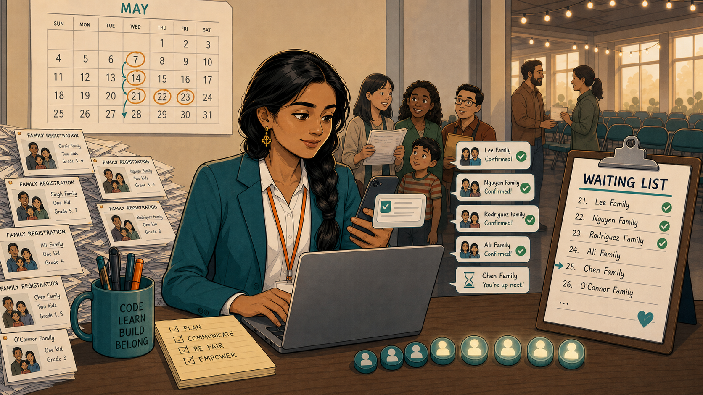
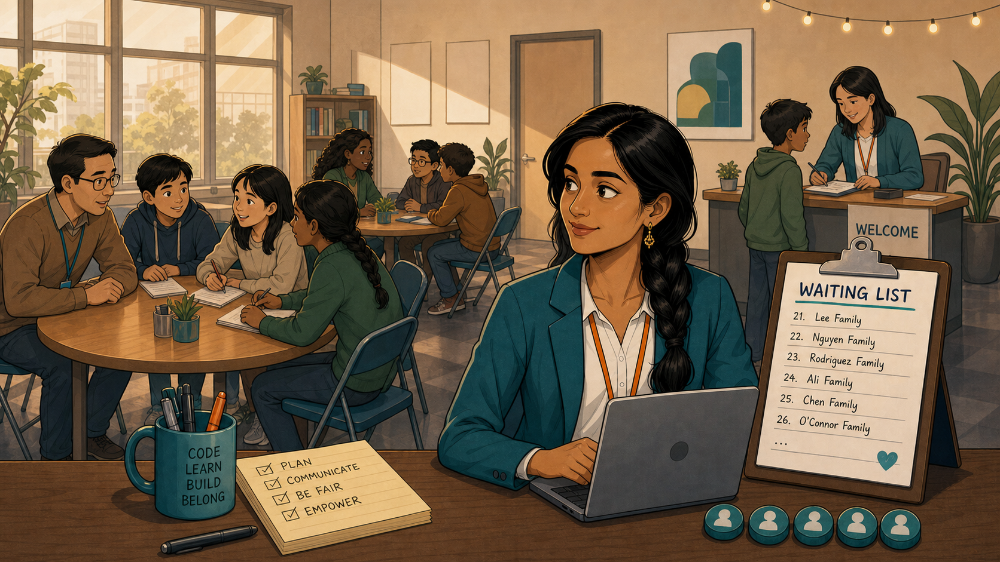

# The Waiting List

Narrative Prompt

This is a fictional composite story, not a depiction of a specific
real club or a real named individual. "Priya" (registration
coordinator, braided hair, teal blazer, orange lanyard) represents a
pattern seen across many first-time club registrations: enthusiasm
outpaces capacity by an order of magnitude, and the fix isn't
turning families away but gating growth by confirmed mentor count.
Setting: a present-day community coding-club registration opening in
the United States. Art style: warm, contemporary educational-
graphic-novel illustration, clean linework, soft cel-shading,
consistent character design and color palette across all panels —
Priya should be immediately recognizable from panel to panel.

### Prologue – Twenty Chairs, One Morning

Priya had planned the club's first-term registration carefully: a
simple online form, twenty available seats, a clean list ready to
fill. She had built a waiting-list page just in case — never
expecting she would need it within the hour.

## Panel 1: A System Built in Advance

Priya sat at her desk on launch morning with coffee in hand, watching
a tidy grid of twenty chair icons fill her laptop screen under
"First-Term Online Registration." Beside it sat a notepad headed
"Waiting List" — empty for now, built in advance just in case more
families applied than there were seats. She had no idea how soon
she'd need it.

## Panel 2: Three Hundred Families, One Morning

By mid-morning, "Family Registration" cards were piling up faster
than Priya could read them, email notifications stacking on top of
each other across her screen. She circled a number on her notepad in
disbelief: 300 families had applied for a room with twenty chairs in
it. The sign on the wall behind her still read "20."

## Panel 3: Seventeen Filled, Three Left, a Line Out the Door

By afternoon, families were lining up in person, phones were ringing,
and a printed capacity board told the whole story at a glance:
twenty seats, seventeen filled, three remaining — with a stack of a
hundred registration forms still waiting to be read. Priya held the
phone to her ear with one hand and a token seat marker in the other,
trying to be fair to everyone at once and failing.

## Panel 4: Mentors Unlock Seats, Not the Other Way Around

That evening, Priya redesigned the whole system around one idea:
seats wouldn't open because a family clicked fastest — they'd open
because a mentor was confirmed. Her new screen showed it plainly:
each confirmed mentor unlocked exactly three student seats, no more,
with everyone else moving to a clearly numbered waiting list instead
of a black hole.

## Panel 5: Confirmations Instead of Chaos

Over the following weeks, as new mentors confirmed, Priya sent out
confirmations in calm, scheduled waves instead of one first-come
scramble: "Lee Family confirmed," "Nguyen Family confirmed,"
"Rodriguez Family confirmed," each one checked off a numbered list a
family could actually see themselves moving up. Nobody was left
wondering if they'd been forgotten.

## Panel 6: A Room That Finally Matches Its Seats

By the time the term actually started, the room matched the plan
instead of the panic: small groups working comfortably with a
mentor nearby, a proper welcome desk for new families, and a waiting
list on the wall that families could check instead of wondering.
Priya sat back at her laptop, calm for the first time since launch
morning.

### Epilogue – Fair Isn't the Same as First

Priya's first instinct on launch day was to feel like she'd failed —
300 families for 20 seats felt like proof the system was broken. It
wasn't. The demand was a sign of success; the chaos was just a sign
that capacity needed to be tied to something real. Once seats were
gated by confirmed mentors instead of by who clicked fastest, the
same overwhelming demand became a fair, visible waiting list instead
of a source of daily panic.

| Challenge | How Priya Responded | Lesson for Today |
|-----------|------------------------|-------------------|
| 300 families applied for 20 seats within hours of registration opening | Built and staffed a phone line and capacity board to manage the immediate overflow honestly | A surge in demand is a signal to communicate capacity clearly, not to quietly overpromise seats that don't exist |
| First-come-first-served registration couldn't scale fairly with so few mentors | Redesigned registration so each confirmed mentor unlocked a fixed number of student seats | Gating enrollment by mentor capacity, not click speed, keeps growth fair and sustainable at the same time |
| Families on a waiting list had no visibility into their status | Sent staggered, numbered confirmations families could track over several weeks | A waiting list only feels fair when people can actually see their place in it |

### Call to Action

Before your next registration opens, decide in advance what unlocks
a seat — a mentor, not a click. A big waiting list isn't a crisis; an
invisible one is. Build the visible version before you need it, the
way Priya wishes she had.

---

*"Three hundred families for twenty seats felt like a failure. It
wasn't — it was proof the demand was real."*
—Priya, after launch day

*"Each confirmed mentor unlocks three student seats."*
—the rule that replaced first-come, first-served

---

## References

1. [Wikipedia: Eventbrite](https://en.wikipedia.org/wiki/Eventbrite) - The event registration platform many clubs use to manage sign-ups and capacity
2. [Wikipedia: Queueing theory](https://en.wikipedia.org/wiki/Queueing_theory) - The mathematics behind fair, orderly waiting lists under limited capacity
3. [Wikipedia: Overbooking](https://en.wikipedia.org/wiki/Overbooking) - What happens when signups are allowed to exceed real capacity without a gating rule
4. [Wikipedia: First-come, first-served](https://en.wikipedia.org/wiki/First-come,_first-served) - The default allocation rule Priya's mentor-gated system replaced
5. [STEM Classroom Administration](http://dmccreary.github.io/stem-classroom-admin/) - The companion textbook on managing classroom capacity and technology
