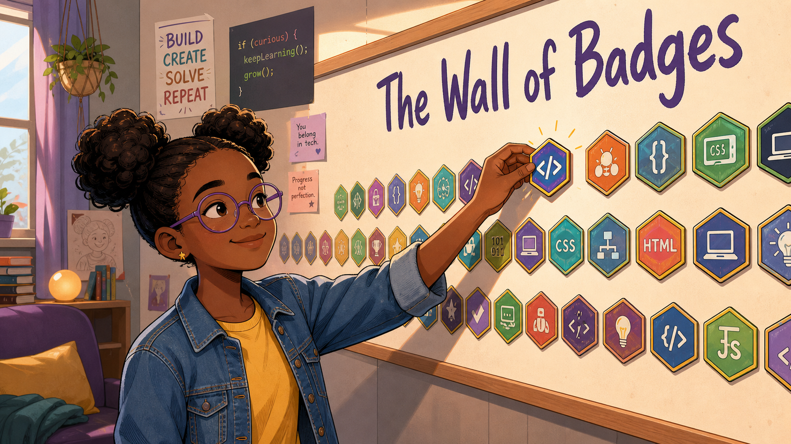
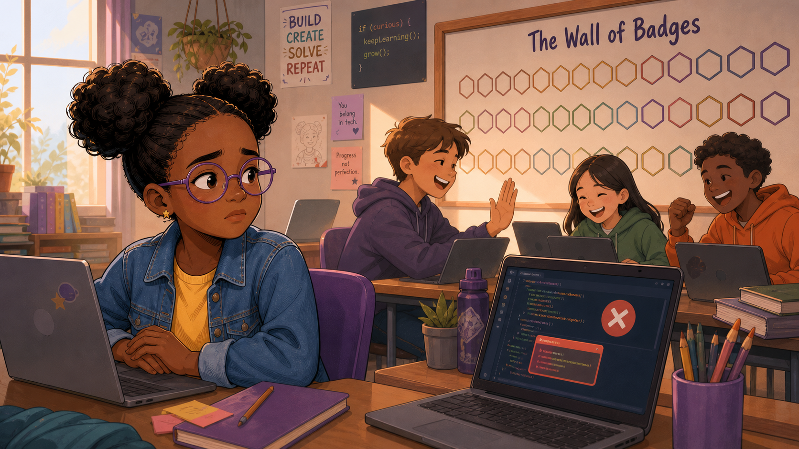
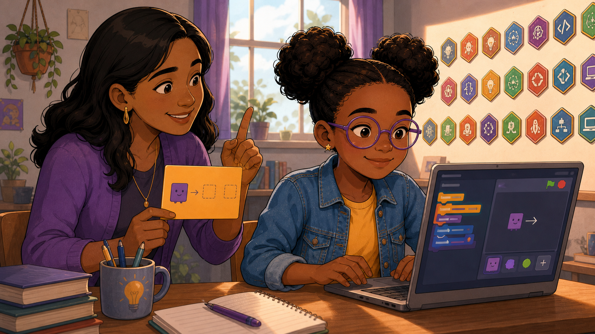
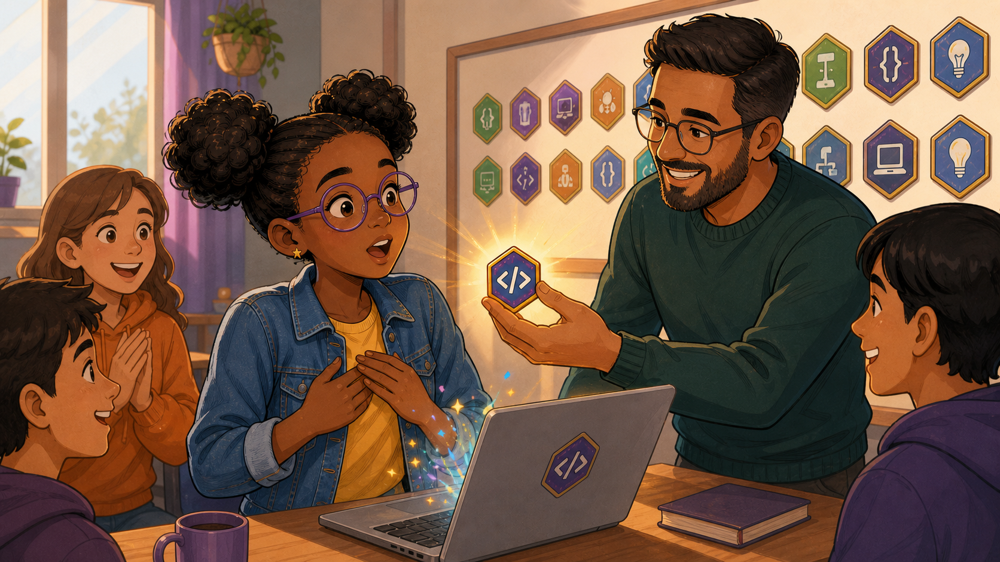
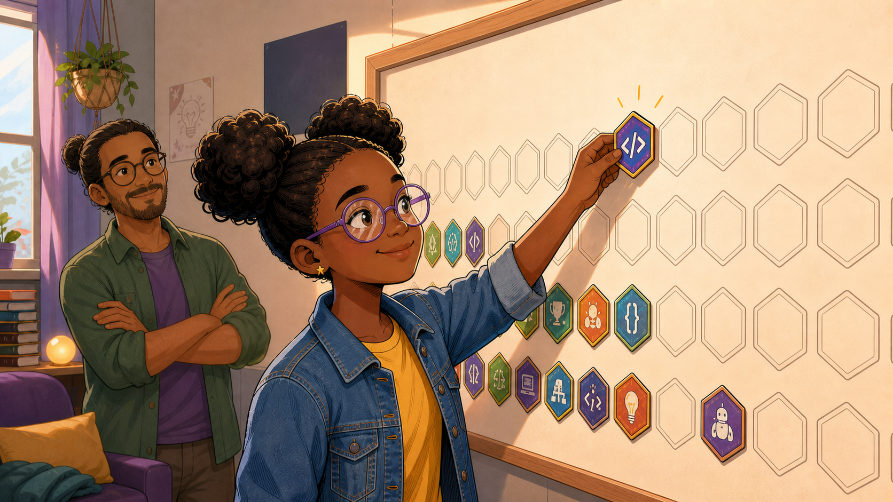
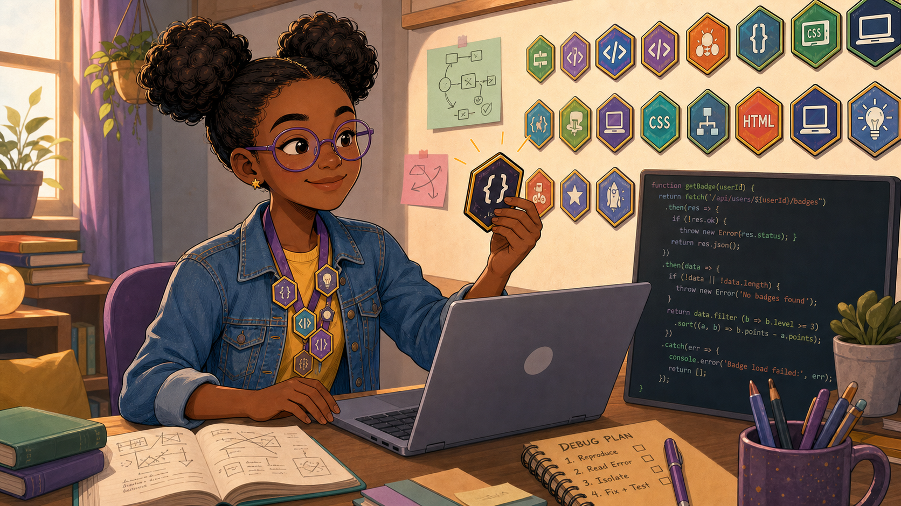
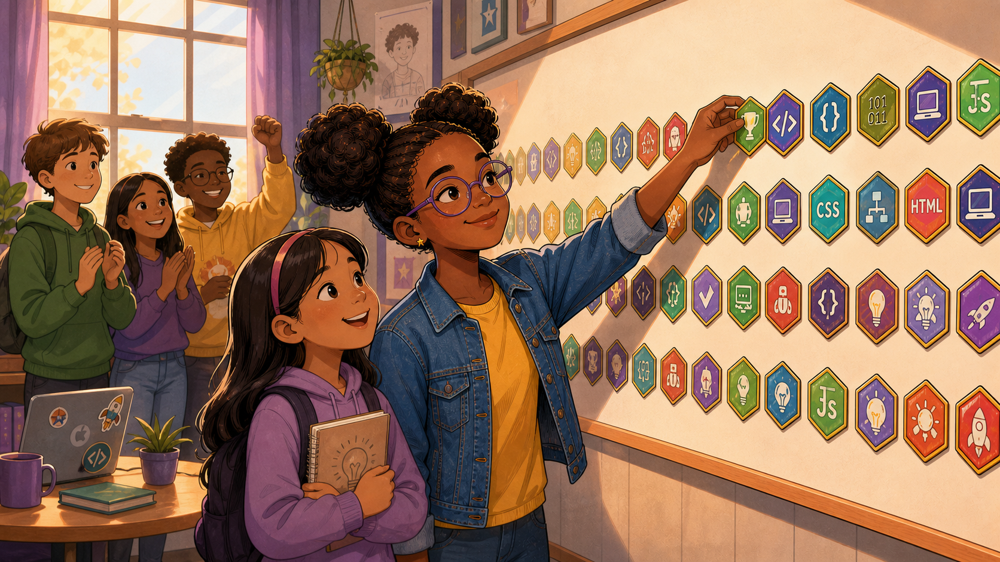

# The Wall of Badges

Cover Image Prompt

(This is the Cover Image. Do not include this label in the image.)
Please generate a wide-landscape 16:9 cover image for this story in a warm,
contemporary educational-graphic-novel illustration style. A girl of about
twelve, Zora, with dark curly hair in two puffed buns, round purple glasses,
a gold star earring, a yellow t-shirt under an open denim jacket, reaches up
on her toes to press a glowing purple "</>" hexagon badge onto a large wall
mounted with a wooden frame. The wall is already dense with dozens of
colorful hexagon badges arranged in tidy rows — CSS, HTML, JS, laptop,
lightbulb, and robot icons in blue, green, purple, orange, and teal — with
hand-lettered purple script reading "The Wall of Badges" above them. The
cozy club room around her has a hanging plant in a macrame holder, purple
curtains, a bookshelf, a small glowing lamp, and taped-up posters reading
"BUILD CREATE SOLVE REPEAT," a chalkboard with "if (curious) {
keepLearning(); grow(); }," "You belong in tech," and "Progress not
perfection." Color palette: warm honey light, purple and gold accents
against a cream wall. Emotional tone: quiet pride and belonging. Generate
the image immediately without asking clarifying questions.

Narrative Prompt

This is a fictional composite story, not a depiction of a specific real
club, school, or real named individuals. Zora (student, twin curly hair
buns, round purple glasses, gold star earring, denim jacket over a yellow
t-shirt) represents a pattern many coding-club mentors recognize: a capable
student who has quietly decided, without ever saying it out loud, that a
subject "isn't for people like her" — and who needs a small, visible,
repeatable win to start rewriting that belief. Denise is Zora's mother.
Malik is the club's lead mentor, who keeps the Wall of Badges tradition
running: finish a Challenge Card, and you don't just receive a badge, you
walk up and press it onto the shared wall yourself. Setting: a present-day
coding club meeting space in a mid-sized American town, plus Zora's home
desk. Art style: warm, contemporary educational-graphic-novel illustration,
clean linework, soft cel-shading, consistent character design and color
palette across all panels — Zora, Denise, and Malik should be immediately
recognizable from panel to panel, and the Wall of Badges itself should grow
fuller and more colorful as the story progresses.

### Prologue – A Wall That Felt Like a Scoreboard

Zora had been coming to the club for two months and had never once said out
loud what she actually believed: that coding was a thing other kids were
just naturally good at, and she wasn't one of them. Nobody had told her
that. She'd decided it on her own, quietly, the way kids do, watching other
laptops light up green while hers kept turning red. The day the club
unveiled a brand-new wall of empty badge outlines and called it exciting,
it didn't feel exciting to her at all. It felt like one more place her name
wasn't going to appear.

## Panel 1: The Wall Says Nothing Yet

Image Prompt

(This is Panel 01. Do not include the panel number in the image.)
I am about to ask you to generate a series of images for a graphic novel.
Please make the images have a consistent style and consistent characters.
Do not ask any clarifying questions. Just generate the image immediately
when asked.

Please generate a 16:9 image in a warm, contemporary educational-graphic-
novel style depicting panel 1 of 6. The scene shows Zora, a girl of about
twelve with dark curly hair in two puffed buns and round purple glasses,
seated at a laptop with her arms crossed, a guarded and uncertain
expression on her face, while her laptop screen shows a red error message
with an "X" icon. Behind and beside her, three other club members —
a boy in a purple hoodie, a girl, and a boy in an orange hoodie — cheer and
high-five each other over their own laptops. On the wall behind them hangs
a large wooden-framed board reading "The Wall of Badges" in hand-lettered
purple script, but every hexagon slot on it is just an empty outline — no
badges have been earned yet. Setting: present-day USA, a cozy coding club
room, daytime, with posters reading "BUILD CREATE SOLVE REPEAT" and "You
belong in tech" taped nearby. Color palette: warm honey tones with the
badge wall in soft cream and gray outlines. Emotional tone: contrast
between the other students' excitement and Zora's quiet self-doubt. Six
visual details: the red-X error on Zora's screen, her crossed arms, the
celebrating classmates' laptops and high-five, the completely empty
hexagon outlines on the wall, the "The Wall of Badges" hand lettering, the
"You belong in tech" sticky note just visible near the board. Generate the
image immediately without asking clarifying questions.

Malik had unveiled the Wall of Badges that afternoon, promising that every
finished Challenge Card would earn a spot on it. Around Zora, laptops kept
turning green and kids kept cheering — first scripts running, first sprites
moving exactly where they were supposed to. Hers threw an error again, the
same red X she'd been staring at for weeks. An empty wall was supposed to
feel like an invitation; to Zora it just looked like a scoreboard with
plenty of room for everyone except her.

## Panel 2: One Small Card at the Kitchen Table

Image Prompt

(This is Panel 02. Do not include the panel number in the image.)
Please generate a 16:9 image in the same style depicting panel 2 of 6. Make
Zora consistent with the prior panel, and introduce her mother, Denise, a
woman with long dark wavy hair, gold hoop earrings, and a purple cardigan.
The scene shows Denise and Zora seated together at a home desk. Denise
holds up a small yellow Challenge Card showing a simple purple blob
character with an arrow pointing to two dashed outline boxes — the club's
easiest starter task, moving a sprite from one spot to another — while
gesturing encouragingly with her other hand raised. Zora, no longer
guarded, leans toward her laptop and drags colorful code blocks into place
around a matching purple blob sprite on the block-based editor screen on
her laptop. On the wall behind them, rows of small badge hexagons are
visible, already filled in by other club members over recent weeks. Color
palette: warm domestic tones, the yellow challenge card as a bright focal
point. Emotional tone: gentle encouragement, a small first step. Six visual
details: the yellow Challenge Card with the blob-and-arrow diagram, Denise's
raised encouraging finger, the block-coding editor on Zora's laptop
matching the card, a mug with a lightbulb design, stacked books, the rows
of already-filled badges on the wall behind them. Generate the image
immediately without asking clarifying questions.

Zora brought the frustration home, and Denise didn't lecture her about
trying harder. She dug the smallest card out of Zora's club folder — the
starter challenge everyone skipped past on day one, just moving a sprite
from one box to another — and told her to forget every harder card on the
wall and try only this one. Zora slid her laptop closer, dragged three
blocks into place, and watched the little purple blob slide exactly where
the arrow said it should. It wasn't much. It was also the first thing all
week that had actually worked.

## Panel 3: The First Badge

Image Prompt

(This is Panel 03. Do not include the panel number in the image.)
Please generate a 16:9 image in the same style depicting panel 3 of 6. Make
Zora consistent with prior panels, and introduce Malik, the club's bearded
lead mentor, wearing glasses and a green sweater. The scene shows Malik
holding up a glowing purple "</>" hexagon badge toward Zora, who presses
both hands to her chest with an open-mouthed, joyfully surprised
expression, small sparkles and light motes glittering around her hands.
Two classmates on her left clap enthusiastically, and a boy on her right
smiles. A laptop on the table between them shows the completed challenge
with a matching "</>" hexagon sticker on its lid. Rows of badges already
cover part of the wall behind them. Setting: the same present-day coding
club room, warm afternoon light. Color palette: warm gold light radiating
from the badge, contrasting with the cooler purples and greens of the
room. Emotional tone: disbelief turning into joy, public celebration. Six
visual details: the glowing "</>" badge in Malik's hand, Zora's hands
clasped to her chest, the sparkle effects, the clapping classmates, the
"</>" sticker on her laptop lid, the partially filled badge wall behind
them. Generate the image immediately without asking clarifying questions.

The next Tuesday, Zora finished it — really finished it, no errors left on
the screen. Malik didn't just tell her nice job under his breath; he held
up her very first badge, a glowing purple hexagon, right in front of the
whole table and pressed it into her open hands. Her friends clapped like
she'd done something that mattered, because to the club, she had. For the
first time in months, the sentence she'd been repeating to herself —
*this isn't for people like me* — didn't feel true anymore.

## Panel 4: Placing It Herself

Image Prompt

(This is Panel 04. Do not include the panel number in the image.)
Please generate a 16:9 image in the same style depicting panel 4 of 6. Make
Zora and Malik consistent with prior panels. The scene shows Zora reaching
up with a warm, focused smile to press a glowing purple "</>" hexagon badge
onto the wall herself, while Malik stands a few feet back with his arms
loosely crossed, watching with quiet, proud approval. Only a modest cluster
of badges — hers among them — occupies one corner of the otherwise mostly
empty hexagon-outlined wall. Setting: the same club room, softer late-
afternoon light. Color palette: warm ambers and purples, the small cluster
of colorful badges standing out against the mostly bare wall. Emotional
tone: quiet ownership and the start of a habit. Six visual details: Zora's
own hand pressing the badge into place, the small existing cluster of
badges in the corner, the large remaining field of empty hexagon outlines,
Malik's crossed-arm proud stance, a hanging plant near the window, a dark
poster with a lightbulb sketch on the wall. Generate the image immediately
without asking clarifying questions.

The club's rule was simple: nobody hands you your spot on the wall, you
walk up and place it yourself. Zora did that once, then came back the next
week and did it again — reaching this time for a card that was one notch
harder, without anyone telling her to. Malik noticed. He never had to talk
her into trying the next challenge; after that first badge, she started
asking him which card to try instead.

## Panel 5: A System for the Bugs

Image Prompt

(This is Panel 05. Do not include the panel number in the image.)
Please generate a 16:9 image in the same style depicting panel 5 of 6. Make
Zora consistent with prior panels, now wearing a purple lanyard strung with
four hexagon badges around her neck. The scene shows her seated at her
desk, holding up a newly earned badge with a small smile, a laptop open in
front of her showing real code with error-handling logic, and a second
screen or notebook page beside it with a hand-written sticky note reading
"DEBUG PLAN: 1. Reproduce 2. Read Error 3. Isolate 4. Fix + Test." A hand-
drawn flowchart sketch is taped to the wall nearby. Behind her, the badge
wall is now noticeably fuller, with multiple rows including CSS, HTML, and
laptop icon badges. Setting: her home desk, warm lamp light. Color palette:
warm study-lamp tones with the badge wall's colors glowing behind her.
Emotional tone: quiet competence, confidence replacing panic. Six visual
details: the four-badge lanyard, the "DEBUG PLAN" sticky note with its
numbered steps, the real code with error-handling on the laptop screen, the
taped-up flowchart sketch, the fuller badge wall behind her, a mug of pens
on the desk. Generate the image immediately without asking clarifying
questions.

By midterm, a red error message didn't make Zora want to close the laptop
anymore. She had a plan taped above her desk now — reproduce it, read it,
isolate it, fix it, test it — a checklist that turned panic into just
another step in the work. Four badges hung from a lanyard she'd started
wearing to club on purpose, and she was already circling an HTML badge on
the wall that she hadn't earned yet.

## Panel 6: Half the Wall

Image Prompt

(This is Panel 06. Do not include the panel number in the image.)
Please generate a 16:9 image in the same style depicting panel 6 of 6, the
closing panel. Make Zora consistent with prior panels. The scene shows Zora
reaching up to press a trophy-icon hexagon badge onto a wall that is now
densely covered with colorful badges across roughly half its surface —
many rows of CSS, HTML, JS, laptop, lightbulb, and rocket icon badges.
Behind her, three classmates cheer — one boy pumping his fist, two others
clapping. Beside her, a younger girl with a pink headband, a backpack, and
a notebook clutched to her chest watches Zora with wide-eyed admiration,
the same posture Zora once had herself. Setting: the same club room, golden
late-term afternoon light streaming through the window. Color palette:
rich warm gold and purple, the badge wall now a wash of color across half
the board. Emotional tone: triumph, belonging, and quiet mentorship passed
forward. Six visual details: the trophy badge in Zora's hand, the now half-
full colorful badge wall, the cheering classmates behind her, the younger
girl's admiring expression and notebook, the fist-pump celebration, warm
window light across the scene. Generate the image immediately without
asking clarifying questions.

By the last week of term, Zora's row of badges stretched across nearly half
the wall — more than anyone else in her cohort, more than she'd ever
believed she'd earn when the board was just empty outlines. A nervous new
sixth grader hovered near the table that day, watching everyone else's
laptops turn green without signing up for a card herself. Zora recognized
the exact posture. She walked over, pulled the smallest, easiest Challenge
Card out of the stack, and did for someone else exactly what her mother and
Malik had once done for her.

### Epilogue – What Made the Wall Work

The Wall of Badges didn't fix Zora's coding skills by itself — the
Challenge Cards and the debugging did that. What the wall fixed was the
story she was telling herself about who got to be good at this. A private
"good job" would have been easy to forget by the next bug. A badge
pressed into her own hand, placed on a wall she walked past every single
week, was much harder to argue with.

| Challenge | How the Club Responded | Lesson for Today |
|-----------|------------------------|-------------------|
| Zora had quietly decided for months that coding "wasn't for people like her," even though nobody had told her that directly | Denise and Malik shrank her first real challenge down to something almost impossible to fail — moving one sprite from box to box | Match a struggling student's first challenge to their current confidence, not to what looks impressive to onlookers |
| A private compliment would have been easy to doubt or forget by the next session | The club presented her first badge publicly and let her place it on the wall with her own hands | Make small wins visible and let students physically claim them — a badge only motivates if someone can see it was earned |
| Every red error message used to feel like proof she didn't belong in the room | She adopted a written debug plan — reproduce, read, isolate, fix, test — instead of shutting the laptop | Teach a repeatable process for handling errors so a bug becomes a normal step in the work, not a verdict on someone's ability |
| It would have been easy to stop after one badge, satisfied with having proven the doubt wrong once | Zora started choosing harder Challenge Cards on purpose, without being asked, until badges lined half the wall | Growth mindset shows up in behavior, not mood — watch what level of challenge a student reaches for, not just what they say |

### Call to Action

Build a wall your club can see every week, not just a spreadsheet only you
check. Size the first badge on it so small that almost nobody can fail to
earn one, and then let every student place their own badge with their own
hands — the doubt a kid carries quietly for months rarely survives a
public, physical win.

---

*"I used to think that wall was for other kids. Turns out it was just
waiting for me to walk up to it."*
—Zora

*"You don't have to want the hard card today. You just have to want the
small one."*
—Denise, Zora's mother

*"A badge nobody sees might as well not exist. Put it where she has to
walk past it every single week."*
—Malik, club mentor

---

## References

1. [Wikipedia: Mindset](https://en.wikipedia.org/wiki/Mindset) - Background on Carol Dweck's growth mindset versus fixed mindset framework that underlies Zora's shift in this story
2. [Wikipedia: Digital badge](https://en.wikipedia.org/wiki/Digital_badge) - Background on badge-based credentials as validated indicators of accomplishment, the model behind the club's Wall of Badges
3. [Wikipedia: Gamification of learning](https://en.wikipedia.org/wiki/Gamification_of_learning) - Background on using game elements like points, badges, and increasing challenges to motivate students
4. [Wikipedia: Stereotype threat](https://en.wikipedia.org/wiki/Stereotype_threat) - The psychological pattern behind a capable student quietly believing a field "isn't for people like her"
5. [Coding Club: Motivation, Badges, and Growth Mindset Coaching](https://dmccreary.github.io/coding-club/chapters/26-motivation-badges-growth-mindset/) - The book's own chapter on badge design and growth-mindset coaching that this story dramatizes
